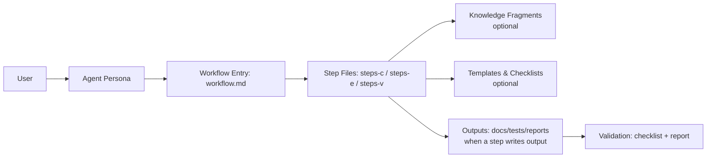

# Test Architect (TEA)

TEA (Test Engineering Architect) is a standalone BMAD module that delivers risk-based test strategy, test automation guidance, and release gate decisions. It provides a single expert agent (Murat, Master Test Architect and Quality Advisor) and nine workflows spanning Teach Me Testing (TEA Academy), framework setup, test design, ATDD, automation, traceability, NFR assessment, CI guidance, and test review.

Docs: <https://bmad-code-org.github.io/bmad-method-test-architecture-enterprise/>

## Why TEA

- Risk-based testing with measurable quality gates
- Consistent, knowledge-base driven outputs
- Clear prioritization (P0-P3) and traceability
- Optional Playwright Utils and MCP enhancements

## How BMad Works

BMad works because it turns big, fuzzy work into **repeatable workflows**. Each workflow is broken into small steps with clear instructions, so the AI follows the same path every time. It also uses a **shared knowledge base** (standards and patterns) so outputs are consistent, not random. In short: **structured steps + shared standards = reliable results**.

## How TEA Fits In

TEA plugs into BMad the same way a specialist plugs into a team. It uses the same step‑by‑step workflow engine and shared standards, but focuses exclusively on testing and quality gates. That means you get a **risk‑based test plan**, **automation guidance**, and **go/no‑go decisions** that align with the rest of the BMad process.

## Architecture & Flow

BMad is a small **agent + workflow engine**:

- **Agent** = expert persona (e.g., Test Architect).
- **Workflow** = a guided sequence of step files.
- **Step file** = one focused instruction set; outputs are written only in the steps that produce them.
- **Knowledge base** = reusable standards and patterns loaded only when needed.
- **Modes** = `steps-c/` (Create), `steps-e/` (Edit), `steps-v/` (Validate).
  - This keeps the create flow separate from editing and validation, and matches BMad Builder conventions.



## Install

```bash
npx bmad-method install
# Select: Test Architect (TEA)
```

**Note:** TEA is automatically added to party mode after installation. Use `/party` to collaborate with TEA alongside other BMad agents.

## Quickstart

1. Install TEA (above)
2. Run one of the core workflows:
   - `TD` / `/bmad:tea:test-design` — test design and risk assessment
   - `AT` / `/bmad:tea:atdd` — failing acceptance tests first (TDD red phase)
   - `TA` / `/bmad:tea:automate` — expand automation coverage
3. Or use in party mode: `/party` to include TEA with other agents

## Engagement Models

- **No TEA**: Use your existing testing approach
- **TEA Solo**: Standalone use on non-BMad projects
- **TEA Lite**: Start with `automate` only for fast onboarding
- **Integrated (BMad Method / Enterprise)**: Use TEA in Phases 3–4 and release gates

## Workflows

| Trigger | Command                      | Purpose                                       |
| ------- | ---------------------------- | --------------------------------------------- |
| TMT     | `/bmad:tea:teach-me-testing` | Teach Me Testing (TEA Academy)                |
| TF      | `/bmad:tea:framework`        | Scaffold Playwright/Cypress test framework    |
| CI      | `/bmad:tea:ci`               | Set up CI/CD quality pipeline                 |
| TD      | `/bmad:tea:test-design`      | System-level or epic-level test design        |
| AT      | `/bmad:tea:atdd`             | Generate failing acceptance tests + checklist |
| TA      | `/bmad:tea:automate`         | Expand test automation coverage               |
| RV      | `/bmad:tea:test-review`      | Review test quality and score                 |
| TR      | `/bmad:tea:trace`            | Trace requirements to tests + gate decision   |
| NR      | `/bmad:tea:nfr-assess`       | Assess non-functional requirements            |

## Configuration

TEA variables are defined in `src/module.yaml` and prompted during install:

- `test_artifacts` — base output folder for test artifacts
- `tea_use_playwright_utils` — enable Playwright Utils integration (boolean)
- `tea_use_mcp_enhancements` — enable Playwright MCP enhancements (boolean)
- `test_framework` — default framework preference (future)
- `risk_threshold` — risk cutoff for mandatory testing (future)
- `test_design_output`, `test_review_output`, `trace_output` — subfolders under `test_artifacts`

## Knowledge Base

TEA relies on a curated testing knowledge base:

- Index: `src/testarch/tea-index.csv`
- Fragments: `src/testarch/knowledge/`

Workflows load only the fragments required for the current task to stay focused and compliant.

## Module Structure

```
src/
├── module.yaml
├── agents/
│   └── tea.agent.yaml
├── workflows/
│   └── testarch/
│       ├── atdd/
│       ├── automate/
│       ├── ci/
│       ├── framework/
│       ├── nfr-assess/
│       ├── teach-me-testing/
│       ├── test-design/
│       ├── test-review/
│       └── trace/
└── testarch/
    ├── tea-index.csv
    └── knowledge/
```

## Contributing

See `CONTRIBUTING.md` for guidelines.

---

<details>
<summary><strong>📦 Release Guide (for Maintainers)</strong></summary>

## Publishing TEA to NPM

TEA uses an automated release workflow that handles versioning, tagging, NPM publishing, and GitHub releases.

### Prerequisites (One-Time Setup)

1. **NPM Token Configuration:**
   - Generate NPM automation token: [npmjs.com/settings/tokens](https://www.npmjs.com/settings/your-username/tokens)
   - Add to GitHub Secrets: `Settings` → `Secrets and variables` → `Actions` → `New repository secret`
   - Name: `NPM_TOKEN`
   - Value: [your token]

2. **Verify Package Configuration:**
   ```bash
   # Check package.json settings
   cat package.json | grep -A 3 "publishConfig"
   # Should show: "access": "public"
   ```

### Release Process

#### Option 1: Using npm Scripts (Recommended)

From your local terminal after merging to `main`:

```bash
# Beta release (first release or testing)
npm run release:beta

# Alpha release (early testing)
npm run release:alpha

# Patch release (bug fixes)
npm run release:patch

# Minor release (new features, backwards compatible)
npm run release:minor

# Major release (breaking changes)
npm run release:major
```

#### Option 2: Manual Workflow Trigger

1. Go to **Actions** tab in GitHub
2. Click **"Manual Release"** workflow
3. Click **"Run workflow"**
4. Select version bump type (alpha, beta, patch, minor, major)
5. Click **"Run workflow"**

### What Happens Automatically

The workflow performs these steps:

1. ✅ **Validation**: Runs all tests, linting, and format checks
2. ✅ **Version Bump**: Updates `package.json` version
   - `beta`: 0.1.0 → 0.1.1-beta.0
   - `alpha`: 0.1.0 → 0.1.1-alpha.0
   - `patch`: 0.1.0 → 0.1.1
   - `minor`: 0.1.0 → 0.2.0
   - `major`: 0.1.0 → 1.0.0
3. ✅ **Commit**: Creates version bump commit
4. ✅ **Tag**: Creates git tag (e.g., v0.1.1-beta.0)
5. ✅ **Push**: Pushes tag to GitHub
6. ✅ **Publish**: Publishes to NPM registry
   - Alpha → `npm install --tag alpha`
   - Beta → `npm install` (tagged as `latest`)
   - Stable → `npm install` (tagged as `latest`)
7. ✅ **GitHub Release**: Creates release with auto-generated notes
8. ✅ **Summary**: Displays installation instructions

### Version Bump Strategy

**For TEA Module:**

- **Beta (0.1.x-beta.x)**: Pre-1.0 testing, used for initial releases
- **Alpha (0.1.x-alpha.x)**: Early development, experimental features
- **Patch (0.1.x)**: Bug fixes, no new features
- **Minor (0.x.0)**: New features, backwards compatible
- **Major (x.0.0)**: Breaking changes (e.g., 1.0.0 release)

**Recommended Release Path:**

1. `0.1.0` → `0.1.1-beta.0` (first beta)
2. Test beta with early adopters
3. `0.1.1-beta.0` → `0.1.1-beta.1` (fixes)
4. When stable: `0.1.1-beta.1` → `1.0.0` (official release)

### Verify Publication

**Check NPM:**

```bash
npm view bmad-method-test-architecture-enterprise
```

**Install TEA:**

```bash
npx bmad-method install
# Select "Test Architect (TEA)"
```

**Test Workflows:**

```bash
# In your project
tea              # Load agent
test-design      # Test workflow
```

### Rollback a Release (if needed)

If you need to unpublish a version:

```bash
# Unpublish specific version (within 72 hours)
npm unpublish bmad-method-test-architecture-enterprise@0.1.1-beta.0

# Deprecate version (preferred for older releases)
npm deprecate bmad-method-test-architecture-enterprise@0.1.1-beta.0 "Use version X.Y.Z instead"
```

### Troubleshooting

**"NPM_TOKEN not found":**

- Verify secret is set: GitHub repo → Settings → Secrets and variables → Actions
- Secret name must be exactly: `NPM_TOKEN`

**"Package already exists":**

- Check if package name is already taken on NPM
- Update `name` in `package.json` if needed

**"Tests failed":**

- Fix failing tests before release
- Run `npm test` locally to verify

**"Git push failed (protected branch)":**

- This is expected for protected `main` branch
- The tag and version bump are still created
- You may need to manually merge the version bump commit

### Release Checklist

Before releasing:

- [ ] All tests passing: `npm test`
- [ ] Documentation up to date
- [ ] CHANGELOG.md updated
- [ ] No uncommitted changes
- [ ] On `main` branch
- [ ] NPM token configured in GitHub Secrets
- [ ] Package name available on NPM

After releasing:

- [ ] Verify NPM publication: `npm view bmad-method-test-architecture-enterprise`
- [ ] Test installation: `npx bmad-method install`
- [ ] Verify workflows work
- [ ] Check GitHub Release created
- [ ] Monitor for issues

</details>

---

## License

See `LICENSE`.
