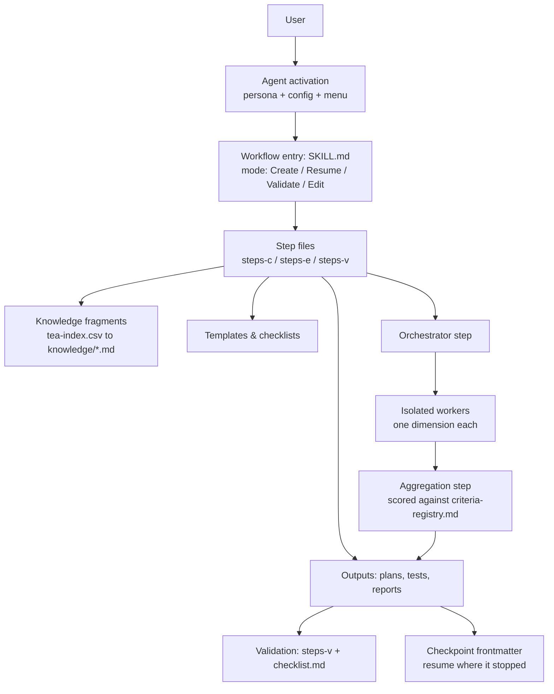

# TEA: Test Engineering Architect

[Node Version](https://nodejs.org)
[License: MIT](./LICENSE)

**TEA** stands for **Test Engineering Architect**. The npm package and repository slug `bmad-method-test-architecture-enterprise` is a package name and never an expansion of the acronym.

TEA is a standalone BMAD module that delivers risk-based test strategy, test automation guidance, and release gate decisions. It ships:

- one expert agent, Murat, Master Test Architect and Quality Advisor
- nine workflows spanning Teach Me Testing (TEA Academy), test design, framework setup, CI guidance, ATDD, automation, test review, NFR Evidence Audit, and traceability
- a 35-row criteria registry that fixes the severity of every reviewable violation, so a score is a lookup rather than a judgment call
- `tea-test-review`, a headless CLI that runs the review workflow as a CI gate with real exit codes
- a write-time enforcement hook that blocks the mechanically decidable violations before they reach disk

TEA is two layers. **TEA Core** decides what must be verified, at what depth, with what evidence, and whether that evidence is sufficient to release; it assumes nothing about your language, framework, or platform. **Execution targets** turn those decisions into runnable tests on a specific stack, and that layer is swappable. See [Verification Architecture](./docs/explanation/verification-architecture.md) for the split, and [Execution Targets](./docs/reference/execution-targets.md) for exactly which stacks are covered at which depth.

Docs: [https://bmad-code-org.github.io/bmad-method-test-architecture-enterprise/](https://bmad-code-org.github.io/bmad-method-test-architecture-enterprise/)

## Why TEA

- Risk-based prioritization (P0-P3) from probability × impact, with measurable quality gates
- Requirements traced to evidence, and PASS / CONCERNS / FAIL / WAIVED release decisions that survive an audit
- NFR thresholds set at design time and audited against real evidence, defaulting to CONCERNS when evidence is missing
- Consistent, knowledge-base driven outputs instead of whatever the model felt like producing
- Stack-aware execution: Playwright and Cypress for browsers, Maestro for mobile native, Pact for contracts, pytest / JUnit / Go test / xUnit / RSpec for backend services, k6 and scanners as NFR evidence
- Three enforcement points rather than one: fragments steer generation, a hook blocks the write, and `test-review` scores what actually landed

## How BMad Works

BMad works because it turns big, fuzzy work into **repeatable workflows**. Each workflow is broken into small steps with clear instructions, so the AI follows the same path every time. It also uses a **shared knowledge base** (standards and patterns) so outputs are consistent, not random. In short: **structured steps + shared standards = reliable results**.

## How TEA Fits In

TEA plugs into BMad the same way a specialist plugs into a team. It uses the same step‑by‑step workflow engine and shared standards, but focuses exclusively on testing and quality gates. That means you get a **risk‑based test plan**, **automation guidance**, and **go/no‑go decisions** that align with the rest of the BMad process.

## How It Actually Works

### The problem it is built around

Ask a model to "write tests for this feature" and you reliably get four things: redundant coverage, incorrect assertions, flaky tests, and diffs nobody can review. The cause is a category error. Prompt-driven generation is nondeterministic, and it is being pointed at the one artifact whose entire job is determinism.

TEA's answer is not a better prompt. It is to make the work repeatable at three levels.

**Repeatable instructions.** A single 5,000-word instruction file fails predictably: the model skims it, improvises past the vague parts ("analyze codebase then generate tests" specifies nothing), keeps going because nothing told it where to stop, and returns something different next run. So every workflow is cut into step files that each do one thing, state what "finished" means, restate the context they need, list what they must not do, and load one at a time. Consistent output for the same input is what makes everything else possible: you cannot parallelize work whose boundaries are undefined.

**Repeatable standards.** 59 knowledge fragments carry the patterns, and an index decides which ones enter context for the task at hand. The model is not asked to remember how fixtures compose or what network-first means. It is handed the fragment.

**Repeatable judgment.** Risk scores, priorities, quality scores, and gate decisions are computed from stated rules rather than produced as opinions. This is the part most tools skip, and it is the difference between a review you can act on and a review you have to re-litigate.

### The order you run things

The nine workflows are a directed graph, not a menu. `src/module-help.csv` encodes it.

```text
Phase 3, solutioning, once per project
  TD  test-design (system-level)  →  TF  framework  →  CI  ci

Phase 4, implementation, per story
  create-story  →  AT  atdd  →  dev implements  →  TA  automate

Epic or release gate
  TA  automate  →  RV  test-review
  TA  automate  →  NR  nfr
  RV  test-review  →  TR  trace (Phase 2 gate decision)
```

Phase 3 order matters and is deliberate: run `test-design` first so NFR evidence needs can shape the infrastructure, then `framework` once the architecture and the test design have settled the stack, then `ci` once the framework exists so the pipeline wires to real commands.

`test-design` is dual-mode. At system level it produces an architecture-facing document and a QA-facing one. Per epic it produces `test-design-epic-N.md`. `teach-me-testing` sits outside the lifecycle and runs once per learner.

`module-help.csv`'s single `phase` column records the phase a workflow's catalog row is sequenced under (its `preceded-by`/`followed-by` chain), not every phase the workflow can run in. `test-design`'s row is `3-solutioning` because that is the chain the row encodes (`test-design` → `framework`); the epic-level Phase 4 invocation above has no dependency edges of its own and so gets no second row, only this prose.

For the full lifecycle diagram including the BMad phases around TEA, see [TEA Overview](./docs/explanation/tea-overview.md).

### One epic, end to end

Here is the same feature moving through the chain, with the rules TEA actually applies at each step.

**1. Risk, in** `test-design`**.** Every identified risk gets a probability of 1 to 3 (unlikely, possible, likely) and an impact of 1 to 3 (minor, degraded, critical). Score is the product, so the range is 1 to 9, and the score determines the action:

| Score | Action   | Gate impact          |
| ----- | -------- | -------------------- |
| 1-3   | DOCUMENT | none                 |
| 4-5   | MONITOR  | none, watch closely  |
| 6-8   | MITIGATE | CONCERNS at the gate |
| 9     | BLOCK    | automatic FAIL       |

A checkout risk scored `probability 2 × impact 3 = 6` lands in MITIGATE. It gets a row in the test design with a named owner and a date, and it will surface as CONCERNS at the gate until the mitigation is real.

Priority is a separate judgment that the risk score informs rather than determines. P0 is revenue-critical, security-critical, data-integrity, regulatory, or previously broken. P1 is core journeys and complex logic. P2 is secondary features. P3 is nice-to-have. The design pins the effort too: P0 tests are budgeted at 2 hours each, P1 at 1, P2 at 0.5, P3 at 0.25.

**2. Test level, still in** `test-design`**.** Favor unit when logic can be isolated with no side effects; integration for persistence, service contracts, and component boundaries; E2E for user-facing critical paths and multi-system interactions. Before adding any test, the duplicate-coverage guard asks whether a lower level already covers it. Overlap is allowed only for genuinely different aspects, defense in depth on critical paths, or regression prevention on something that broke before.

**3. Red tests, in** `atdd` (optional). Run before implementation. It generates acceptance tests that all carry `test.skip()`, plus data factories, fixtures, and an implementation checklist that lists, per test, the tasks required to make it pass and the command to run it. The developer un-skips one test, confirms it fails, then makes it pass. The red phase is the point: a test that has never failed has proven nothing.

**4. Coverage, in** `automate`**.** Run after implementation. Workers generate API, E2E, backend, and mobile tests in parallel depending on the detected stack, and the aggregation step reports the totals broken down by priority. It also rolls up every deviation from an active integration mandate as `file:line: reason`, and writes `None` when there are none, because a reader cannot tell an empty section from a forgotten one.

**5. Quality, in** `test-review`**.** Every finding must cite a registry row (`C1`, `H2`, `M4`), and the row carries the severity. Score starts at 100:

```text
Starting Score:          100
Critical Violations:     -{count} × 10
High Violations:         -{count} × 5
Medium Violations:       -{count} × 2
Low Violations:          -{count} × 1
Bonus (6 categories, each 0 or 5, max +30)
Final Score:             clamped to 0-100     Grade: A ≥90, B ≥80, C ≥70, D ≥60, else F
```

The verdict is then derived from the findings, not written by the model:

```javascript
if (CRITICAL > 0) return 'Block'; // a test that cannot fail is not a suggestion
if (HIGH > 0) return 'Request Changes';
if (score < 70) return 'Request Changes'; // volume of MEDIUM/LOW can also fail the bar
if (MEDIUM + LOW > 0) return 'Approve with Comments';
return 'Approve';
```

This is the part worth sitting with. A suite with one CRITICAL and three MEDIUM findings, earning two bonus categories, scores `100 - 10 - 6 + 10 = 94`, a grade A, and is still a **Block**. Score measures the suite. The verdict answers a different question: is there anything here that makes the suite lie? One committed `.skip` on the test that mattered, or one `expect(true).toBe(true)`, means green proves nothing, which is worse than an absent test because it buys false confidence.

That separation exists because it was measured. Two reviewers of the same four files scored 82 and 85, which is noise, and returned opposite verdicts, which is not. `--fail-on request-changes` acts on the verdict, so the gate was being decided by the unpinned half of the report. `DESIGN-CRITERIA-REGISTRY.md` records the whole investigation.

**6. Gate, in** `trace` **Phase 2.** Requirements are mapped to tests with Given/When/Then, coverage is computed per priority, and the decision is deterministic:

| Condition                                                       | Decision     |
| --------------------------------------------------------------- | ------------ |
| P0 coverage below 100%                                          | **FAIL**     |
| Overall coverage below 80%                                      | **FAIL**     |
| P1 coverage below 80%                                           | **FAIL**     |
| P0 at 100%, overall ≥ 80%, P1 ≥ 90%                             | **PASS**     |
| P0 at 100%, overall ≥ 80%, P1 between 80% and 89%               | **CONCERNS** |
| Stakeholder-approved waiver with the complete approval contract | **WAIVED**   |

Our epic finishes at P0 100%, P1 87%, overall 84%, so it gates at CONCERNS with the residual risk named rather than passing quietly. Two overlays can lower that result further and can never raise it: a requirement resting only on recorded live verification caps at CONCERNS, and a synthetic coverage oracle below high confidence does the same. WAIVED is never derived; a human sets it, and the artifact demands an approver, approval date, reason, expiry, monitoring plan, remediation owner, and fix target. The authoritative contract is in the [Traceability template](./src/workflows/testarch/bmad-testarch-trace/trace-template.md#waiver-details).

If the run is not gate-eligible at all, because evidence collection was waived, restricted, inaccessible, or deferred, TEA emits no decision rather than computing one on partial evidence.

## Architecture & Flow

BMad is a small **agent + workflow engine**. There is no external orchestrator; everything runs inside the LLM context window through structured instructions. TEA adds two pieces that run outside it: a Node hook that intercepts writes in your project, and a CLI that drives the review workflow headlessly in CI.

### Building Blocks

| File / Scope                                              | What it does                                                                                                 | When it loads                                                               |
| --------------------------------------------------------- | ------------------------------------------------------------------------------------------------------------ | --------------------------------------------------------------------------- |
| `src/agents/bmad-tea/SKILL.md`                            | Murat's activation sequence and critical actions; renders the `{agent.menu}` placeholder                     | First, activates the TEA agent                                              |
| `src/agents/bmad-tea/customize.toml`                      | Agent customization surface: `[[agent.menu]]` items (code to skill), persona fields, persistent facts, hooks | During agent activation                                                     |
| `src/workflows/testarch/<workflow>/SKILL.md`              | Workflow entrypoint: resolves workflow customization, picks mode, routes to the first step                   | When a TEA workflow is invoked                                              |
| `src/workflows/testarch/<workflow>/customize.toml`        | Workflow customization surface: activation hooks, persistent facts, optional `on_complete` behavior          | During workflow activation                                                  |
| `src/workflows/testarch/<workflow>/workflow.yaml`         | Machine-readable metadata: config bindings, run variables, tool hints, output paths                          | Installer, tooling, and workflow metadata lookups                           |
| `instructions.md`                                         | Workflow-specific summary and operator notes                                                                 | On demand                                                                   |
| `steps-c/*.md`                                            | **Create** steps: primary execution, 5 to 12 files per workflow, 75 across the module                        | One at a time (just-in-time)                                                |
| `steps-c/step-NNx-subagent-*.md`                          | **Worker** steps: one isolated dimension each, dispatched in parallel                                        | When an orchestrator step delegates                                         |
| `steps-e/*.md`                                            | **Edit** steps: always 2 files, assess target then apply edit                                                | One at a time                                                               |
| `steps-v/*.md`                                            | **Validate** steps: always 1 file, evaluate against the checklist                                            | On demand                                                                   |
| `checklist.md`                                            | Validation criteria: what "done" looks like for this workflow                                                | Read by steps-v                                                             |
| `*-template.md`                                           | Output skeleton with `{PLACEHOLDER}` vars, filled in by steps to produce the artifact                        | Read by steps-c when generating output                                      |
| `bmad-testarch-test-review/steps-c/criteria-registry.md`  | The 35 scoreable rows, each with a fixed severity and gate class. Severity is read here                      | Read by every review worker before it scores anything                       |
| `bmad-testarch-framework/resources/hooks/tea-enforce.cjs` | Project-level guardrail for mechanically decidable test-quality violations; framework Create scaffolds it    | Before writes, after writes or shell commands, and when an agent turn stops |
| `resources/tea-index.csv`                                 | Knowledge fragment index: id, name, description, tags, tier, path. 59 rows                                   | Read before recommendations and by knowledge-loading steps                  |
| `resources/knowledge/*.md`                                | 59 reusable fragments: standards, patterns, API references, integration mandates                             | Selectively read into context by tier and config flags                      |

Nine copies of the knowledge base exist on purpose: the agent carries one, and so does each of the eight workflows that consult it. Every copy is byte-identical. A workflow skill has to stay self-contained so it can be installed, copied, or invoked without reaching across skill boundaries, so when knowledge changes, propagate the update into the affected workflow resource directories rather than replacing them with a central runtime path. `bmad-teach-me-testing` is the exception; it carries a curated pointer file at `data/tea-resources-index.yaml` instead of the fragments themselves.


```mermaid
flowchart TB
  U[User] --> A[Agent activation<br/>persona + config + menu]
  A --> W[Workflow entry: SKILL.md<br/>mode: Create / Resume / Validate / Edit]
  W --> S[Step files<br/>steps-c / steps-e / steps-v]
  S --> K[Knowledge fragments<br/>tea-index.csv to knowledge/*.md]
  S --> T[Templates & checklists]
  S --> P[Orchestrator step]
  P --> X[Isolated workers<br/>one dimension each]
  X --> G[Aggregation step<br/>scored against criteria-registry.md]
  S --> O[Outputs: plans, tests, reports]
  G --> O
  O --> V[Validation: steps-v + checklist.md]
  O --> C[Checkpoint frontmatter<br/>resume where it stopped]
```

### How It Works at Runtime

**1. Activation.** `/bmad-tea` or `$bmad-tea` loads the agent skill. It resolves its customization block across base, team, and user layers, adopts the persona, loads persistent facts and `_bmad/tea/config.yaml`, greets you, and renders `{agent.menu}` as a numbered table. Naming an intent in your first message ("let's design tests for this epic") skips the menu and dispatches directly.

**2. Workflow entry.** Direct workflow commands use the installed skill name, such as `/bmad-testarch-automate` or `$bmad-testarch-automate`, depending on the host's invocation syntax. `TA` is the equivalent agent-menu code, available only once TEA is active. Either way, the workflow's `SKILL.md` resolves its own `[workflow]` customization block and asks which mode to run: Create, Resume, Validate, or Edit. Create and Resume both route into `steps-c/`; Validate into `steps-v/`; Edit into `steps-e/`. `test-review` alone supports `headless: true`, which skips the greeting and the menu and runs Create directly. That is how the CLI drives it in CI.

**3. Steps.** Each step file declares its own wiring in YAML frontmatter: `outputFile`, `nextStepFile`, and where relevant `knowledgeIndex` and `resumeStepFile`. A step loads on its own, pulls only the fragments its mode and config flags call for, fills any `*-template.md` placeholders, writes its output, and names the next step. Nothing loads the whole workflow at once, and the step files say so in as many words: "Do not load the next step until this step is complete."

**4. Progress and resume.** Every create step appends itself to a checkpoint file's YAML frontmatter (`stepsCompleted`, `lastStep`, `lastSaved`), so an interrupted run resumes at the next incomplete step rather than from the top. `test-design` checkpoints additionally carry run identity: `runScope` and `runKey` are resolved before anything is saved, the file is named `test-design-progress-{run_key}.md`, and Resume refuses to continue a checkpoint whose `runKey` belongs to a different run. Interrupting a system-level run and starting an epic-level one no longer clobbers the first. `framework` and `ci` scaffold once per project, so a single fixed checkpoint is the right shape there and they keep one.

**5. Validation.** `steps-v/` scores the finished output against `checklist.md`.

See [Step-File Architecture](./docs/explanation/step-file-architecture.md) for the loading model, worker isolation, and the per-workflow step patterns.

### Parallel Workers and Execution Modes

Five workflows split their heaviest step across isolated workers. An orchestrator step does no work of its own; it resolves the mode, dispatches, and hands off to an aggregation step.

| Workflow      | Workers                                                        |
| ------------- | -------------------------------------------------------------- |
| `test-review` | determinism, isolation, maintainability, performance           |
| `nfr`         | security, performance, reliability, maintainability            |
| `automate`    | API, E2E, backend, mobile. Stack-gated, so 1 to 3 of the 4 run |
| `atdd`        | failing API tests, failing E2E tests                           |
| `test-design` | system-level mode may generate its two documents in parallel   |

`tea_execution_mode` decides how they run: `auto`, `agent-team`, `subagent`, or `sequential`. With `tea_capability_probe` at its default of `true`, `auto` probes the runtime and prefers agent-team, then subagent, then sequential, which keeps behavior portable across supported agent runtimes. With probing off, TEA honors the configured mode strictly and fails with an explicit error rather than falling back silently. Mode changes orchestration only. The output schema, the validation rules, and the aggregation contract are identical in every mode.

Workers exchange nothing directly. Each writes a JSON file under `/tmp` keyed by a shared run timestamp, and the aggregation step asserts every expected file exists before it scores anything. Isolation is what makes a parallel review honest. The shared criteria registry is what stops two isolated workers from disagreeing about what a finding is worth: every worker loads it, and none of them choose a severity.

### How Knowledge Gets Selected

`tea-index.csv` classifies all 59 fragments into three tiers: **core** (24, always loaded), **extended** (19, loaded when deeper analysis is called for), and **specialized** (16, loaded only when the case matches, such as contract testing on a real consumer-provider boundary). Steps name the fragments they need, and they name their exclusions just as explicitly. A Maestro run is told not to load the browser fragments, because a device flow has no DOM and no request interceptor, and loading them invites browser patterns into a device flow.

Over-loading is treated as a real defect, not a harmless cost. `npm run eval:fragment-selection` measures both directions: recall of the fragments a step requires, and the rate at which a run pulls one the step excludes by name.

### The Three Control Points

A test rule can be enforced at three moments, and most tools occupy one of them. TEA occupies all three. The release gate is the fourth row below because it consumes what the other three produce, rather than being a fourth place to enforce a rule.

| Point          | When                   | Mechanism                                              | What it closes                                                               |
| -------------- | ---------------------- | ------------------------------------------------------ | ---------------------------------------------------------------------------- |
| **Generation** | before the test exists | knowledge fragments and integration mandates           | the model improvising a pattern TEA already has a standard for               |
| **Write**      | as the file lands      | `tea-enforce.cjs` on PreToolUse, PostToolUse, and Stop | a `.only`, a hard wait, or a tautological assertion getting committed at all |
| **Review**     | after the fact         | `test-review` scored against the criteria registry     | severity drifting with whichever model happened to run the review            |
| **Gate**       | at release             | `trace` Phase 2, PASS / CONCERNS / FAIL / WAIVED       | shipping on evidence nobody checked was sufficient                           |

The hook has separate installation and runtime lifecycles. The `bmad-testarch-framework` Create path installs it during its documentation and scripts step. Resume reaches the same step when installation is still incomplete. Framework Validate and Edit do not install it, and no other TEA workflow calls it.

Once installed, the hook is project-scoped rather than workflow-scoped. It runs on matching tool events across TEA workflows, other agents, and ordinary coding sessions without requiring Murat or a TEA workflow to be active.

The three passes cover different user-visible moments. `--pre` checks content before a direct file write reaches disk and rejects a blocking violation with a fix. `--post` re-reads the affected file after direct file writes or shell commands, then reports violations that only become visible in the complete file. `--stop` scans recently modified test files when the agent turn finishes, including outputs a code generator did not name in its command. All three passes are limited to the test and Pact configuration globs written for the detected stack in `.tea/enforce-config.json`.

This closes the gap between advisory generation guidance and a later `test-review`. It blocks seven mechanically decidable Absolute rules and warns on one: focused tests, tautological assertions, hard waits, oversized test files, Maestro flows that cannot fail, two Pact parallelism rules, and undocumented disabled tests as the warning. Rules that require semantic judgment stay in `test-review`. The hook fails open on its own errors so a broken guardrail cannot lock the agent out of writing. Agent platforms without a write-time hook API skip installation and rely on `test-review` for enforcement.

**How workflows become commands.** `npx bmad-method install` copies each TEA skill into the host runtime's skill directory under its own name. Invoking that name loads the skill, and the step-file process takes over. The skill name is identical on every platform the BMad installer supports.

## Install

```bash
npx bmad-method install
# Select: Test Architect (TEA)
```

**Note:** TEA is automatically added to party mode after installation. Use `/party` to collaborate with TEA alongside other BMad agents.

### Invocation Syntax

| Host convention       | Example                                  |
| --------------------- | ---------------------------------------- |
| Slash command         | `/bmad-testarch-automate`                |
| Dollar-prefixed skill | `$bmad-tea` or `$bmad-testarch-automate` |

## Quickstart

1. Install TEA (above)
2. Load the TEA menu with `/bmad-tea` or `$bmad-tea` if you want a conversational entrypoint.
3. Run one of the core workflows:

- `TD` / `/bmad-testarch-test-design` / `$bmad-testarch-test-design` — test design, risk assessment, and NFR planning
- `AT` / `/bmad-testarch-atdd` / `$bmad-testarch-atdd` — failing acceptance tests first (TDD red phase)
- `TA` / `/bmad-testarch-automate` / `$bmad-testarch-automate` — expand automation coverage

1. Or use in party mode: `/party` to include TEA with other agents

## Engagement Models

- **No TEA**: Use your existing testing approach
- **TEA Solo**: Standalone use on non-BMad projects
- **TEA Lite**: Start with `automate` only for fast onboarding
- **Integrated (BMad Method / Enterprise)**: Use TEA in Phases 3–4 and release gates

## Workflows

| Trigger | Slash Command                | Dollar Skill                 | Purpose                                                                     |
| ------- | ---------------------------- | ---------------------------- | --------------------------------------------------------------------------- |
| TMT     | `/bmad-teach-me-testing`     | `$bmad-teach-me-testing`     | Teach Me Testing (TEA Academy)                                              |
| TD      | `/bmad-testarch-test-design` | `$bmad-testarch-test-design` | System-level or epic-level test design and NFR planning                     |
| TF      | `/bmad-testarch-framework`   | `$bmad-testarch-framework`   | Scaffold test framework (frontend, backend, fullstack, or mobile)           |
| CI      | `/bmad-testarch-ci`          | `$bmad-testarch-ci`          | Set up CI/CD quality pipeline (multi-platform)                              |
| AT      | `/bmad-testarch-atdd`        | `$bmad-testarch-atdd`        | Generate failing acceptance tests + checklist                               |
| TA      | `/bmad-testarch-automate`    | `$bmad-testarch-automate`    | Expand test automation coverage                                             |
| RV      | `/bmad-testarch-test-review` | `$bmad-testarch-test-review` | Review test quality and score                                               |
| NR      | `/bmad-testarch-nfr`         | `$bmad-testarch-nfr`         | Audit implemented NFR evidence                                              |
| TR      | `/bmad-testarch-trace`       | `$bmad-testarch-trace`       | Trace requirements to tests + gate decision                                 |
| GATE    | agent menu only              | agent menu only              | Route the release gate: test review, NFR evidence audit, then trace Phase 2 |

`GATE` is a routing prompt on the agent menu, so it has no standalone command. Load the agent with `/bmad-tea` or `$bmad-tea` and pick it there.

## The Release Gate

`trace` Phase 2 produces the decision: PASS, CONCERNS, FAIL, or WAIVED. Two mechanics sit under that vocabulary and are easy to miss.

**Live evidence is capped.** A requirement covered only by recorded live verification forces PASS down to CONCERNS, with a rationale naming the recorded source SHA. The overlay only ever lowers a PASS or annotates an existing CONCERNS. It can never lift a FAIL. Only a `pass` recorded against the commit under trace counts; `stale`, `unverifiable`, `contradicted`, `blocked`, and the rest are reported as blockers. The JSON contract is published at [Live Verification Results](./docs/reference/live-verification-results.md), so any runner can produce it. Trace reads that file and never runs anything itself.

**Some runs are not gate-eligible at all.** A collection status of `waived`, `restricted`, `inaccessible`, or `deferred_shared` means no decision is emitted rather than a decision computed on partial evidence. A missing manifest resolves to `INACCESSIBLE`, not to 0% coverage.

### `tea-test-review` in CI

Installing this package also installs a `tea-test-review` binary that runs the review workflow headlessly against a pull request diff.

```bash
npx tea-test-review --base origin/main --min-score 80
```

It scopes to changed tests (`--base`, `--files`), runs through an agent adapter with a pinned review model, isolates the filesystem, emits a JSON verdict, and separates its exit codes: `0` pass, `1` verdict failure, `2` environment or configuration failure, and `3` agent failure or an unparseable or untrusted report. For example, a missing credential exits `2`, while a runner crash after launch exits `3`.

The recommendation is derived from the findings rather than taken from the agent's prose. Any CRITICAL derives Block. Any HIGH, or a score under 70, derives Request Changes. The agent's own stated recommendation is preserved as `reportedRecommendation` when the two disagree. `--waive` exists for the exceptions and requires an expiry.

A copy-paste workflow lives at `cli/examples/pr-test-review.yml`, and the full flag, exit-code, and security reference is at [tea-test-review CLI](./docs/reference/tea-test-review-cli.md).

## Configuration

TEA variables are defined in `src/module.yaml` and prompted during install. Ten are wired into workflows today; the last four are placeholders that nothing reads yet.

- `test_artifacts` — base output folder for test artifacts
- `tea_use_playwright_utils` — enable Playwright Utils integration (boolean, default true). When true **and the package is installed**, `@seontechnologies/playwright-utils` becomes the default implementation for everything it covers: generated Playwright tests use `interceptNetworkCall`, `apiRequest`, `recurse`, and `log` without being asked, and `test-review` flags a vanilla equivalent that carries no stated reason. See [Integrate Playwright Utils](https://bmad-code-org.github.io/bmad-method-test-architecture-enterprise/how-to/customization/integrate-playwright-utils/)
- `tea_use_pactjs_utils` — enable Pact.js Utils integration for contract testing (boolean, default true). It decides how Pact suites are written, not whether a project gets one: TEA still requires a real consumer-provider boundary before scaffolding a contract test. When on **and the package is installed**, generated Pact code uses `createProviderState`, `buildVerifierOptions`, and `createRequestFilter` rather than raw Pact boilerplate. A flag with no install generates the raw path and reports one recommendation rather than flagging every file
- `tea_pact_mcp` — SmartBear MCP for PactFlow/Broker interaction: mcp, none (string, default mcp). Safe without a broker: every broker-dependent step degrades to provider source or an OpenAPI spec and reports that the broker was unreachable
- `tea_browser_automation` — browser automation mode: auto, cli, mcp, none (string, default auto)
- `tea_execution_mode` — how TEA orchestrates multi-step generation and evaluation: auto, subagent, agent-team, sequential (string, default auto)
- `tea_capability_probe` — probe the runtime before selecting an execution mode (boolean, default true). With it off, TEA honors the configured mode strictly and fails loudly instead of falling back
- `test_stack_type` — detected or configured stack type (auto, frontend, backend, fullstack, mobile). Mobile is checked before frontend, because a React Native project carries React in `package.json` and would otherwise misdetect as web
- `ci_platform` — CI platform (auto, github-actions, gitlab-ci, jenkins, azure-devops, harness, circle-ci, other)
- `test_framework` — detected or configured test framework (auto, Playwright, Cypress, Jest, Vitest, pytest, JUnit, Go test, dotnet test, RSpec, Maestro, other)
- `risk_threshold` — risk cutoff for mandatory testing. Prompted at install, not yet read by any workflow
- `test_design_output`, `test_review_output`, `trace_output` — subfolders under `test_artifacts`. Prompted at install, not yet read by any workflow

Full option reference: [Configuration](./docs/reference/configuration.md).

## Knowledge Base

TEA relies on a curated testing knowledge base of 59 fragments, indexed by tier:

- Index: `src/agents/bmad-tea/resources/tea-index.csv`
- Fragments: `src/agents/bmad-tea/resources/knowledge/`
- Tiers: 24 core, 19 extended, 16 specialized

Workflows load only the fragments required for the current task, and the required set is named in the step file rather than inferred from index tags. See [Knowledge Base](./docs/reference/knowledge-base.md).

## Repository Layout

```text
src/                     # the shipped module
├── module.yaml          # install-time variables and post-install notes
├── module-help.csv      # workflow catalog: menu codes, phases, ordering
├── agents/bmad-tea/     # SKILL.md, customize.toml, resources/{tea-index.csv, knowledge/}
└── workflows/testarch/  # nine self-contained workflow skills
    ├── bmad-teach-me-testing/
    ├── bmad-testarch-atdd/
    ├── bmad-testarch-automate/
    ├── bmad-testarch-ci/
    ├── bmad-testarch-framework/        # resources/hooks/tea-enforce.cjs lives here
    ├── bmad-testarch-nfr/
    ├── bmad-testarch-test-design/
    ├── bmad-testarch-test-review/      # steps-c/criteria-registry.md lives here
    └── bmad-testarch-trace/

cli/                     # tea-test-review: the headless CI gate
docs/                    # source of truth for the docs site
website/                 # Astro + Starlight, consumes docs/ through a symlink
tools/                   # validators, doc build, changelog stamping
test/                    # quality gate suites and the two eval harnesses
```

## How TEA Keeps Itself Honest

TEA has deterministic checks and live evals. These cover specific risks. They are not end-to-end evals of every skill.

### Current Eval Coverage

The eight suites under `test/evals/` measure one decision inside each knowledge-bearing workflow: whether the agent selects the required knowledge fragments and avoids fragments the workflow excludes. They do not execute the complete workflow or grade its final artifact.

`test-review` has an additional behavioral eval. It runs the complete review against files containing nine planted defects plus one clean file, then scores recall, precision, score variance, and verdict stability.

| Skill                       | Fragment-selection cases | Full behavioral eval                                       |
| --------------------------- | ------------------------ | ---------------------------------------------------------- |
| `bmad-tea`                  | N/A                      | None                                                       |
| `bmad-teach-me-testing`     | N/A                      | None; this skill has no workflow knowledge index           |
| `bmad-testarch-atdd`        | 3                        | None                                                       |
| `bmad-testarch-automate`    | 5                        | None                                                       |
| `bmad-testarch-ci`          | 2                        | None                                                       |
| `bmad-testarch-framework`   | 3                        | None                                                       |
| `bmad-testarch-nfr`         | 2                        | None                                                       |
| `bmad-testarch-test-design` | 5                        | None                                                       |
| `bmad-testarch-test-review` | 2                        | Yes; three files, nine planted defects, and one clean file |
| `bmad-testarch-trace`       | 2                        | None                                                       |

A passing fragment-selection eval means the workflow loaded the right knowledge. It makes no claim about the quality of the workflow's final output. Full behavioral evals for the other skills remain a coverage gap. The source-controlled [Eval Quality and Behavioral Coverage Roadmap](./docs/explanation/eval-quality-roadmap.md) records the per-skill contracts, runner work, CI plan, and intended boundary with the upcoming standalone `eval-quality` project.

### Deterministic Checks

`npm test` chains thirteen deterministic checks, including three that keep the rules, guidance, hook, and eval data aligned:

- `test:criteria-fragments` fails when a registry row is neither mapped to a knowledge fragment nor declared a known gap. A rule the reviewer scores but no fragment teaches is a rule TEA punishes without ever having explained it. All 35 rows are currently mapped across 48 anchors. Because the declared-gap list is empty, the validator feeds itself a synthetic unmapped row on every run to prove that path still works.
- `test:enforce-hook` fails when a new Absolute registry row appears in neither the hook's enforced list nor its deferred list. This prevents a rule from being added without an explicit write-time enforcement decision.
- `test:eval-data` checks that all 24 fragment-selection cases are structurally usable: their workflow context files exist, every expected fragment exists and is indexed for that workflow, and the required and forbidden sets do not overlap. The expected sets come from the workflow step files. This check does not ask an agent to select anything.

These checks produce the same answer from the same repository state. They need no agent credential, network call, or model budget. `test:eval-data` runs through `npm test`, the local pre-commit hook, pull-request quality checks, and the publish workflow.

### Start Here

You do not start an interactive agent session. A live eval launches the selected agent CLI as a headless subprocess, sends it each prompt, waits for the result, and scores the result.

The normal path is one command. It runs fragment selection across all eight covered workflow skills, then runs the behavioral `test-review` eval:

```bash
npm run eval:all -- --agent codex
```

Use `claude` or `agy` instead, or run all three built-in adapters:

```bash
npm run eval:all -- --agent claude
npm run eval:all -- --agent agy
npm run eval:all -- --agent agy --agent claude --agent codex
```

`eval:all` uses two repetitions per fragment-selection case and three repetitions for `test-review`. One runner makes 51 agent calls: 48 fragment selections plus 3 reviews. All three built-in runners make 153 calls.

Check the data, executable, login, fixtures, and expected results without making a model call:

```bash
npm run eval:all -- --agent codex --preflight-only
npm run eval:all -- --agent claude --preflight-only
npm run eval:all -- --agent agy --preflight-only
```

Output ending with `nothing measured` is expected in preflight mode. It means the static eval data is valid and the selected executable passed the available readiness checks. Some runners cannot expose session authentication to this probe, so a preflight pass does not guarantee that the later live call will authenticate. The flag intentionally exits before launching the agent.

### A La Carte Live Evals

Use the focused commands when debugging one metric or skill. A one-call review smoke test is:

```bash
# One review. Recall and precision are measured; variance and stability are not.
npm run eval:test-review -- --agent codex --runs 1

# Complete eval with one runner.
npm run eval:test-review -- --agent codex
npm run eval:test-review -- --agent claude

# Complete eval with all three built-in runners. This makes nine review calls.
npm run eval:test-review -- --agent agy --agent claude --agent codex
```

### Run Fragment Selection by Skill

Each command below runs one repetition. Use `--runs 2` for the complete stability measurement.

| Skill                 | Copy-paste command                                                                               |
| --------------------- | ------------------------------------------------------------------------------------------------ |
| `atdd`                | `npm run eval:fragment-selection -- --agent codex --workflow bmad-testarch-atdd --runs 1`        |
| `automate`            | `npm run eval:fragment-selection -- --agent codex --workflow bmad-testarch-automate --runs 1`    |
| `ci`                  | `npm run eval:fragment-selection -- --agent codex --workflow bmad-testarch-ci --runs 1`          |
| `framework`           | `npm run eval:fragment-selection -- --agent codex --workflow bmad-testarch-framework --runs 1`   |
| `nfr`                 | `npm run eval:fragment-selection -- --agent codex --workflow bmad-testarch-nfr --runs 1`         |
| `test-design`         | `npm run eval:fragment-selection -- --agent codex --workflow bmad-testarch-test-design --runs 1` |
| `test-review` routing | `npm run eval:fragment-selection -- --agent codex --workflow bmad-testarch-test-review --runs 1` |
| `trace`               | `npm run eval:fragment-selection -- --agent codex --workflow bmad-testarch-trace --runs 1`       |

Run every suite with one or all built-in runners:

```bash
# 24 cases run twice: 48 calls.
npm run eval:fragment-selection -- --agent codex
npm run eval:fragment-selection -- --agent claude

# All three runners: 144 calls.
npm run eval:fragment-selection -- --agent agy --agent claude --agent codex
```

### Antigravity, Claude, Codex, and Custom Agent CLIs

The built-in adapters are `claude`, `codex`, and `agy` (Antigravity CLI). Run live evals with any built-in adapter:

```bash
npm run eval:all -- --agent agy
npm run eval:all -- --agent claude
npm run eval:all -- --agent codex
```

Any other headless CLI can use `--agent custom`. The runner must:

1. Read the complete prompt from standard input.
2. Run non-interactively in the repository working directory.
3. Print its final response to standard output. The review eval must also allow the agent to write the report path named in the prompt.
4. Exit with a nonzero status when the agent call fails.

[Gemini CLI headless mode](https://geminicli.com/docs/cli/headless/) accepts standard input alongside a `-p` prompt. Once Gemini is installed and authenticated, run every live eval with:

```bash
npm run eval:all -- \
  --agent custom \
  --agent-cmd gemini \
  --agent-arg -p \
  --agent-arg "Follow the complete instructions from standard input." \
  --agent-arg --output-format \
  --agent-arg text \
  --agent-arg --approval-mode \
  --agent-arg yolo \
  --agent-arg --skip-trust \
  --env-pass GEMINI_API_KEY \
  --env-pass GOOGLE_API_KEY
```

This uses `yolo` because the review eval must write its report. To run fragment selection alone with a read-only policy:

```bash
npm run eval:fragment-selection -- \
  --agent custom \
  --agent-cmd gemini \
  --agent-arg -p \
  --agent-arg "Follow the complete instructions from standard input." \
  --agent-arg --output-format \
  --agent-arg text \
  --agent-arg --approval-mode \
  --agent-arg plan \
  --agent-arg --skip-trust \
  --env-pass GEMINI_API_KEY \
  --env-pass GOOGLE_API_KEY
```

`--env-pass` is required only for credentials stored in environment variables. Stored CLI logins use the home directory that the harness already passes through. Model selection for a custom runner is also explicit, using repeated `--agent-arg` values for that CLI's model flag and value.

### What Passes

| Eval                              | Passing result                                                                                                                                        | Default volume               |
| --------------------------------- | ----------------------------------------------------------------------------------------------------------------------------------------------------- | ---------------------------- |
| `npm run eval:all -- --agent ...` | Both live evals below pass for the selected runner                                                                                                    | 48 selections plus 3 reviews |
| Fragment selection                | At least 90% required-fragment recall, at most 10% forbidden-fragment selection, and stable choices across repeated cases                             | 24 cases twice: 48 calls     |
| Test review                       | At least 70% overall recall, 100% CRITICAL recall, at least 80% clean-file precision, score standard deviation no higher than 3, and a stable verdict | Three complete reviews       |
| `npm run test:eval-data`          | Every case references valid workflow files and indexed fragments; required and forbidden sets do not overlap                                          | No agent calls               |

### CI Usage

Run the deterministic check on every pull request:

```bash
npm ci
npm run test:eval-data
```

Run live evals in a scheduled or manually triggered CI job after installing and authenticating the selected agent CLI:

```bash
npm ci
npm run eval:all -- --agent codex
```

The eval harnesses use CI-compatible exit codes: `0` means every threshold passed, `1` means a measured result missed a threshold, and `2` means the environment could not run the eval. Live jobs consume model quota and can vary as models change, so keep their result separate from the deterministic pull-request gate until the team chooses to make model quality a required check.

TEA applies the same evidence rule to its documentation. Unproven explanations are labeled as hypotheses, and workarounds are labeled as countermeasures. `DESIGN-CRITERIA-REGISTRY.md` records the investigations behind the review rules and scoring decisions.

## Extending TEA

Custom workflows are still compatible with TEA, but they are no longer implicitly absorbed into TEA core. The supported path is:

1. Package the workflow as custom content or a custom module.
2. Attach it to `bmad-tea` using the agent customization flow.
3. Reinstall/update BMAD so the new menu item and workflow are registered.

See [Extend TEA with Custom Workflows](docs/how-to/customization/extend-tea-with-custom-workflows.md) and the BMAD customization guide at [BMAD-METHOD/docs/how-to/customize-bmad.md](https://github.com/bmad-code-org/BMAD-METHOD/blob/main/docs/how-to/customize-bmad.md).

## Contributing

See `CONTRIBUTING.md` for guidelines.

---

**📦 Release Guide (for Maintainers)**

## Publishing TEA to NPM

TEA uses an automated publish workflow modeled after the main `BMAD-METHOD` repo. It supports:

- `next` prereleases published automatically from `main`
- manual stable releases on the `latest` dist-tag
- trusted npm publishing (no `NPM_TOKEN` secret)
- metadata sync for `package.json`, `package-lock.json`, and `.claude-plugin/marketplace.json`

### Prerequisites (One-Time Setup)

1. **npm Trusted Publishing:**

- In npm package settings for `bmad-method-test-architecture-enterprise`, configure Trusted Publishers for this GitHub repository
- Allow publishes from the `bmad-code-org/bmad-method-test-architecture-enterprise` repo and the `.github/workflows/publish.yaml` workflow
- GitHub Actions must be able to request an OIDC token (`id-token: write`), which the workflow already does

1. **GitHub App Secrets for Stable Releases:**

- Add `RELEASE_APP_ID`
- Add `RELEASE_APP_PRIVATE_KEY`
- Install the corresponding GitHub App on this repository with contents write access
- If `main` is protected, ensure the app is allowed to push the release commit and tag
- These are used only for manual stable releases so the workflow can push the version bump commit and tag back to `main`

1. **Verify Package Configuration:**

```bash
 # Check package.json settings
 cat package.json | grep -A 3 "publishConfig"
 # Should show: "access": "public"
 if grep -Eq '"private"[[:space:]]*:[[:space:]]*true' package.json; then
   echo '❌ package.json must not set "private": true'
 else
   echo '✅ package.json is publishable ("private": true not present)'
 fi
```

### Release Process

#### Option 1: Using npm Scripts (Recommended)

From your local terminal after merging to `main`:

```bash
# Publish the next prerelease from current main
npm run release:next

# Publish a stable patch release
npm run release:patch

# Publish a stable minor release
npm run release:minor

# Publish a stable major release
npm run release:major
```

#### Option 2: Manual Workflow Trigger

1. Go to **Actions** tab in GitHub
2. Click **"Publish"** workflow
3. Click **"Run workflow"**
4. Choose the branch to release, typically `main`
5. Select channel:

- `next` for a prerelease publish
- `latest` for a stable release

1. If using `latest`, choose the bump type (`patch`, `minor`, `major`)
2. Click **"Run workflow"**

### What Happens Automatically

The workflow performs these steps:

1. ✅ **Validation**: Runs the full `npm test` chain: schema checks, install tests, knowledge checks, criteria-to-fragment traceability, enforce-hook coverage, eval data validation, release metadata, changelog, workflow descriptions, linting, markdown linting, and formatting. The CLI suite (`npm run test:cli`) runs as its own CI job because it takes over twelve minutes
2. ✅ **Version Bump**:

- `next`: derives the next prerelease version and publishes it with dist-tag `next`
- `latest`: bumps the stable version (`patch`, `minor`, or `major`)

1. ✅ **Metadata Sync**: Updates `.claude-plugin/marketplace.json` to match the package version before publishing
2. ✅ **Publish**: Publishes to npm with provenance enabled

- `next` → `npm publish --tag next --provenance`
- `latest` → `npm publish --tag latest --provenance`

1. ✅ **Stable Release Finalization**: For `latest`, creates a version bump commit, tags it, pushes it to `main`, and creates a GitHub Release

### Channel Strategy

- `next`: prerelease channel for the newest merged changes
- `latest`: stable channel for intentional releases
- `patch`: bug fixes, no breaking changes
- `minor`: new features, backwards compatible
- `major`: breaking changes

**Recommended Release Path:**

1. Merge releasable work to `main`
2. Let `next` publish for early validation
3. When ready, cut a stable `latest` release via `patch`, `minor`, or `major`

### Verify Publication

**Check NPM:**

```bash
npm view bmad-method-test-architecture-enterprise
npm view bmad-method-test-architecture-enterprise dist-tags
```

**Install TEA:**

```bash
npx bmad-method install
# Select "Test Architect (TEA)"
```

**Test Workflows:** type these in the assistant chat, not in a shell.

```text
/bmad-tea                     # load the agent persona and menu
/bmad-testarch-test-design    # run a workflow directly
```

Hosts that use dollar-prefixed skills use `$` in place of `/`.

### Rollback a Release (if needed)

If you need to unpublish a version:

```bash
# Unpublish specific version (within 72 hours)
npm unpublish bmad-method-test-architecture-enterprise@1.13.2-next.0

# Deprecate version (preferred for older releases)
npm deprecate bmad-method-test-architecture-enterprise@1.13.2-next.0 "Use version X.Y.Z instead"
```

### Troubleshooting

**Trusted publishing failed:**

- Verify npm Trusted Publishing is configured for this repository and workflow
- Verify the workflow has `id-token: write`
- Confirm the publish is running from the canonical repository, not a fork

**"Package already exists":**

- Check if package name is already taken on NPM
- Update `name` in `package.json` if needed

**"Version push failed":**

- Verify `RELEASE_APP_ID` and `RELEASE_APP_PRIVATE_KEY` are configured
- Verify the GitHub App is installed on this repository with contents write access
- If branch protection is enabled on `main`, verify the app is allowed to push the release commit and tag

**"Tests failed":**

- Fix failing tests before release
- Run `npm test` locally to verify

**"Git push failed (protected branch)":**

- This is not expected once the release GitHub App is configured correctly
- Verify branch protection allows the app to push the release commit and tag
- If needed, create the GitHub Release manually after resolving the app permissions

### Release Checklist

Before releasing:

- [ ] All tests passing: `npm test`
- [ ] Documentation up to date
- [ ] CHANGELOG.md updated
- [ ] No uncommitted changes
- [ ] On `main` branch
- [ ] npm Trusted Publishing configured
- [ ] `RELEASE_APP_ID` and `RELEASE_APP_PRIVATE_KEY` configured
- [ ] Package name available on NPM

After releasing:

- [ ] Verify NPM publication: `npm view bmad-method-test-architecture-enterprise`
- [ ] Test installation: `npx bmad-method install`
- [ ] Verify workflows work
- [ ] Check GitHub Release created
- [ ] Monitor for issues

---

## Community

- [Discord](https://discord.gg/gk8jAdXWmj) — Get help, share ideas, collaborate
- [YouTube](https://youtube.com/@BMadCode) — Tutorials, master class, and more
- [X / Twitter](https://x.com/BMadCode)
- [Website](https://bmadcode.com)

## Support BMad

BMad is free for everyone and always will be. Star this repo, [buy me a coffee](https://buymeacoffee.com/bmad), or email [contact@bmadcode.com](mailto:contact@bmadcode.com) for corporate sponsorship.

## License

See `LICENSE`.
