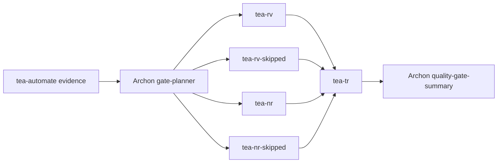

# BMAD-TEA Architecture Handoff: TEA Gate Contracts For BMAD V2 Workflow

## Document Purpose

This document is the local BMAD-TEA architecture handoff for TEA gate contracts in the BMAD v2 workflow.
It contains only BMAD-TEA-owned architecture constraints, gate semantics, contract shapes, and validation requirements.
It is intended to be read with `prd.md` and `epics.md` in this same folder.
Implementation agents must not traverse out of this repository to read parent workspace planning files.

## Architecture Paradigm

BMAD-TEA owns evidence and gate semantics.
Archon owns orchestration and routing.
The boundary between the two is a versioned JSON contract with links to human-readable TEA reports.
Markdown reports are not route APIs.

## Core Decisions

### T-AD-1: TA Emits Structured Planning Evidence

`TA` must expose structured evidence or evidence pointers for Archon `gate-planner`.
Archon should not parse TEA markdown reports to decide `run_rv`, `run_nr`, or `run_tr`.

### T-AD-2: RV Reviews Test Quality And Reliability

`RV` is a test quality and reliability review.
It is not a coverage decision.
Coverage-looking evidence may inform concerns, but RV's route findings are about reliability, assertions, fixtures, timing, flakiness, and test meaning.

### T-AD-3: NR Reviews NFR Evidence

`NR` runs when story risk, test design, ATDD evidence, implementation evidence, or integration boundaries indicate NFR concern.
NFR categories include security, reliability, performance, observability, data integrity, and integration boundaries.

### T-AD-4: TR Is Final Traceability

`TR` is the final traceability gate after resolved RV and NR branches.
It checks links between requirements, test design, automation evidence, and implementation evidence.
It emits `coverage_gaps_count` and trace/report pointers.

### T-AD-5: Skipped Contracts Are Intentional Evidence

Skipped contracts are valid route inputs.
They are not missing data.
Skipped contracts must include story identity, node, round, `gate: SKIPPED`, and reason.

### T-AD-6: ERROR Is Separate From FAIL

`FAIL` means development work can fix quality findings.
`ERROR` means TEA cannot trust execution, evidence, contract shape, story identity, or output.
`ERROR` must not be converted into quality `FAIL`.

## Contract Envelope

Every TEA route-facing contract must include:

- `contract_version`
- `workflow`
- `story_ref`
- `node`
- `round`
- `gate`
- Gate-specific count fields
- `report_file` when a report exists
- Machine-readable artifact pointers when applicable

Allowed gate values are:

- `PASS`
- `FAIL`
- `SKIPPED`
- `ERROR`

TEA may also tolerate `CONCERNS` where a future gate needs it, but the v2 TEA route stories require PASS, FAIL, SKIPPED, and ERROR.

## Gate-Specific Contracts

### `tea-rv.gate.json`

Required fields:

- `quality_score`
- `findings_count`
- `blocking_findings_count`
- `report_file`

Blocking findings include weak tests, flaky behavior, unreliable fixtures, timing-sensitive behavior, async or network-heavy test instability, UI test fragility, and weak assertions.

### `tea-nr.gate.json`

Required fields:

- `nfr_categories`
- `findings_count`
- `blocking_findings_count`
- `report_file`

NFR categories include security, permissions, data integrity, reliability, retries, timeouts, queues, background jobs, performance, scalability, caching, batching, observability, logging, monitoring, audit, public APIs, integration boundaries, workflow engine behavior, provider adapters, CI, and critical state machines.

### `tea-tr.gate.json`

Required fields:

- `coverage_gaps_count`
- `findings_count`
- `blocking_findings_count`
- `trace_file`
- `report_file`

TR evaluates traceability across story requirements, test design, automation evidence, and implementation evidence.

### Skipped Contracts

Skipped contracts for RV, NR, and TR must include:

- `contract_version`
- `workflow`
- `story_ref`
- `node`
- `round`
- `gate: SKIPPED`
- `reason`

## Validation Rules

Implementation is complete only when:

- TA structured evidence can be consumed without markdown parsing.
- RV emits PASS, FAIL, and ERROR fixtures.
- NR emits PASS, FAIL, and ERROR fixtures.
- TR emits PASS, FAIL, and ERROR fixtures.
- Skipped contract fixtures validate for RV, NR, and TR.
- Story identity mismatch produces ERROR.
- Human-readable reports are linked from contracts.
- Archon summary fixtures can consume real and skipped TEA contracts.

## Cross-Project Dependencies

BMAD-TEA depends on Archon for:

- `gate-planner` flags
- `when:` branch orchestration
- skipped-contract node execution
- `quality-gate-summary`
- `quality-route-loop`

BMAD-TEA depends on BMAD-METHOD indirectly through the shared `story_ref` and Archon's quality flow.
BMAD-TEA does not parse BMAD code-review markdown for route decisions.
