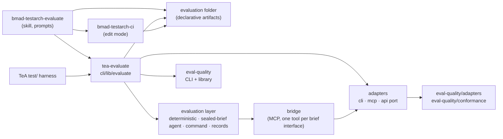
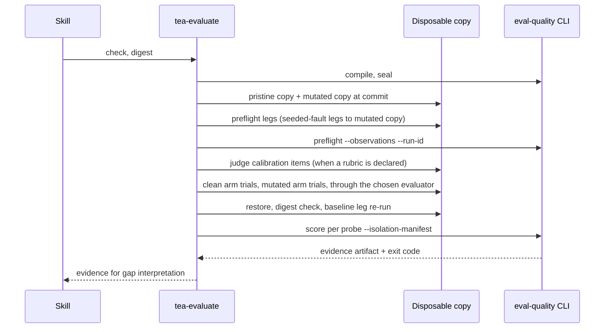

# Architecture Spine: Evaluate

## Design Paradigm

Ports and adapters around a fixed engine. The evaluation stack runs system under test, then the evaluation (the mechanism that runs the system, collects evidence and makes judgments), then the Behavioral Evaluation Contract, then eval-quality. TeA owns every layer above eval-quality, including each concern eval-quality states it leaves to the caller. Three layers of code, one direction of dependency:

- **Authoring layer:** the `bmad-testarch-evaluate` skill. Prompt content and the craft knowledge each stage needs, taught with worked examples. It inspects, asks, designs, chooses or builds the evaluation layer and writes declarative evaluation artifacts, then calls the runtime.
- **Runtime layer:** `tea-evaluate`, a bin in TeA's npm package over `cli/lib/evaluate/`. The only code that stages workspaces, launches targets, applies and rolls back mutations, records observations, drives the chosen evaluator and converts its judgments through one import contract, calibrates judges, builds and seals run records, digests the corpus, partitions held-out results, writes interpretation evidence and runs CI tiers.
- **Engine:** `eval-quality`, reached through its CLI and library. It compiles, seals, preflights, scores and measures strength. It runs nothing and mutates nothing.

Per-target adapters implement eval-quality's `EnvironmentProbePort` and plug into the runtime.



`cli/` never imports `test/`. The skill never re-implements a runtime operation in prose. Nothing in TeA re-implements an engine stage.

## Invariants & Rules

### AD-1: TeA authors, eval-quality measures [ADOPTED]

- **Binds:** all
- **Prevents:** a TeA unit copying compile, seal, preflight reduction, scoring or strength logic, or assuming the engine drives or mutates a target.
- **Rule:** TeA owns target inspection, corpus, contract, controls, seeded-defect and gameability probes, oracles and rubrics, adapters, the evaluation layer (running the system, collecting evidence, judging, and choosing or building that layer), held-out probes, judge calibration, mutation and rollback, harness configuration, gap interpretation, CI wiring and enforcement policy. eval-quality owns contract validation and sealing, probe qualification, preflight reduction, evidence verification, scoring and contract strength. Settled by the owner; no alternative was weighed.
- **Amended 2026-09-23:** the evaluation layer, held-out probes and judge calibration are named in TeA's list. The owner's intent is a fully stacked Evaluate, and eval-quality states it runs no evaluator and leaves held-out sets and judge calibration to the caller; naming them keeps AD-21 and AD-22 inside this rule.

### AD-2: One skill, `bmad-testarch-evaluate`, menu code EV

- **Binds:** CAP-1 to CAP-12, `src/`, `.claude-plugin/marketplace.json`, `test/test-installation-components.js`
- **Prevents:** two registrations of one capability, a menu-code collision, or an evaluation that ends before CI wiring.
- **Rule:** The skill lives at `src/workflows/testarch/bmad-testarch-evaluate/`. Registration, all in one change:
  - a `src/module-help.csv` row: display name `Evaluate`, menu code `EV`, phase `4-implementation`, followed-by `bmad-testarch-ci`, output-location `tea_evaluations_folder` (the committed evaluation folder lives there; working drafts such as the Story 1.12 requirements statement go under `{test_artifacts}/evaluate/`);
  - a `[[agent.menu]]` entry with `code = "EV"` and `skill = "bmad-testarch-evaluate"` in `src/agents/bmad-tea/customize.toml`;
  - a `skills` path in `marketplace.json`;
  - the `test-installation-components.js` workflow list;
  - one `src/module.yaml` config variable, `tea_evaluations_folder`, default `evals`, resolved as `{project-root}/{value}`;
  - the EV intent in `test/fixtures/tea-routing-eval/intents.json` and its ground truth, with the routing contracts and probes regenerated by `tools/generate-contracts.js` and `tools/generate-probes.js` (the intents contract stays within its `probeStepBound`), and EV in the install test's `expectedMenu`;
  - a `deferred` entry for `bmad-testarch-evaluate` in `test/evals/suite-manifest.json`, since `test/lib/suite-manifest.js` and `tools/validate-eval-schemas.js` fail a skill with neither a suite nor a deferral. The AD-15 proof story replaces it with the suite.
- **Amended 2026-09-23 (Story 1.3 review):** the `module-help.csv` output-location was `test_artifacts` when this decision was first written, matching every other row. It is corrected to `tea_evaluations_folder`: the committed evaluation folder lives there, and `test_artifacts` names only the working-draft path for artifacts like the Story 1.12 requirements statement, never the row's own output-location.
- **Rejected:** separate authoring and CI-wiring skills. The input notes treat CI integration as part of completing an evaluation, and a split would leave an eval unenforced at the handoff. A prompt-only menu entry is also rejected, since Evaluate is a multi-stage workflow that resumes from its own artifacts.

### AD-3: Lean builder shape for Evaluate

- **Binds:** the skill directory, `test/test-installation-components.js`, `tools/validate-tea-workflow-descriptions.js`
- **Prevents:** the skill failing the builder's Analyze gate by construction, or house-shape tests rejecting a lean skill.
- **Rule:** The skill has `SKILL.md` (the inline workflow), `references/` (stage guides), `assets/` (templates) and `customize.toml`. It has no `workflow.yaml`, no `steps-c/e/v`, no `instructions.md` or `checklist.md`, and no skill-local `scripts/`, because deterministic work belongs to AD-5. It keeps TEA's activation contract: the `resolve_customization.py` call, `_bmad/tea/config.yaml`, `persistent_facts = []`, `on_complete`.
  - `test-installation-components.js` gains a lean-shape assertion set.
  - The description validator reads `SKILL.md` frontmatter when no `workflow.yaml` exists.
  - The skill carries no `resources/knowledge` copy. Its domain knowledge lives in `references/`.
  - Lean shape is the precedent for new TEA skills built with `bmad-workflow-builder`. The eight house-shape skills keep it. `bmad-teach-me-testing` already has no `workflow.yaml`, and the validator's hard-coded path for it generalizes to every lean skill.
  - Twelve stage guides: inspection, intake, corpus, contract, oracles, adapters, evaluator, mutation, harness, run, gaps and ci. Each teaches its stage's craft under exact headings with worked examples; examples that are artifact fragments are tagged fenced JSON that the guidance test validates or compiles through the engine or runtime schema.
  - Guidance is proven behaviorally as well as by structure: Evaluate authors strong suites for two target kinds beyond the dogfood skill, closes seeded weaknesses through its gap loop, and succeeds with an evaluation framework its guides never name (Stories 1.24 to 1.26).
- **Amended 2026-09-23:** the `evaluator` stage guide was added (eleven became twelve) and the craft, tagged-example and behavioral-proof bullets were added, because the plan gap audit found the guides specified as term lists that no test could show produce good corpora or contracts.
- **Rejected:** the house shape. The builder cannot author it, and its Analyze gate would flag it on every run.

### AD-4: Target kind picks the interface kind and the adapter; contracts never carry it

- **Binds:** CAP-1, CAP-4, CAP-6
- **Prevents:** a contract declaring `web`, target kind leaking into a schema field, or two units choosing different adapters for one kind.
- **Rule:** Target kind is recorded only in `evaluation.json`. Mapping and generated output:

| Target kind | Interface | Adapter | Evaluate generates |
| --- | --- | --- | --- |
| Skill | `cli` | `createCommandLineAdapter` | A registry entry for TeA's shipped generic skill runner, which takes an explicit `--skill-root` inside the disposable copy and never probes install locations; `check` asserts every mutation's `targetArtifact` sits under that root. The runner is generalized from `cli/*-runner.js` and `cli/lib/run-agent.js`: prompt on stdin, vendor knowledge only in `cli/lib/agent-adapters.js`. |
| Agent | `cli` | `createCommandLineAdapter` | A registry entry for the adopter's own non-interactive command. When the agent has no such command, the skill runner wraps it. |
| Workflow | kind of the target | per kind | An interaction plan with `after` clauses and `captured` bindings, over the target's own kind. The runtime issues steps in `after` order and resolves each `captured` binding from the earlier observation of the same trial (Story 1.18). |
| Tool use: calling agent | `cli` | `createCommandLineAdapter` | As for an agent, with the agent's tool-call trajectory on stdout so an oracle and the evaluator can read tool selection and arguments (Story 1.19). |
| Tool use: tool server | `mcp` | `createMcpAdapter` | An `McpTargetAuthorization`. |
| AI feature or any web application | `api` | adopter-owned `EnvironmentProbePort` | `adapter/http-probe-port.mjs` from the skill's template: a default-export factory holding only address, auth and transport configuration, which delegates every allow or deny decision to eval-quality's exported HTTP target-policy evaluation. Plus `adapter/http-probe-port.conformance.mjs`, which calls `runEnvironmentProbePortConformance`. |
| Tool server reached over HTTP | `api` | as above | The server's HTTP surface declared as `api`; eval-quality ships stdio MCP only. |
| Test-review mechanism (a skill, agent or tool that judges tests) | kind of how it runs, usually `cli` | per that kind | The adapter of the kind it runs as (skill runner or its own command). The kind exists for corpus design: seeded test smells, clean tests, and the degenerate response that flags every test. |

- **Vendor models:** inspection redirects a request to evaluate a model or vendor dependency itself to the adopter's use of it, records the model as a fixed condition in `policy/evaluator-conditions.json`, and plans no mutation of model weights or provider choice, since a probe cannot declare either (NFR8).
- **Amended 2026-09-23:** the test-review mechanism row was added because the owner's input notes name it as a corpus-design target and the audit found no guidance for it; the workflow and calling-agent rows now name the stories that prove them; the vendor-model bullet makes NFR8 an inspection behavior with a test.

- **Engine change:** eval-quality 3.4.0 does not export its HTTP target-policy evaluation (`evaluateTarget` and address classification in `src/core/probe/target-policy.ts`). eval-quality gains that export in a release before the `api` story lands, so no adopter file carries a copy of address classification.
- **Rejected:** a shared HTTP port in TeA's runtime, because shared code would then carry network defaults for every adopter. Copying address classification into each scaffolded port, because fixes could never reach adopters. TeA proves the template against a loopback fixture (AD-15).

### AD-5: `tea-evaluate` is the single driver

- **Binds:** CAP-6, CAP-7, CAP-9, CAP-11, CAP-12, `cli/`, `test/lib/`
- **Prevents:** a second sealer, digest or registry builder; adopters holding forked harness copies; the skill improvising a deterministic step.
- **Rule:** TeA's npm package ships the `tea-evaluate` bin over `cli/lib/evaluate/`. It has seven subcommands: `check`, `digest`, `preflight`, `run`, `score`, `compare` and `ci`. The modules are generalized from existing TeA code:

| Module | Generalized from |
| --- | --- |
| registry | `test/lib/probe-targets.js` (one `RegistryEntry` schema read from `evaluation.json`; TeA's `EXECUTION_TARGETS` becomes data in that schema) |
| records | `test/lib/eval-quality-inputs.js` |
| digest and provenance | `test/lib/eval-record.js` |
| workspace | `test/eval-contract-strength.js` (`cachingPort`, `stagedWorkspaceFor`) |
| mutation | `test/test-automate-eval-fixture.js` |
| compare | `test/lib/compare-dominance.js`, `test/lib/compare-eval-runs.js` |
| evaluator | new (AD-21): the evaluator kinds and the judgment-rows conversion |
| bridge | new (AD-21): the stdio MCP server a sealed-brief agent evaluator acts through |
| partition and calibration | new (AD-22) |
| interpret | new (AD-23) |

- **Harness:** TeA's `test/` harness imports these modules and keeps only TeA data. It maps runtime exits through the AD-10 table.
- **Module format:** `cli/lib/evaluate` is CommonJS like the rest of TeA and reaches the ESM-only engine through one async loader generalized from `loadEvalQuality`.
  Moved code drops every `test/` path (package-boundary gate).
  The `dependency-direction` section of `eval-quality.config.json` gives `cli/lib/evaluate/engine.js` its own exact `evaluate-engine` layer, declared ahead of the `cli` prefix layer, whose `allow` list names `eval-quality`, `eval-quality/adapters`, `node:fs` and `node:path`.
  The `cli` layer's `allow` list names every other external `cli/` uses and leaves `eval-quality` out, so `engine.js` is the one file that names `eval-quality` in an `import(` or `require(`, and `test:direction` refuses an engine import from any other `cli/` file.
  Every module the runtime needs ships in TeA's `dependencies` (`ajv` moves there).
  (Amended 2026-09-23 in Story 1.5: this decision first put `eval-quality` on the `cli` layer's list; the engine's own layer replaced that.)
- **Packaging:** TeA's `package.json` declares `eval-quality` under `peerDependencies`, floored at `>=4.0.0`, the first published release carrying the target-policy export and trial-set scoring (#143) Evaluate needs, since an older engine admitted by the range could not run Evaluate. (Amended 2026-09-23: the floor was `>=3.4.0` with a later raise in Story H.1, written before 4.0.0 shipped.) `peerDependenciesMeta` marks it optional so projects that never run Evaluate do not receive it, and the bin is `tea-evaluate`; the release-metadata and guard-publish checks cover both. One engine version serves a run.
- **Inputs:** the runtime reads no `_bmad/` config. Every subcommand takes `--evaluation <path>` and exits 64 when none resolves.
- **Schemas:** the runtime owns the JSON schemas of `evaluation.json` and `evaluation-ci-plan.json`. `npm test` validates the skill's templates and `bmad-testarch-ci`'s plan reader against them.
- **Rejected:** generating harness source into each adopter repository, because fixes could never propagate. Skill-local scripts are also rejected: they install under `_bmad/`, so they are no stable CI entry point.
- **Amended 2026-09-23:** four module rows were added for AD-21 to AD-23. The subcommand count stays seven: evaluator kinds, partitions and calibration run inside `run` and `score`, and interpretation is written by `score`.

### AD-6: The CLI decides every enforced verdict; the library only drives legs

- **Binds:** CAP-9, CAP-11
- **Prevents:** two verdict paths that disagree, or exit codes CI cannot reproduce by hand.
- **Rule:** The runtime calls `runPreflight` through a recording port, which is the only way to plan and drive preflight legs, and persists every observation. It also uses `resolveCheck`, `digestArtifact` and the conformance suites from the library. Every verdict CI enforces comes from the `eval-quality` CLI over persisted files: `compile`, `seal`, `preflight --observations`, and `score` once per probe. The library's own preflight verdict is discarded. `preflight` receives the invocation's `--run-id`.
- **Leg routing:** a leg named by a defect's `manifestationWitness.legId` goes to the mutated copy of that defect's mutation, or to the pre-fix revision on the `historical` route. Every other leg goes to the pristine copy. Both copies stay live until preflight finishes. The registry builds each leg's authorization with `cwd` set to the copy the leg is routed to, from the per-operation staging `evaluation.json` declares.

### AD-7: Run records have one shape

- **Binds:** CAP-8, CAP-9
- **Prevents:** trial sets that ingest refuses for field disagreement, or clean and mutated arms labelled differently by different units.
- **Rule:**
  - One `invocationId` per `tea-evaluate` invocation keys `runs/<invocationId>/`. One `runId` per trial set, derived from it. `trialIndex` runs 1..N, unique within the set, with N at least the policy's `minimumTrialCount`.
  - `mode` is `contract-scoring` for evaluation runs.
  - `conditionArm` is `clean`, `mutated:<mutationId>`, `historical:<revision>`, or `gameability:<probeId>`. A gameability arm launches no target: it evaluates the probe's degenerate response as a synthetic observation with `resolveCheck`, producing `naiveOracleSatisfiedEvidence` and `disciplinedOracleRejectedEvidence`.
  - Trial requests come from the contract's `interactionPlan`, bound from the probe's `testData`. No second request source exists.
  - Findings and oracle dispositions come from the evaluator kind `evaluation.json` declares (AD-21): by default a deterministic evaluator that runs `resolveCheck` over the arm's observations; otherwise a sealed-brief agent evaluator, an adopter evaluator command whose judgment rows the runtime converts, or records the adopter's own harness sealed. A model judge appears only where a rubric is declared; TeA's own judge runs through `cli/lib/agent-adapters.js`, every judge is calibrated before its scores count (AD-22), `judgeConfiguration` records the judge's `modelSnapshot` and `systemPromptDigest` (the only fields its strict schema allows), and the calibration set's digest is recorded as `decodingParameters["tea.judgeCalibrationDigest"]`.
  - Observations the runtime drives from the interaction plan carry `provenance: baseline`; observations a sealed-brief agent evaluator chooses through the bridge carry `provenance: evaluator-chosen`.
  - `EvaluatorConfiguration` records the vendor model and runner as a fixed condition in a run that uses a model. A run that uses none writes `modelSnapshot: "none"` and a `systemPromptDigest` of `digestBytes` over the empty byte string, since the published schema requires both.
  - The runtime emits one `IsolationManifest` per trial set from the workspace, network and environment it actually granted, and passes `--isolation-manifest` to `score`. An absent manifest makes the run Invalid.
  - Each registry entry declares `infrastructureExitCodes` (3 to 6 for the skill runner, whose exit 2 is a usage error). A trial observation carrying one is an infrastructure failure: the trial yields no record and the invocation exits 12. `check` refuses a defect signature those codes could satisfy.
  - The adopter sets `severityFloor`, `minimumTrialCount` and `catchThreshold` at intake. The policy template carries no values.
  - `EvaluatorConfiguration` is generated per run into `runs/`, since its `sealedBriefDigest` comes from `seal`. Only its fixed-condition inputs are committed, as `policy/evaluator-conditions.json`.
  - Probe digests: `commitDigest` is the evaluated commit, `artifactDigest` the `targetArtifact` bytes, `implementationDigest` the tracked tree of the skill root or target root at that commit. A change to any of them requires re-qualification.
  - Every artifact is validated against eval-quality's published schemas before it reaches the CLI.
  - **Amended 2026-09-23:** the evaluator source, provenance and calibration bullets were widened for AD-21 and AD-22; the deterministic evaluator stays the default.

### AD-8: Mutation happens only in a disposable copy, and rollback is proved

- **Binds:** CAP-7
- **Prevents:** writes to the adopter's working tree, or `rollbackVerified: true` without a performed and verified restore.
- **Rule:** A mutation is a file, `mutations/M-NNN.mutation.json`, holding `targetArtifact` (repo-relative) and a `replace-exact` operator: `find`, `replace`, and an occurrence count that must be exactly 1. For a git target the copy is `git worktree add --detach` at the evaluated commit, provisioned with read-only links to the gitignored runtime directories `evaluation.json` lists (for example `_bmad/`, `node_modules/`); a `targetArtifact` inside a provisioned directory is refused. For any other target, including a fixture whose `evaluation.json` declares a copy workspace, it is a temp copy identified by its tree digest. When the adopter evaluates uncommitted work (`--from-working-tree`) it is also a temp copy, and `run.json` then records `dirty: true`; a dirty run cannot be accepted as a baseline. Per mutation:
  1. Run the clean arm on the pristine copy. This is the baseline-pass evidence.
  2. Apply the mutation.
  3. Run the mutated arm. This is the mutated-fail evidence.
  4. Restore the original bytes.
  5. Check that the artifact digest equals the pre-mutation digest.
  6. Re-run the baseline leg until the clean-control oracle holds, within the policy's `reExecutionCap`.

- **Rollback proof:** only then is `rollbackVerified` set to `true`, and the evidence files carry digests. `git status` of the adopter tree must be unchanged before and after. Scratch is removed in `finally`. A failed step emits no probe. An occurrence count other than 1 exits 10; a baseline that does not pass or a mutated arm that does not fail exits 11; a workspace, launch or restore failure exits 12. A target reachable only as a remote deployment takes the `historical` route when two addressable revisions exist. Otherwise its seeded probe is recorded as refused, with the reason. Seeded-fault preflight legs follow the routing in AD-6.
- **Rejected:** the twin-fixture pattern in `tools/generate-probes.js`, because its hard-coded `rollbackVerified: true` proves no rollback. Mutating the adopter tree and running `git restore` afterwards is also rejected, because it risks uncommitted work.

### AD-9: Corpus layout and digest

- **Binds:** CAP-3, CAP-12
- **Prevents:** two layouts for one evaluation, or a `corpusDigest` that misses fixture bytes.
- **Rule:** An evaluation lives at `{tea_evaluations_folder}/<evaluationId>/`, shaped as in the Structural Seed. `corpus-index.json` lists every file under `corpus/`, `probes/` and `mutations/` as `{path, sha256}`, sorted by path. `corpusDigest` is eval-quality's `digestArtifact` over that index. `tea-evaluate check` fails on a stale index.
- **Versioning:** `evaluation.json` carries `schemaVersion`; `check` refuses a version the installed runtime does not know, naming the installed TeA version and the schema versions it knows. (Amended 2026-09-23: the rule named "the TeA version that does", which a runtime cannot know for a release newer than itself.)
- **Qualification evidence:** committed under `baseline/qualification/` with public paths; `check` verifies each reference's digest. Re-qualification is one reviewed commit that updates the evidence and the baseline together.
- **Authored and runtime fields:** committed probes hold authored fields only: class, behavior, defects with signatures and witnesses, and the qualification route. The mutation file is the single source of `mutationSource`, `targetArtifact` and the operator. The runtime writes qualified probes, with evidence references and digests, into `runs/` and `baseline/`. `check` refuses a committed probe that carries a runtime-owned field.
- **Evaluation-layer and policy files:** `evaluator/` holds an adopter evaluator command, `mapping.json` and, for a learned framework, `LEARNED.md`; `policy/judge-calibration.json` holds labelled calibration items; `evaluation.json` carries `evaluator`, `heldOutProbes`, `judgeCalibration`, `operationPhases` and `requirements` (the confirmed requirements statement's path and digest). The `evaluator/` tree digest is recorded in `EvaluatorConfiguration` as `decodingParameters["tea.evaluatorTreeDigest"]` (AD-21), so a changed evaluator changes the scoring version.
- **Scope:** this digest governs Evaluate-authored evaluations. TeA's ten generator suites keep `corpusDigestOf`, so their recorded baselines stay comparable. Filenames: `P-NNN.probe.json` (one probe per file), `M-NNN.mutation.json`, `contract.json`, with IDs matching eval-quality's patterns.
- **Rejected:** TeA's `corpusDigestOf`, which digests only `contractId` and the probes JSON.
- **Amended 2026-09-23:** the evaluation-layer and policy files bullet was added for AD-21, AD-22 and AD-23.

### AD-10: CI tiers and enforcement map onto eval-quality's exits

- **Binds:** CAP-11
- **Prevents:** a parallel failure taxonomy, a failed model call reading as a low score, or CI claiming detections the engine cannot make.
- **Rule:** Placement is derived per adopter. Evaluate's ci stage inspects the adopter's repository, existing CI, merge flow, release flow and risk profile, and places each check in a tier; the table below is the default each placement starts from. Every check records its `placement` (chosen tier, default tier, and the reason naming what the inspection found). One floor holds for every adopter: a deterministic check that needs no secret runs on `pr` (CAP-11). Default tiers:
  - `pr`: `tea-evaluate check` (contract-source freshness included), `compile`, `seal`, API port conformance, the gameability arm for every gameability probe, oracle-versus-scorer agreement read from the `corroboration` eval-quality records on each oracle outcome in the committed baseline evidence (TeA keeps no comparison table of its own), and a replay of committed baseline observations and records through `preflight` and `score` that must reproduce the committed evidence.
  - `merge`: `pr`, plus a live preflight when the target needs no secret.
  - `scheduled`: a live preflight, plus a twin run at `minimumTrialCount`, plus the held-out partition, plus judge calibration when a rubric is declared, plus a strength comparison against the baseline.
  - `release`: the `scheduled` set, as a release gate.
  - `ci/evaluation-ci-plan.json` is the only definition of tier membership; `tea-evaluate ci --tier <tier>` runs exactly the plan's checks for that tier.
  - **Amended 2026-09-23:** tier membership was fixed for every adopter; the owner's input notes require inspecting the adopter's repository, CI, release flow and risk profile to decide what runs when, so the table became the default and placement became a recorded, validated decision. The gameability arm, contract-source freshness (`ci-enforcement-policy.md` check 2) and oracle-versus-scorer agreement (check 3) were in no tier; all three are deterministic and joined `pr`. Held-out partitions and judge calibration (AD-22) joined `scheduled` and `release`.

- **Enforcement:**

| Exit | Source | Class | Action |
| --- | --- | --- | --- |
| 0 | eval-quality | pass. CONCERNS is read from the evidence artifact | pass, or warn on CONCERNS |
| 2 | eval-quality | target behavior failure, or evidence or lineage integrity | block |
| 3 | eval-quality | infrastructure or integrity, classified from the persisted `PreflightVerdict` checks for `preflight`, and from `score` diagnostics captured to `runs/` for `score`. Never counted as a quality score | block |
| 4 | eval-quality | contract authoring defect | block |
| 5 | eval-quality | runtime fault: infrastructure or invocation | block |
| 10 | `tea-evaluate` | authoring defect: `check` failure, stale index, registry mismatch, bad mutation | block |
| 11 | `tea-evaluate` | evaluation weakness: a mutation that does not manifest, a baseline that does not pass, a judge below its calibration agreement, or a baseline oracle outcome whose engine-recorded `corroboration` is `disagrees`, or `not-evaluable` for a required oracle | block |
| 12 | `tea-evaluate` | infrastructure: workspace, launch, restore, an infrastructure exit from the target, or an evaluator that crashes or emits output outside the import contract | block |
| 13 | `tea-evaluate` | evaluation evidence drift: the `pr` replay's produced evidence differs from the baseline | block |
| 64 | `tea-evaluate` | wiring defect: no `--evaluation` resolves | block |
| 64 | eval-quality | wiring defect | block |
| 1 | eval-quality-gates | repository policy violation | block |
| 64 | eval-quality-gates | wiring defect | block |

- **Outcome states:** `missed`, `abstained`, `bypassed` and `false-positive` at or above `severityFloor` reach CI as FAIL (exit 2); below it, as CONCERNS. `oracle-error`, `judge-error` and `infrastructure-error` reach it as Invalid (exit 3), reported as infrastructure. `unreached` and below-minimum trials are CONCERNS evidence conditions: warn.
- **Informs:** strength trend, duration, cost, and a `refused` baseline comparison, including one refused across `evalQualityVersion`, which is routed to `compare --accept`.
- **Strength floor:** `evaluation.json` declares a minimum catch rate per probe class. Below it, the `scheduled` tier warns and the `release` tier blocks. The held-out partition is held to the floor on its own.
- **Stale baseline:** the `pr` replay runs against the baseline's own snapshot. When the current contract or corpus digest differs from the baseline's, `pr` warns and `release` blocks until a re-recorded baseline is accepted.
- **Limits:** `--strict` is never passed. A strength regression against the baseline is a warning. No policy claims `evidence-over-truncated`, `evidence-unavailable` or `evidence-internally-inconsistent`. `tea-evaluate` passes stage exits through verbatim. TeA's 0/1/2 harness convention is documented as an optional pattern.
- **Rejected:** imposing TeA's 0/1/2 classes on adopters, which would add a second taxonomy over eval-quality's codes. Promoting CONCERNS with `--strict`, which TeA already declines.

### AD-11: Evaluate composes with `bmad-testarch-ci`: one pipeline owner

- **Binds:** CAP-11, `src/workflows/testarch/bmad-testarch-ci/`
- **Prevents:** two skills writing the adopter's pipeline files.
- **Rule:** Evaluate writes `ci/evaluation-ci-plan.json`. It is platform-neutral: each check names its tier, trigger, a command (a `tea-evaluate` command, or an `eval-quality-gates` command for a gate the adopter adopted), its enforcement class and its evidence paths. `bmad-testarch-ci` gains a step that detects evaluation plans and renders them with its existing platform templates. Evaluate's last stage invokes `bmad-testarch-ci` in edit mode, and a standalone CI run also picks up existing plans. `eval-quality-gates` is opt-in: Evaluate adds sections to `eval-quality.config.json` only for gates the adopter adopts, and never rewrites an existing section. In TeA, the eight gates stay in their current `quality.yaml` jobs, and each Evaluate `pr` check joins the `npm test` chain with its own step in the `validate` job, as `tools/validate-ci-coverage.js` requires. `bmad-testarch-ci` rendering is proved on the AD-15 fixture adopters.
- **CI skill change gate:** the `bmad-testarch-ci` edit keeps the house shape. It is authored directly and gated by its house tests, by `generate-contracts.js --check` for `ci.contract.json`, and by its existing suite's replay. Builder Analyze does not apply to it.
- **Rejected:** Evaluate writing its own workflow files, which would duplicate five platform templates. Moving evaluation knowledge into the CI skill is also rejected.

### AD-12: Evidence bundle and baseline

- **Binds:** CAP-12
- **Prevents:** unauditable runs, silent baseline drift, or comparisons across incomparable runs.
- **Rule:** `runs/<invocationId>/` is gitignored and uploaded as a CI artifact. It holds:
  - the compiled contract and the sealed brief;
  - observations and the preflight verdict;
  - sealed run records, isolation manifests, evaluator configurations, evidence artifacts and strength;
  - `score` diagnostics;
  - evaluator stdout and stderr, judge calibration results, `partitions.json`, `gap-view.json` and `interpretation.json`;
  - gate outputs;
  - `run.json`: TeA and eval-quality versions, contract and corpus digests, runner and model identity, trial count, duration and commit.

- **Baseline:** `baseline/` is committed and holds a snapshot of the contract, the sealed brief, the qualified probes, observations, the preflight verdict, sealed records, per-trial-set isolation manifests, the evaluator configuration, the scoring policy and evidence, every input a replay through `score` needs. It changes only through `tea-evaluate compare --accept` in a reviewed pull request. Comparison uses `compareDominance` and reports `refused` when `comparabilityKey` differs.

### AD-13: Versions float [ADOPTED]

- **Binds:** all generated dependencies, TeA's `package.json`, `test/test-eval-quality-corpus.js`, `.npmrc`, `eval-quality.config.json`
- **Prevents:** pins that age, or two eval-quality versions inside one run.
- **Rule:** Evaluate adds `eval-quality` and TeA's package to adopters as devDependencies with the `latest` spec, in the evaluation folder's own `package.json` (AD-20). TeA declares `peerDependencies: {"eval-quality": ">=4.0.0"}`, and its exact devDependency pin and the exact-version assertion in `test/test-eval-quality-corpus.js` become float in the proof-target work. The `min-release-age` and `lockfile-age` exclusions stay, with their rationale rewritten, so engine releases arrive without the seven-day delay. Engine drift then surfaces through the `pr` baseline replay and the `evalQualityVersion` stamp that already exists.

### AD-14: TeA's generators coexist

- **Binds:** `tools/generate-contracts.js`, `tools/generate-probes.js`
- **Prevents:** two authoring paths writing one suite.
- **Rule:** The ten existing suites stay generator-owned, guarded by `--check`. Evaluate-authored evaluations are committed files, guarded by `tea-evaluate check`. No suite has both. Superseding the generators is rejected: they derive from ground truth that Evaluate does not model.

### AD-15: Proof target and finish line

- **Binds:** all
- **Prevents:** declaring Evaluate done on a demo.
- **Rule:** Evaluate is done when it has authored the behavioral suite for `bmad-testarch-evaluate` itself, TeA's next skill, which `suite-manifest.json` requires to carry a suite. That run must show:
  - a live controlled mutation of a skill file, with a proved rollback;
  - `compile` exit 0 and a passed preflight;
  - the clean arm at `passed-clean-control`;
  - the mutated arm `caught` at `minimumTrialCount`;
  - registration in the suite manifest as a new `evalType`, `evaluate-authored`, whose entry points at the evaluation's `evaluation.json`; `tools/validate-eval-schemas.js` cross-checks its thresholds against `evaluation.json` and the scoring policy;
  - the `pr` tier running in `quality.yaml` as `npm test` chain scripts with their own steps.
- **TeA's folder:** `tea_evaluations_folder` is `test/evaluations` in this repository, inside the existing lint and dependency-direction roots.

- **Rejected:** re-deriving an existing skill's suite and comparing it with the hand-built one. The corpora differ, so `comparabilityKey` differs and `compareDominance` refuses.
- **Other interface kinds:** two loopback fixture targets under `test/fixtures/` run the same pipeline in TeA's CI: one `api` target using the scaffolded HTTP port, which passes conformance, and one `mcp` stdio server.
- **Guidance and evaluation layer:** Evaluate is fully stacked when, beyond the dogfood run, it has authored strong suites for an AI feature and a test-review mechanism from their descriptions (Story 1.24), closed seeded weaknesses through its gap loop (Story 1.25), imported results from two unrelated frameworks through one contract (Stories 1.19, 1.20) and succeeded with a framework its guides never name (Story 1.26), each held by a deterministic `npm test` script and run on `pr` (Story 2.5).
- **Amended 2026-09-23:** the guidance and evaluation-layer bullet was added; a dogfood run alone proves the loop works on one kind and says nothing about the quality of the guidance.

### AD-16: `bmad-workflow-builder` authors the skill and gates it

- **Binds:** the skill directory, every story that changes it
- **Prevents:** the skill landing in `{project-root}/skills`, builder process files shipping in the npm tarball, or an ungated skill.
- **Rule:** Build and Edit run headless on the explicit path `src/workflows/testarch/bmad-testarch-evaluate`, and the configured output folder is never used. `.memlog.md` and `.analysis/` inside the skill are gitignored and absent from `npm pack --dry-run`. The Analyze gate requires zero critical and zero high findings. A finding that contradicts a repository test is skipped, with the reason recorded in the story.
- **Rejected:** setting `bmad_builder_output_folder` to the skill path. That config is local and gitignored, so another contributor's build would land elsewhere.

### AD-17: `bmad-module-builder` VM gates registration through a staged layout

- **Binds:** `src/module.yaml`, `src/module-help.csv`, the agent menu, `marketplace.json`
- **Prevents:** a gate that fails on main already, or a registration defect that goes unseen.
- **Rule:** A staging step builds `<tmp>/tea-setup/` from a stub `SKILL.md` and `assets/{module.yaml,module-help.csv}` copied from `src/`, and symlinks every `src/workflows/testarch` skill. VM runs on that staged tree for main and for the branch. The gate is zero new critical or high findings, plus VM's LLM review of the EV row. Findings that exist on main today (the `_meta` row, the cross-module `bmad-create-story:create` reference, the `module_name` mis-parse) are the baseline. Ideate and Create do not apply.
- **Rejected:** restructuring TEA into a setup-skill layout, which would break the installer, the marketplace and the install tests.

### AD-18: `bmad-build` owns the story; the builder runs inside implement

- **Binds:** every implementation story
- **Prevents:** two loops each planning, committing or reviewing the same change.
- **Rule:** `bmad-build` owns the spec, plan, implement, review and commit steps. In implement, prompt-content changes go through the builder (AD-16), and runtime and test code is written directly. Story acceptance gates, in order, after implement and before the review layers:
  1. builder Analyze;
  2. the VM staged gate, when a registration file changed;
  3. `npm test`.

- **Builder scope:** the builder never commits and never edits outside the skill directory. `bmad-testarch-ci` changes follow AD-11's gate.
- **Rejected:** the builder owning the story. It has no spec, review layers, sprint status or commit step.

### AD-19: Probe discipline the engine enforces is planned at authoring

- **Binds:** CAP-3, CAP-5, CAP-7
- **Prevents:** probes that compile and then cannot score.
- **Rule:**
  - Each behavior that a defect or gameability probe discharges declares exactly one oracle.
  - A defect signature addresses an exit code or the descriptor-nominated stream or response body. Where neither is possible, the probe is recorded as refused, with the reason.
  - A clean control is `zero-action` with `expectedClean: true`.
  - Every defect of a non-canary probe carries a `manifestationWitness`. Clean controls carry no defects.

### AD-20: Operational envelope

- **Binds:** CAP-6, CAP-9, CAP-11, adopter repositories, TeA CI
- **Prevents:** a skill that cannot reach its runtime, live tiers wired to credentials that do not exist, or a proof run with no place to execute.
- **Rule:**
  - Evaluate writes a private `{tea_evaluations_folder}/package.json` with `eval-quality` and TeA's package as devDependencies (`latest` spec). The skill runs `npm install --prefix` there, then `npm exec --prefix <folder> tea-evaluate`. The adopter's root manifest stays untouched, so repositories in any language work. Node >=22.20.0 is the CI prerequisite.
  - The `pr` tier needs no secret. Live tiers need the runner's vendor credential keys as CI secrets, declared as `permittedEnvironmentKeys`. Skill and agent targets always need them, so their live tiers run on `scheduled`, `release` and manual dispatch only.
  - A `sealed-brief-agent` evaluator, a model-graded framework evaluator and judge calibration with a model judge each need model credentials, so the runs that use them sit in the live tiers under the same rule; their `pr` presence is the replay of committed evidence. (Amended 2026-09-23 for AD-21 and AD-22.)
  - TeA's CI has no model secret and runs the `pr` tier. TeA's live proof (AD-15) runs on a maintainer machine through the local agent CLI, and its evidence enters `baseline/` through `compare --accept` in a reviewed pull request.
- **Rejected:** adding the devDependencies to the adopter's root `package.json`, which fails in repositories with no Node manifest and mixes evaluation tooling into the product's dependencies.

### AD-21: The evaluation layer is chosen per evaluation, behind one framework-neutral import contract

- **Binds:** CAP-9, CAP-13, `cli/lib/evaluate/`, the skill's `evaluator` stage, `evaluation.json`
- **Prevents:** an Evaluate that can only run its own evaluator, a runtime that needs a change for each framework, framework knowledge leaking into `cli/`, or an evaluator that reads the answers off the contract.
- **Rule:** `evaluation.json` declares `evaluator.kind`:
  - `deterministic` (default): TeA's `resolveCheck` evaluator (AD-7).
  - `sealed-brief-agent`: an agent run through `cli/lib/agent-adapters.js` that receives the sealed brief and the judgment-rows instructions only, and acts on the target only through `cli/lib/evaluate/bridge.js`, a vendor-neutral stdio MCP server exposing one tool per interface the brief carries. The brief names interfaces as `{ logicalId, kind }` and withholds the operation list, so each tool takes a kind-generic call (`cli`: arguments and stdin; `api`: method, path and body; `mcp`: tool name and arguments); the registry authorization denies anything it does not grant, and the runtime maps each authorized call to the contract `operationId` it matches for the `evaluator-chosen` observation it records. This is eval-quality's own intended evaluator shape (its README's sealed-brief example).
  - `command`: an adopter-owned executable (own harness, skill-specific evaluator, custom code, or a wrapper over any evaluation framework) that receives `{ sealedBrief, observations }` on stdin and prints judgment rows.
  - `records`: an adopter harness that runs the system and seals its own `SealedRunRecord`s, which `score` validates and passes through.
- **Import contract:** judgment rows (`key`, `outcome` `pass`, `fail` or `score`, `score`, `observationIds`, `quote`, `quoteChannel`, `artifactId` on the `artifact` channel, `confidence`, `comment` required on `fail`, optional `recommendation`) plus `evaluator/mapping.json`, which binds each key to an oracle and behavior or to a rubric criterion and its anchored levels. The runtime converts rows into `SealedRunRecord` findings, dispositions and judge results through that one mapping; a `fail` row becomes a `findingType: defect` finding with a runtime-minted `findingId`, `comment` as `summary`, `evidenceArtifacts: []` and `quotedEvidence` `{ quote, channel, artifactId }`, so every record validates against eval-quality's strict `Finding` union. Each row's `key` is one `mapping.json` declares and appears at most once per trial; zero rows for a trial with a mapped oracle, a row set outside the schema, or a `command` evaluator still running at its required `evaluator.timeoutMs` (its process group killed) each exit 12 with no record. The runtime re-checks nothing eval-quality's ingest checks. Framework-specific code lives only in the adopter's `evaluator/` folder; the binding guard is the `cli` layer's dependency-direction `allow` list, which names no framework, so any framework import from `cli/` fails `test:direction` whatever it is called; a name scan in `test:evaluate-boundaries` is secondary.
- **Frameworks TeA does not know:** the skill's evaluator guide carries a learn-on-the-go procedure (primary sources, an executed minimal example against a known pass and fail, `evaluator/LEARNED.md` with sources), so the set of admissible frameworks is open. `evaluation-framework-facts.md` holds verified examples from that open set.
- **Fixed conditions:** `EvaluatorConfiguration`'s schema is strict, so the evaluator identity goes in `evaluatorIdentity`, the model in `modelSnapshot`, and TeA's own conditions under caller-owned keys in `decodingParameters`, the one field open to caller keys: `tea.evaluatorKind`, `tea.evaluatorExecutableDigest` and `tea.evaluatorTreeDigest`. A changed evaluator therefore changes the configuration digest and the scoring version. A framework or judge model is a condition of the run; the system under test is the adopter's use of it (NFR8).
- **Rejected:** framework-specific importers in `cli/lib/evaluate/`, because every new framework would then need a TeA release. Hard-wiring the deterministic evaluator as the only path, because eval-quality's model expects a sealed-brief evaluator and adopters already run evaluation frameworks. Having the runtime verify quotes and citations, because that copies eval-quality's ingest (AD-1).

### AD-22: Held-out probes and judge calibration are TeA's

- **Binds:** CAP-3, CAP-5, CAP-14, `run`, `score`, the ci tiers
- **Prevents:** an evaluation tuned to the only probes it is ever scored on, or rubric scores from a judge nobody checked against a human reading.
- **Rule:** eval-quality's evidence does not mark held-out probes and it declares a judge-calibration platform out of scope, so TeA owns both.
  - **Held-out probes:** `evaluation.json` lists `heldOutProbes`, chosen at corpus design before oracles are written. `run --partition` runs development, held-out or both. `score` writes `partitions.json` (outcomes copied from evidence artifacts, grouped) and `gap-view.json` (held-out probes as ID, class and outcome only). The gap stage reads `gap-view.json` only. The held-out partition runs on `scheduled` and `release` and is held to the strength floor on its own.
  - **Judge calibration:** `policy/judge-calibration.json` holds labelled items covering every anchored level of every rubric criterion; `judgeCalibration.minimumAgreement` is the adopter's. Before the first trial, `run` passes every item through the same judge path with its label withheld, records exact agreement and the largest level distance, and exits 11 below the threshold. The calibration set's digest is a fixed condition recorded as `decodingParameters["tea.judgeCalibrationDigest"]` in `EvaluatorConfiguration`, whose strict `judgeConfiguration` has no slot for it.
- **Rejected:** computing held-out strength inside TeA, which would copy eval-quality's strength logic; the partition only groups outcomes the engine produced.

### AD-23: Where TeA's interpretation stops

- **Binds:** CAP-10, `score`, the skill's `gaps` stage
- **Prevents:** TeA re-implementing engine judgments under another name, or leaving the caller-side concerns eval-quality names with no owner.
- **Rule:** eval-quality leaves claim-to-evidence lineage, semantic checkpoint scoring, process and outcome separation, and first material error attribution outside the package. TeA covers what it legitimately owns and stops at the engine's boundary:
  - **Claim-to-evidence lineage:** TeA authors the evidence pointers every oracle and rubric criterion reads, requires every evaluator finding to cite observations and quote them, and traces each finding to its observations and pointers in `interpretation.json`. Whether a claim is supported is decided only by eval-quality's signature match and ingest conditions; TeA scores no claim.
  - **Semantic checkpoints:** a checkpoint that needs judgment is a rubric criterion with an anchored scale, judged by a calibrated judge (AD-22) and scored by eval-quality. TeA adds no checkpoint score of its own.
  - **Process and outcome separation, and first material error:** `evaluation.json` classifies each operation as `process` or `outcome`; `interpretation.json` partitions findings by phase and names the lowest-`sequence` observation cited by a `material` or `critical` finding. Outcomes, verdicts and rates in the file are copied from the evidence artifact.
- **Rejected:** a TeA claim-support or checkpoint scorer, which would be a second verdict path (AD-6).

## Consistency Conventions

| Concern | Convention |
| --- | --- |
| Identifiers | `evaluationId` is kebab-case; `B-NNN`, `O-NNN` and `P-NNN` follow eval-quality; mutations are `M-NNN` |
| Artifact serialization | Canonical JSON (RFC 8785) through eval-quality's `serializeArtifact`; one artifact per file |
| Vocabulary | eval-quality terms only (`eval-quality-vocabulary.md`); no parallel names for engine concepts |
| Environment | Only declared keys reach a target; `PATH` is never declared; secrets come from CI secrets only |
| Tier names | `pr` maps to the suite manifest's `deterministic`, `merge` to `smoke`, `scheduled` and `release` to `full-matrix` |
| Vendor knowledge | Only in `cli/lib/agent-adapters.js`; runners and the runtime stay vendor-neutral |
| Planning outputs | Requirements statements and gap reports go to `{test_artifacts}/evaluate/<evaluationId>/`; committed evaluation assets go to `{tea_evaluations_folder}` |

## Stack

| Name | Version |
| --- | --- |
| eval-quality | `latest` spec (3.4.0 verified 2026-09-22; 4.0.0 published 2026-09-23 with the target-policy export and trial-set scoring); TeA peer range `>=4.0.0` |
| Node.js | >=22.20.0 (TeA and eval-quality engines) |

## Structural Seed

```text
src/workflows/testarch/bmad-testarch-evaluate/
  SKILL.md            # inline workflow, TEA activation contract
  customize.toml
  references/         # stage guides: inspection, intake, corpus, contract, oracles, adapters, evaluator, mutation, harness, run, gaps, ci
  assets/             # templates: evaluation.json, inspection record, requirements statement, contract skeleton, http-probe-port, conformance test, evaluators/, ci plan
cli/
  evaluate.js         # bin tea-evaluate
  skill-runner.js     # generic skill runner (cli target)
  lib/evaluate/       # registry, records, digest, workspace, mutation, evaluator, bridge, partition, calibration, interpret, compare, ci
{tea_evaluations_folder}/<evaluationId>/
  package.json        # private: eval-quality + TeA package, latest spec (adopters)
  evaluation.json     # TeA manifest: targetKind, interface, registry, launch, arms, trials, tiers
  contract.json
  probes/P-NNN.probe.json
  mutations/M-NNN.mutation.json
  corpus/             # local corpus adapter root
  corpus-index.json
  policy/             # scoring-policy.json, evaluator-conditions.json, judge-calibration.json
  evaluator/          # command evaluators: executable, mapping.json, LEARNED.md for a learned framework
  adapter/            # api only: http-probe-port.mjs + conformance
  ci/evaluation-ci-plan.json
  baseline/           # committed
  runs/               # gitignored, CI artifact
```



## Capability → Architecture Map

| Capability | Lives in | Governed by |
| --- | --- | --- |
| CAP-1 target inspection | skill `references/` | AD-4 |
| CAP-2 requirements intake | skill | AD-2, conventions (planning outputs) |
| CAP-3 corpus design | skill, `corpus/`, `probes/` | AD-9, AD-19 |
| CAP-4 contract authoring | skill, `contract.json` | AD-1, AD-4, AD-6 |
| CAP-5 oracles and rubrics | `contract.json` | AD-7, AD-19 |
| CAP-6 adapter scaffolding | `evaluation.json`, `adapter/`, `cli/skill-runner.js` | AD-4, AD-5 |
| CAP-7 mutation and rollback | `mutations/`, `cli/lib/evaluate/mutation` | AD-8 |
| CAP-8 harness configuration | `policy/` | AD-7 |
| CAP-9 run and seal | `tea-evaluate run`, `preflight` and `score` | AD-5, AD-6, AD-7, AD-21 |
| CAP-10 gap interpretation | skill, reading `runs/`; `interpretation.json` | AD-10 classes, AD-23 |
| CAP-11 CI wiring | `ci/evaluation-ci-plan.json`, `bmad-testarch-ci` | AD-10, AD-11 |
| CAP-12 evidence | `runs/`, `baseline/` | AD-9, AD-12 |
| CAP-13 evaluation layer | `evaluator/`, `cli/lib/evaluate/evaluator` and `bridge`, skill `references/evaluator.md` | AD-21 |
| CAP-14 held-out probes and judge calibration | `evaluation.json`, `policy/judge-calibration.json`, `run`, `score` | AD-22 |

## Deferred

- **Prompt wording inside `SKILL.md` and `references/`.** The builder and the story own the wording; AD-3 fixes the shape, the twelve stages and the craft each stage guide must teach, and the stories name the required headings and worked examples.
- **The field-level text of the runtime-owned schemas.** AD-5 fixes their owner and validation; AD-7, AD-9 and AD-11 fix the fields that bind.
- **Exact scheduling cadence and per-platform syntax.** `bmad-testarch-ci` owns these per adopter.
