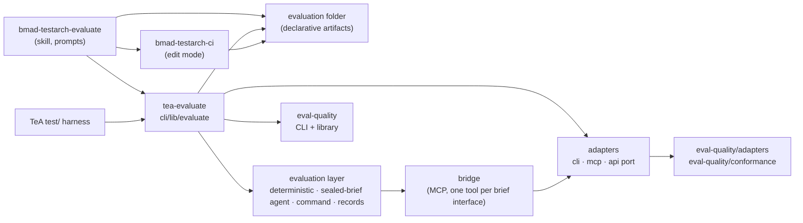
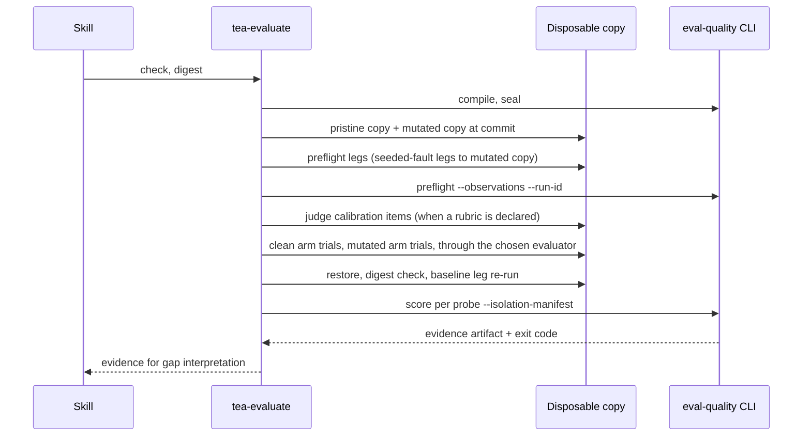

# Architecture Spine: Evaluate

## Design Paradigm

Ports and adapters around a fixed engine. The evaluation stack runs system under test, then the evaluation (the mechanism that runs the system, collects evidence and makes judgments), then the Behavioral Evaluation Contract, then eval-quality. TeA owns every layer above eval-quality, including each concern eval-quality states it leaves to the caller. Three layers of code, one direction of dependency:

- **Authoring layer:** the `bmad-testarch-evaluate` skill. Prompt content and the craft knowledge each stage needs, taught with worked examples. It inspects, asks, designs, chooses or builds the evaluation layer and writes declarative evaluation artifacts, then calls the runtime.
- **Runtime layer:** `tea-evaluate`, a bin in TeA's npm package over `cli/lib/evaluate/`. The only code that stages workspaces, launches targets, applies and rolls back mutations, records observations, drives the chosen evaluator and converts its judgments through one import contract, calibrates judges, builds and seals run records, digests the corpus, partitions held-out results, writes interpretation evidence and runs CI tiers.
- **Engine:** `eval-quality`, reached through its CLI and library. It compiles, seals, preflights, scores and measures strength. It runs nothing and mutates nothing.

Per-target adapters implement eval-quality's `EnvironmentProbePort` and plug into the runtime.


```mermaid
flowchart LR
  skill["bmad-testarch-evaluate<br/>(skill, prompts)"] --> artifacts["evaluation folder<br/>(declarative artifacts)"]
  skill --> runtime["tea-evaluate<br/>cli/lib/evaluate"]
  skill --> ciSkill["bmad-testarch-ci<br/>(edit mode)"]
  runtime --> artifacts
  runtime --> adapters["adapters<br/>cli · mcp · api port"]
  runtime --> evaluators["evaluation layer<br/>deterministic · sealed-brief agent · command · records"]
  evaluators --> bridge["bridge<br/>(MCP, one tool per brief interface)"]
  bridge --> adapters
  runtime --> engine["eval-quality<br/>CLI + library"]
  adapters --> engineTypes["eval-quality/adapters<br/>eval-quality/conformance"]
  harness["TeA test/ harness"] --> runtime
  ciSkill --> artifacts
```

`cli/` never imports `test/`. The skill never re-implements a runtime operation in prose. Nothing in TeA re-implements an engine stage.

## Invariants & Rules

### AD-1: TeA authors, eval-quality measures [ADOPTED]

- **Binds:** all
- **Prevents:** a TeA unit copying compile, seal, preflight reduction, scoring or strength logic, or assuming the engine drives or mutates a target.
- **Rule:** TeA owns target inspection, corpus, contract, controls, seeded-defect and gameability probes, oracles and rubrics, adapters, the evaluation layer (running the system, collecting evidence, judging, and choosing or building that layer), held-out probes, judge calibration, mutation and rollback, harness configuration, gap interpretation, CI wiring and enforcement policy. eval-quality owns contract validation and sealing, probe qualification, preflight reduction, evidence verification, scoring and contract strength. Settled by the owner; no alternative was weighed.
- **Amended 2026-09-23:** the evaluation layer, held-out probes and judge calibration are named in TeA's list. The owner's intent is a fully stacked Evaluate, and eval-quality states it runs no evaluator and leaves held-out sets and judge calibration to the caller; naming them keeps AD-21 and AD-22 inside this rule.

### AD-2: One skill, `bmad-testarch-evaluate`, menu code EV

- **Binds:** CAP-1 to CAP-12, `src/`, `.claude-plugin/marketplace.json`, `test/test-installation-components.js`
- **Prevents:** two registrations of one capability, a menu-code collision, or an evaluation that ends before CI wiring.
- **Rule:** The skill lives at `src/workflows/testarch/bmad-testarch-evaluate/`. Registration, all in one change:
  - a `src/module-help.csv` row: display name `Evaluate`, menu code `EV`, phase `4-implementation`, followed-by `bmad-testarch-ci`, output-location `tea_evaluations_folder` (the committed evaluation folder lives there; working drafts such as the Story 1.12 requirements statement go under `{test_artifacts}/evaluate/`);
  - a `[[agent.menu]]` entry with `code = "EV"` and `skill = "bmad-testarch-evaluate"` in `src/agents/bmad-tea/customize.toml`;
  - a `skills` path in `marketplace.json`;
  - the `test-installation-components.js` workflow list;
  - one `src/module.yaml` config variable, `tea_evaluations_folder`, default `evals`, resolved as `{project-root}/{value}`;
  - the EV intent in `test/fixtures/tea-routing-eval/intents.json` and its ground truth, with the routing contracts and probes regenerated by `tools/generate-contracts.js` and `tools/generate-probes.js` (the intents contract stays within its `probeStepBound`), and EV in the install test's `expectedMenu`;
  - a `deferred` entry for `bmad-testarch-evaluate` in `test/evals/suite-manifest.json`, since `test/lib/suite-manifest.js` and `tools/validate-eval-schemas.js` fail a skill with neither a suite nor a deferral. The AD-15 proof story replaces it with the suite.
- **Amended 2026-09-23 (Story 1.3 review):** the `module-help.csv` output-location was `test_artifacts` when this decision was first written, matching every other row. It is corrected to `tea_evaluations_folder`: the committed evaluation folder lives there, and `test_artifacts` names only the working-draft path for artifacts like the Story 1.12 requirements statement, never the row's own output-location.
- **Rejected:** separate authoring and CI-wiring skills. The input notes treat CI integration as part of completing an evaluation, and a split would leave an eval unenforced at the handoff. A prompt-only menu entry is also rejected, since Evaluate is a multi-stage workflow that resumes from its own artifacts.

### AD-3: Lean builder shape for Evaluate

- **Binds:** the skill directory, `test/test-installation-components.js`, `tools/validate-tea-workflow-descriptions.js`
- **Prevents:** the skill failing the builder's Analyze gate by construction, or house-shape tests rejecting a lean skill.
- **Rule:** The skill has `SKILL.md` (the inline workflow), `references/` (stage guides), `assets/` (templates) and `customize.toml`. It has no `workflow.yaml`, no `steps-c/e/v`, no `instructions.md` or `checklist.md`, and no skill-local `scripts/`, because deterministic work belongs to AD-5. It keeps TEA's activation contract: the `resolve_customization.py` call, `_bmad/tea/config.yaml`, `persistent_facts = []`, `on_complete`.
  - `test-installation-components.js` gains a lean-shape assertion set.
  - The description validator reads `SKILL.md` frontmatter when no `workflow.yaml` exists.
  - The skill carries no `resources/knowledge` copy. Its domain knowledge lives in `references/`.
  - Lean shape is the precedent for new TEA skills built with `bmad-workflow-builder`. The eight house-shape skills keep it. `bmad-teach-me-testing` already has no `workflow.yaml`, and the validator's hard-coded path for it generalizes to every lean skill.
  - Twelve stage guides: inspection, intake, corpus, contract, oracles, adapters, evaluator, mutation, harness, run, gaps and ci. Each teaches its stage's craft under exact headings with worked examples; examples that are artifact fragments are tagged fenced JSON that the guidance test validates or compiles through the engine or runtime schema.
  - Guidance is proven behaviorally as well as by structure: Evaluate authors strong suites for two target kinds beyond the dogfood skill, closes seeded weaknesses through its gap loop, and succeeds with an evaluation framework its guides never name (Stories 1.24 to 1.26).
- **Amended 2026-09-23:** the `evaluator` stage guide was added (eleven became twelve) and the craft, tagged-example and behavioral-proof bullets were added, because the plan gap audit found the guides specified as term lists that no test could show produce good corpora or contracts.
- **Rejected:** the house shape. The builder cannot author it, and its Analyze gate would flag it on every run.

### AD-4: Target kind picks the interface kind and the adapter; contracts never carry it

- **Binds:** CAP-1, CAP-4, CAP-6
- **Prevents:** a contract declaring `web`, target kind leaking into a schema field, or two units choosing different adapters for one kind.
- **Rule:** Target kind is recorded only in `evaluation.json`. Mapping and generated output:

| Target kind                                                      | Interface                          | Adapter                              | Evaluate generates                                                                                                                                                                                                                                                                                                                                                                         |
| ---------------------------------------------------------------- | ---------------------------------- | ------------------------------------ | ------------------------------------------------------------------------------------------------------------------------------------------------------------------------------------------------------------------------------------------------------------------------------------------------------------------------------------------------------------------------------------------ |
| Skill                                                            | `cli`                              | `createCommandLineAdapter`           | A registry entry for TeA's shipped generic skill runner, which takes an explicit `--skill-root` inside the disposable copy and never probes install locations; `check` asserts every mutation's `targetArtifact` sits under that root. The runner is generalized from `cli/*-runner.js` and `cli/lib/run-agent.js`: prompt on stdin, vendor knowledge only in `cli/lib/agent-adapters.js`. |
| Agent                                                            | `cli`                              | `createCommandLineAdapter`           | A registry entry for the adopter's own non-interactive command. When the agent has no such command, the skill runner wraps it.                                                                                                                                                                                                                                                             |
| Workflow                                                         | kind of the target                 | per kind                             | An interaction plan with `after` clauses and `captured` bindings, over the target's own kind. The runtime issues steps in `after` order and resolves each `captured` binding from the earlier observation of the same trial (Story 1.18).                                                                                                                                                  |
| Tool use: calling agent                                          | `cli`                              | `createCommandLineAdapter`           | As for an agent, with the agent's tool-call trajectory on stdout so an oracle and the evaluator can read tool selection and arguments (Story 1.19).                                                                                                                                                                                                                                        |
| Tool use: tool server                                            | `mcp`                              | `createMcpAdapter`                   | An `McpTargetAuthorization`.                                                                                                                                                                                                                                                                                                                                                               |
| AI feature or any web application                                | `api`                              | adopter-owned `EnvironmentProbePort` | `adapter/http-probe-port.mjs` from the skill's template: a default-export factory holding only address, auth and transport configuration, which delegates every allow or deny decision to eval-quality's exported HTTP target-policy evaluation. Plus `adapter/http-probe-port.conformance.mjs`, which calls `runEnvironmentProbePortConformance`.                                         |
| Tool server reached over HTTP                                    | `api`                              | as above                             | The server's HTTP surface declared as `api`; eval-quality ships stdio MCP only.                                                                                                                                                                                                                                                                                                            |
| Test-review mechanism (a skill, agent or tool that judges tests) | kind of how it runs, usually `cli` | per that kind                        | The adapter of the kind it runs as (skill runner or its own command). The kind exists for corpus design: seeded test smells, clean tests, and the degenerate response that flags every test.                                                                                                                                                                                               |

- **Vendor models:** inspection redirects a request to evaluate a model or vendor dependency itself to the adopter's use of it, records the model as a fixed condition in `policy/evaluator-conditions.json`, and plans no mutation of model weights or provider choice, since a probe cannot declare either (NFR8).
- **Amended 2026-09-23:** the test-review mechanism row was added because the owner's input notes name it as a corpus-design target and the audit found no guidance for it; the workflow and calling-agent rows now name the stories that prove them; the vendor-model bullet makes NFR8 an inspection behavior with a test.
- **Amended 2026-09-25 in Story 1.10:** the tool-server row's `McpTargetAuthorization` comes from a registry entry with `kind: "mcp"` (`target`, `targetArgs`, `tools`, `environmentKeys`, ceilings) beside the command entries, one entry per interface; the runtime builds it for the workspace each call runs in (`cwd`, the host's values for the keys as `serverEnvironment`), eval-quality's `parseMcpTargetPolicy` checks it at `check` and before any server starts, and the workspace's one port hands an `mcp` request to `createMcpAdapter` and a `cli` request to `createCommandLineAdapter`. A tool call's record carries its arguments as `callInputs.arguments`, its structured result as `responseBody` and its error flag as `responseStatus`, the projection eval-quality's `McpProbeObservation` names. (Amended 2026-09-30 in Story 1.35: a session the server's process ended before answering carries no body and also carries its signed `exitCode` on the `exit-code` channel, a signal's number made negative; a signal from outside the server stops the run with exit 12.)

- **Amended 2026-09-25 in Story 1.11:** the AI-feature row's port is rendered unchanged from the skill's template, and its configuration comes from a registry entry with `kind: "api"`: eval-quality's HTTP authorization fields, one of a deployed `port` or a `server` the runtime starts from the workspace for each call on a free port, and an optional auth header holding the host's value for its key. The runtime never imports the port: for each call it starts `adapter/http-probe-port.mjs` as a Node process of its own, whose last lines hand the factory and its `nodeTransport` to TeA's host (`cli/lib/evaluate/http-port-host.js`), which serves the call over standard input and output (amended 2026-09-25 in Story 1.11's final review: over file descriptor 3, a channel the runtime opens for the protocol alone, so the port's standard output and error stay its own logging, captured and quoted when a call fails). eval-quality's `dependency-direction` gate refuses a computed `import()` anywhere under `cli/`, and a port in its own process keeps the adopter's code apart from the run's state and ends at its ceiling; an in-process loader was weighed and turned down for both reasons. A started server starts only once the port's policy has allowed the call and ends with its process group after it (amended 2026-09-26 in Story 1.11's pull request, delivering Story 1.37: a `server` naming `portFileEnvironmentKey` gets `0` in `portEnvironmentKey` and a private file's path, binds a port the system chooses and writes its number there, and the port probes the call again at that port before anything is sent, so no other process can answer on it; without that key the runtime keeps the chosen free port for a server that cannot report its own, with the window between the port's release and the server's bind). An HTTP call's record carries its `path`, `query`, `header` and `body` inputs and the answer's status, headers and body.
- **Amended 2026-10-03 in Story 1.46:** the web-application rule moves out of the table into one prose sentence of `references/inspection.md` (a web application is an `ai-feature` target reached as `api`), so a mutation can edit its single statement and B-002 can be seeded. The skill's tables carry the row label `AI feature`; the rule's meaning is unchanged, and `test:evaluate-guidance` holds that the skill states it once.

- **Amended 2026-09-26 in Story 1.32:** an `api` registry entry may list `deployments`, other origins its interface is deployed at (`scheme`, `host`, `port`, `addresses` each), which a historical probe on the deployment route reaches; each is an authorization of the interface with the entry's methods, redirects, ceilings and auth, and `check` holds each to the entry's host-spelling and `staysOnHost` rules. Before a deployment arm runs, eval-quality's `evaluateTarget` decides which of the entry's authorizations (its `deployments`, and its own when it names a deployed `port`) allows the probe's origin, and that one authorization is the arm's whole policy for the interface, so a redirect to another origin is denied; no other arm's policy holds a deployment, and one entry per interface stays the rule.

- **Amended 2026-09-26 in Story 1.18:** the workflow row holds as written, proven over a `cli` record store whose `create` mints a fresh identifier on every run.
  A `captured` binding's value is read by eval-quality's `makeResolveOperand` from the observation the named step recorded in the same arm, the reading `score` gives the pointer, and a capture orders its step as an `after` clause does, since `score` holds a captured value to an earlier `sequence`.
  A step whose `after` step was not issued, whose captured value the earlier observation lacks, or whose captured value the request cannot carry as the target printed it, is not issued and records no observation; the arm's evidence keeps the skip and its reason, and eval-quality alone reads what the missing observation means.
- **Engine change:** eval-quality 3.4.0 does not export its HTTP target-policy evaluation (`evaluateTarget` and address classification in `src/core/probe/target-policy.ts`). eval-quality gains that export in a release before the `api` story lands, so no adopter file carries a copy of address classification.
- **Rejected:** a shared HTTP port in TeA's runtime, because shared code would then carry network defaults for every adopter. Copying address classification into each scaffolded port, because fixes could never reach adopters. TeA proves the template against a loopback fixture (AD-15).

### AD-5: `tea-evaluate` is the single driver

- **Binds:** CAP-6, CAP-7, CAP-9, CAP-11, CAP-12, `cli/`, `test/lib/`
- **Prevents:** a second sealer, digest or registry builder; adopters holding forked harness copies; the skill improvising a deterministic step.
- **Rule:** TeA's npm package ships the `tea-evaluate` bin over `cli/lib/evaluate/`. It has seven subcommands: `check`, `digest`, `preflight`, `run`, `score`, `compare` and `ci`. The modules are generalized from existing TeA code:

| Module                    | Generalized from                                                                                                                            |
| ------------------------- | ------------------------------------------------------------------------------------------------------------------------------------------- |
| registry                  | `test/lib/probe-targets.js` (one `RegistryEntry` schema read from `evaluation.json`; TeA's `EXECUTION_TARGETS` becomes data in that schema) |
| records                   | `test/lib/eval-quality-inputs.js`                                                                                                           |
| digest and provenance     | `test/lib/eval-record.js`                                                                                                                   |
| workspace                 | `test/eval-contract-strength.js` (`cachingPort`, `stagedWorkspaceFor`)                                                                      |
| mutation                  | `test/test-automate-eval-fixture.js`                                                                                                        |
| compare                   | `test/lib/compare-dominance.js`, `test/lib/compare-eval-runs.js`                                                                            |
| evaluator                 | new (AD-21): the evaluator kinds and the judgment-rows conversion                                                                           |
| bridge                    | new (AD-21): the stdio MCP server a sealed-brief agent evaluator acts through                                                               |
| partition and calibration | new (AD-22)                                                                                                                                 |
| interpret                 | new (AD-23)                                                                                                                                 |

- **Harness:** TeA's `test/` harness imports these modules and keeps only TeA data. It maps runtime exits through the AD-10 table.
- **Module format:** `cli/lib/evaluate` is CommonJS like the rest of TeA and reaches the ESM-only engine through one async loader generalized from `loadEvalQuality`.
  Moved code drops every `test/` path (package-boundary gate).
  The `dependency-direction` section of `eval-quality.config.json` gives `cli/lib/evaluate/engine.js` its own exact `evaluate-engine` layer, declared ahead of the `cli` prefix layer, whose `allow` list names `eval-quality`, `eval-quality/adapters`, `node:fs` and `node:path`.
  The `cli` layer's `allow` list names every other external `cli/` uses and leaves `eval-quality` out, so `engine.js` is the one file that names `eval-quality` in an `import(` or `require(`, and `test:direction` refuses an engine import from any other `cli/` file.
  Every module the runtime needs ships in TeA's `dependencies` (`ajv` moves there).
  (Amended 2026-09-23 in Story 1.5: this decision first put `eval-quality` on the `cli` layer's list; the engine's own layer replaced that.)
- **Packaging:** TeA's `package.json` declares `eval-quality` under `peerDependencies`, floored at `>=7.1.0`: 4.0.0 is the first published release carrying the target-policy export and trial-set scoring (#143) Evaluate needs, 4.1.1 the first whose command-line adapter kills the target's process group at its ceiling (#160), 4.1.2 the first that also kills it when the host dies, by `SIGKILL` included (#161), which `tea-evaluate preflight` relies on, 4.1.3 the first whose `score` writes an Invalid result's reasons to stderr (#162), which `tea-evaluate score` persists for AD-10 to classify, 4.1.4 the first whose record schema defines an observation's `provenance` by its role in the run, 4.2.0 the first whose command-line and MCP adapters carry the denying policy's `reason` on the `forbidden-target` fault, which the runtime records beside the code, and 4.3.0 the first exporting `staysOnHost`, the on-host predicate `tea-evaluate check` holds a credential sent over `http` to, since an older engine admitted by the range could not run Evaluate as documented, and since 2026-10-01 4.4.0 the first whose MCP adapter answers a tool call that ended the session after the handshake with an observation (Story 1.35), 4.5.0 the first exporting `parseProbeTargetPolicy` (Story 1.36), 4.6.0 the first whose command-line adapter carries `portFailureReason` on a `port-failure` fault (Story 1.39), 4.7.0 the first shipping the `aggregate-strength` stage `tea-evaluate score` calls once after the probe loop (Story 1.45) and 5.0.0 the first whose sealed observation, interaction plan step and sibling group name the declaring interface beside the operation, which the runtime records and reads to give each finding the phase of its own interface (Story 1.42), and 6.0.0 the first accepting raw API bodies and requiring the bodyEncoding marker on sealed observations (Story 1.50), and 6.0.1 the first recognizing paired process success and whole stdout checks for a scalar CLI answer (Story 1.55), and 7.0.0 the first whose `score`, `preflight` and `aggregate-strength` name a stale schema stamp on every artifact they read before its shape is read (Story 1.101), and 7.0.1 the first whose `compile` and `preflight` refuse two interfaces that share a `logicalId` under `duplicate-interface-identifier`, which `tea-evaluate check` quotes (Story 1.102), and 7.1.0 the first whose `success-indicator-separation` coverage rule counts only an oracle some behavior lists (Story 1.104). (Amended 2026-09-23: the floor was `>=3.4.0` with a later raise in Story H.1, written before 4.0.0 shipped. Amended 2026-09-24, Story 1.6: raised from `>=4.0.0` to `>=4.1.1`, then to `>=4.1.2`. Amended 2026-09-24, Story 1.8: raised to `>=4.1.3`, then to `>=4.1.4`. Amended 2026-09-25, Story 1.10: raised to `>=4.2.0`. Amended 2026-09-25, Story 1.11: raised to `>=4.3.0`. Amended 2026-10-01, Story 1.39: raised to `>=4.6.0` (via `>=4.4.0` in Story 1.35 and `>=4.5.0` in Story 1.36). Amended 2026-10-01, Story 1.45: raised to `>=4.7.0`. Amended 2026-10-02, Story 1.42: raised to `>=5.0.0`. Amended 2026-10-02, Story 1.50: raised to `>=6.0.0`. Amended 2026-10-03, Story 1.55: raised to `>=6.0.1`. Amended 2026-10-03, Story 1.101: raised to `>=7.0.0`. Amended 2026-10-04, Story 1.102: raised to `>=7.0.1`. Amended 2026-10-04, Story 1.104: raised to `>=7.1.0`. `tools/guard-publish.js` and `test/test-release-metadata.js` hold the same floor.) `peerDependenciesMeta` marks it optional so projects that never run Evaluate do not receive it, and the bin is `tea-evaluate`; the release-metadata and guard-publish checks cover both. One engine version serves a run.
- **Inputs:** the runtime reads no `_bmad/` config. Every subcommand takes `--evaluation <path>` and exits 64 when none resolves.
- **Schemas:** the runtime owns the JSON schemas of `evaluation.json` and `evaluation-ci-plan.json`. `npm test` validates the skill's templates and `bmad-testarch-ci`'s plan reader against them.
- **Rejected:** generating harness source into each adopter repository, because fixes could never propagate. Skill-local scripts are also rejected: they install under `_bmad/`, so they are no stable CI entry point.
- **Amended 2026-09-23:** four module rows were added for AD-21 to AD-23. The subcommand count stays seven: evaluator kinds, partitions and calibration run inside `run` and `score`, and interpretation is written by `score`.

### AD-6: The CLI decides every enforced verdict; the library only drives legs

- **Binds:** CAP-9, CAP-11
- **Prevents:** two verdict paths that disagree, or exit codes CI cannot reproduce by hand.
- **Rule:** The runtime calls `runPreflight` through a recording port, which is the only way to plan and drive preflight legs, and persists every observation. It also uses `resolveCheck`, `digestArtifact` and the conformance suites from the library. Every verdict CI enforces comes from the `eval-quality` CLI over persisted files: `compile`, `seal`, `preflight --observations`, `score` once per probe, and `aggregate-strength` once per `score` invocation (Story 1.45: the run-wide class strength and floor decisions are the engine's, copied into the score directory with TeA computing no rate, count or decision). The library's own preflight verdict is discarded. `preflight` receives the invocation's `--run-id`.
- **Amended 2026-10-01 in Story 1.68:** `score` holds the bytes of every input it verified (`cli/lib/evaluate/score-inputs.js`) and, after each CLI call, scores those bytes in process with the library's `runScore` and `serializeArtifact` and requires the staged artifact to equal the result byte for byte (an absent artifact must match a result with no artifact, whatever the call exited), after re-reading every input and naming the first that changed or appeared. The call's exit must be the one the held bytes give (the ladder's exit for a result, 4 for a structural failure, 5 for a fault, 64 for a private-storage manifest reference) and the `eval-quality:` lines on its stderr must be the ones the result prints (the qualification failures and, for an Invalid result, its basis); when the library refuses the held bytes only the exit is compared, since the CLI renders that error itself. The call's stdout and its other stderr text are not compared. The same holds for the `aggregate-strength` call of Story 1.45 (amended 2026-10-01): after it `score` re-reads every input, the run's policy included, reads the persisted evidence artifacts back and compares them with the bytes it copied, then aggregates the held bytes in process with the library's `aggregateStrength` and `serializeArtifact` and requires the staged aggregate to equal the result byte for byte and the call's exit (0, 4 for a refused set, 5 for a fault) to be the one the held bytes give; the comparison refuses and never supplies an aggregate, a floor decision or an exit. The in-process re-score compares and refuses, never decides: it supplies no verdict, exit code or artifact, and the CLI still decides every enforced verdict. `test:evaluate-boundaries` names `score-inputs.js` as the one file that may name `runScore`; `seal` and `preflightFromObservations` stay forbidden everywhere under `cli/`.
- **Amended 2026-10-02 in Story 1.69's build:** the call `run` makes for each attempt of a sealed-brief agent evaluator's qualification is held the same way.
  `scoreAttempt` reads the attempt's inputs (the contract, the preflight verdict, the evaluator configuration, the policy, the probe, the attempt's record and its isolation manifest) once through `holdAttemptInputs` in `cli/lib/evaluate/score-inputs.js`, from the run directory writer's own read (`writer.read`, held to the digest the runtime wrote), so an input that is not what the runtime wrote stops the run with exit 12 before any call; after the call it re-reads every input through the writer and makes the comparison `score` makes (`heldRefusal` in `cli/lib/evaluate/held-refusal.js`, which `score.js` calls too): the first changed input is named, the staged artifact must equal the in-process score of the held bytes byte for byte, and the call's exit and `eval-quality:` lines must be the ones the held bytes give, or `run` exits 12 and records no vote for the call.
  The staged bytes the comparison accepted are the ones copied and read for the vote.
  The comparison supplies no vote, exit or artifact.
  `test:evaluate-boundaries` names `held-refusal.js`'s `heldRefusal` as the one place that asks for the in-process score (`reproduce`) and `score.js`'s `heldAggregateRefusal` as the one that asks for the aggregate (`reproduceAggregate`), and refuses either call in `run.js` or anywhere else.
- **Leg routing:** a leg named by a defect's `manifestationWitness.legId` goes to the mutated copy of that defect's mutation, or to the pre-fix revision on the `historical` route. Every other leg goes to the pristine copy. Both copies stay live until preflight finishes. The registry builds each leg's authorization with `cwd` set to the copy the leg is routed to, from the per-operation staging `evaluation.json` declares. (Amended 2026-09-26 in Story 1.32: on the historical route's deployment route, a witness leg goes to the pre-fix deployment, its HTTP calls sent to the origins the probe names for it and no server started.)

### AD-7: Run records have one shape

- **Binds:** CAP-8, CAP-9
- **Prevents:** trial sets that ingest refuses for field disagreement, or clean and mutated arms labelled differently by different units.
- **Rule:**
  - One `invocationId` per `tea-evaluate` invocation keys `runs/<invocationId>/`. One `runId` per trial set, derived from it. `trialIndex` runs 1..N, unique within the set, with N at least the policy's `minimumTrialCount`.
  - `mode` is `contract-scoring` for evaluation runs.
  - `conditionArm` is `clean`, `mutated:<mutationId>`, `historical:<revision>`, or `gameability:<probeId>`. A gameability arm launches no target: it evaluates the probe's degenerate response as a synthetic observation with `resolveCheck`, producing `naiveOracleSatisfiedEvidence` and `disciplinedOracleRejectedEvidence`. (Amended 2026-09-25 in Story 1.9: the `historical` arm's `<revision>` is the pre-fix revision's full commit id, the fix commit's first parent, so the label names the code the defect lives in; the degenerate response's bytes are committed at `corpus/gameability/<probeId>.json`, one `{ stdout, stderr, exitCode }` per plan step, since eval-quality keeps `degenerateResponse` as prose, and the committed gameability probe names its naive oracle, an oracle of another behavior, as TeA's own `naiveOracle`; the disciplined oracle is the one oracle of the probe's behavior.) (Amended 2026-09-26 in Story 1.32: on the deployment route the `historical` arm's `<revision>` is the pre-fix deployment's release identifier, declared by the probe; one arm runs one target, so two probes naming one label at a worktree and a deployment, or at two sets of pre-fix origins, exit 10.) (Amended 2026-09-26 in Story 1.18: a gameability arm reads each step's degenerate response through eval-quality's adapter of the step's kind over the registry's authorizations, with a mechanism that launches nothing, as a sealed-brief agent's gameability calls already were, so a command's JSON-shaped output is JSON there as on a real arm; a plan step's committed answer gets no host value injected or scrubbed, so it reads the same on every host.)
  - Trial requests come from the contract's `interactionPlan`, bound from the probe's `testData`. No second request source exists.
  - Findings and oracle dispositions come from the evaluator kind `evaluation.json` declares (AD-21): by default a deterministic evaluator that runs `resolveCheck` over the arm's observations; otherwise a sealed-brief agent evaluator, an adopter evaluator command whose judgment rows the runtime converts, or records the adopter's own harness sealed. A model judge appears only where a rubric is declared; TeA's own judge runs through `cli/lib/agent-adapters.js`, every judge is calibrated before its scores count (AD-22), `judgeConfiguration` records the judge's `modelSnapshot` and `systemPromptDigest` (the only fields its strict schema allows), and the calibration set's digest is recorded as `decodingParameters["tea.judgeCalibrationDigest"]`. (Amended 2026-09-25 in Story 1.9: TeA's judge is wired by `evaluation.json`'s `judge` (`agent`, optional `agentCommand`, `agentArgs`, `model`, and `timeoutMs`) and its model snapshot is committed as `policy/evaluator-conditions.json`'s `judge.modelSnapshot`; `judgeConfiguration` is `{ modelSnapshot, systemPromptDigest }` with the digest over the runtime's judge instruction template; the judge runs once per trial, only when the contract declares a rubric, and every record of the trial carries its scores as `judgeResults`, a reply that cannot be read as one on-scale score per declared criterion becoming that criterion's `score: null` with a note, which eval-quality reads as Invalid. A contract with no rubric makes no judge call and keeps `judgeConfiguration: null`.)
  - Observations the runtime drives from the interaction plan carry `provenance: baseline`; observations a sealed-brief agent evaluator chooses through the bridge carry `provenance: evaluator-chosen`. (Amended 2026-09-24 in Story 1.8: under the deterministic evaluator, and under a `command` evaluator that judges the plan's observations, the interaction plan is the evaluator's own exercise of the target, so a scored trial's observations carry `evaluator-chosen`; eval-quality's witness match counts only `evaluator-chosen` observations (`dist/core/score/witness.js`), and its own tutorial records mark scripted exercises the same way. Qualification arms, which are evidence and never scored, keep `baseline`, and under a sealed-brief agent the plan steps the runtime drives stay `baseline`. From 4.1.4, eval-quality's published `SealedRunRecord` schema states this role reading itself: `evaluator-chosen` is an action the evaluation performed on the probed interface, whether an agent or a scripted plan chose it, and `baseline` a harness baseline or fixture set-up call the evaluation did not perform, which the witness match excludes; TeA's floor rose to 4.1.4 with it.)
  - `EvaluatorConfiguration` records the vendor model and runner as a fixed condition in a run that uses a model. A run that uses none writes `modelSnapshot: "none"` and a `systemPromptDigest` of `digestBytes` over the empty byte string, since the published schema requires both.
  - The runtime emits one `IsolationManifest` per trial set from the workspace, network and environment it actually granted, and passes `--isolation-manifest` to `score`. An absent manifest makes the run Invalid. (Amended 2026-09-24 in Story 1.8: its observed lists hold only what the runtime observed, the commands it ran for the plan as `observedToolCalls` and no mount or network target, since it does not sandbox the target's file system or network; Story 1.31 confines the file system and reports the mounts it observes. Every runtime write into the run directory is made by bare name from inside a directory the runtime made and holds open until the command ends (so its inode number cannot pass to a directory the target makes), confirmed before and after the write by device, inode and the path the system reports for it, without following a link; the run directory is verified against the digests the runtime held before `run.json` says completed, the run's last write; and `run.json` anchors every file `score` reads, each record and isolation manifest included, which holds against a change after the run only while nothing else can write the run directory, a target's leftover process included, until Story 1.31 confines it.) (Amended 2026-10-01 in Story 1.68: `score` also keeps the bytes it verified and refuses a call over a file that changed while it ran, so a run that opted out of confinement is held too; see AD-6.)
    (Amended 2026-10-02 in Story 1.69's build: `run` holds the score call of each evaluator qualification attempt to the bytes the runtime wrote the same way, so an attempt's votes cannot come from a file or an artifact a process changed; see AD-6.)
    (Amended 2026-10-03 in Story 1.81's build: a macOS audit reads the kernel's log, which loses reports without a trace on a saturated host, so `run.json` records, for each audited trial of a trial set's arms, `observedMountsChannel` entries `{ conditionArm, trialIndex, completeness, canariesSent, canariesDelivered, logReportedLoss }`, `lossy` when the log delivered fewer of the audit's own canary reads than it sent or reported lost events and `complete` otherwise, and the run's summary line names each lossy trial with its counts; the isolation manifest's strict schema has no slot for it, so `observedMounts` stays what the audit listed. A Linux trial records `complete` with no canary sent, and a trial that launched nothing or ran in a run that opted out has no entry.)
  - (Amended 2026-10-04 in Story 1.113: a registry command entry may declare `"login": "claude"`, which hands its processes the logins Claude Code documents and nothing else of the user's home.
    A confined run passes the variable `CLAUDE_CODE_OAUTH_TOKEN` when the host sets it and links the host's credentials file (`.credentials.json` in `CLAUDE_CONFIG_DIR`, or in `.claude` under the home) at `.claude/.credentials.json` in each private home, read-only and unlisted by the audit, a refused write to it included; `run.json` records each grant under `logins` by the variable's name and the file's path, the manifest names the file read-only in `allowedMounts` and both sources in its forbidden-input note, and a record holds neither the value nor a string of the file (the run replaces each with `[redacted]` wherever any target of any request kind prints it, and leaves as written the values of the fields the adapter declares public: `scopes`, `subscriptionType` and `rateLimitTier`; the set holds every string the file has held during the run, is read again when each call settles, takes the tokens and quoted strings of a read caught mid-write, and covers an opted-out run's host file too).
    A host with neither source is refused at selection (exit 12) naming the token route and the opt-out.
    A macOS Keychain login has no grant: Seatbelt has no rule that scopes the keychain below the whole keychain, and the CLI finds it through the `HOME` a confined target holds privately.)
  - Each registry entry declares `infrastructureExitCodes` (3 to 6 for the skill runner, whose exit 2 is a usage error). A trial observation carrying one is an infrastructure failure: the trial yields no record and the invocation exits 12. `check` refuses a defect signature those codes could satisfy.
  - The adopter sets `severityFloor`, `minimumTrialCount` and `catchThreshold` at intake. The policy template carries no values.
  - `EvaluatorConfiguration` is generated per run into `runs/`, since its `sealedBriefDigest` comes from `seal`. Only its fixed-condition inputs are committed, as `policy/evaluator-conditions.json`.
  - Probe digests: `commitDigest` is the evaluated commit, `artifactDigest` the `targetArtifact` bytes, `implementationDigest` the tracked tree of the skill root or target root at that commit. A change to any of them requires re-qualification. (Amended 2026-09-24 in Story 1.8: `implementationDigest` leaves out the evaluation folder's entries when the folder sits under that root, since the folder describes the implementation and a committed baseline in it would otherwise move the digest it records; a copy workspace, which has no tracked tree, digests the directory's files without its provisioned directories; and a clean control, which seeds no `targetArtifact`, records its `implementationDigest` as its `artifactDigest`.) (Amended 2026-09-25 in Story 1.9: a gameability probe, which seeds nothing into the target either, records its `implementationDigest` as its `artifactDigest`; a historical probe records the tracked tree of the same root at its pre-fix revision, where its defect lives, as its `artifactDigest`, and `fixCommitDigest` is `digestBytes` over the fix commit's full id.) (Amended 2026-09-26 in Story 1.32: a deployment-routed historical probe records `digestBytes` over the pre-fix release identifier as its `artifactDigest` and over the post-fix one as its `fixCommitDigest`; eval-quality's schema constrains both only to the AD-27 digest form.) (Amended 2026-10-03 in Stories 1.49 and 1.99: a controlled-mutation probe qualified by a stored-twin cycle records the digest of the stored mutated artifact it cites as `artifactDigest` (the seeded design for test-design, the twin under `test/fixtures/probe-mutants/` for the test-review, trace, nfr and ci probes), since the cycle's mutated arm scores those bytes; the `targetArtifact` reference carries its own digest, the reference's.)
  - Every artifact is validated against eval-quality's published schemas before it reaches the CLI.
  - **Amended 2026-09-23:** the evaluator source, provenance and calibration bullets were widened for AD-21 and AD-22; the deterministic evaluator stays the default.

### AD-8: Mutation happens only in a disposable copy, and rollback is proved

- **Binds:** CAP-7
- **Prevents:** writes to the adopter's working tree, or `rollbackVerified: true` without a performed and verified restore.
- **Rule:** A mutation is a file, `mutations/M-NNN.mutation.json`, holding `targetArtifact` (relative to `launch.root`; amended 2026-09-24, Story 1.7 final review: the rule said repo-relative, while the runtime, `check` and the mutation schema resolve it against `launch.root`, which differs when `launch.root` is a subdirectory of the repository) and a `replace-exact` operator: `find`, `replace`, and an occurrence count that must be exactly 1. For a git target the copy is `git worktree add --detach` at the evaluated commit, provisioned with read-only copies of the gitignored runtime directories `evaluation.json` lists (for example `_bmad/`, `node_modules/`); a `targetArtifact` inside a provisioned directory is refused. (Amended 2026-09-24, Story 1.7: the rule said read-only links, and no unprivileged process can make a symbolic link read-only, so each provisioned directory is copied, as a copy-on-write clone where the file system offers one, with its write bits removed.) For any other target, including a fixture whose `evaluation.json` declares a copy workspace, it is a temp copy identified by its tree digest. When the adopter evaluates uncommitted work (`--from-working-tree`) it is also a temp copy, and `run.json` then records `dirty: true`; a dirty run cannot be accepted as a baseline. Per mutation:
  1. Run the clean arm on the pristine copy. This is the baseline-pass evidence.
  2. Apply the mutation.
  3. Run the mutated arm. This is the mutated-fail evidence.
  4. Restore the original bytes.
  5. Check that the artifact digest equals the pre-mutation digest.
  6. Re-run the baseline leg until the clean-control oracle holds, within the policy's `reExecutionCap`.

- **Rollback proof:** only then is `rollbackVerified` set to `true`, and the evidence files carry digests. `git status` of the adopter tree must be unchanged before and after. Scratch is removed in `finally`. A failed step emits no probe. An occurrence count other than 1 exits 10; a baseline that does not pass or a mutated arm that does not fail exits 11; a workspace, launch or restore failure exits 12. A target reachable only as a remote deployment takes the `historical` route when two addressable revisions exist. Otherwise its seeded probe is recorded as refused, with the reason. Seeded-fault preflight legs follow the routing in AD-6. (Amended 2026-09-25 in Story 1.9: the route is triggered by the probe, which declares `route: historical` with the `fixCommit` (a hexadecimal commit id, never a ref) that removed its natural defect; its two revisions are that commit and its first parent, addressed as git commits whose target launches from a worktree, so a target reachable only as a remote deployment is not measured by this route until Story 1.32 qualifies a probe against two deployments the adopter names. A `fixCommit` that names no commit in a full-history repository is an authoring defect (exit 10). The probe is refused, with the reason, when the pristine workspace is not a git worktree (a copy, a target outside git, or `--from-working-tree`), when a shallow clone lacks the fix commit or its parent, when it is not an ancestor of the evaluated commit (git's own error when it cannot tell), when it has no parent, or when the target cannot run at a revision (`launch.root` or the skill root not a directory at either revision, a submodule or a missing executable registry target at the pre-fix revision); `score` prints and records each refused probe. A refused probe is listed in `run.json`'s `refused` and in `runs/<invocationId>/refused/<probeId>.json`, stays out of the preflight probe list, `probes.json` and the trial sets, and does not by itself fail the run. Qualification runs the plan in a worktree at each revision: the oracles of the probe's behaviors must be violated before the fix and hold after it, or the probe exits 11. `oracleStableAcrossRevisions` is true because both arms are judged by the one compiled contract the run read before any arm ran.)
- **Amended 2026-09-26 in Story 1.32:** the historical route names two kinds of fix boundary, and a probe names exactly one. A probe naming `fixCommit` runs from worktrees at the fix commit and its first parent, as above. A probe naming `deployments` runs against deployments: a pre-fix and a post-fix deployment, each the `release` identifier it runs and the `origins` each HTTP interface of the registry answers at; its fail-before arm runs against the pre-fix deployment and its pass-after arm against the post-fix one, with the same verdicts required (exit 11 otherwise), its witness leg and the trials of `historical:<pre-fix release>` reach the pre-fix deployment, and no worktree is made, so it needs no git history. Each origin must be one the registry authorizes (AD-4's `deployments`), which eval-quality's `evaluateTarget` decides before either arm runs; a deployment it does not authorize refuses the probe with each authorization's denial as every historical refusal is recorded, and one some authorization admits whose host does not resolve within the entry's `maxElapsedMs` and the port call's start allowance is unreachable (exit 12); an origin whose scheme, host or port no authorization admits is refused before its host is resolved. `check` refuses under `historical` a probe naming neither or both boundaries, one deployment without the other, one release for both, a deployment beside a registry entry that is not an HTTP entry, origins that are not an http or https origin for each HTTP interface of the registry and no other, and a pre-fix origin that reaches a post-fix one (scheme, host lower-cased with one trailing dot dropped and an IP address read as eval-quality's `parseAddress` reads it, and port); the runtime refuses the same boundaries again with exit 12, as defence in depth. The release identifier is declared by the probe. Amended 2026-09-30 in Story 1.38: each deployment also names `report`, an operation of the contract's `api` interface and a JSON pointer into its answer, and before either arm the runtime sends that request to each deployment through the evaluation's HTTP port, under eval-quality's policy decision, with no bound inputs. A reported string other than the declared `release` refuses the probe with both identifiers named, as does a request the policy denies and an answer with no string at the pointer; a deployment that cannot answer at all stops the run with exit 12. `check` refuses under `historical` a `report` naming an operation the contract does not declare on an `api` interface the registry serves, one that needs an input, or a pointer that is no JSON pointer. Amended 2026-10-01 in Story 1.65: each deployment names `reports` in place of `report`, one report for every HTTP interface of the registry and for no other, keyed by interface ID, so the origin of each interface is asked which release it runs. The runtime asks the pre-fix deployment first and each deployment's interfaces in sorted order, each request through the port to that interface's own origin, and the first answer that refuses the probe stops the asking; a deployment whose second origin runs another release is no longer measured under the identifier the first origin reported. `check` also refuses an interface of the registry with no report, a report keyed by an interface the registry does not serve over HTTP, and an operation declared on another interface than its key. Amended 2026-10-02 in Story 1.64: the witness legs and the trials of `historical:<pre-fix release>` reach the pre-fix deployment after the qualification, so the runtime asks it again, through the same per-interface asking, after the witness legs (`preflight` and `run`; before the CLI's preflight verdict reads the run directory, so a refused probe leaves `probes.json` and `observations.json` and no trial of it runs) and after the arm's last trial (`run` only; before any trial set is sealed, so no trial set of a refused probe is sealed and the trials' evidence stays). A probe refused after the trials is the exception to the earlier sentence that a refused probe stays out of `probes.json`: the verdict read it before the trials ran, so it stays in `probes.json` and the verdict and keeps its `probes/<probeId>.probe.json`. The qualification asks once per probe and each later point once per pre-fix release (the legs) or arm (the trials), so an arm of N probes asks each pre-fix origin N + 2 times in a `run` and each post-fix origin N times; the post-fix deployment is reached by the qualification arms alone. A release that changed refuses every probe on that pre-fix release, naming the point, and the refusal is recorded as every historical refusal is.
- **Amended 2026-09-26 in Story 1.18:** a copy workspace made from the pristine copy reproduces what that copy held when it was made, from a snapshot the pristine copy keeps beside itself, its links contained and its provisioned directories left out, since the preflight legs run in the pristine copy and a target that writes changes it; a snapshot that no longer digests to the pristine tree exits 12, and a reproduction provisions only the directories the pristine copy provisioned, from its read-only copies, exiting 12 when one was planted in the snapshot or moved out of the pristine copy.
- **Amended 2026-10-01 in Story 1.57:** a confined run gives each git workspace a withheld repository, a bare store under the workspace directory and beside its checkout that holds the evaluated commit's whole history except the objects reachable only through the evaluation folder's subtree at some commit, each such subtree replaced by the empty tree through a `refs/replace/` entry so no commit or tree id changes, and the confinement withholds the adopter's git directory from the target except the worktree's own metadata directory, so a target's git reads no committed object of the evaluation folder.
- **Amended 2026-10-03 in Story 1.80:** the withheld repository also carries the repository's tags that point into the evaluated commit's history, with their annotations and no remote, URL, credential or hook; it is built from the objects a partial clone holds on disk, so no process of a confined run fetches from the promisor remote (`GIT_NO_LAZY_FETCH`, git 2.44 or later; an older git refuses the project with exit 12, and so does the checkout of a revision whose objects the clone lacks, which names the revision), and an object the project lacks is absent from the store as from the project; and every walk of the history that grows with it (the commits that name the folder's trees, the objects missing from the store, a partial clone's pack) streams through `cli/lib/evaluate/git-lines.js` under the supervisor, so no buffer bounds the history. It carries a filter driver's configuration whatever its name holds and a boolean written with no value as true. The refusals of a partial clone and of a history of about six million objects are gone.
- **Amended 2026-10-03 in Story 1.81:** the macOS audit makes a canary read every 50 ms while a trial runs, and one more when it ends, of a file beneath its own directory that no target can reach, through the sandbox's own token (`cli/lib/evaluate/confinement-audit.js`), and counts the canaries the log delivered against the canaries sent (a canary counts as sent when it is attempted, and a gap of more than 200 ms between attempts counts the canaries the cadence called for as sent and undelivered, so a target that kills or prevents its canaries or freezes the runtime makes the trial lossy). The canaries never enter `observedMounts`. A trial whose log lost a canary is recorded `lossy` (AD-7), so an empty or short list is read with how complete the channel was. The canary samples the log at its own reads, so a loss shorter than 50 ms can still drop a target's report; `strace` on Linux loses none and sends none.
- **Amended 2026-10-03 in Story 1.82:** a Bubblewrap target has no route to the host's path-based Unix sockets. Each call lists the host's sockets (`cli/lib/evaluate/host-sockets.js`: the kernel's table of bound Unix sockets in `/proc/net/unix`, the socket files beside a listed path that was moved after it bound, and the socket files in `/run`, `/var/run`, `/tmp` and `/var/tmp` and their directories; a path joins the list only when `lstat` on its exact path finds a socket file; amended 2026-10-03 in Story 1.82's build, review round 2: the list is ranked by who can create a socket (the well-known service sockets, root and the system accounts, the runtime's own user, then every other user) and cut to the room the call's own command leaves for mounts, at most 2,000, since Bubblewrap counts the target's arguments with the mounts against 9,000; `/dev` and `/proc` take no room; a call is refused (exit 12) when the sockets of the first three ranks alone exceed the room, which no other user can cause; `run.json`'s `hostSocketTruncation` records each trial whose calls left sockets of other users reachable) and mounts an empty device file over each socket file outside the call's grants and the sandbox's own mounts, by its real path and whatever the entry's `network`, so a `connect()` answers `ECONNREFUSED`; a socket in the workspace or in a private directory of the call stays connectable, and a call whose Bubblewrap cannot start over a socket that went away is started again over its own list without the vanished sockets. A socket bound after the call started, one bound in another network namespace outside the scanned directories, one whose file name is no UTF-8, one of another user's past the room and a second path to the same socket file through a hard link or another mount stay reachable for that call, since no mount of a read-only `/` covers a file that does not exist yet; the audit does not list a connection to one until Story 1.86, a Seatbelt target keeps its route to a path-based socket outside the private root until Story 1.87, and the evaluation layer's processes keep every host socket until Story 1.88.
- **Amended 2026-10-02 in Story 1.49:** TeA's own test-design probe corpus follows this cycle. `tools/generate-probes.js` qualifies each of its controlled-mutation probes in a disposable workspace through `runMutationCycle`: the clean arm scores a copy of the stored reference design, the one `replace-exact` edit that yields the stored seeded design is applied, the mutated arm scores it, the original bytes are restored and their digest compared, and the clean arm scores again. `rollbackVerified` is the cycle's own result, a failed step stops the generator before any probe is written, and each arm's result must equal the one the stored run records.
- **Amended 2026-10-03 in Story 1.99:** the test-review, trace, nfr and ci corpora follow the same cycle through `test/lib/mutation-qualification.js`, which `test/lib/test-design-qualification.js` now shares. Their arm is the probe's own contract oracle, resolved by eval-quality over the stored correct output the mutation edits (a review's verdict, a trace summary, an nfr report, a CI workflow), so the cycle measures the claim the strength vector later measures. The generator raises an error naming the exit and emits no probe when a cycle fails or its evidence carries digests other than those of the stored reference and mutated artifacts it cites, and it holds no `rollbackVerified: true` literal.
- **Amended 2026-10-03 in Story 1.99's review round 1:** a stored mutated artifact is a twin of its reference that differs by the one named edit, and the derived `replace-exact` operator may not span the whole reference, since any two files differ by that edit; a stored replay case does not serve as a whole-file mutant. The qualification suites list the lines or paths that differ and the oracles that flip between reference and twin, each from held to violated. The arm reads the workspace file it is handed, so each phase scores the bytes that phase holds. The direction of the cycle differs between the corpora: for the test-review, trace and nfr probes the plant is in the system's input, the manifestation witness fires on the correct run the clean arm scores, and the mutated artifact models a run that misses the plant; the ci probes' witnesses fire on the mutated pipeline (review round 2 amends this: by the witness's wording alone, see below). The witness is kept in the first direction because pre-flight's fault leg replays the correct run on the planted input. The suites hold each corpus to its direction by resolving every committed probe's witness over both stored artifacts. The checkout's `git status` includes ignored files, and the rule that scans for a `rollbackVerified` value outside `cli/` derives its files and reports any value that is not an identifier, a member expression or `false`.
- **Amended 2026-10-03 in Story 1.99's review round 2:** the three ci probes' witnesses read the element the run gets wrong (the weekly schedule and the `contents: read` grant a run misses, the burn-in job a run adds), so they fire on the mutated pipeline. Their plant is the request in the project's docs, as for the other fifteen, so the ci direction is the reverse of theirs by the witness's wording alone, and that wording is why the ci pre-flight records `failed: seeded-fault-fired, seeded-faults-scoped` for all three, as it did before Story 1.99 and without any document saying so. Fixing it moves those outcomes, which the story's acceptance criteria keep, so it is filed as Story 1.121 and the witnesses are unchanged here; the kit labels the direction `gap-read` and holds each probe to what its witness resolves to. A twin keeps its reference's bytes outside the named edit: the test-review twins carry the reference's own `$comment` and ledger fields and are the reference with that row's finding lines removed, and the ci template twin is the reference, a blank line, the `burn-in` job heading and lines indented below it, with no other top-level key or job. The cycle hands every arm the workspace file alone, the test-design arm included, so no text can reach a phase from outside the workspace. The checkout's status leaves out `_bmad/` beside `node_modules/`, `.claude/` and `.DS_Store`, since agent sessions write ignored render directories there while a suite runs, and a case over a scratch repository holds the guard to reading other ignored paths. The rule that scans for a `rollbackVerified` value reads the generator's whole relative-require closure beside the files that require the cycle, reads class fields and aliases, and accepts `??` and `?:` over handed-over values. Every probe verdict and exit code stays as recorded; `expected-strength.json` moves in four corpus digests and three behavior ids against its state before the story.
- **Amended 2026-10-03 in Story 1.83:** a Bubblewrap target reaches the hosts its registry entry lists in `egress` and no other. Every call runs in a network namespace of its own (a loopback and nothing else), and a call of an entry that lists hosts gets one route out, the mirror of the bridge a started service is reached through: the runtime serves an HTTP `CONNECT` proxy on a Unix socket in a private directory of the call beneath the run's private parent (`cli/lib/evaluate/confinement-egress.js`), the directory is bound read-only at a path under the synthetic `/dev`, and the call's status shim listens on a loopback port of the namespace, connects each connection to the socket and starts the target with `HTTPS_PROXY`, `https_proxy` and `NODE_USE_ENV_PROXY=1`. Each item (`host`, `port`, `addresses`) becomes an eval-quality `ProbeTargetAuthorization` that `evaluateTarget` decides for every request: a host and port no item lists is refused before the host is resolved, the connection goes to a resolved address an item names, the next when one cannot be reached, and a refusal answers `403` and is recorded in `run.json` (`egressRefusals`, with `egress` listing what each entry authorizes). An entry that lists no host has no proxy and reaches none. The authorization lives in the runtime's memory for the life of the call, and the proxy's directory is removed with it, by a signal that ends the run too and by the recovery of a killed run's private parent. The registry field `network` and its `host` value are removed: `check` refuses an entry that declares it. A raw TCP client and a client that ignores `HTTPS_PROXY` have no route, and the evaluation layer's processes keep the host's network (Story 1.88 closes the sockets).
- **Amended 2026-10-04 in Story 1.85:** a worktree that is sparse (it inherited the project's cone) gets the private repository's index with sparse semantics: the repository carries the worktree's `core.sparseCheckout`, `core.sparseCheckoutCone` and, when the worktree reports a sparse index, `index.sparse`, the patterns stay the worktree's own `info/sparse-checkout`, and `read-tree -m -u HEAD` over the index that `read-tree HEAD` built marks every tracked file outside the cone skip-worktree, so the target's `git status` lists no deletion where the project's lists none, `git ls-files` lists the files outside the cone and `git sparse-checkout list` prints the project's patterns. A worktree that is not sparse keeps the index `read-tree HEAD` builds. A failing `read-tree -m -u HEAD` refuses the build (exit 12). The runtime also removes the `config.worktree` that `git worktree add` copies into the worktree's metadata directory, since the private repository never reads it and a target can read the project's worktree-scoped remotes, URLs and credential helpers there.
- **Amended 2026-10-04 in Story 1.112:** the comparison of the adopter's tree that `git status` before and after supplies differs by what can write the shared git state. A confined target works in a private repository and cannot reach the refs or the configuration the worktree shares, and the evaluation layer's processes (the command evaluator, the HTTP port, the judge, the sealed-brief agent) cannot write the project's common git directory either: the Seatbelt layer profile adds `(deny file-write* (subpath <common git directory>))` beside the evaluation folder's, and the Bubblewrap layer vector adds `--ro-bind <common git directory> <common git directory>` after `--bind / /`, the directory resolved by `selectConfinement` with `git rev-parse --git-common-dir` from `launch.root` (none outside a git repository). A `core.hooksPath` that names a directory outside the common git directory is resolved with `git rev-parse --git-path hooks` from `launch.root` and denied to the layer the same way, and the opted-out comparison digests it; a directory that does not exist yet resolves to the real path of its nearest existing ancestor plus the components below it, which Seatbelt denies, while Bubblewrap cannot bind an absent path, so both modes record in the reading whether it exists. When the checkout is a linked worktree or a submodule its `.git` is a file outside the common git directory: `selectConfinement` carries it as `gitFile` (from `git rev-parse --show-toplevel`) and the layer is denied a write to it (a Seatbelt `(literal <path>)` rule, a Bubblewrap `--ro-bind` of the file), and the reading records the git directory the checkout resolves to (`git rev-parse --absolute-git-dir`) and the file's content, so a redirect ends the run with exit 12 even when a write path was missed. Since every process of a confined run is denied a write to the git directory, that denial is the guard, and a confined run digests none of it: it compares the working tree (tracked and untracked paths in full), the checkout's own `HEAD` (per worktree, so another worktree's commit cannot move it, and an edit committed in the project's own checkout does) and where the checkout's git commands read their repository from (the resolved git directory, the `.git` file's content, the hooks directory's presence). A ref, the configuration, branch tracking or an in-progress operation (a rebase, merge, cherry-pick or `gc`) that any other checkout of the same repository (the main checkout when the run reads a linked worktree) leaves in the shared git directory does not stop a confined run, and `run.json` records `adopterTree.unchanged: true`. An opted-out run keeps every ref and the whole shared state in the comparison, and the CLI reference tells a maintainer who shares a repository with other sessions to run it from a standalone clone. The target profiles and the isolation golden are unchanged; the layer vectors of a confinement with no git directory keep their bytes. **Rejected:** a comparison limited to the refs the evaluated commit reaches, since an opted-out target can write any ref; a tolerance for refs outside the evaluated branch, since an opted-out target can rewrite those too; a per-evaluation setting that turns the shared-state comparison off, since the confinement mode already says whether a target can write the shared state; a digest of the configuration, hooks and `info/` for a confined run, since the layer denial already refuses those writes and the digest fires on `git push -u`, `git worktree add -b` and a stopped rebase in other worktrees.
- **Amended 2026-10-04 in Story 1.132:** the build of the withheld repository writes nothing into the adopter's object store. The adopter's git prints the pack (`pack-objects --stdout`, after a `rev-list --objects --missing=allow-any` walk for a partial clone) and the store's own `git --git-dir=<store> index-pack --stdin` writes it, so the pack is written on the store's device and the adopter's `objects/pack` receives no file at any point of the build. A project and a temp directory on different filesystems work, and a failed stage leaves nothing in the adopter's object store. The build writes only the worktree's own entry under the adopter's `.git/worktrees/`, which `git worktree add` made.
- **Rejected:** the twin-fixture pattern in `tools/generate-probes.js`, because its hard-coded `rollbackVerified: true` proves no rollback. Mutating the adopter tree and running `git restore` afterwards is also rejected, because it risks uncommitted work.

### AD-9: Corpus layout and digest

- **Binds:** CAP-3, CAP-12
- **Prevents:** two layouts for one evaluation, or a `corpusDigest` that misses fixture bytes.
- **Rule:** An evaluation lives at `{tea_evaluations_folder}/<evaluationId>/`, shaped as in the Structural Seed. `corpus-index.json` lists every file under `corpus/`, `probes/` and `mutations/` as `{path, sha256}`, sorted by path. `corpusDigest` is eval-quality's `digestArtifact` over that index. `tea-evaluate check` fails on a stale index.
- **Versioning:** `evaluation.json` carries `schemaVersion`; `check` refuses a version the installed runtime does not know, naming the installed TeA version and the schema versions it knows. (Amended 2026-09-23: the rule named "the TeA version that does", which a runtime cannot know for a release newer than itself.)
- **Qualification evidence:** committed under `baseline/qualification/` with public paths; `check` verifies each reference's digest. Re-qualification is one reviewed commit that updates the evidence and the baseline together.
- **Authored and runtime fields:** committed probes hold authored fields only: class, behavior, defects with signatures and witnesses, and the qualification route. The mutation file is the single source of `mutationSource`, `targetArtifact` and the operator. The runtime writes qualified probes, with evidence references and digests, into `runs/` and `baseline/`. `check` refuses a committed probe that carries a runtime-owned field.
- **Evaluation-layer and policy files:** `evaluator/` holds an adopter evaluator command, `mapping.json` and, for a learned framework, `LEARNED.md`; `policy/judge-calibration.json` holds labelled calibration items; `evaluation.json` carries `evaluator`, `heldOutProbes`, `judgeCalibration`, `operationPhases` and `requirements` (the confirmed requirements statement's path and digest). The `evaluator/` tree digest is recorded in `EvaluatorConfiguration` as `decodingParameters["tea.evaluatorTreeDigest"]` (AD-21), so a changed evaluator changes the scoring version.
- **Scope:** this digest governs Evaluate-authored evaluations. TeA's ten generator suites keep `corpusDigestOf`, so their recorded baselines stay comparable. Filenames: `P-NNN.probe.json` (one probe per file), `M-NNN.mutation.json`, `contract.json`, with IDs matching eval-quality's patterns.
- **Rejected:** TeA's `corpusDigestOf`, which digests only `contractId` and the probes JSON.
- **Amended 2026-09-23:** the evaluation-layer and policy files bullet was added for AD-21, AD-22 and AD-23.
- **Amended 2026-10-03 in Story 1.51:** `corpus/held-out/` holds a sealed held-out plan, the interaction plan steps and oracles only the held-out partition runs, named by `evaluation.json`'s `partitionPlan.heldOutPlan` (schema `held-out-plan.schema.json`); `corpus-index.json` digests it like any corpus file. The development-only steps stay in `contract.json`, named by `partitionPlan.developmentOnlySteps`, and a step carries no `partition` field. `check` validates the plan and names paths and IDs, never its bytes. A development run never opens the plan or hashes it for the index comparison; `check` and any held-out or both run do.

### AD-10: CI tiers and enforcement map onto eval-quality's exits

- **Binds:** CAP-11
- **Prevents:** a parallel failure taxonomy, a failed model call reading as a low score, or CI claiming detections the engine cannot make.
- **Rule:** Placement is derived per adopter. Evaluate's ci stage inspects the adopter's repository, existing CI, merge flow, release flow and risk profile, and places each check in a tier; the table below is the default each placement starts from. Every check records its `placement` (chosen tier, default tier, and the reason naming what the inspection found). One floor holds for every adopter: a deterministic check that needs no secret runs on `pr` (CAP-11). Default tiers:
  - `pr`: `tea-evaluate check` (contract-source freshness included), `compile`, `seal`, API port conformance, the gameability arm for every gameability probe, oracle-versus-scorer agreement read from the `corroboration` eval-quality records on each oracle outcome in the committed baseline evidence (TeA keeps no comparison table of its own), and a replay of committed baseline observations and records through `preflight` and `score` that must reproduce the committed evidence.
  - `merge`: `pr`, plus a live preflight when the target needs no secret.
  - `scheduled`: a live preflight, plus a twin run at `minimumTrialCount`, plus the held-out partition, plus judge calibration when a rubric is declared, plus a strength comparison against the baseline.
  - `release`: the `scheduled` set, as a release gate.
  - `ci/evaluation-ci-plan.json` is the only definition of tier membership; `tea-evaluate ci --tier <tier>` runs exactly the plan's checks for that tier.
  - **Amended 2026-09-23:** tier membership was fixed for every adopter; the owner's input notes require inspecting the adopter's repository, CI, release flow and risk profile to decide what runs when, so the table became the default and placement became a recorded, validated decision. The gameability arm, contract-source freshness (`ci-enforcement-policy.md` check 2) and oracle-versus-scorer agreement (check 3) were in no tier; all three are deterministic and joined `pr`. Held-out partitions and judge calibration (AD-22) joined `scheduled` and `release`.

- **Enforcement:**

| Exit | Source             | Class                                                                                                                                                                                                                                                                                                                                                                                                                          | Action                    |
| ---- | ------------------ | ------------------------------------------------------------------------------------------------------------------------------------------------------------------------------------------------------------------------------------------------------------------------------------------------------------------------------------------------------------------------------------------------------------------------------ | ------------------------- |
| 0    | eval-quality       | pass. CONCERNS is read from the evidence artifact                                                                                                                                                                                                                                                                                                                                                                              | pass, or warn on CONCERNS |
| 2    | eval-quality       | target behavior failure, or evidence or lineage integrity                                                                                                                                                                                                                                                                                                                                                                      | block                     |
| 3    | eval-quality       | infrastructure or integrity, classified from the persisted `PreflightVerdict` checks for `preflight`, and from `score` diagnostics captured to `runs/` for `score`. Never counted as a quality score                                                                                                                                                                                                                           | block                     |
| 4    | eval-quality       | contract authoring defect                                                                                                                                                                                                                                                                                                                                                                                                      | block                     |
| 5    | eval-quality       | runtime fault: infrastructure or invocation                                                                                                                                                                                                                                                                                                                                                                                    | block                     |
| 10   | `tea-evaluate`     | authoring defect: `check` failure (a CI plan that breaks its schema or placement rules, and a contract whose `sourceSpecDigest` is not the digest of the committed requirements statement, included), stale index, registry mismatch, bad mutation                                                                                                                                                                             | block                     |
| 11   | `tea-evaluate`     | evaluation weakness: a mutation that does not manifest, a baseline that does not pass, a judge below its calibration agreement, or a baseline oracle outcome whose engine-recorded `corroboration` is `disagrees`, or `not-evaluable` or `unreached` for an oracle a behavior requires, or a stale baseline on the `release` tier                                                                                              | block                     |
| 12   | `tea-evaluate`     | infrastructure: workspace, launch, restore, an infrastructure exit from the target, or an evaluator that crashes or emits output outside the import contract; a run directory holding an entry the runtime did not write, a file whose bytes differ from the ones it wrote, or a directory the target replaced or moved; for `score`, an engine call that cannot run, is killed or exits with a code the CLI does not document | block                     |
| 13   | `tea-evaluate`     | evaluation evidence drift: the `pr` replay's produced evidence (the preflight verdict, each probe's evidence artifact, the strength aggregate and its floors file `strength-floors.json`) differs from the baseline's, or lacks or adds a file, while eval-quality's own exits are success or FAIL                                                                                                                             | block                     |
| 64   | `tea-evaluate`     | wiring defect: no `--evaluation` resolves; for `score`, no run to score, a `--run` naming no run or a `preflight` invocation, or a run that did not complete                                                                                                                                                                                                                                                                   | block                     |
| 64   | eval-quality       | wiring defect                                                                                                                                                                                                                                                                                                                                                                                                                  | block                     |
| 1    | eval-quality-gates | repository policy violation                                                                                                                                                                                                                                                                                                                                                                                                    | block                     |
| 64   | eval-quality-gates | wiring defect                                                                                                                                                                                                                                                                                                                                                                                                                  | block                     |

- **Amended 2026-09-24 in Story 1.8:** the table gained `score`'s own exits (64 when there is nothing to score, 12 when an engine call cannot run or exits undocumented) and exit 12 for a run directory the runtime did not write alone; `score` passes the most severe of its per-probe engine exits through, in the order 64, 5, 4, 3, 2, 0.
- **Amended 2026-09-25 in Story 1.11:** an `api` evaluation adds causes under the existing classes and no new code. Exit 10, authoring defect: the evaluation's HTTP port is absent, a link, or does not answer as TeA's host when `preflight` or `run` first starts it (no factory, another protocol, a line outside the protocol, its channel past its ceiling, an end before it answers); an `auth` key the host does not set; a registry `host` a URL spells otherwise; an `auth` header over `http` to an address eval-quality's `staysOnHost` says leaves the host (eval-quality 4.3.0). Exit 12, infrastructure: the port's process cannot start or answer within its ceiling; a port that answered once breaks the protocol during a call (a line that is no message, output past a ceiling, an answer eval-quality's `ProbeObservation` parser does not read or that answers another request, recorded `port-contract-violation`), which is the evaluation layer emitting output outside its contract; the port file changes after the run started; a started server exits before it accepts a connection, does not accept one within `readyTimeoutMs`, finds its port already taken, or ends abnormally before an answer arrives (recorded `port-failure`); amended 2026-09-26 in Story 1.11's pull request, delivering Story 1.37: a server naming `portFileEnvironmentKey` that writes no port within `readyTimeoutMs` or writes something other than a port number, and an answer the port gives before the call's server is ready, are exit 12 as well.
- **Amended 2026-09-26 in Story 1.32:** the deployment route adds causes under the existing classes and no new code. Exit 10: two probes naming one historical arm label at two targets, or two labels that differ only in letter case. Exit 11: a qualification arm against a deployment going the other way. Exit 12: a historical probe whose boundary the runtime cannot address (neither boundary, one deployment, deployments beside a `fixCommit`, one release for both, a registry entry that is not an HTTP entry, origins off the registry's HTTP interfaces, or a shared origin), which `check` refuses first, so the runtime's refusal is defence in depth; a deployment whose host does not resolve within the entry's `maxElapsedMs` and the port call's start allowance. A deployment the registry does not authorize refuses its probe and exits nothing by itself.
- **Amended 2026-10-01 in Story 2.2:** `tea-evaluate ci` ships and the plan has a runtime-owned schema (`cli/lib/evaluate/schemas/evaluation-ci-plan.schema.json`). A tier runs exactly the checks whose `placement.tier` is that tier, in plan order, and runs every one, so the evidence bundle is complete; a merge pipeline runs the `pr` tier as well as the `merge` tier, since a tier holds only the checks placed on it. `evaluate` check ids are a closed set, one per default-tier member: `check`, `compile`, `seal`, `api-conformance`, `gameability`, `oracle-agreement`, `replay`, `preflight-live`, `twin-run`, `held-out`, `judge-calibration`, `strength-comparison`; a `gate` check runs an adopted `eval-quality-gates` command as a child process with no shell. Validation exits 10: a tier differing from `defaultTier` with no reason, a deterministic check that needs no secret (every `pr` default, and every gate) placed off `pr`, a live check on `pr`, a command not led by its tool, a tier and a `placement.tier` that disagree. A missing plan exits 64. The final exit is the most severe blocking result in the order 64, 12, 5, 4, 3, 13, 11, 10, 2, 1, then 0 (a coordinator decision): infrastructure outranks an engine fault because the run cannot be trusted, drift outranks weakness and authoring, and a policy violation is lowest. CONCERNS is read from the evidence artifact's `contractVerdict` and is a warning. The `pr` replay places the baseline at `runs/<acceptedRun>/` in a scratch copy of the evaluation folder, runs eval-quality's preflight and `score` over it, and compares the produced verdict, per-probe evidence artifacts, strength aggregate and floors file with the baseline's byte for byte; the invocation's own `score.json` summary (it names the replay's invocation id) is the only file left out, and each probe's `score.json` and `aggregate-strength.json` are compared too (amended 2026-10-04 in Story 1.91: the call records hold neutral path forms, so a replay of the same records writes them again). The stage exits pass through and 13 applies when they are 0 or 2 and a file differs, is missing or is extra (a changed control leg makes the engine exit 3, which passes through). The strength floor is read from the floor decisions the engine records in the strength aggregate of the twin run and of the held-out run, each on its own: a breach warns on `scheduled` and exits 2 on `release`. A stale baseline compares the current contract (compiled), corpus and policy digests with `baseline.json`'s: a warning, and exit 11 on `release`. `api-conformance` runs the rendered conformance file: exit 1 is an authoring defect (10), a run that cannot finish is infrastructure (12).
- **Amended 2026-10-01 in Story 2.2's review (round 1):** the causes `tea-evaluate ci` gives under the existing classes, and one class that has no row in the table. Exit 64: no `ci/evaluation-ci-plan.json`, an unknown or missing `--tier`, a check that reads `baseline/` while it is absent, and `api-conformance` over an evaluation that declares no HTTP target; a gate's or an engine stage's own 64 passes through. Exit 12: an engine stage killed or exiting a code the CLI does not document (the replay's included), a `gate` that cannot start, runs past its plan check's `timeoutMs` (600000 ms when the plan names none) or prints more than 64 MiB (its process group is stopped, and what it printed up to the bound is kept), a conformance run that cannot finish (any exit other than 0 and 1, or past its 120 s ceiling), a gameability arm `score` did not score, a stale-baseline check that cannot run, an unexpected internal error (the message is kept, no stack), and a CI run directory that cannot be created. Exit 10 also covers a `baseline/` whose manifest ids are not invocation identifiers or whose `scores/` holds anything besides the accepted score invocation (AD-12 keeps the latest subtree alone), a baseline probe or contract that is not JSON, a `ci/` directory that is a link, and an `enforcement` of `warn` where this table gives no warn. The class `undocumented exit` is TeA-only and has no row: any exit a check gives that no row names for its source (a gate's 7, an `evaluate` check's 1) blocks, passes through verbatim, and ranks after 1 and before 0 in the final order (`UNDOCUMENTED` and `mostSevere` in `ci-plan.js`). The plan's `enforcement` records the class; the action comes from this table, and `warn` is valid only where this table says warn (a strength regression on `strength-comparison`, the strength floor on `twin-run` and `held-out` on `scheduled`). The stale-baseline rule applies once per tier whenever `baseline/` exists, whichever checks the plan holds, and each check that reads the baseline carries it too; the baseline's strength floors (`strength-floors.json`) are one of its arms beside the contract, corpus and policy digests, and the replay scores under those floors, so an edit to `evaluation.json`'s floors since the accept is a stale baseline. The twin run repeats the baseline's partition at the scoring policy's `minimumTrialCount` trials per arm; a baseline of `both` is a run of everything, held-out probes included, because a development run against it is a `refused` comparison, and the held-out check applies the floor to that partition on its own.
- **Amended 2026-10-04 in Story 1.96:** an `api-conformance` check over an evaluation whose registry names no HTTP target is a `ci-plan` finding of rule `applicability` that exits 10 from `check` and `ci`; it left the exit 64 causes of Story 2.2's review above. Exit 64 stays for a `ci` run whose `evaluation.json` names no registry, which the plan cannot be held against.
- **Outcome states:** `missed`, `abstained`, `bypassed` and `false-positive` at or above `severityFloor` reach CI as FAIL (exit 2); below it, as CONCERNS. `oracle-error`, `judge-error` and `infrastructure-error` reach it as Invalid (exit 3), reported as infrastructure. `unreached` and below-minimum trials are CONCERNS evidence conditions: warn.
- **Informs:** strength trend, duration, cost, and a `refused` baseline comparison, including one refused across `evalQualityVersion`, which is routed to `compare --accept`.
- **Strength floor:** `evaluation.json` declares a minimum catch rate per probe class. Below it, the `scheduled` tier warns and the `release` tier blocks. The held-out partition is held to the floor on its own.
- **Stale baseline:** the `pr` replay runs against the baseline's own snapshot. When the current contract or corpus digest differs from the baseline's, `pr` warns and `release` blocks until a re-recorded baseline is accepted.
- **Limits:** `--strict` is never passed. A strength regression against the baseline is a warning. No policy claims `evidence-over-truncated`, `evidence-unavailable` or `evidence-internally-inconsistent`. `tea-evaluate` passes stage exits through verbatim. TeA's 0/1/2 harness convention is documented as an optional pattern.
- **Rejected:** imposing TeA's 0/1/2 classes on adopters, which would add a second taxonomy over eval-quality's codes. Promoting CONCERNS with `--strict`, which TeA already declines.

### AD-11: Evaluate composes with `bmad-testarch-ci`: one pipeline owner

- **Binds:** CAP-11, `src/workflows/testarch/bmad-testarch-ci/`
- **Prevents:** two skills writing the adopter's pipeline files.
- **Rule:** Evaluate writes `ci/evaluation-ci-plan.json`. It is platform-neutral: each check names its tier, trigger, a command (a `tea-evaluate` command, or an `eval-quality-gates` command for a gate the adopter adopted), its enforcement class and its evidence paths. `bmad-testarch-ci` gains a step that detects evaluation plans and renders them with its existing platform templates. Evaluate's last stage invokes `bmad-testarch-ci` in edit mode, and a standalone CI run also picks up existing plans. `eval-quality-gates` is opt-in: Evaluate adds sections to `eval-quality.config.json` only for gates the adopter adopts, and never rewrites an existing section. In TeA, the eight gates stay in their current `quality.yaml` jobs, and each Evaluate `pr` check joins the `npm test` chain, which the `chain` matrix of `quality.yaml` runs (amended 2026-09-25 in Story 1.9: CI runs the `npm test` chain in shards through the `chain` matrix, which `test:ci-coverage` and `test:shards` hold, so a chained script needs no step of its own). `bmad-testarch-ci` rendering is proved on the AD-15 fixture adopters.
- **Amended 2026-10-01 in Story 2.3:** the step is `steps-c/step-03b-render-evaluation-plans.md`, reached from create mode through step 3's `nextStepFile`, from edit mode through `steps-e/step-01-assess.md` (detect and validate) and `steps-e/step-02-apply-edit.md` (render), and from resume routing. It renders a job per tier the plan places a check on, with one standalone step per job, `npm exec --prefix <evaluations folder> -- tea-evaluate ci --evaluation <evaluation folder> --tier <tier>` named for every check on the tier, after an `npm ci --prefix` (or `npm install --prefix`) of the evaluations folder that AD-20 gives its private `package.json`, a `merge` job that runs the `pr` step first, and an upload of the evaluation folder's `runs/` with `if: always()` (round 1 amended an earlier one-step-per-distinct-command reading: `ci --tier` is the runtime's one entry that runs a tier and writes its evidence bundle and takes no check selector). Generated jobs carry a `# tea-evaluation-plan:` marker with the plan's path, so a later run replaces them under the current job id. The skill points at the runtime's schema and `ci-plan.js` and restates no tier table; `test:evaluate-ci-render` holds that, the reachability from both entry points and the template block, and the `evaluation-plan` case of the `ci` behavioral suite holds the rendering over a live capture.
- **Amended 2026-10-01 in Story 2.4:** Evaluate's ci stage (`references/ci.md`, Stage 12) writes `ci/evaluation-ci-plan.json` from `assets/evaluation-ci-plan.template.json`. It inspects existing CI, merge flow, release flow and risk profile, records `placement.reason` for every check, and invokes `bmad-testarch-ci` in edit mode, or in create mode when the repository has no pipeline file. `defaultTier` is the tier AD-10 gives the check for the adopter: a check the table lists on `scheduled` and `release` has one entry per tier with its own tier as default, and `preflight-live` for a target that needs no secret defaults to `merge`. The stage also sets `evaluation.json` `tiers` to the tiers the plan uses. Two fixture repositories under `test/fixtures/evaluate-ci-repos/` hold plans captured from a live maintainer session, and `test:evaluate-ci` asserts that their live placements differ with reasons citing their own files.
- **Amended 2026-10-04 in Story 1.96:** `tea-evaluate check` and `ci` check the fields of the plan that follow from other fields, as `ci-plan` findings that exit 10: `trigger` (a check names an event its tier does not use: `pr` allows `pull-request`, `merge` allows `merge`, `scheduled` allows `schedule` and `manual-dispatch`, `release` allows `release` and `manual-dispatch`), `tiers` (`evaluation.json` `tiers` differ from the tiers the plan places a check on), `placeholder` (`<evaluation-folder>` left in a `command` or an `evidence` path), `applicability` (an `api-conformance` check over an evaluation with no HTTP target, and a contract that declares a rubric with no `judge-calibration` check on a live tier the plan uses), `placement-default` (a `preflight-live` default that disagrees with the registry: `merge` when the registry names no `environmentKeys` and the target is no skill or agent runner, `scheduled` or `release` otherwise) and `placement-reason` (every check records a non-blank reason, its default placement included). `tiers`, `applicability` and the registry half of `placement-default` read `evaluation.json` (and, for the rubric, `contract.json` or the held-out plan), `trigger`, `placeholder` and `placement-reason` read the plan alone, and a rule that reads the evaluation is skipped when its file cannot be read, which `check` reports itself. An `api-conformance` check over an evaluation with no HTTP target exits 10 from the plan; `ci` exits 64 only when it cannot read the registry.
- **CI skill change gate:** the `bmad-testarch-ci` edit keeps the house shape. It is authored directly and gated by its house tests, by `generate-contracts.js --check` for `ci.contract.json`, and by its existing suite's replay. Builder Analyze does not apply to it.
- **Rejected:** Evaluate writing its own workflow files, which would duplicate five platform templates. Moving evaluation knowledge into the CI skill is also rejected.

### AD-12: Evidence bundle and baseline

- **Binds:** CAP-12
- **Prevents:** unauditable runs, silent baseline drift, or comparisons across incomparable runs.
- **Rule:** `runs/<invocationId>/` is gitignored and uploaded as a CI artifact. It holds:
  - the compiled contract and the sealed brief;
  - observations and the preflight verdict;
  - sealed run records, isolation manifests, evaluator configurations, evidence artifacts and strength, including `scores/<scoreInvocationId>/strength-aggregate.json` and the floors file it was computed from (Story 1.45);
  - `score` diagnostics;
  - evaluator stdout and stderr, judge calibration results, `partitions.json`, `gap-view.json` and `interpretation.json`;
  - gate outputs;
  - `run.json`: TeA and eval-quality versions, contract and corpus digests, runner and model identity, trial count, duration and commit.

- **Baseline:** `baseline/` is committed and holds a snapshot of the contract, the sealed brief, the qualified probes, observations, the preflight verdict, sealed records, per-trial-set isolation manifests, the evaluator configuration, the scoring policy and evidence, every input a replay through `score` needs. It changes only through `tea-evaluate compare --accept` in a reviewed pull request. Comparison uses `compareDominance` and reports `refused` when `comparabilityKey` differs. (Amended 2026-10-01 in Story 2.1: `comparabilityKey` lives in each score's `evidence-artifact.json`, one per probe, not in `run.json`, so the key refusal reads the artifacts of the same `probeId` on both sides; `evalQualityVersion` is read from `run.json` and refuses on its own, routing to `compare --accept`. Differing partitions and probe sets also refuse. `baseline/` mirrors the run directory's relative paths byte for byte, so every digest `run.json` recorded still matches. The sealed records name their actions artifacts and isolation manifests as `runs/<acceptedRun>/...` paths, and `score` refuses a reference outside the run directory it scores, so a replay places the baseline's bytes at `runs/<acceptedRun>/` inside a scratch copy of the evaluation folder and rewrites no path. The members are: `run.json`, `trial-sets.json`, `contract.json`, `eval-contract.json`, `sealed-evaluator-brief.json`, `scoring-policy.json`, `evaluator-configuration.json`, `operation-phases.json`, `preflight-verdict.json`, `probes.json`, `probes/`, `observations.json`, `observations/`, `trial-sets/`, the actions artifacts the records reference under `trials/`, the run's `qualification/<probeId>/` files and its latest `scores/<scoreInvocationId>/` subtree, with `baseline.json` recording the accepted run, score invocation, partition, `evalQualityVersion`, `corpusDigest`, `contractDigest`, `policyDigest` and a `files` map of path to `digestBytes`, each qualification file listed as a public reference under `baseline/qualification/`. Staging happens under `runs/.compare-staging/` (gitignored, on the same file system, so each rename is atomic) and the swap is last, so a refused or failed accept leaves the old baseline untouched, and the next `compare` settles what an interrupted accept left. A run whose `run.json` says `dirty: true` is never accepted, and neither is a run `score` would refuse (its input checks report a finding, or its latest `score.json` records an infrastructure failure or a refused aggregate).) (Amended 2026-10-04 in Story 1.90: `tea-evaluate check` and a plain `tea-evaluate compare` verify the `files` map and report a `baseline-digest` finding, exit 10, for each file of `baseline/` whose `digestBytes` differs from the map, each listed file that is missing or is not a regular file, each file other than `baseline.json` the map does not list, a manifest that cannot be read, a listed path outside `baseline/` or one the file system cannot examine, and a `baseline/` with no manifest that holds anything but authored qualification evidence (files under `probes/` and `qualification/` and a placeholder `README.md`); `compare` gives no verdict and reads none of the baseline's evidence first. One helper, `cli/lib/evaluate/baseline-digests.js`, serves both. A manifest-less `baseline/` of authored qualification evidence only is left alone. (Amended 2026-10-04 in Story 1.91: the runtime records neutral path forms where a machine path would be, so `baseline/` names no workspace, repository, staging directory, checkout or home directory of the machine that accepted it, and `compare --accept` still copies the run's bytes unchanged. The forms are written at the source and every digest is taken over them: `run.json` `workspaces` and each observation's `cwd` are `<workspace>` (below the workspace's top when `launch.root` sits deeper), `adopterTree.repository` is `<repository>`, a login's credentials file is `<credentials-file>` in `run.json`, the isolation manifest's `allowedMounts` and its forbidden-input note, and each engine call record states `cli` as `eval-quality/<path below the package>` and its `argv` with every file of the evaluation folder by its path below the folder, the private staging file as `<staging>/<file name>` and the score invocation's directory as `<score-invocation>`, so the call reruns by hand from the evaluation folder. A neutral substitution when `compare --accept` copies the files was turned down: the live `runs/` bundle and the CI artifact built from it would still carry the paths, and a `pr` replay of the same records would write call records that differ from the accepted ones by those paths and by the random invocation id, which is why Story 2.2 left them out of its comparison. What an `evaluate` check of `ci` printed and logged (`checks/<id>/stdout` and `stderr`, warnings and notes) is recorded with the evaluation folder as `<evaluation-folder>`, the private root as `<private-root>`, the temporary directory as `<tmp>` and the home directory as `<home>`, and a gate's own output is recorded as the gate printed it. The replay's comparison set is now every file `score` writes under `scores/<id>/` except the invocation's own `score.json` summary, which names the replay's invocation id, so a changed call record is drift (exit 13). `test:evaluate-compare` accepts a run made under a distinctive project path and temporary directory and scans every file under `baseline/` for them, the home directory and the temporary roots, and scans every committed `baseline/` under `test/fixtures/` and `test/evaluations/`.))

### AD-13: Versions float [ADOPTED]

- **Binds:** all generated dependencies, TeA's `package.json`, `test/test-eval-quality-corpus.js`, `.npmrc`, `eval-quality.config.json`
- **Prevents:** pins that age, or two eval-quality versions inside one run.
- **Rule:** Evaluate adds `eval-quality` and TeA's package to adopters as devDependencies with the `latest` spec, in the evaluation folder's own `package.json` (AD-20). TeA declares `peerDependencies: {"eval-quality": ">=7.1.0"}` (amended 2026-09-25 in Story 1.10 to `>=4.2.0`, 2026-09-25 in Story 1.11 to `>=4.3.0`, 2026-10-01 in Story 1.39 to `>=4.6.0`, 2026-10-01 in Story 1.45 to `>=4.7.0`, and 2026-10-02 in Story 1.42 to `>=5.0.0`, then in Story 1.50 to `>=6.0.0`, in Story 1.55 to `>=6.0.1`, in Story 1.101 to `>=7.0.0`, in Story 1.102 to `>=7.0.1`, and in Story 1.104 to `>=7.1.0`), and its exact devDependency pin and the exact-version assertion in `test/test-eval-quality-corpus.js` become float in the proof-target work. The `min-release-age` and `lockfile-age` exclusions stay, with their rationale rewritten, so engine releases arrive without the seven-day delay. Engine drift then surfaces through the `pr` baseline replay and the `evalQualityVersion` stamp that already exists.

### AD-14: TeA's generators coexist

- **Binds:** `tools/generate-contracts.js`, `tools/generate-probes.js`
- **Prevents:** two authoring paths writing one suite.
- **Rule:** The ten existing suites stay generator-owned, guarded by `--check`. Evaluate-authored evaluations are committed files, guarded by `tea-evaluate check`. No suite has both. Superseding the generators is rejected: they derive from ground truth that Evaluate does not model.

### AD-15: Proof target and finish line

- **Binds:** all
- **Prevents:** declaring Evaluate done on a demo.
- **Rule:** Evaluate is done when it has authored the behavioral suite for `bmad-testarch-evaluate` itself, TeA's next skill, which `suite-manifest.json` requires to carry a suite. That run must show:
  - a live controlled mutation of a skill file, with a proved rollback;
  - `compile` exit 0 and a passed preflight;
  - the clean arm at `passed-clean-control`;
  - the mutated arm `caught` at `minimumTrialCount`;
  - registration in the suite manifest as a new `evalType`, `evaluate-authored`, whose entry points at the evaluation's `evaluation.json`; `tools/validate-eval-schemas.js` cross-checks its thresholds against `evaluation.json` and the scoring policy;
  - the `pr` tier running in `quality.yaml` as `npm test` chain scripts, which the `chain` matrix runs (amended 2026-09-25 in Story 1.9, which replaced the one-step-per-script `validate` job with the sharded `chain` job).
- **TeA's folder:** `tea_evaluations_folder` is `test/evaluations` in this repository, inside the existing lint and dependency-direction roots.

- **Rejected:** re-deriving an existing skill's suite and comparing it with the hand-built one. The corpora differ, so `comparabilityKey` differs and `compareDominance` refuses.
- **Other interface kinds:** two loopback fixture targets under `test/fixtures/` run the same pipeline in TeA's CI: one `api` target using the scaffolded HTTP port, which passes conformance, and one `mcp` stdio server.
- **Guidance and evaluation layer:** Evaluate is fully stacked when, beyond the dogfood run, it has authored strong suites for an AI feature and a test-review mechanism from their descriptions (Story 1.24), closed seeded weaknesses through its gap loop (Story 1.25), imported results from two unrelated frameworks through one contract (Stories 1.19, 1.20) and succeeded with a framework its guides never name (Story 1.26), each held by a deterministic `npm test` script and run on `pr` (Story 2.5).
- **Amended 2026-09-23:** the guidance and evaluation-layer bullet was added; a dogfood run alone proves the loop works on one kind and says nothing about the quality of the guidance.

### AD-16: `bmad-workflow-builder` authors the skill and gates it

- **Binds:** the skill directory, every story that changes it
- **Prevents:** the skill landing in `{project-root}/skills`, builder process files shipping in the npm tarball, or an ungated skill.
- **Rule:** Build and Edit run headless on the explicit path `src/workflows/testarch/bmad-testarch-evaluate`, and the configured output folder is never used. `.memlog.md` and `.analysis/` inside the skill are gitignored and absent from `npm pack --dry-run`. The Analyze gate requires zero critical and zero high findings. A finding that contradicts a repository test is skipped, with the reason recorded in the story.
- **Rejected:** setting `bmad_builder_output_folder` to the skill path. That config is local and gitignored, so another contributor's build would land elsewhere.

### AD-17: `bmad-module-builder` VM gates registration through a staged layout

- **Binds:** `src/module.yaml`, `src/module-help.csv`, the agent menu, `marketplace.json`
- **Prevents:** a gate that fails on main already, or a registration defect that goes unseen.
- **Rule:** A staging step builds `<tmp>/tea-setup/` from a stub `SKILL.md` and `assets/{module.yaml,module-help.csv}` copied from `src/`, and symlinks every `src/workflows/testarch` skill. VM runs on that staged tree for main and for the branch. The gate is zero new critical or high findings, plus VM's LLM review of the EV row. Findings that exist on main today (the `_meta` row, the cross-module `bmad-create-story:create` reference, the `module_name` mis-parse) are the baseline. Ideate and Create do not apply.
- **Rejected:** restructuring TEA into a setup-skill layout, which would break the installer, the marketplace and the install tests.

### AD-18: `bmad-build` owns the story; the builder runs inside implement

- **Binds:** every implementation story
- **Prevents:** two loops each planning, committing or reviewing the same change.
- **Rule:** `bmad-build` owns the spec, plan, implement, review and commit steps. In implement, prompt-content changes go through the builder (AD-16), and runtime and test code is written directly. Story acceptance gates, in order, after implement and before the review layers:
  1. builder Analyze;
  2. the VM staged gate, when a registration file changed;
  3. `npm test`.

- **Builder scope:** the builder never commits and never edits outside the skill directory. `bmad-testarch-ci` changes follow AD-11's gate.
- **Rejected:** the builder owning the story. It has no spec, review layers, sprint status or commit step.

### AD-19: Probe discipline the engine enforces is planned at authoring

- **Binds:** CAP-3, CAP-5, CAP-7
- **Prevents:** probes that compile and then cannot score.
- **Rule:**
  - Each behavior that a defect or gameability probe discharges declares exactly one oracle.
  - A defect signature addresses an exit code or the descriptor-nominated stream or response body. Where neither is possible, the probe is recorded as refused, with the reason.
  - A clean control is `zero-action` with `expectedClean: true`.
  - Every defect of a non-canary probe carries a `manifestationWitness`. Clean controls carry no defects.

### AD-20: Operational envelope

- **Binds:** CAP-6, CAP-9, CAP-11, adopter repositories, TeA CI
- **Prevents:** a skill that cannot reach its runtime, live tiers wired to credentials that do not exist, or a proof run with no place to execute.
- **Rule:**
  - Evaluate writes a private `{tea_evaluations_folder}/package.json` with `eval-quality` and TeA's package as devDependencies (`latest` spec). The skill runs `npm install --prefix` there, then `npm exec --prefix <folder> tea-evaluate`. The adopter's root manifest stays untouched, so repositories in any language work. Node >=22.20.0 is the CI prerequisite.
  - The `pr` tier needs no secret. Live tiers need the runner's vendor credential keys as CI secrets, declared as `permittedEnvironmentKeys`. Skill and agent targets always need them, so their live tiers run on `scheduled`, `release` and manual dispatch only.
  - A `sealed-brief-agent` evaluator, a model-graded framework evaluator and judge calibration with a model judge each need model credentials, so the runs that use them sit in the live tiers under the same rule; their `pr` presence is the replay of committed evidence. (Amended 2026-09-23 for AD-21 and AD-22.)
  - TeA's CI has no model secret and runs the `pr` tier. TeA's live proof (AD-15) runs on a maintainer machine through the local agent CLI, and its evidence enters `baseline/` through `compare --accept` in a reviewed pull request.
- **Rejected:** adding the devDependencies to the adopter's root `package.json`, which fails in repositories with no Node manifest and mixes evaluation tooling into the product's dependencies.

### AD-21: The evaluation layer is chosen per evaluation, behind one framework-neutral import contract

- **Binds:** CAP-9, CAP-13, `cli/lib/evaluate/`, the skill's `evaluator` stage, `evaluation.json`
- **Prevents:** an Evaluate that can only run its own evaluator, a runtime that needs a change for each framework, framework knowledge leaking into `cli/`, or an evaluator that reads the answers off the contract.
- **Rule:** `evaluation.json` declares `evaluator.kind`:
  - `deterministic` (default): TeA's `resolveCheck` evaluator (AD-7).
  - `sealed-brief-agent`: an agent run through `cli/lib/agent-adapters.js` that receives the sealed brief and the judgment-rows instructions only, and acts on the target only through `cli/lib/evaluate/bridge.js`, a vendor-neutral stdio MCP server exposing one tool per interface the brief carries. The brief names interfaces as `{ logicalId, kind }` and withholds the operation list, so each tool takes a kind-generic call (`cli`: arguments and stdin; `api`: method, path and body; `mcp`: tool name and arguments); the registry authorization denies anything it does not grant, and the runtime maps each authorized call to the contract `operationId` it matches for the `evaluator-chosen` observation it records. This is eval-quality's own intended evaluator shape (its README's sealed-brief example).
  - `command`: an adopter-owned executable (own harness, skill-specific evaluator, custom code, or a wrapper over any evaluation framework) that receives `{ sealedBrief, observations }` on stdin and prints judgment rows.
  - `records`: an adopter harness that runs the system and seals its own `SealedRunRecord`s, which `score` validates and passes through.
- **Import contract:** judgment rows (`key`, `outcome` `pass`, `fail` or `score`, `score`, `observationIds`, `quote`, `quoteChannel`, `artifactId` on the `artifact` channel, `confidence`, `comment` required on `fail`, optional `recommendation`) plus `evaluator/mapping.json`, which binds each key to an oracle and behavior or to a rubric criterion and its anchored levels. The runtime converts rows into `SealedRunRecord` findings, dispositions and judge results through that one mapping; a `fail` row becomes a `findingType: defect` finding with a runtime-minted `findingId`, `comment` as `summary`, `evidenceArtifacts: []` and `quotedEvidence` `{ quote, channel, artifactId }`, so every record validates against eval-quality's strict `Finding` union. Each row's `key` is one `mapping.json` declares and appears at most once per trial; zero rows for a trial with a mapped oracle, a row set outside the schema, or a `command` evaluator still running at its required `evaluator.timeoutMs` (its process group killed) each exit 12 with no record. The runtime re-checks nothing eval-quality's ingest checks. Framework-specific code lives only in the adopter's `evaluator/` folder; the binding guard is the `cli` layer's dependency-direction `allow` list, which names no framework, so any framework import from `cli/` fails `test:direction` whatever it is called; a name scan in `test:evaluate-boundaries` is secondary.
- **Frameworks TeA does not know:** the skill's evaluator guide carries a learn-on-the-go procedure (primary sources, an executed minimal example against a known pass and fail, `evaluator/LEARNED.md` with sources), so the set of admissible frameworks is open. `evaluation-framework-facts.md` holds verified examples from that open set.
- **Fixed conditions:** `EvaluatorConfiguration`'s schema is strict, so the evaluator identity goes in `evaluatorIdentity`, the model in `modelSnapshot`, and TeA's own conditions under caller-owned keys in `decodingParameters`, the one field open to caller keys: `tea.evaluatorKind`, `tea.evaluatorExecutableDigest` and `tea.evaluatorTreeDigest`. A changed evaluator therefore changes the configuration digest and the scoring version. A framework or judge model is a condition of the run; the system under test is the adopter's use of it (NFR8).
- **Rejected:** framework-specific importers in `cli/lib/evaluate/`, because every new framework would then need a TeA release. Hard-wiring the deterministic evaluator as the only path, because eval-quality's model expects a sealed-brief evaluator and adopters already run evaluation frameworks. Having the runtime verify quotes and citations, because that copies eval-quality's ingest (AD-1).
- **Amended 2026-09-25 in Story 1.17:** `evaluator/mapping.json` binds each key to `{ oracleId, behaviorId }` or `{ rubricId, criterionId, levels }` and serves the `sealed-brief-agent` kind as it serves `command`; an evaluator answers one JSON object `{ rows, recommendation? }` per trial, and a trial set records the most severe of its trials' recommendations. A `fail` row files its finding only in the records of a probe whose behaviors include the bound behavior, as the deterministic evaluator does, and a probe's implied recommendation follows its own findings. A `command` evaluator is a regular executable under `evaluator/`, run under `cli/lib/agent-supervisor.js` in an empty temporary directory. The bridge is two halves: the runtime serves the MCP protocol over a private socket, and `bridge.js` run as the agent's MCP server relays its stdio to it, so the contract, the registry and the recording stay in the runtime process, which runs the agent without blocking (`runAgentAsync`); the relay reads its admission token from its environment and the bridge admits one connection; the bridge counts every call against the contract's `budgets.maxToolCalls` in a trial, stops a call still running once the agent ends, answers an unmatched call with no observation ID and, until Stories 1.10 and 1.11 give the registry `mcp` and `api` targets, lets eval-quality deny those kinds at the interface. The agent answers in a nonce-tagged block, as the rubric judge does (AD-7). `claude` (verified live against 2.1.282: no built-in tool, the bridge alone, no user or project settings, no saved transcript; `--safe-mode` drops the servers `--mcp-config` names) and `custom` (whose sealing is the runner's own contract) carry a bridged run in `cli/lib/agent-adapters.js`, and `check` refuses the others. A sealed-brief agent's model is `policy/evaluator-conditions.json`'s `evaluator.modelSnapshot`, recorded as the configuration's `modelSnapshot` beside the digest of the runtime's evaluator template (instructions, answer line, heading, and the tools' descriptions and call shapes), with `tea.evaluatorAgent`, `tea.evaluatorModel` and the tree digest under `decodingParameters` and a target model kept as `tea.targetModelSnapshot`; both row-converting kinds record `tea.evaluatorWiring`, the `evaluation.json` block that runs them, and a command's model as `tea.evaluatorModelSnapshot`. The judgment-rows instructions carry each rubric key's criterion text and anchored levels, which the sealed brief does not. A `records` run qualifies and preflights as any run does, then validates the harness's records and copies them byte for byte (exit 10 before any `score` call on a record off its schema), holding the configuration's and each record's `sealedBriefDigest` to the run's brief and each set to one `runId` and the arm the run qualified its probe on, agreements eval-quality does not check.
- **Amended 2026-09-25 in Story 1.17's final review round 1:** a `fail` row files its finding in the records of a probe one of whose behaviors declares the bound oracle, for the first such behavior, as `judgeTrial` does, so an oracle two behaviors declare is judged for either through its one key, and the binding's `behaviorId` names the behavior the key is described under. In a git repository the evaluation layer is the files git tracks under `evaluator/` (every regular file outside one), read once at prepare: the tree digest is taken over those bytes, and a `command` evaluator ran from a private snapshot of them until final review round 2 replaced it (below). The evaluator's streams are kept byte for byte. On a gameability arm the bridge sends a call through eval-quality's command-line adapter over the registry's authorizations with a mechanism that launches nothing, so an ungranted call is denied as on a real arm; the answer nonce is drawn before the router is built, which refuses unsent any call carrying it, and a call's `stdin` reaches the target as the agent wrote it. The bridged run's configuration file bytes come from the adapter (`buildBridgeConfig`).
- **Amended 2026-09-25 in Story 1.17's final review round 2:** the snapshot cut a wrapper off from the project's `node_modules` and one snapshot served every trial, so an evaluator could rewrite it between trials unseen; it is gone. A `command` evaluator runs in place from `evaluator/`, so module resolution works as it does outside a run, and a cache it writes there must be gitignored or the adopter-tree check stops the run. The layer's digests are taken over the bytes read before anything runs, and the run reads the files again before each launch of the evaluator and after each trial, exiting 12 with no record on any file gone, changed or added. A process that swaps a file and restores it between that re-read and the launch goes unseen until Story 1.31's confinement covers `evaluator/`. Every private directory the run makes for an evaluator, a judge or the bridge is in its scratch list and removed however it ends, write bits restored first.
- **Amended 2026-09-25 in Story 1.10:** the registry declares tool servers (AD-4), so the bridge routes an `mcp` call through the trial's port and eval-quality's MCP adapter over the arm's `McpTargetAuthorization`; the operation a call matches is the one declaring its tool name, an authorized call no operation declares is answered unrecorded, and a gameability arm answers a tool call from the degenerate response's `{ isError, structuredResult }` through the same adapter with nothing started. Every denial the runtime records, in the bridge and outside it, keeps eval-quality's `reason` beside the fault code (eval-quality 4.2.0). Only an `api` call is still denied at the interface, until Story 1.11.
- **Amended 2026-09-25 in Story 1.11:** the bridge routes an `api` call through the trial's port and the evaluation's HTTP port over the arm's HTTP target policy (AD-4), so eval-quality's `evaluateTarget` denies an interface, address, method or scheme the registry does not grant before any request is sent or any server starts; the operation a call matches is the one declaring its method and a path template its path fits, whose parameters and query string become the call's `path` and `query` inputs, and a gameability arm answers an HTTP call from the degenerate response's `{ status, headers?, body? }` through the same port with nothing sent. No kind is denied at the interface any longer.
- **Amended 2026-10-01 in Story 1.58:** every run makes one private parent directory when it starts, beneath one per-user root (`/tmp/tea-evaluate-p<uid>` on POSIX whatever the run's `TMPDIR`, mode 700) and registered in its scratch list, and every private directory the evaluation layer makes (the bridge's configuration, token file and socket, the engine, qualification, score and aggregate staging directories, and the evaluator, judge and command-evaluator working directories) is made beneath it, so the target confinement withholds that one root from a confined target and from a process it leaves running, including the parent of a run made later or elsewhere, under both mechanisms (Seatbelt also refuses a unix socket connection under it), while the bridge's token exists only in a file beneath the parent and the agent's own connection and every layer process stay admitted.

- **Amended 2026-10-01 in Story 1.44:** an installed framework sits outside the tracked `evaluator/` tree, so a `command` evaluator declares each one in `evaluator/frameworks.json` (package, exact version, and a probe that is a tracked executable under `evaluator/`) and the run observes the installed versions through that probe, launched as the evaluator is (`command-evaluator.js`, so `cli/` imports no framework): before calibration and the first trial, before each launch of the evaluator and after each trial. A missing, different or changed package exits 12 with no sealed record; the observed versions are recorded in `decodingParameters["tea.evaluatorFrameworks"]` (an empty list for a dependency-free evaluator) and in `framework-versions.json`, so an upgrade changes the configuration digest and the scoring version. `check` runs no probe and holds `evaluator/LEARNED.md`'s `package@version` records to the declaration. `score` reads the recorded configuration.

### AD-22: Held-out probes and judge calibration are TeA's

- **Binds:** CAP-3, CAP-5, CAP-14, `run`, `score`, the ci tiers
- **Prevents:** an evaluation tuned to the only probes it is ever scored on, or rubric scores from a judge nobody checked against a human reading.
- **Rule:** eval-quality's evidence does not mark held-out probes and it declares a judge-calibration platform out of scope, so TeA owns both.
  - **Held-out probes:** `evaluation.json` lists `heldOutProbes`, chosen at corpus design before oracles are written. `run --partition` runs development, held-out or both. `score` writes `partitions.json` (outcomes copied from evidence artifacts, grouped) and `gap-view.json` (held-out probes as ID, class and outcome only). The gap stage reads `gap-view.json` only. The held-out partition runs on `scheduled` and `release` and is held to the strength floor on its own.
  - **Judge calibration:** `policy/judge-calibration.json` holds labelled items covering every anchored level of every rubric criterion; `judgeCalibration.minimumAgreement` is the adopter's. Before the first trial, `run` passes every item through the same judge path with its label withheld, records exact agreement and the largest level distance, and exits 11 below the threshold. The calibration set's digest is a fixed condition recorded as `decodingParameters["tea.judgeCalibrationDigest"]` in `EvaluatorConfiguration`, whose strict `judgeConfiguration` has no slot for it. (Amended 2026-10-01 in Story 1.40: a `records` evaluator's rubric scores are the harness's own, so the harness runs its scorer over the labelled items and writes label-free judgments as `<records>/calibration-judgments.json`; `check` and `run` verify, with one function, that each `scorerInput` is the label-free observation the runtime derives from the item, that `scorerConfigurationDigest` names the imported configuration without its two calibration bindings, and that the configuration binds `tea.judgeCalibrationDigest` and `tea.judgeCalibrationMinimumAgreement`; the runtime then computes agreement itself and exits 11 below the minimum before any record is copied. It cannot prove the harness ran its scorer.)
  - **Held-out interactions (amended 2026-10-03 in Story 1.51):** `run --partition` also selects the contract. One pure view, `contractView` in `cli/lib/evaluate/partition.js`, derives each partition's contract at the single choke point in the preflight pipeline (`run` and `preflight --partition` both pass through it), so every launch, the run's `contract.json`, `eval-contract.json`, the sealed brief and every observation, trial record and replay file carry only that partition's steps. With no `partitionPlan`, or for the development partition, the view is the folder's own `contract.json` bytes. The held-out view removes the development-only steps and every oracle that reads one (the engine fails `unreachable-check-evidence` on an oracle whose step is gone), appends the held-out plan's steps and oracles and gives each behavior the oracles the plan lists (`behaviorOracles`), keeping at least one per behavior; the both view appends the held-out steps and oracles to the whole contract. Gameability probes are not partitioned yet (Story 1.109). **Rubrics (amended 2026-10-04 in Story 1.105):** a rubric criterion belongs to the partition whose steps its evidence pointer reads. A criterion in `contract.json` is in the development view, and in the held-out view unless it reads a development-only step; a rubric the held-out view leaves with no criterion leaves with them. The held-out plan's optional `rubrics` array holds the criteria only the held-out partition judges, under rubric IDs `contract.json` does not use, and they join the held-out and both views only. Each partition's run compiles, calibrates and scores its own view's criteria: `policy/judge-calibration.json` stays one file, and a partition's run judges the items of the criteria its view holds and leaves the others to the partition that owns them. `check` names a criterion that no view can reach by its criterion ID, and `ci`'s judge-calibration check reads the view of the baseline's partition. **Waivers (amended 2026-10-04 in Story 1.106):** eval-quality's `Waiver` holds `id`, `rule`, `rationale`, `condition`, `approval` and `expiresAt`: it names a discipline rule and no oracle or behavior, and the engine only checks it for completeness at compile (`waiver-incomplete`; the CLI scores with no waiver state). The one field that reads a step is `condition`, so a waiver belongs to the partition whose steps its condition reads, by the rule a criterion follows, except that `condition` is free text: every `/interactions/<stepId>` pointer in the sentence names a step wherever it sits, with or without a path after the step, and a waiver that names a development-only step anywhere leaves the held-out view. A waiver in `contract.json` is in the development view, and in the held-out view unless its condition reads a development-only step; a waiver whose condition reads no step is in every view. The held-out plan's optional `waivers` array holds the waivers only the held-out partition carries, under waiver IDs `contract.json` does not use, and they join the held-out and both views only. `check` names a waiver that no view can reach by its waiver ID (a `contract.json` waiver that reads a step the development view lacks, a plan waiver that reads a development-only or an unknown step) and never quotes a plan waiver's text. eval-quality designates an oracle only for a behavior that names exactly one, so the both view scores a behavior with two oracles without one (Story 1.110). `ci` compiles `contract.json` for the stale-baseline comparison of a baseline under the view its partition ran; compile and seal over every view in `ci` follow in Story 1.108. **Evaluator mappings (amended 2026-10-04 in Story 1.107):** a `command` or `sealed-brief-agent` evaluator binds the keys it prints to oracles, behaviors and rubric criteria through `evaluator/mapping.json`, so the mapping follows the contract view (`mappingView` in `cli/lib/evaluate/partition.js`, beside `contractView`). A command evaluator receives `{ sealedBrief, observations }` and never the mapping; the mapping validates and converts its rows, is digested into `tea.evaluatorTreeDigest`, and for a sealed-brief agent is shown as the keys to judge (key, oracle and behavior IDs or criterion text and levels). A row of `evaluator/mapping.json` binds what `contract.json` declares, so it is in the development view, and in the held-out view unless that view drops the oracle or criterion it binds. The held-out plan's optional `mappings` array holds the rows for what only the held-out partition declares (`{ key, oracleId, behaviorId }` or `{ key, rubricId, criterionId, levels }`), and they join the held-out and both views only, so no held-out ID sits in a file the development run reads. A run's evaluator layer holds its view's mapping only, and its tree digest covers the view's mapping bytes in place of the file's, so the digest of a development run depends on no held-out row. `check` names a plan row by its place in `mappings` (never its key), a row of `evaluator/mapping.json` that binds what `contract.json` lacks by its key and IDs, and a plan criterion no key binds. A `records` evaluator reads no mapping: a record carries the oracles it disposes, the oracle and behavior of a finding, the criteria it scores and the plan steps its observations record (TeA names an observation `<label>-<stepId>`, as in `trial-2-shared-run`, and an observation holds the step's call inputs and every response channel), eval-quality's `score` ignores an oracle its contract lacks, and the rubric criterion check is the caller's, so under a `partitionPlan` `importRecords` refuses (exit 10, nothing copied) a record that names one the run's view does not declare, by where it sits in the record (`observations[3]`, `findings[1].observationIds[0]`) and never by the ID. An observation is admitted only when its ID is `<run label>-<a step the view declares>` or `<run label>-call-<n>` (the labels `trial-<n>`, `attempt-<n>`, `baseline`, `degenerate`, `mutated`, `re-pass-<n>`, written once in `records.js`), because a development run never opens the plan and cannot know a held-out step ID, and a citation only when the record holds the observation it names. `check` refuses a step named `call-<n>` under a plan, because its observation would look like an agent's chosen call. A command evaluator's files under `evaluator/` are read, executed and digested by the development partition, so such an evaluator derives a held-out key from its input and spells none. The held-out view's mapping is always serialized, so its bytes and the digests over them move only with the rows the view holds. A records evaluator beside a rubric and a `partitionPlan` is refused by `check`, because the harness's calibration judgments answer one labelled file for one contract.
- **Rejected:** computing held-out strength inside TeA, which would copy eval-quality's strength logic; the partition only groups outcomes the engine produced.

### AD-23: Where TeA's interpretation stops

- **Binds:** CAP-10, `score`, the skill's `gaps` stage
- **Prevents:** TeA re-implementing engine judgments under another name, or leaving the caller-side concerns eval-quality names with no owner.
- **Rule:** eval-quality leaves claim-to-evidence lineage, semantic checkpoint scoring, process and outcome separation, and first material error attribution outside the package. TeA covers what it legitimately owns and stops at the engine's boundary:
  - **Claim-to-evidence lineage:** TeA authors the evidence pointers every oracle and rubric criterion reads, requires every evaluator finding to cite observations and quote them, and traces each finding to its observations and pointers in `interpretation.json`. Whether a claim is supported is decided only by eval-quality's signature match and ingest conditions; TeA scores no claim.
  - **Semantic checkpoints:** a checkpoint that needs judgment is a rubric criterion with an anchored scale, judged by a calibrated judge (AD-22) and scored by eval-quality. TeA adds no checkpoint score of its own.
  - **Process and outcome separation, and first material error:** `evaluation.json` classifies each operation as `process` or `outcome`, keyed by the pair of its interface and its operation ID (`operationPhases: { interfaceId: { operationId: phase } }`), because an operation ID is unique only within its interface and the sealed observation names both (amended 2026-10-02, Story 1.42; `check` covers exactly the contract's pairs). `interpretation.json` partitions findings by the phase of each citation's pair, carries the citation's `interfaceId`, and names the lowest-`sequence` observation cited by a `material` or `critical` finding. Outcomes, verdicts and rates in the file are copied from the evidence artifact.
- **Rejected:** a TeA claim-support or checkpoint scorer, which would be a second verdict path (AD-6).

## Consistency Conventions

| Concern                | Convention                                                                                                                                              |
| ---------------------- | ------------------------------------------------------------------------------------------------------------------------------------------------------- |
| Identifiers            | `evaluationId` is kebab-case; `B-NNN`, `O-NNN` and `P-NNN` follow eval-quality; mutations are `M-NNN`                                                   |
| Artifact serialization | Canonical JSON (RFC 8785) through eval-quality's `serializeArtifact`; one artifact per file                                                             |
| Vocabulary             | eval-quality terms only (`eval-quality-vocabulary.md`); no parallel names for engine concepts                                                           |
| Environment            | Only declared keys reach a target; `PATH` is never declared; secrets come from CI secrets only                                                          |
| Tier names             | `pr` maps to the suite manifest's `deterministic`, `merge` to `smoke`, `scheduled` and `release` to `full-matrix`                                       |
| Vendor knowledge       | Only in `cli/lib/agent-adapters.js`; runners and the runtime stay vendor-neutral                                                                        |
| Planning outputs       | Requirements statements and gap reports go to `{test_artifacts}/evaluate/<evaluationId>/`; committed evaluation assets go to `{tea_evaluations_folder}` |

## Stack

| Name         | Version                                                                                                                                                                                                                                                                                                                                                                                                                                                                                                                                                                                                                                                                                                                                                                                                                                                                                                                                                                                                                                                                                                                                                                                                                                                                                                                   |
| ------------ | ------------------------------------------------------------------------------------------------------------------------------------------------------------------------------------------------------------------------------------------------------------------------------------------------------------------------------------------------------------------------------------------------------------------------------------------------------------------------------------------------------------------------------------------------------------------------------------------------------------------------------------------------------------------------------------------------------------------------------------------------------------------------------------------------------------------------------------------------------------------------------------------------------------------------------------------------------------------------------------------------------------------------------------------------------------------------------------------------------------------------------------------------------------------------------------------------------------------------------------------------------------------------------------------------------------------------- |
| eval-quality | `latest` spec (3.4.0 verified 2026-09-22; 4.0.0 published 2026-09-23 with the target-policy export and trial-set scoring; 4.1.1 kills the target's process group at the ceiling; 4.1.2 also kills it when the host dies; 4.1.3 writes an Invalid score's reasons to stderr; 4.1.4 defines `provenance` by the observation's role; 4.2.0 carries a denial's `reason`; 4.3.0 exports `staysOnHost`; 4.4.0 answers a tool server's ended session with an observation; 4.5.0 exports `parseProbeTargetPolicy`; 4.6.0 carries `portFailureReason` on a `port-failure` fault, amended 2026-10-01; 4.7.0 ships `aggregate-strength`, amended 2026-10-01; 5.0.0 names the declaring interface on every sealed observation, plan step and sibling group, amended 2026-10-02; 6.0.0 carries raw API bodies and sealed bodyEncoding, amended 2026-10-02; 6.0.1 recognizes paired exit-code and whole-stdout checks on scalar CLI output, amended 2026-10-03; 7.0.0 names a stale schema stamp on every artifact `score`, `preflight` and `aggregate-strength` read, amended 2026-10-03; 7.0.1 refuses two interfaces that share a `logicalId` at `compile` and `preflight`, amended 2026-10-04; 7.1.0 counts only an oracle some behavior lists toward `success-indicator-separation`, amended 2026-10-04); TeA peer range `>=7.1.0` |
| Node.js      | >=22.20.0 (TeA and eval-quality engines)                                                                                                                                                                                                                                                                                                                                                                                                                                                                                                                                                                                                                                                                                                                                                                                                                                                                                                                                                                                                                                                                                                                                                                                                                                                                                  |

## Structural Seed

```text
src/workflows/testarch/bmad-testarch-evaluate/
  SKILL.md            # inline workflow, TEA activation contract
  customize.toml
  references/         # stage guides: inspection, intake, corpus, contract, oracles, adapters, evaluator, mutation, harness, run, gaps, ci
  assets/             # templates: evaluation.json, inspection record, requirements statement, contract skeleton, http-probe-port, conformance test, evaluators/, ci plan
cli/
  evaluate.js         # bin tea-evaluate
  skill-runner.js     # generic skill runner (cli target)
  lib/evaluate/       # registry, records, digest, workspace, mutation, evaluator, bridge, partition, calibration, interpret, compare, ci
{tea_evaluations_folder}/<evaluationId>/
  package.json        # private: eval-quality + TeA package, latest spec (adopters)
  evaluation.json     # TeA manifest: targetKind, interface, registry, launch, arms, trials, tiers
  contract.json
  probes/P-NNN.probe.json
  mutations/M-NNN.mutation.json
  corpus/             # local corpus adapter root
  corpus-index.json
  policy/             # scoring-policy.json, evaluator-conditions.json, judge-calibration.json
  evaluator/          # command evaluators: executable, mapping.json, LEARNED.md for a learned framework
  adapter/            # api only: http-probe-port.mjs + conformance
  ci/evaluation-ci-plan.json
  baseline/           # committed
  runs/               # gitignored, CI artifact
```


```mermaid
sequenceDiagram
  participant S as Skill
  participant R as tea-evaluate
  participant W as Disposable copy
  participant E as eval-quality CLI
  S->>R: check, digest
  R->>E: compile, seal
  R->>W: pristine copy + mutated copy at commit
  R->>W: preflight legs (seeded-fault legs to mutated copy)
  R->>E: preflight --observations --run-id
  R->>W: judge calibration items (when a rubric is declared)
  R->>W: clean arm trials, mutated arm trials, through the chosen evaluator
  R->>W: restore, digest check, baseline leg re-run
  R->>E: score per probe --isolation-manifest
  E-->>R: evidence artifact + exit code
  R-->>S: evidence for gap interpretation
```

## Capability → Architecture Map

| Capability                                   | Lives in                                                                                 | Governed by                          |
| -------------------------------------------- | ---------------------------------------------------------------------------------------- | ------------------------------------ |
| CAP-1 target inspection                      | skill `references/`                                                                      | AD-4                                 |
| CAP-2 requirements intake                    | skill                                                                                    | AD-2, conventions (planning outputs) |
| CAP-3 corpus design                          | skill, `corpus/`, `probes/`                                                              | AD-9, AD-19                          |
| CAP-4 contract authoring                     | skill, `contract.json`                                                                   | AD-1, AD-4, AD-6                     |
| CAP-5 oracles and rubrics                    | `contract.json`                                                                          | AD-7, AD-19                          |
| CAP-6 adapter scaffolding                    | `evaluation.json`, `adapter/`, `cli/skill-runner.js`                                     | AD-4, AD-5                           |
| CAP-7 mutation and rollback                  | `mutations/`, `cli/lib/evaluate/mutation`                                                | AD-8                                 |
| CAP-8 harness configuration                  | `policy/`                                                                                | AD-7                                 |
| CAP-9 run and seal                           | `tea-evaluate run`, `preflight` and `score`                                              | AD-5, AD-6, AD-7, AD-21              |
| CAP-10 gap interpretation                    | skill, reading `runs/`; `interpretation.json`                                            | AD-10 classes, AD-23                 |
| CAP-11 CI wiring                             | `ci/evaluation-ci-plan.json`, `bmad-testarch-ci`                                         | AD-10, AD-11                         |
| CAP-12 evidence                              | `runs/`, `baseline/`                                                                     | AD-9, AD-12                          |
| CAP-13 evaluation layer                      | `evaluator/`, `cli/lib/evaluate/evaluator` and `bridge`, skill `references/evaluator.md` | AD-21                                |
| CAP-14 held-out probes and judge calibration | `evaluation.json`, `policy/judge-calibration.json`, `run`, `score`                       | AD-22                                |

## Deferred

- **Prompt wording inside `SKILL.md` and `references/`.** The builder and the story own the wording; AD-3 fixes the shape, the twelve stages and the craft each stage guide must teach, and the stories name the required headings and worked examples.
- **The field-level text of the runtime-owned schemas.** AD-5 fixes their owner and validation; AD-7, AD-9 and AD-11 fix the fields that bind.
- **Exact scheduling cadence and per-platform syntax.** `bmad-testarch-ci` owns these per adopter.
