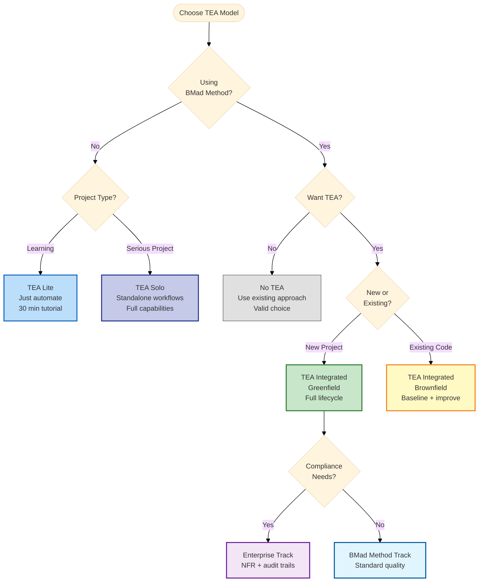

# TEA Engagement Models Explained

TEA is optional. There are five engagement models; pick one intentionally and change it later if it stops fitting.

| #   | Model                       | BMad Method required | Workflows used | Best for                         |
| --- | --------------------------- | -------------------- | -------------- | -------------------------------- |
| 1   | No TEA                      | No                   | 0              | Teams whose existing suite works |
| 2   | TEA Solo                    | No                   | 4-6            | Non-BMad projects                |
| 3   | TEA Lite                    | No                   | 2-3            | Learning TEA                     |
| 4   | TEA Integrated (Greenfield) | Yes                  | 8              | New projects                     |
| 5   | TEA Integrated (Brownfield) | Yes                  | 8              | Existing codebases               |

**Enterprise is a track, not a sixth model.** It layers extra steps onto either Integrated model when compliance, security, or regulatory evidence is in scope. Its deltas are listed under [Model 4](#model-4-tea-integrated-greenfield).

**TEA Academy is a learning path, not an engagement model.** `teach-me-testing` (menu code `TMT`) teaches testing progressively through 7 structured sessions, 30-90 minutes each, over 1-2 weeks self-paced. It persists state so you can pause and resume, adapts examples to your role (QA, Dev, Lead, VP), validates with quizzes, and ends with a completion summary. It runs alongside any of the five models. See [Learn Testing with TEA Academy](/docs/tutorials/learn-testing-tea-academy.md).

## Model 1: No TEA

Skip all TEA workflows and keep your existing testing approach.

**Use when** the team has established practices, quality is already high, and TEA solves no problem you have.

**You keep** full control, existing tools, team expertise, and zero learning curve.

**You give up** risk-based test planning, systematic quality review, evidence-backed gate decisions, and the knowledge base patterns.

A ten-year QA team with a high-quality suite and no flakiness problem is making a correct choice here.

## Model 2: TEA Solo

Run TEA workflows standalone, without BMad Method planning.

**Use when** the project is not on BMad Method, you want the quality operating model only, and you can bring your own requirements.

**Typical sequence:**

1. `test-design` (system or epic level)
2. `atdd` and/or `automate`
3. `test-review` (optional)
4. `trace` (coverage matrix, then gate decision)

Run `framework` or `ci` only if you want TEA to scaffold the harness or pipeline. Both work best after the stack and architecture are decided.

**You bring:** coverage oracle inputs (requirements, specs, external system-of-record pointers, or an analyzable source tree), a development environment, and project context.

**Example:** a Scrum team on Jira exports stories, runs `test-design` on the epic, runs `atdd` per story, implements, then runs `trace` for coverage. A consultancy uses the same sequence across clients on Scrum, Kanban, and ad-hoc processes to get one testing approach regardless of the client's methodology.

## Model 3: TEA Lite

Use `automate` to test features that already exist.

**Use when** you are learning TEA, want results inside 30 minutes, or are adding tests to an existing app with no time for a full methodology.

**Workflow:**

1. `framework` (set up test infrastructure)
2. `test-design` (optional risk assessment)
3. `automate` (generate tests for existing features)
4. Run the tests; they pass immediately because the features already work

**You give up** the ATDD red phase, risk-based planning depth, and quality gates (`trace` Phase 2).

See [TEA Lite Quickstart](/docs/tutorials/tea-lite-quickstart.md) for the 30-minute walkthrough on TodoMVC.

## Model 4: TEA Integrated (Greenfield)

Full BMad Method integration with TEA across every phase. This is the baseline that Models 4 and 5 and the Enterprise track are described as deltas from.

| Phase                      | TEA                                                                | Dev / Team                                                                       | Outputs                                                           |
| -------------------------- | ------------------------------------------------------------------ | -------------------------------------------------------------------------------- | ----------------------------------------------------------------- |
| **Phase 1**: Discovery     | -                                                                  | Analyst `product-brief` (optional)                                               | `product-brief.md`                                                |
| **Phase 2**: Planning      | -                                                                  | PM `prd`                                                                         | PRD with FRs and NFRs                                             |
| **Phase 3**: Solutioning   | `test-design` (system-level), then `framework` and `ci`            | Architect `architecture`, `create-epics-and-stories`, `implementation-readiness` | Testability review, NFR evidence plan, test scaffold, CI pipeline |
| **Phase 4**: Sprint start  | -                                                                  | SM `sprint-planning`                                                             | Sprint status file with all epics and stories                     |
| **Phase 4**: Epic planning | `test-design` for THIS epic                                        | Review epic scope                                                                | `test-design-epic-N.md` with risk assessment and test plan        |
| **Phase 4**: Story dev     | `atdd` before dev (optional), then `automate`                      | SM `create-story`, DEV implements                                                | Tests, story implementation                                       |
| **Phase 4**: Story review  | `test-review` (optional), re-run `trace`                           | Address recommendations, update code and tests                                   | Quality report, refreshed coverage matrix                         |
| **Release gate**           | `test-review` (optional), `nfr-assess` (optional), `trace` Phase 2 | Confirm Definition of Done, share release notes                                  | Quality audit, NFR evidence audit, gate YAML, release summary     |

`test-design` runs before `framework` and `ci` so NFR evidence needs can shape the infrastructure. `framework` and `ci` run once, in Phase 3, after architecture. The gate decision is one of PASS, CONCERNS, FAIL, or WAIVED.

### Enterprise track deltas

Legend: ➕ new workflow or phase · 🔄 same workflow, different emphasis · 📦 additional output or archival requirement

- ➕ **Phase 1**: `research` for domain and compliance research (recommended)
- 🔄 **Phase 3**: `test-design` captures NFR thresholds and planned evidence early (security, performance, reliability)
- 🔄 **Phase 2**: PM `prd` plus UX `create-ux-design`
- 🔄 **Phase 4**: `test-design` focuses on compliance and security architecture alignment
- ➕ **Release gate**: `nfr-assess` audits NFR evidence before the final gate
- 📦 **Release gate**: archive artifacts and compliance evidence for audits

Run `test-design` early enough to define NFR thresholds and planned evidence before implementation starts, and run `nfr-assess` at the gate once that evidence exists.

## Model 5: TEA Integrated (Brownfield)

Same lifecycle as Model 4 against an existing codebase, on either the BMad Method or Enterprise track.

**Deltas from greenfield:**

- ➕ **Documentation (prerequisite)**: `document-project` if the codebase is undocumented
- ➕ **Phase 2**: `trace` to baseline existing coverage before planning
- 🔄 **Phase 3**: `framework` only if you are modernizing the test infrastructure; `ci` updates the existing pipeline rather than creating one
- 🔄 **Phase 4**: `test-design` focuses on regression hotspots (bug-prone areas) and integration risk
- 🔄 **Story review**: `test-review` targets legacy test quality, not only new tests
- 🔄 **Release gate**: include `nfr-assess` when NFR evidence exists and matters to release

Baseline coverage before planning, then compare every later `trace` run to that baseline so improvement is measurable rather than asserted.

## Which model?

The Enterprise branch applies to the Brownfield model too; the diagram shows it once to stay readable.

| Your context                         | Model                             | Alternative              |
| ------------------------------------ | --------------------------------- | ------------------------ |
| BMad Method, new project             | TEA Integrated (Greenfield)       | TEA Lite while learning  |
| BMad Method, existing code           | TEA Integrated (Brownfield)       | TEA Solo                 |
| Non-BMad, need better quality        | TEA Solo                          | TEA Lite                 |
| Enterprise compliance (SOC 2, HIPAA) | TEA Integrated + Enterprise track | TEA Solo                 |
| Just learning testing                | TEA Lite                          | No TEA                   |
| Bug fix on a healthy codebase        | TEA Lite                          | No TEA                   |
| Established QA team, high quality    | No TEA                            | TEA Solo as a supplement |

Setup cost scales with the model: none for No TEA, ~30 minutes for TEA Lite, a few hours for TEA Solo, one to two days for either Integrated model. Beginners generally start at TEA Lite and grow into TEA Solo; teams already on BMad Method start Integrated.

| Aspect                 | No TEA | TEA Lite | TEA Solo | Integrated (Green) | Integrated (Brown) |
| ---------------------- | ------ | -------- | -------- | ------------------ | ------------------ |
| **Learning curve**     | None   | Low      | Medium   | High               | High               |
| **Test planning**      | Manual | Optional | Yes      | Systematic         | + Regression focus |
| **Quality gates**      | No     | No       | Optional | Yes                | Yes + baseline     |
| **NFR evidence audit** | No     | No       | Optional | Optional           | Recommended        |
| **Coverage tracking**  | Manual | No       | Optional | Yes                | Yes + trending     |

## Changing and mixing models

Models are not a commitment. Two things you can do:

**Expand gradually.** TEA Lite to TEA Solo takes two to four weeks: keep `framework` and `automate`, then add `test-design` for planning, `atdd` for the red phase, `test-review` for audits, and `trace` for coverage. TEA Solo to TEA Integrated takes one to two sprints: install BMad Method, run the planning workflows (PRD, architecture), wire TEA into Phase 3 with system-level `test-design`, then follow the per-epic lifecycle and add the `trace` Phase 2 gate. Going the other way is immediate: export the BMad artifacts and keep running TEA workflows standalone.

**Mix per feature.** Full Integrated for payment and auth, TEA Lite or No TEA for UI tweaks and bug fixes. Applying the whole model to a one-line change costs more than it protects.

## Worked scenarios

These are illustrative scenarios showing how the models compose, not benchmark measurements.

**Startup, Lite to Integrated.** Month 1: three developers, no QA, manual testing only. They run `framework` for a Playwright setup and `automate` for a first batch of tests. Month 3: five developers with tests in place, so they add `test-design`, `atdd`, and `test-review`. Month 6: eight developers and one QA, testing now business-critical, so they adopt full BMad Method with quality gates before each release and an NFR evidence audit for enterprise customers.

**Enterprise brownfield.** A legacy banking application with a large flaky suite, new features landing, and SOC 2 in scope. Phase 2 runs `trace` to record a coverage baseline. Phase 3 runs `test-design` to identify regression hotspots, `framework` to modernize the harness, and `ci` to add selective testing. Phase 4, per epic: `test-design` covering regression plus new work, fix the worst flaky tests, `atdd` for new features, `automate` for coverage expansion, `test-review` to track quality, and `trace` compared against the baseline. What the model produces for the audit is the traceability matrix and NFR evidence, whatever the coverage number lands at.

## Related

- [TEA Overview](/docs/explanation/tea-overview.md) - the nine workflows and the phase lifecycle
- [Testing as Engineering](/docs/explanation/testing-as-engineering.md) - why TEA exists
- [TEA Lite Quickstart](/docs/tutorials/tea-lite-quickstart.md) - Model 3 end to end
- [Using TEA with Existing Tests](/docs/how-to/brownfield/use-tea-with-existing-tests.md) - Model 5 in practice
- [Running TEA for Enterprise](/docs/how-to/brownfield/use-tea-for-enterprise.md) - the Enterprise track in practice
- [TEA Command Reference](/docs/reference/commands.md) - every workflow's inputs and outputs
