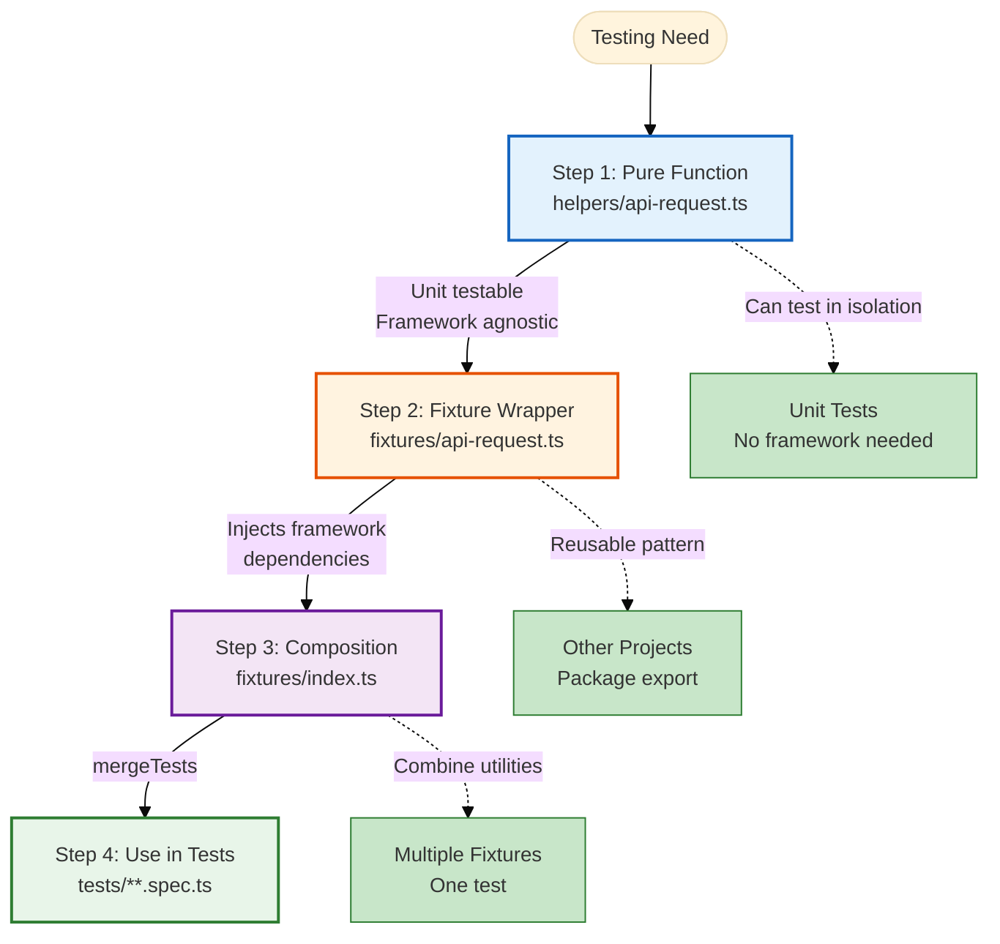

# Fixture Architecture Explained

Fixture architecture is TEA's pattern for building reusable, testable, and composable test utilities. The core principle: build pure functions first, wrap in framework fixtures second.

## Overview

1. Write the utility as a pure function, so it is unit-testable.
2. Wrap it in a framework fixture (Playwright, Cypress), which is where portability is lost.
3. Compose fixtures with `mergeTests`.
4. Package for reuse across projects.

The order is what makes it work: everything below the fixture layer stays testable and portable, and the framework-specific part is one thin file.



## The Problem

### Framework-First Approach (Common Anti-Pattern)

```typescript
// ❌ Built as a fixture from the start
export const test = base.extend({
  apiRequest: async ({ request }, use) => {
    await use(async (options) => {
      const response = await request.fetch(options.url, {
        method: options.method,
        data: options.data,
      });

      if (!response.ok()) {
        throw new Error(`API request failed: ${response.status()}`);
      }

      return response.json();
    });
  },
});
```

The logic is now sealed inside a Playwright context, so it cannot be unit tested or mocked, cannot be reused outside Playwright, and cannot be composed cleanly with other fixtures.

### Copy-Paste Utilities

```typescript
// The alternative failure mode: the same block in every spec file
test('test 1', async ({ request }) => {
  const response = await request.post('/api/users', { data: {...} });
  const body = await response.json();
  if (!response.ok()) throw new Error('Failed');
});
```

Duplication with drift: error handling diverges between copies, and changing the behavior means editing fifty tests.

## The Solution: Three-Step Pattern

### Step 1: Pure Function

```typescript
// helpers/api-request.ts

/**
 * Make API request with automatic error handling
 * Pure function: no framework dependencies
 */
export async function apiRequest({
  request, // Passed in (dependency injection)
  method,
  url,
  data,
  headers = {},
}: ApiRequestParams): Promise<ApiResponse> {
  const response = await request.fetch(url, {
    method,
    data,
    headers,
  });

  if (!response.ok()) {
    throw new Error(`API request failed: ${response.status()}`);
  }

  return {
    status: response.status(),
    body: await response.json(),
  };
}

// ✅ Can unit test this function!
describe('apiRequest', () => {
  it('should throw on non-OK response', async () => {
    const mockRequest = {
      fetch: vi.fn().mockResolvedValue({ ok: () => false, status: () => 500 }),
    };

    await expect(
      apiRequest({
        request: mockRequest,
        method: 'GET',
        url: '/api/test',
      }),
    ).rejects.toThrow('API request failed: 500');
  });
});
```

Because it takes `request` as a parameter instead of reaching for it, the same function works with any HTTP client and runs anywhere: a Node script, a CLI tool, a Vitest unit test.

### Step 2: Fixture Wrapper

```typescript
// fixtures/api-request.ts
import { test as base } from '@playwright/test';
import { apiRequest as apiRequestFn } from '../helpers/api-request';

/**
 * Playwright fixture wrapping the pure function
 */
export const test = base.extend<{ apiRequest: typeof apiRequestFn }>({
  apiRequest: async ({ request }, use) => {
    // Inject framework dependency (request)
    await use((params) => apiRequestFn({ request, ...params }));
  },
});

export { expect } from '@playwright/test';
```

The wrapper's only job is injecting the framework dependency. Moving to Cypress or another runner means rewriting this file and nothing else.

### Step 3: Composition with mergeTests

```typescript
// fixtures/index.ts
import { mergeTests } from '@playwright/test';
import { test as apiRequestTest } from './api-request';
import { test as authSessionTest } from './auth-session';
import { test as logTest } from './log';

/**
 * Compose all fixtures into one test
 */
export const test = mergeTests(apiRequestTest, authSessionTest, logTest);

export { expect } from '@playwright/test';
```

**Usage:**

```typescript
// tests/profile.spec.ts
import { test, expect } from '../support/fixtures';

test('should update profile', async ({ apiRequest, authToken, log }) => {
  log.info('Starting profile update test');

  // Use API request fixture (matches pure function signature)
  const { status, body } = await apiRequest({
    method: 'PATCH',
    url: '/api/profile',
    data: { name: 'New Name' },
    headers: { Authorization: `Bearer ${authToken}` },
  });

  expect(status).toBe(200);
  expect(body.name).toBe('New Name');

  log.info('Profile updated successfully');
});
```

**Note:** This example uses the vanilla pure function signature (`url`, `data`). Playwright Utils uses different parameter names (`path`, `body`). See [Integrate Playwright Utils](/docs/how-to/customization/integrate-playwright-utils.md) for the utilities API.

**Note:** `authToken` requires auth-session fixture setup with provider configuration. See [auth-session documentation](https://seontechnologies.github.io/playwright-utils/auth-session.html).

One import, every fixture, and TypeScript knows the type of each one.

## How It Works in TEA

`framework` with `tea_use_playwright_utils: true` scaffolds the layout directly:

```text
tests/
├── support/
│   ├── helpers/           # Pure functions
│   │   ├── api-request.ts
│   │   └── auth-session.ts
│   └── fixtures/          # Framework wrappers
│       ├── api-request.ts
│       ├── auth-session.ts
│       └── index.ts       # Composition
└── e2e/
    └── example.spec.ts    # Uses composed fixtures
```

`test-review` checks the same four properties: utilities are pure functions, fixtures are minimal wrappers, composition is used, and the utilities can be unit tested.

## Making Fixtures Reusable Across Projects

**Option 1: Use Playwright Utils (recommended)**

```bash
npm install -D @seontechnologies/playwright-utils
```

```typescript
import { test as base, mergeTests } from '@playwright/test';
import { test as apiRequestFixture } from '@seontechnologies/playwright-utils/api-request/fixtures';
import { createAuthFixtures } from '@seontechnologies/playwright-utils/auth-session';

const authFixtureTest = base.extend(createAuthFixtures());
export const test = mergeTests(apiRequestFixture, authFixtureTest);
```

Auth-session requires provider configuration. See the [auth-session setup guide](https://seontechnologies.github.io/playwright-utils/auth-session.html).

Playwright Utils 4.4.0 exports ten utility modules: `api-request`, `intercept-network-call`, `auth-session`, `network-recorder`, `network-error-monitor`, `recurse`, `burn-in`, `file-utils`, `log`, and `webhook`.

**Option 2: Build your own** when you need company-specific patterns, a custom authentication system, or something the utilities do not cover. Export one subpath per fixture so consumers compose only what they need:

```json
// package.json
{
  "name": "@company/test-utils",
  "exports": {
    "./api-request": "./fixtures/api-request.ts",
    "./auth-session": "./fixtures/auth-session.ts",
    "./log": "./fixtures/log.ts"
  }
}
```

```typescript
import { test as apiTest } from '@company/test-utils/api-request';
import { test as authTest } from '@company/test-utils/auth-session';
import { mergeTests } from '@playwright/test';

export const test = mergeTests(apiTest, authTest);
```

## Anti-Pattern: The God Fixture

```typescript
// ❌ Everything in one fixture
export const test = base.extend({
  testUtils: async ({ page, request, context }, use) => {
    await use({
      // 50 different methods crammed into one fixture
      apiRequest: async (...) => { },
      login: async (...) => { },
      createUser: async (...) => { },
      deleteUser: async (...) => { },
      uploadFile: async (...) => { },
      // ... 45 more methods
    });
  }
});
```

Nothing here can be tested, reused, or composed on its own. It is all-or-nothing, in one file that will pass a thousand lines.

```typescript
// ✅ One concern per fixture

// api-request.ts
export const test = base.extend({ apiRequest });

// auth-session.ts
export const test = base.extend({ authSession });

// log.ts
export const test = base.extend({ log });

// Compose as needed
import { mergeTests } from '@playwright/test';
export const test = mergeTests(apiRequestTest, authSessionTest, logTest);
```

Each fixture stays unit-testable, reusable on its own, and small enough to maintain, and a test composes only what it needs.

## When to Use This Pattern

### Always Use For:

**Reusable utilities:**

- API request helpers
- Authentication handlers
- File operations
- Network mocking

**Test infrastructure:**

- Shared fixtures across teams
- Packaged utilities (playwright-utils)
- Company-wide test standards

### Consider Skipping For:

**One-off test setup:**

```typescript
// Simple one-time setup: inline is fine
test.beforeEach(async ({ page }) => {
  await page.goto('/');
  await page.click('#accept-cookies');
});
```

**Test-specific helpers:**

```typescript
// Used in one test file only: keep local
function createTestUser(name: string) {
  return { name, email: `${name}@test.com` };
}
```

## Related

- [Test Quality Standards](/docs/explanation/test-quality-standards.md) - the isolation rule fixtures exist to satisfy
- [Network-First Patterns](/docs/explanation/network-first-patterns.md) - `interceptNetworkCall` as a fixture
- [How to Set Up Test Framework](/docs/how-to/workflows/setup-test-framework.md) - TEA scaffolds this layout
- [Integrate Playwright Utils](/docs/how-to/customization/integrate-playwright-utils.md) - the packaged fixtures
- [How to Run Automate](/docs/how-to/workflows/run-automate.md) - fixture composition in generated tests
- [Knowledge Base Index](/docs/reference/knowledge-base.md) - the fixture-architecture and fixtures-composition fragments
