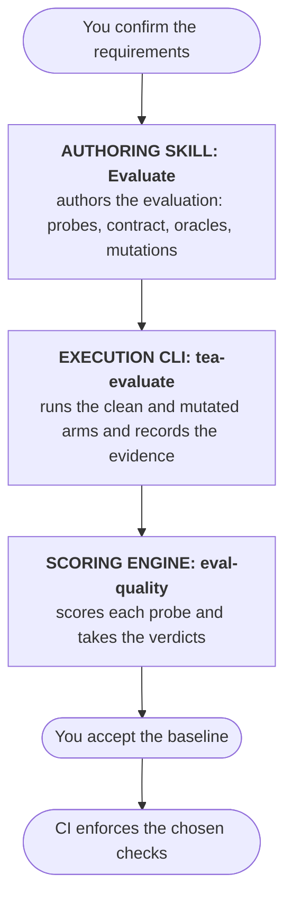

# How Evaluate Works

Evaluate (`bmad-testarch-evaluate`, menu code `EV`) checks whether your evaluation can detect known defects.
It plants a defect in your target, runs the evaluation, then restores the original files and runs again.
A passing evaluation on the mutated target exposes a blind spot.

Evaluation moves from confirmed requirements to CI in six steps, and three roles carry them.
The Evaluate skill authors the evaluation, the `tea-evaluate` command runs it and records the evidence, and `eval-quality` scores it.
You confirm the requirements and accept the baseline, and CI enforces the checks the evaluation chose.

To run one, start with the tutorial [Evaluate Your First Skill](/docs/tutorials/evaluate-your-first-skill.md).
For the commands and fields, use the [tea-evaluate CLI reference](/docs/reference/tea-evaluate-cli.md).

## The stack

| Layer                              | What it is                                                                                        | The question it answers                                |
| ---------------------------------- | ------------------------------------------------------------------------------------------------- | ------------------------------------------------------ |
| The system under test              | Your use of a model, a skill, an agent, a workflow, a tool server or an HTTP service              | What behaves, and where do we observe it?              |
| The evaluation                     | A folder committed with your code: requirements, contract, probes, mutations, policy and baseline | What do we claim, and what is the evidence?            |
| The Behavioral Evaluation Contract | One JSON file in the folder that declares behaviors, interfaces, evidence, oracles and budgets    | What counts as the behavior holding?                   |
| `eval-quality`                     | The engine that compiles and seals the contract, takes verdicts and scores strength               | Did the evaluation catch the defect, and how strongly? |

The system under test is always your use of something: the prompt, the wiring and the tools around a model.
Evaluate redirects a request to evaluate a vendor model on its own, because the vendor owns that system and you cannot fix it.

The evaluation is a folder (`evals/<evaluation-id>/` in the examples) that holds everything needed to repeat the measurement: the confirmed `requirements.md`, the `contract.json`, one probe file per probe, one mutation file per planted defect, the scoring policy and, once you accept one, a `baseline/` of results.
Because it is committed, a reviewer reads a change to the evaluation the way they read a change to code.

The contract tells an evaluator how to expose a failure and what evidence counts as finding it.
Every behavior in it carries an observable success criterion, and every behavior that a defect probe covers is decided by exactly one oracle.

`eval-quality` owns the mathematics and the integrity rules.
It compiles the contract, seals the brief an independent evaluator reads, checks that the environment can measure anything at all, resolves oracles over evidence, scores each probe and compares two runs.
The runtime accepts verdicts from `eval-quality`.

## What TEA owns above eval-quality

Evaluate authors the evaluation through its skill and executes it through `tea-evaluate`.

The skill is a conversation with the Master Test Architect through twelve stages: inspect the target and name its kind, capture the requirements you confirm, design the corpus of probes, author the contract, design the oracles, scaffold the registry and adapters, choose the evaluator, plant and roll back mutations, scaffold the harness, run and score, interpret the gaps, and write the CI plan.
Every stage has a craft guide, and a stage hands a checked artifact to the next.

The runtime, `tea-evaluate`, does the mechanical work that has to be exactly right.
It validates the folder, builds a disposable workspace for every arm, applies and rolls back mutations, confines every process the target starts, records observations, seals each trial as a record `eval-quality` reads, replays a committed baseline and runs the checks of a CI tier.
It computes no verdict, no score and no rate of its own.
Every exit that carries a judgment is `eval-quality`'s exit, passed through unchanged.

The engine checks scoring against its published corpus.
The runtime records evidence from confined target processes.

## Oracles and evaluator kinds

An oracle is the assertion: a relation that has to hold over the recorded evidence. "The title sent equals the title read back" is an oracle.
An exit code of zero alone decides nothing, because a process can succeed and still give a wrong answer.
So a strong oracle reads the substantive channel, such as the response body or the structured result, and says what it expects of it.

Judgment that no relation can express gets a rubric: an anchored scale of levels, written by you, that a scorer applies to a piece of evidence.
Every rubric criterion is calibrated before its scores count, which the next section explains.

Who applies the oracles is the evaluator kind, and `evaluation.json` chooses it:

- **`deterministic`**, the default.
  The runtime resolves each oracle with `eval-quality`'s own resolver over the recorded observations.
  A contract with a rubric also names a model judge, which scores each trial once.
- **`command`**.
  Your executable under `evaluator/` receives the sealed brief and the observations and prints judgment rows.
  It suits a skill-specific evaluator or a wrapper around a framework you already use.
- **`sealed-brief-agent`**.
  An agent reads the sealed brief alone and acts on the target only through a bridge the runtime owns, so the registry still decides what it may call.
  Because the agent chooses its own calls, two runs can differ, so Evaluate runs it several times on each arm first and requires its attempts to agree.
- **`records`**.
  Your own harness runs the target and the scorer, and hands over sealed run records.
  The runtime checks they match the brief and the configuration and passes them on.

Whatever the kind, `score` refuses a finding that cites no observation, quotes no evidence or cites an observation its record does not hold, with exit 10 before any score call.
Whether a quote, a citation or a signature supports the finding is `eval-quality`'s decision when it ingests the records, so an evaluator that cites evidence that does not exist is caught by the engine.

## Held-out probes and judge calibration

An evaluation you tune while you watch it will fit what you watched.
Evaluate splits the probes into two partitions to stop that.
The development partition is the one you author against and fix against.
The held-out partition holds probes you reserve and do not read while you improve the target, and each behavior that has a held-out probe also keeps a development probe.

The gap loop reads a view of the held-out partition that carries only the probe's identifier, its class and its outcome.
It hides the rationale, the defect, the test data and the mutation text, so a repair that makes the held-out probe pass shows a real gain.
When a held-out request must not reach the development partition at all, a `partitionPlan` removes the steps and oracles of one partition from the other's contract, so no run directory of either partition holds the other's requests.

A rubric score is only as good as its scorer.
Calibration measures that before any trial counts.
You label example responses at every anchored level of every criterion, the scorer scores them without seeing the labels, and the run computes exact agreement per criterion.
Agreement below the minimum you set in `judgeCalibration` ends the run with exit 11, an evaluation weakness, before any trial record exists.
The calibration file and the minimum become part of the scoring version, so changing either changes what a score means.

## Gameability

A rubric or a judgment invites a shortcut: a response that looks compliant and decides nothing.
A gameability probe commits such a degenerate response, for example a verdict line with no verdict behind it, together with a naive oracle that accepts it.
The disciplined oracle of the behavior under test has to reject the same response.
If the naive oracle rejects it, or the disciplined one accepts it, the probe shows the evaluation can be gamed, and the run exits 11.

The probe launches no target.
The runtime answers the interaction plan from the committed response, as if the target had produced it, and resolves both oracles.
When a held-out partition exists, the response splits where the plan does, and a run of both partitions scores each probe against the oracle of its own partition, which a `ci` replay of the baseline reproduces.

## The clean and mutated arms, and their rollback

An evaluation earns trust when it passes on a system that works and fails on the same system with a known defect.
Evaluate calls those the clean arm and the mutated arm.

The clean arm runs the interaction plan against the unchanged target in a disposable workspace.
A clean control, a probe flagged as expecting no defect, must pass, or the evaluation produces false alarms.

The mutated arm plants one defect.
A mutation is a single exact replacement in one file of your project: a sentence of a prompt, a limit in a rule, a condition in code.
The runtime qualifies it through six steps in a workspace of its own:

1. The clean arm runs, and every oracle of the covered behaviors must hold.
2. The mutation is applied.
3. The mutated arm runs, and at least one of those oracles must be violated.
4. The original bytes are restored, with the file's original mode.
5. The restored file's digest and mode are compared with the ones taken before the mutation.
6. The clean arm runs again until it passes, within a cap the scoring policy sets.

The run proves the rollback: `rollbackVerified` is true only when the restored bytes match and the clean arm passes again.
If the harness cannot reproduce its clean baseline after restoration, the run exits 12 because the harness is unfit to qualify that mutation.
A mutation that does not change the behavior exits 11, because an evaluation that cannot see a defect it was designed to see is the weakness Evaluate exists to find.

Two more arms exist for particular probes.
A historical arm runs a defect a release really fixed, either across the commit that fixed it or against two deployments, so the evaluation is tested on a failure your users met.
A gameability arm, described above, launches nothing.
Each arm runs the number of trials `evaluation.json` declares, in a fresh workspace each time, and the sealed trial sets go to `eval-quality score`, one call per probe.

The result is a strength vector per probe, and a catch rate per probe class in the run's strength aggregate, which together say how much of the planted-defect space the evaluation catches.
`compare --accept` writes the scored run to `baseline/`, which you commit, and later runs are held to it.
A baseline enters the repository only through a reviewed change, because it states what you accepted as the measure of the feature.

## Why the target is confined

The target is code you are measuring, so the runtime trusts none of it.
A skill or an agent can read files, write files, start processes and call out, and an evaluation is only worth having if what it did is recorded honestly.
So the runtime confines every process the target starts: it can write its disposable workspace and nothing else, it cannot read the contract, the probes or the evaluator, it cannot change your repository, and what it opens outside the grants is audited and makes the score Invalid.

macOS confines through Seatbelt and Linux through Bubblewrap.
A host that can do neither, or whose audit cannot observe, stops the command with exit 12, because an audit that cannot see would report an empty list as if it were evidence.
[Why Evaluate Confines the Target](/docs/explanation/why-evaluate-confines-the-target.md) describes the mechanisms, and the [reference](/docs/reference/tea-evaluate-cli.md#file-system-confinement) lists what you configure.

## How CI placement is derived

`ci/evaluation-ci-plan.json` assigns each check to a CI tier.
The runtime uses that plan to decide which checks run for each event.

The checks fall into two groups.
The deterministic set needs no secret and calls no model: the contract checks, the conformance run of an HTTP port, the gameability arm, the agreement of each oracle with its scorer and the replay of the baseline.
Every one of them belongs on the `pr` tier, so every pull request runs them, and the runtime refuses a plan that places one anywhere else.
The live set needs a live target, a model judge or a run to compare: a live preflight, a twin run of the evaluation, a held-out run, a judge calibration and a strength comparison.
It belongs on the `merge`, `scheduled` or `release` tiers, and the runtime refuses a live check on `pr`.

The last stage of the skill derives the placement from your repository.
It reads the pipeline files, the events that start each workflow, the checks your platform requires, the merge flow, the release flow and the secrets each event receives.
It also prices a live run from the contract's severities and the number of trials.
Each check starts at its default tier and moves only for a reason recorded in the plan, naming the file or the answer behind it.
A pull request from a fork receives no secret on most platforms, so a check that needs one cannot live on `pr`, and a scheduled run on the default branch can hold it.

Placement decides blocking too.
`tea-evaluate ci --tier <tier>` runs every check of the tier, keeps the evidence of each, and exits with the most severe blocking result.
It passes `eval-quality`'s exits through, so the pipeline fails for the engine's reason.
A plan can name existing publish or deploy jobs for a tier to gate, so a failing release evaluation stops the shipment.
`bmad-testarch-framework`'s CI setup renders the plan into the pipeline, one job per tier, as [Setup CI](/docs/how-to/workflows/setup-test-framework.md#evaluation-plans) describes.

## Related

- [Evaluate Your First Skill](/docs/tutorials/evaluate-your-first-skill.md) walks one small skill from requirements to an accepted baseline.
- [tea-evaluate CLI reference](/docs/reference/tea-evaluate-cli.md) states every command, option, field and exit code.
- [Why Evaluate Confines the Target](/docs/explanation/why-evaluate-confines-the-target.md) explains the confinement and the integrity checks.
- [How TEA Is Tested](/docs/explanation/how-tea-is-tested.md) shows the engine, the skill and the runtime proving themselves.
