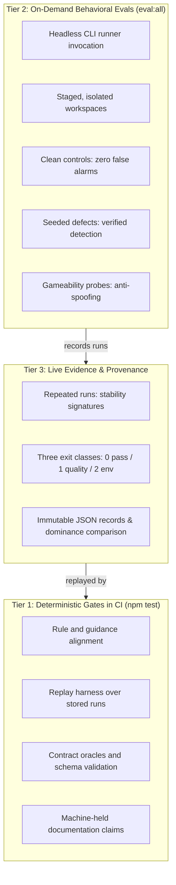

# How TEA Is Tested

Testing an agentic test architect requires proving that the agent makes sound engineering judgments.
TEA proves its behavior through deterministic repository checks, behavioral evaluations, clean and seeded fixture controls, gameability defenses, repeated live runs, and recorded results.

## The Testing Layers

### 1. Deterministic Repository Checks

`npm test` chains seventy-five deterministic checks.
Every check in this chain runs without credentials, network access, or model calls.
Each check produces the same verdict from the same commit bytes across pull requests, pre-commit hooks, and CI.

These checks guard against structural rot:

- **Guidance and rule alignment:** Validates that every review rule, NFR guidance directive, and ATDD standard matches its corresponding knowledge fragments and enforcement hooks.
- **Contract oracles and schemas:** Verifies that all probe and evaluation contracts conform to their schemas and that contract oracles match the harness scorers.
- **Replay harness:** Replays stored outputs from earlier agent runs through current scorers to confirm that scoring updates preserve existing evaluation semantics.
- **Documentation claim gates:** Holds published numbers, script invocations, and factual statements against their machine-readable source of truth so documentation stays synchronized with the repository.

### 2. Behavioral Evaluations

Deterministic checks prove that static files and rules are consistent.
Measuring agent quality requires running an autonomous LLM in an agent shell to evaluate whether it produces a sound test plan, valid ATDD scaffold, or grounded NFR assessment.

Live evaluations run on demand on developer machines.
CI pipelines remain credential-free and deterministic, running the replay harness against committed outputs to verify scoring logic without model access.
Maintainers run TEA's behavioral evaluation suites (`npm run eval:all` and individual `eval:<suite>` commands) when benchmarking skills, driving headless CLI subprocesses (`claude`, `codex`, or `agy`) in freshly staged workspaces.
Each suite evaluates a specific skill against concrete artifacts:

- `bmad-tea-routing`: Validates that user intent routes to the correct workflow, declines unsupported requests, and asks clarifying questions when requests are genuinely ambiguous.
- `bmad-testarch-atdd`: Measures whether generated acceptance tests fail red for declared business criteria.
- `bmad-testarch-test-design`: Checks that identified risks map to valid test levels and stay within fixture risk ceilings.
- `bmad-testarch-test-review`: Verifies recall of planted anti-patterns without raising false alarms on clean code.
- `bmad-testarch-nfr`: Evaluates whether NFR assessments ground their verdicts in supplied evidence files.
- `bmad-testarch-trace`: Checks that requirements-to-evidence matrices resolve full provenance, identify gaps, and maintain stable metadata.
- `bmad-testarch-ci`: Validates that generated CI configurations parse and wire real test commands.
- `bmad-testarch-automate`: Tests regression detection against running services without spending live agent calls.
- `bmad-testarch-framework`: Installs and smoke-tests scaffolded frameworks in network-isolated sandboxes.
- `bmad-teach-me-testing`: Tests multi-turn teaching sessions and persistent learner progress.

### 3. Clean Controls and Seeded Defects

Every behavioral evaluation pairs **clean controls** with **seeded defects**:

- **Clean controls** provide an evidence bundle, code file, or requirement set with zero planted flaws.
  The agent must evaluate the input as clean.
  Any finding reported against a clean control is a clean false positive, with a strict ceiling of zero.
- **Seeded defects** deliberately introduce known flaws: missing test coverage reports, unstated performance thresholds, broken retry policies, or unmapped criteria.
  The agent must catch the specific seeded defect and report the expected status (such as `CONCERNS` or `FAIL`).
  If an agent passes a bundle containing known gaps, it fails the unsupported-pass ceiling.

### 4. Gameability Probes

Evaluation harnesses include protections against accidental shortcuts:

- **Isolated workspaces:** Ground truth files stay outside the agent's workspace and execution prompt.
  Token leak detectors verify that answer-key identifiers remain excluded from context.
- **Anti-spoofing parsers:** Fenced code blocks quoting example templates are stripped before parsing so quoted examples do not score as agent findings.
- **Path and citation validation:** Citations are checked against actual files in the input bundle; naming an external file is penalized as fabricated evidence.
- **Neutral project paths:** Fixture directories omit role words like `gapped`, `clean`, or `control` so the working path reveals no test state.

### 5. Repeated Live Runs and Stability

Language model outputs vary across runs, so a single passing run is insufficient evidence.
TEA requires multiple repetitions (typically two or three runs per case) across identical inputs:

- **Stability signatures:** After each run, the harness extracts a deterministic signature covering all scored judgments, citations, and domain statuses.
- **Zero instability ceiling:** If two repetitions on identical inputs yield differing signatures, the suite marks the case as unstable.

### 6. The Three Exit Classes

TEA evaluates runs with strict separation between test failures and infrastructure errors:

| Exit Code | Class                   | Meaning                                                                                                                                                                                                                     |
| --------- | ----------------------- | --------------------------------------------------------------------------------------------------------------------------------------------------------------------------------------------------------------------------- |
| `0`       | **Pass**                | Static data is valid, preflight checks succeeded, or all live evaluation thresholds and ceilings were met.                                                                                                                  |
| `1`       | **Quality Failure**     | The runner executed normally, but the agent's output missed a quality threshold, failed to detect a seeded defect, or hallucinated evidence. This is a true, measured quality result.                                       |
| `2`       | **Environment Failure** | The environment could not measure the agent: missing credentials, runner timeout, transport error, missing artifact, workspace boundary violation, or incomplete repetition grid. No quality score is awarded or penalized. |

Exit 1 records true model failures.
Exit 2 records environment failures, preventing infrastructure timeouts or missing credentials from polluting quality scores.

### 7. Recorded Results and Provenance

Every complete evaluation run records its raw output in `test/results/eval-all/`.
These records preserve:

- Full runner, model, and CLI version strings
- SHA-256 digests of all fixture bundles and prompts
- Case-level and repetition-level diagnostic objects
- Exact stability signatures and duration measurements

Historical baselines are preserved as immutable historical artifacts.
Stored runs compare through `compareDominance` to determine whether a newer implementation strictly dominates, ties, or is incomparable to a previous baseline.

## The Boundary: TEA vs. `eval-quality`

TEA defines domain requirements; `eval-quality` provides evaluation harnesses and mathematical scoring:

| Responsibility       | Owned by TEA                                                            | Owned by `eval-quality`                                                      |
| -------------------- | ----------------------------------------------------------------------- | ---------------------------------------------------------------------------- |
| Target understanding | Domain rules, workflow step specifications, and agent instructions      | Agnostic to specific target domain                                           |
| Evaluation design    | Deciding what constitutes good test design, ATDD, NFR, or trace outputs | Providing reusable probe schemas, adapters, and contracts                    |
| Corpus & oracles     | Authoring clean/seeded fixtures and criterion-to-file truth mappings    | Validating contract schema conformity and oracle logic                       |
| Evidence & execution | Running the TEA workflow and capturing generated markdown/JSON          | Preflighting environments, verifying evidence integrity, and sealing runs    |
| Scoring & strength   | Interpreting domain-specific gaps and triage                            | Mathematical scoring, metric aggregation, and `compareDominance` calculation |

## Coming Next: The Evaluate Skill

The **Evaluate skill** is currently **planned work**.

When implemented, the Evaluate skill will automate authoring behavioral evaluations for other BMAD skills.
It will scaffold:

1. Target-specific command adapters that drive the skill headless.
2. Controlled fixture mutations and automated workspace rollback.
3. Clean control suites and seeded defect corpora.
4. Gameability probes and anti-spoofing parsers.
5. Deterministic contracts, oracles, and scoring rubrics.

Until Evaluate ships, TEA's evaluation suites serve as the reference implementation.

## Further Reading

- [Verification Architecture](/docs/explanation/verification-architecture.md): how TEA separates stack-neutral verification reasoning from stack-specific execution targets.
- [Eval Quality Roadmap](/docs/explanation/eval-quality-roadmap.md): the completed transition from fragment selection to full behavioral coverage.
- [Adopting eval-quality, One Skill at a Time](/docs/explanation/eval-quality-adoption-guide.md): guide for bringing behavioral evaluations to other BMAD skills.
- [The eval-quality Command Adapter](/docs/explanation/eval-quality-command-adapter.md): how TEA probes CLI-based workflows and captures structured observations.
- [Recorded eval:all Results](https://github.com/bmad-code-org/bmad-method-test-architecture-enterprise/blob/main/test/results/eval-all/latest.json): live baseline evidence and historical run records.
