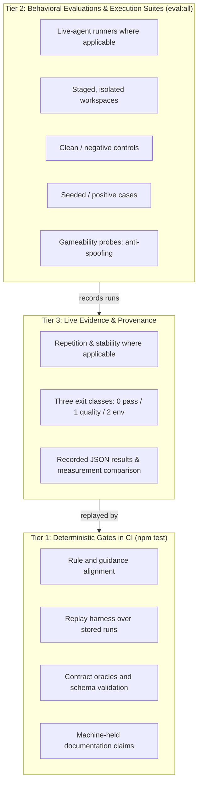

# How TEA Is Tested

Testing an agentic test architect requires proving that the agent makes sound engineering judgments.
TEA proves its behavior through deterministic repository checks, behavioral evaluations, clean and seeded fixture controls, gameability defenses, repeated live runs, and recorded results.

## The Testing Layers

### 1. Deterministic Repository Checks

`npm test` runs the repository's credential-free checks without live model calls.
These include structural validation, scorer replays, and deterministic execution against local fixtures.
Some checks require local services or declared external dependencies.

These checks guard against structural rot:

- **Guidance and rule alignment:** Validates that every review rule, NFR guidance directive, and ATDD standard matches its corresponding knowledge fragments and enforcement hooks.
- **Contract oracles and schemas:** Verifies that all probe and evaluation contracts conform to their schemas and that contract oracles match the harness scorers.
- **Replay harness:** Replays stored outputs from earlier agent runs through current scorers to confirm that scoring updates preserve existing evaluation semantics.
- **Documentation claim gates:** Holds configured claims, script invocations, and factual statements against their machine-readable source of truth so documentation stays synchronized with the repository.

### 2. Behavioral Evaluations and Execution Suites

Deterministic checks prove that static files and rules are consistent.
The manifest-driven `eval:all` command runs both live-agent evaluations and deterministic execution suites.
Live-agent suites invoke headless CLI runners in staged workspaces to evaluate whether an autonomous model produces sound engineering outputs.
The `automate` and `framework` suites execute committed test or scaffold fixtures without model calls.

Each suite evaluates a specific skill against concrete artifacts:

- `bmad-tea-routing`: Validates that user intent routes to the correct workflow, declines unsupported requests, and asks clarifying questions when requests are genuinely ambiguous.
- `bmad-testarch-atdd`: Measures whether generated acceptance tests fail red for declared business criteria.
- `bmad-testarch-test-design`: Checks that identified risks map to valid test levels and stay within fixture risk ceilings.
- `bmad-testarch-test-review`: Verifies recall of planted anti-patterns without raising false alarms on clean code.
- `bmad-testarch-nfr`: Evaluates whether NFR assessments ground their verdicts in supplied evidence files.
- `bmad-testarch-trace`: Checks that requirements-to-evidence matrices resolve full provenance, identify gaps, and maintain stable metadata.
- `bmad-testarch-ci`: Validates that generated CI configurations parse and wire real test commands.
- `bmad-testarch-automate`: Tests regression detection against running services using four hand-authored spec sets without model calls.
- `bmad-testarch-framework`: Tests template-produced scaffolds in capability-restricted sandboxes with explicitly permitted registry and loopback access.
- `bmad-teach-me-testing`: Tests multi-turn teaching sessions and persistent learner progress.

### 3. Clean Controls and Seeded Defects

Each suite defines positive, negative, clean, or seeded cases appropriate to its task.
False-positive limits, repetition counts, and stability requirements are suite-specific and declared in the suite manifest.
Several suites require zero unstable cases; others enforce bounded score variation, stable verdicts, or different explicit ceilings.

- **Clean controls:** Provide an evidence bundle, code file, or requirement set with zero planted flaws.
  The agent evaluates the input against defined thresholds (for example, `test-review` declares an 80% non-false-positive rate).
- **Seeded defects:** Deliberately introduce known flaws: missing test coverage reports, unstated performance thresholds, broken retry policies, or unmapped criteria.
  The agent must detect the seeded defect and report the expected status (such as `CONCERNS` or `FAIL`).

### 4. Gameability Probes

Evaluation harnesses include protections against accidental shortcuts:

- **Isolated workspaces:** Ground truth files stay outside the agent's workspace and execution prompt.
  Token leak detectors verify that answer-key identifiers remain excluded from context.
- **Anti-spoofing parsers:** Fenced code blocks quoting example templates are stripped before parsing so quoted examples do not score as agent findings.
- **Path and citation validation:** Citations are checked against actual files in the input bundle; naming an external file is penalized as fabricated evidence.
  For NFR assessments, the scorer also checks citations against the fixture's criterion-to-evidence mapping; citing a real file associated with another criterion is a grounding failure.
- **Neutral project paths:** Fixture directories omit role words like `gapped`, `clean`, or `control` so the working path reveals no test state.

### 5. Repeated Live Runs and Stability

Language model outputs vary across runs, so suites declare repetition counts and stability ceilings suited to their task.
For example, `bmad-tea-routing` allows up to two unstable cases across repeated runs; `test-review` permits score standard deviation up to 3 while requiring a single stable verdict; `teach-me-testing` evaluates session persistence across a two-turn session.

- **Stability signatures:** After each run, the harness extracts a deterministic signature covering scored judgments, citations, and domain statuses.
- **Suite-specific ceilings:** The suite manifest declares each suite's repetition and stability thresholds.

### 6. The Three Exit Classes

TEA evaluates runs with strict separation between test failures and infrastructure errors:

| Exit Code | Class                   | Meaning                                                                                                                                                                        |
| --------- | ----------------------- | ------------------------------------------------------------------------------------------------------------------------------------------------------------------------------ |
| `0`       | **Pass**                | Static data is valid, preflight checks succeeded, or live evaluation thresholds and ceilings were met.                                                                         |
| `1`       | **Quality Failure**     | The runner executed normally, but output missed a quality threshold, missed a seeded defect, or hallucinated evidence.                                                         |
| `2`       | **Environment Failure** | The harness could not complete measurement due to missing credentials, timeouts, transport errors, or unexpected execution failures. No quality score is awarded or penalized. |

Exit 1 records measured quality failures across workflow, model, harness, corpus, or oracle defects.
Exit 2 records environment or unexpected runtime errors, preventing infrastructure failures from skewing quality metrics.

### 7. Recorded Results and Provenance

With `--json`, `eval:all` writes a structured run summary containing provenance, measurements, and bounded diagnostics.
Maintainers preserve a summary under `test/results/eval-all/` using `tools/record-eval-run.js`.
Each recording updates `latest.json` and adds a timestamped history entry.

These records preserve:

- Full runner, model, and CLI version strings
- SHA-256 digests of all fixture bundles and prompts
- Case-level and repetition-level diagnostic objects
- Exact stability signatures and duration measurements

Historical baselines are preserved as immutable records.
Recorded `eval:all` runs are compared for changes in measurements, failure classes, and suite membership.
The comparison refuses incompatible configurations.
Separate strength-result comparisons use `eval-quality`'s `compareDominance` when both records carry the required comparable-result data.
A reader should consult the recorded result in `latest.json` to verify actual measurements, since an attempt can record infrastructure or transport failures alongside successful deterministic checks.

## The Boundary: TEA vs. `eval-quality`

TEA supplies the execution harnesses, domain-specific scorers, fixtures, oracles, and acceptance thresholds.
`eval-quality` supplies reusable contract, probe, validation, sealing, and scoring primitives:

| Responsibility       | Owned by TEA                                                       | Owned by `eval-quality`                                                       |
| -------------------- | ------------------------------------------------------------------ | ----------------------------------------------------------------------------- |
| Target understanding | Domain rules, workflow step specifications, and agent instructions | Agnostic to specific target domain                                            |
| Evaluation design    | Defining domain test plans, ATDD, NFR, or trace expectations       | Providing reusable probe schemas, adapters, and contracts                     |
| Corpus & oracles     | Authoring fixtures and criterion-to-file truth mappings            | Validating contract schema conformity and oracle logic                        |
| Evidence & execution | Driving workflow execution and capturing generated artifacts       | Preflighting environments, verifying evidence integrity, and contract sealing |
| Scoring & strength   | Interpreting domain-specific gaps and triage                       | Mathematical scoring, metric aggregation, and `compareDominance` calculation  |

## Evaluate, In Progress

The **Evaluate skill** (`bmad-testarch-evaluate`, menu code `EV`) helps users build evaluations on top of `eval-quality`, and it is being built story by story.
It is registered as TEA's tenth workflow, and its runtime, `tea-evaluate`, already validates, digests and preflights an evaluation folder ([tea-evaluate CLI](/docs/reference/tea-evaluate-cli.md)).
Running an evaluation's arms, scoring it, and wiring it into CI arrive in later stories.
Until Evaluate authors its own suite, TEA's evaluation suites serve as the reference implementation.

## Further Reading

- [Verification Architecture](/docs/explanation/verification-architecture.md): how TEA separates stack-neutral verification reasoning from stack-specific execution targets.
- [Eval Quality Roadmap](/docs/explanation/eval-quality-roadmap.md): the completed transition from fragment selection to full behavioral coverage.
- [Adopting eval-quality, One Skill at a Time](/docs/explanation/eval-quality-adoption-guide.md): guide for bringing behavioral evaluations to other BMAD skills.
- [The eval-quality Command Adapter](/docs/explanation/eval-quality-command-adapter.md): how TEA probes CLI-based workflows and captures structured observations.
- [Recorded eval:all Results](https://github.com/bmad-code-org/bmad-method-test-architecture-enterprise/blob/main/test/results/eval-all/latest.json): live baseline evidence and historical run records.
