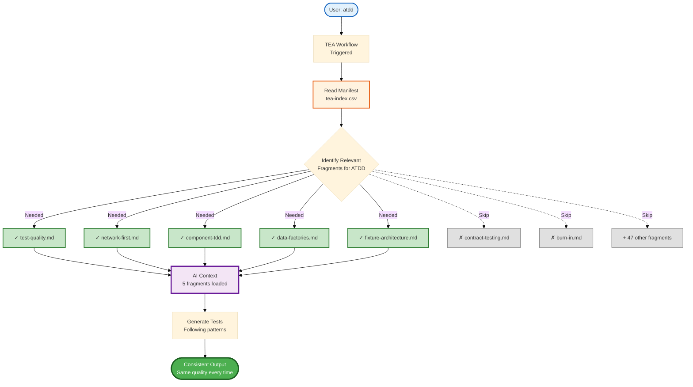

# Knowledge Base System Explained

TEA's knowledge base is how context engineering works in practice: domain standards load into AI context automatically, so test quality stops depending on how well the prompt was written.

Without it, quality is a function of prompt engineering skill. "Write tests for login" produces hard waits one session and network-first patterns the next, and two teams on the same codebase drift into two pattern sets with no single source of truth. With it, `atdd` loads the same fragments every run and generates tests that look like the same expert wrote them. [Testing as Engineering](/docs/explanation/testing-as-engineering.md) covers why this matters; this page covers the mechanism.

## The `tea-index.csv` Manifest

`src/agents/bmad-tea/resources/tea-index.csv` is the manifest. One row per fragment:

```csv
id,name,description,tags,tier,fragment_file
fixture-architecture,Fixture Architecture,"Composable fixture patterns (pure function → fixture → merge) and reuse rules","fixtures,architecture,playwright,cypress",core,knowledge/fixture-architecture.md
network-first,Network-First Safeguards,"Intercept-before-navigate workflow, HAR capture, deterministic waits, edge mocking","network,stability,playwright,cypress,ui",core,knowledge/network-first.md
test-quality,Test Quality Definition of Done,"Execution limits, isolation rules, green criteria","quality,definition-of-done,tests",core,knowledge/test-quality.md
```

`tier` is one of `core`, `extended`, or `specialized`. The 56 fragments split 21 / 19 / 16 across those tiers.

The agent-level `resources/` directory is the reference catalog. Workflow skills also carry their own `resources/tea-index.csv` and `resources/knowledge/` directories. That duplication is intentional: workflow step frontmatter resolves `knowledgeIndex: './resources/tea-index.csv'` from `{skill-root}`, which keeps each workflow skill modular and self-contained.

A workflow reads the manifest, selects the fragments its task needs, and loads only those. Running `atdd` on an authentication feature pulls `test-quality.md`, `auth-session.md`, `network-first.md`, `data-factories.md`, and `email-auth.md` if the auth is email-based, and skips the other 49 including `contract-testing.md`, `feature-flags.md`, and `file-utils.md`. Focused context produces better results at lower token cost, and it produces the _same_ results next session.



| Workflow      | Fragments loaded                                              | Purpose                  |
| ------------- | ------------------------------------------------------------- | ------------------------ |
| `framework`   | fixture-architecture, playwright-config, fixtures-composition | Infrastructure patterns  |
| `test-design` | test-quality, test-priorities-matrix, risk-governance         | Planning standards       |
| `atdd`        | test-quality, component-tdd, network-first, data-factories    | TDD patterns             |
| `automate`    | test-quality, test-levels-framework, selector-resilience      | Comprehensive generation |
| `test-review` | All quality, resilience, and debugging fragments              | Full audit patterns      |
| `ci`          | ci-burn-in, burn-in, selective-testing                        | CI/CD optimization       |

## Anatomy of a Fragment

Every fragment follows the same shape:

- **Principle.** One sentence: what is this pattern?
- **Rationale.** Why this instead of the alternatives, what problems it solves.
- **Pattern examples.** Runnable code, basic through advanced, each with a short explanation.
- **Anti-patterns.** The bad version, what breaks, and why.
- **Related patterns.** Links to neighbouring fragments.

## What the Fragments Buy You

**Consistent generation.** Without the knowledge base, `atdd` guesses from general model knowledge, so one session emits a hard wait inside an API test and the next emits a cleaner version that still does not match the first. With it, both sessions load `test-quality.md`, `network-first.md`, and `api-request.md`, and both emit:

```typescript
import { test } from '@seontechnologies/playwright-utils/api-request/fixtures';

test('should fetch users', async ({ apiRequest }) => {
  const { status, body } = await apiRequest({
    method: 'GET',
    path: '/api/users',
  }).validateSchema(UsersSchema); // chained validation

  expect(status).toBe(200);
  expect(body).toBeInstanceOf(Array);
});
```

Always `apiRequest` when playwright-utils is enabled, always schema-validated, always `{ status, body }`.

**One correct answer instead of three plausible ones.** Testing an async background job, three developers with no shared reference produce a hard wait, a hand-rolled polling loop, and a `waitForSelector` with a 30-second ceiling. All three are suboptimal in different ways. The `recurse.md` fragment gives everyone the same one:

```typescript
import { mergeTests } from '@playwright/test';
import { test as apiRequestTest } from '@seontechnologies/playwright-utils/api-request/fixtures';
import { test as recurseTest } from '@seontechnologies/playwright-utils/recurse/fixtures';

const test = mergeTests(apiRequestTest, recurseTest);

test('job completion', async ({ apiRequest, recurse }) => {
  const { body: job } = await apiRequest({
    method: 'POST',
    path: '/api/jobs',
  });

  // recurse(command, predicate, options)
  const result = await recurse(
    () => apiRequest({ method: 'GET', path: `/api/jobs/${job.id}` }),
    (response) => response.body.status === 'completed', // response.body comes from apiRequest
    {
      timeout: 30000,
      interval: 2000,
      log: 'Waiting for job to complete',
    },
  );

  expect(result.body.status).toBe('completed');
});
```

**Objective review.** `test-review` scores against the fragments rather than against an opinion, so the same suite gets the same findings with the same explanations on every run.

**Cheap evolution and onboarding.** A pattern change is one fragment edit that every subsequent generation picks up, instead of a manual sweep across a hundred test files. A new team member runs `atdd` and reads the generated code rather than reading twenty documents.

## Maintaining the Knowledge Base

**Add a fragment when** the pattern spans multiple workflows, the standard is non-obvious, the same question keeps getting asked, or you are integrating a new tool. **Do not add one** for a one-off pattern (document it in the test file), something everyone already knows, or something still experimental.

**A good fragment** states its principle in one sentence, explains the rationale clearly, carries three or more code examples, shows the anti-patterns, and stands alone with minimal dependencies. Optimal size is 10-30 KB.

**Update a fragment when** the pattern evolves, the tool ships a new API, feedback says it is unclear, or an example has a bug. Edit the markdown, update the examples, test against the affected workflows, and check nothing downstream breaks. `tea-index.csv` only needs touching when the description or tags change.

## Related

- [Knowledge Base Index](/docs/reference/knowledge-base.md) - all 56 fragments, categorized
- [Testing as Engineering](/docs/explanation/testing-as-engineering.md) - the context engineering argument
- [Test Quality Standards](/docs/explanation/test-quality-standards.md) - what `test-quality.md` encodes
- [Network-First Patterns](/docs/explanation/network-first-patterns.md) - what `network-first.md` encodes
- [Extend TEA with Custom Workflows](/docs/how-to/customization/extend-tea-with-custom-workflows.md) - adding fragments for your own stack
- [TEA Configuration](/docs/reference/configuration.md) - config keys that affect fragment loading
