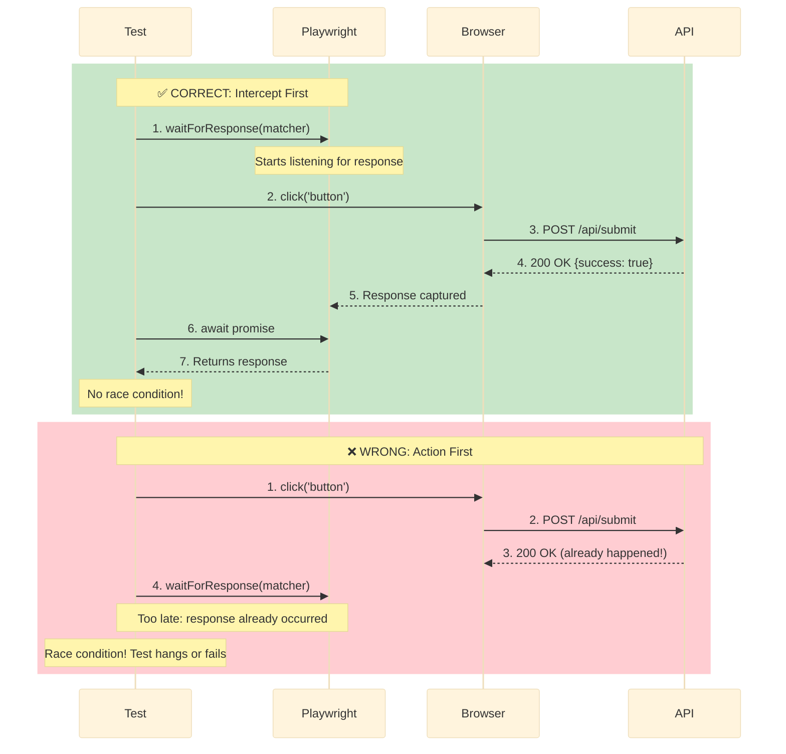

# Network-First Patterns Explained

Network-first patterns are TEA's answer to flakiness. The UI changes because an API responded, so wait for the API response rather than guessing at a timeout.

```typescript
// ❌ Traditional: hope 3 seconds is enough
await page.click('button');
await page.waitForTimeout(3000);
await expect(page.locator('.success')).toBeVisible();

// ✅ Network-first: wait exactly as long as the API takes
const responsePromise = page.waitForResponse((resp) => resp.url().includes('/api/submit') && resp.ok());
await page.click('button');
await responsePromise;
await expect(page.locator('.success')).toBeVisible();
```

## Why Hard Waits Fail

A fixed timeout is wrong in both directions at once:

- **Fast network:** wastes the difference on every run, multiplied by every test.
- **Slow network, CI, or load:** the API takes longer than the guess and the test fails.

The usual repair makes it worse. A test fails at 2000 ms, so it goes to 5000, still fails sometimes, so it goes to 10000 and finally passes. Now every run of that test costs 10 seconds, the suite that took 5 minutes takes 30, and it is still not deterministic. It is slower and equally flaky.

Navigation has the same problem in a sharper form:

```typescript
// ❌ Navigate-then-assert race condition
test('should load dashboard data', async ({ page }) => {
  await page.goto('/dashboard'); // navigation starts
  // Page loads HTML, JavaScript requests /api/dashboard, and this assertion
  // runs before the response arrives. It fails intermittently.
  await expect(page.locator('.data-table')).toBeVisible();
});
```

The counter-argument that tests are fast enough locally does not survive contact with a different environment, an API under load, network variability, or a suite growing from 100 tests to 1000. Network-first prevents all four before they appear, and the investment is roughly thirty minutes to learn against the hundreds of hours a flaky suite costs in debugging and lost trust.

## Intercept, Act, Await

**Set up the wait before triggering the action.**

```typescript
const promise = page.waitForResponse(matcher); // 1. Intercept: starts listening immediately
await page.click('button'); // 2. Act: triggers the request
await promise; // 3. Await: resolves on the actual response
```

Reverse steps 1 and 2 and the response can arrive before the listener exists, at which point the test hangs until timeout.



Applied to the racing dashboard test above:

```typescript
// ✅ Vanilla Playwright
test('should load dashboard data', async ({ page }) => {
  const dashboardPromise = page.waitForResponse((resp) => resp.url().includes('/api/dashboard') && resp.ok());

  await page.goto('/dashboard');

  const response = await dashboardPromise;
  const { items } = await response.json();

  expect(items).toHaveLength(5); // validate the API: catches backend errors
  await expect(page.locator('.data-table')).toBeVisible();
  await expect(page.locator('.data-table tr')).toHaveCount(items.length); // validate UI against API: catches frontend bugs
});
```

```typescript
// ✅ Same test with Playwright Utils
import { test } from '@seontechnologies/playwright-utils/intercept-network-call/fixtures';
import { expect } from '@playwright/test';

test('should load dashboard data', async ({ page, interceptNetworkCall }) => {
  const dashboardCall = interceptNetworkCall({
    method: 'GET',
    url: '**/api/dashboard',
  });

  await page.goto('/dashboard');

  const {
    status,
    responseJson: { items },
  } = await dashboardCall; // already parsed, no resp.ok() check needed

  expect(status).toBe(200);
  expect(items).toHaveLength(5);

  await expect(page.locator('.data-table')).toBeVisible();
  await expect(page.locator('.data-table tr')).toHaveCount(items.length);
});
```

Both forms wait exactly as long as needed, whether that is 100 ms or 5 seconds, and behave the same locally, in CI, and against staging.

## What Playwright Utils Adds

`@seontechnologies/playwright-utils` is optional as a choice, and binding once chosen. `tea_use_playwright_utils` defaults to `true`, and while it is `true` the second form above is what TEA generates and what `test-review` expects. `page.route` on an application endpoint becomes a finding unless the code says why. It stays correct for what it is genuinely for: blocking analytics, fonts, and third-party scripts. The full rule is the `playwright-utils-mandate` knowledge fragment.

Seven things the utility changes:

1. **Automatic JSON parsing.** No `await response.json()` anywhere.
2. **Different result shapes for different utilities**, and the distinction matters. `interceptNetworkCall` resolves to `{ status, responseJson, requestJson }` because it observes a browser round trip and can see both directions. `apiRequest` resolves to `{ status, body }` because it issues the request itself.
3. **Glob matching.** `url: '**/api/users'` instead of a `resp.url().includes(...)` predicate or a regex.
4. **One declarative call.** Setup and wait are the same expression, and the fixture injects `page`, so you never pass it.
5. **Automatic retry.** `apiRequest` retries 5xx with exponential backoff; 4xx fails immediately. Disable with `retryConfig: { maxRetries: 0 }` when the error itself is what you are testing.
6. **Schema validation.** `validateSchema` as a parameter, or `.validateSchema(Schema)` chained. Accepts JSON Schema, Zod, YAML files, and OpenAPI specs, and throws with detailed errors on mismatch.
7. **Managed HAR recording.** `networkRecorder` handles HAR naming and paths, detects CRUD operations for stateful mocking, and switches between record and playback from an environment variable.

Setup: [Integrate Playwright Utils](/docs/how-to/customization/integrate-playwright-utils.md#intercept-network-call).

## Matcher Variations

`interceptNetworkCall` narrows by any combination of method, URL glob, and observed status.

```typescript
import { test } from '@seontechnologies/playwright-utils/intercept-network-call/fixtures';

// Any response
const anyCall = interceptNetworkCall({ url: '**' });

// Specific endpoint
const userCall = interceptNetworkCall({ url: '**/api/users/123' });

// Method plus endpoint; assert the status you expect rather than filtering on it
const createCall = interceptNetworkCall({ method: 'POST', url: '**/api/users' });
const { status, responseJson } = await createCall;
expect(status).toBe(201);

// Multiple calls from one navigation: intercept both, then navigate
test('multiple responses', async ({ page, interceptNetworkCall }) => {
  const usersCall = interceptNetworkCall({ url: '**/api/users' });
  const postsCall = interceptNetworkCall({ url: '**/api/posts' });

  await page.goto('/dashboard'); // triggers both

  const [{ responseJson: users }, { responseJson: posts }] = await Promise.all([usersCall, postsCall]);

  expect(users).toBeInstanceOf(Array);
  expect(posts).toBeInstanceOf(Array);
});
```

The vanilla equivalents, for projects not using the utilities:

```typescript
// Any successful response
const promise = page.waitForResponse((resp) => resp.ok());

// Specific endpoint
const promise = page.waitForResponse((resp) => resp.url().includes('/api/users/123'));

// POST returning 201
const promise = page.waitForResponse(
  (resp) => resp.url().includes('/api/users') && resp.request().method() === 'POST' && resp.status() === 201,
);

// Multiple calls: the navigation goes inside Promise.all, so the listeners exist first
const [usersResp, postsResp] = await Promise.all([
  page.waitForResponse((resp) => resp.url().includes('/api/users')),
  page.waitForResponse((resp) => resp.url().includes('/api/posts')),
  page.goto('/dashboard'),
]);

const users = await usersResp.json();
const posts = await postsResp.json();
```

Validating the response before asserting on the UI is the point of all of these. It separates "the backend returned the wrong thing" from "the frontend rendered the right thing wrongly", which a UI-only assertion cannot do:

```typescript
test('validate response data', async ({ page, interceptNetworkCall }) => {
  const checkoutCall = interceptNetworkCall({ method: 'POST', url: '**/api/checkout' });

  await page.click('button:has-text("Complete Order")');

  const { status, responseJson: order } = await checkoutCall;

  expect(status).toBe(200);
  expect(order.status).toBe('confirmed');
  expect(order.total).toBeGreaterThan(0);

  await expect(page.locator('.order-confirmation')).toContainText(order.id);
});
```

## Stubbing Responses

Set the stub up before navigation, same ordering rule.

```typescript
import { test } from '@seontechnologies/playwright-utils/intercept-network-call/fixtures';

test('should handle API error', async ({ page, interceptNetworkCall }) => {
  const usersCall = interceptNetworkCall({
    method: 'GET',
    url: '**/api/users',
    fulfillResponse: {
      status: 500,
      body: { error: 'Internal server error' },
    },
  });

  await page.goto('/users');

  const { status, responseJson } = await usersCall; // stub and wait are one call

  expect(status).toBe(500);
  expect(responseJson.error).toContain('Internal server');
  await expect(page.locator('.error-message')).toContainText('Server error');
});
```

```typescript
// Vanilla: route setup and response wait are two separate steps
test('should handle API error', async ({ page }) => {
  await page.route('**/api/users', (route) => {
    route.fulfill({
      status: 500,
      body: JSON.stringify({ error: 'Internal server error' }),
    });
  });

  await page.goto('/users');

  const response = await page.waitForResponse('**/api/users');
  const error = await response.json();

  expect(error.error).toContain('Internal server');
  await expect(page.locator('.error-message')).toContainText('Server error');
});
```

## HAR Recording for Offline Testing

```typescript
import { test } from '@seontechnologies/playwright-utils/network-recorder/fixtures';

// Record mode
process.env.PW_NET_MODE = 'record';

test('should work offline', async ({ page, context, networkRecorder }) => {
  await networkRecorder.setup(context); // HAR naming and paths handled for you

  await page.goto('/dashboard');
  await page.click('#add-item'); // CRUD operations detected and replayed statefully
});
```

```bash
# Play the recording back with no backend running
PW_NET_MODE=playback npx playwright test
```

```typescript
// Vanilla: name the HAR file and flip `update` by hand, per test
test('offline testing - RECORD', async ({ page, context }) => {
  await context.routeFromHAR('./hars/dashboard.har', { url: '**/api/**', update: true });
  await page.goto('/dashboard');
});

test('offline testing - PLAYBACK', async ({ page, context }) => {
  await context.routeFromHAR('./hars/dashboard.har', { url: '**/api/**', update: false });
  await page.goto('/dashboard'); // uses recorded responses, no backend needed
});
```

## "I Already Use waitForSelector"

```typescript
// Still a guess, just a differently shaped one
await page.click('button');
await page.waitForSelector('.success', { timeout: 5000 });
```

It waits on the DOM, which is the effect, and gives up after an arbitrary ceiling. Wait on the cause first, then check the effect:

```typescript
await page.waitForResponse(matcher);
await page.waitForSelector('.success');
```

## How TEA Applies This

`atdd` and `automate` generate network-first tests by default, in whichever form the project is configured for. `test-review` flags every `waitForTimeout` as a Critical determinism violation with the network-first replacement attached:

```markdown
## Critical Issue: Hard Wait Detected

**File:** tests/e2e/submit.spec.ts:45
**Issue:** Using `page.waitForTimeout(3000)`
**Severity:** Critical (causes flakiness)
**Fix:** Replace with `page.waitForResponse(matcher)` set up before the action
```

## Related

- [Test Quality Standards](/docs/explanation/test-quality-standards.md) - the scoring rubric this rule is worth 15 points in
- [Fixture Architecture](/docs/explanation/fixture-architecture.md) - how network utilities become fixtures
- [Integrate Playwright Utils](/docs/how-to/customization/integrate-playwright-utils.md) - installation and configuration
- [How to Run Test Review](/docs/how-to/workflows/run-test-review.md) - finding hard waits in an existing suite
- [Knowledge Base Index](/docs/reference/knowledge-base.md) - the network-first and intercept-network-call fragments
