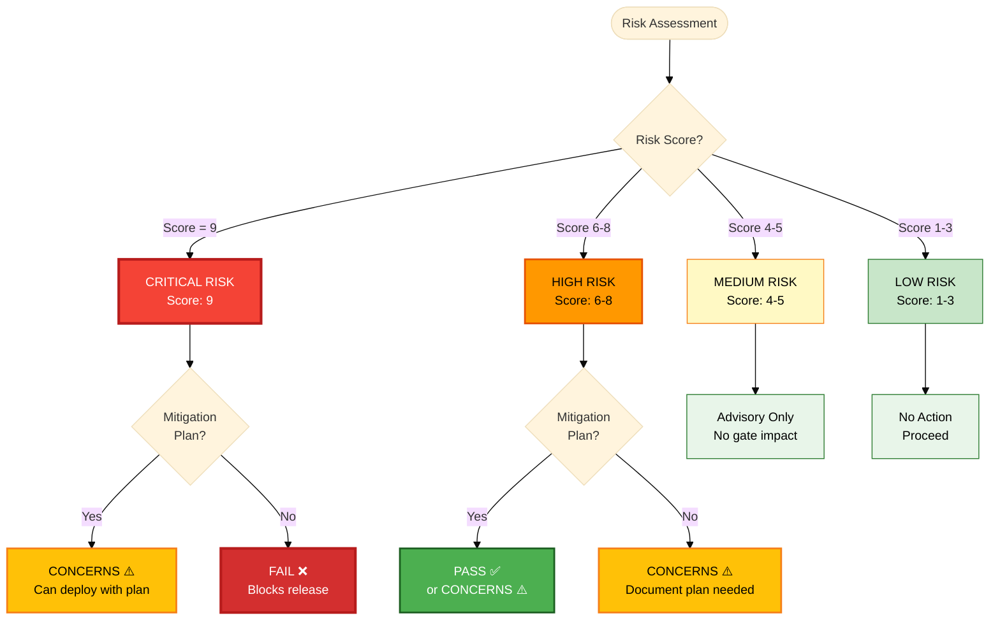

# Risk-Based Testing Explained

Risk-based testing is TEA's core principle: testing depth scales with business impact. Rather than testing everything equally, put the effort where failure hurts most.

Testing every feature to the same depth means user login and export-to-PDF get ten tests each, the same review scrutiny, and the same development time. That over-tests the trivial and under-tests the critical. The alternative to a number is a conversation that ends in "when it feels safe", which is a political debate with no data in it.

Risk-based testing asks three questions instead: how likely is this to fail, how bad is it if it does, and how much testing does that combination justify?

## Probability × Impact

**Probability** (how likely to fail?)

- **1 (Low):** stable, well-tested, simple logic
- **2 (Medium):** moderate complexity, some unknowns
- **3 (High):** complex, untested, many edge cases

**Impact** (how bad if it fails?)

- **1 (Low):** minor inconvenience, few users affected
- **2 (Medium):** degraded experience, workarounds exist
- **3 (High):** critical path broken, business impact

The product is the risk score, from 1 to 9:

```text
           Impact
           1    2    3
      ┌────┬────┬────┐
    1 │ 1  │ 2  │ 3  │ Low risk
P   2 │ 2  │ 4  │ 6  │ Medium risk
r   3 │ 3  │ 6  │ 9  │ High risk
o     └────┴────┴────┘
b      Low  Med  High
```

TEA applies this in `test-design`.

### What each band buys

| Score   | Level    | Mitigation                | Gate impact             | Actions                                                                                                                                                                                                                                                                                        |
| ------- | -------- | ------------------------- | ----------------------- | ---------------------------------------------------------------------------------------------------------------------------------------------------------------------------------------------------------------------------------------------------------------------------------------------- |
| **9**   | Critical | Mandatory, blocks release | FAIL without mitigation | Comprehensive suite (E2E, API, security); multiple environments including a prod mirror; load and performance validation; security audit and penetration testing; monitoring and alerting; documented rollback; on-call rotation assigned. Cannot deploy until the score is mitigated below 9. |
| **6-8** | High     | Required, documented plan | CONCERNS if incomplete  | Targeted suite covering happy path plus critical errors; test environment set up; monitoring plan; mitigation and owners documented. Deploys with an approved plan.                                                                                                                            |
| **4-5** | Medium   | Recommended               | Advisory only           | Basic coverage; standard monitoring; known limitations documented.                                                                                                                                                                                                                             |
| **1-3** | Low      | Optional                  | None                    | Smoke test if desired; feature flag for easy disable.                                                                                                                                                                                                                                          |



A score of 9 with a documented mitigation plan lands on CONCERNS rather than FAIL. That branch is the whole reason the plan is worth writing.

Every score at 6 or above needs a written mitigation with an owner and a date:

```markdown
## Risk Mitigation

**Risk:** Payment integration failure (Score: 9)

**Mitigation Plan:**

- Create comprehensive test suite (20+ tests)
- Add payment sandbox environment
- Implement retry logic with idempotency
- Add monitoring and alerts
- Document rollback procedure

**Owner:** Backend team lead
**Deadline:** Before production deployment
**Status:** In progress
```

## The Six Risk Categories

TEA scores across six categories, so a feature can be low-risk technically and high-risk on data integrity at the same time.

| Category | Covers                                 | Example                        | P   | I   | Score | Consequence                            |
| -------- | -------------------------------------- | ------------------------------ | --- | --- | ----- | -------------------------------------- |
| **TECH** | Technical debt, architecture fragility | Migrating REST to GraphQL      | 3   | 3   | 9     | Extensive integration testing required |
| **SEC**  | Security vulnerabilities               | Adding OAuth integration       | 2   | 3   | 6     | Security testing mandatory             |
| **PERF** | Performance degradation                | Adding real-time notifications | 2   | 2   | 4     | Load testing recommended               |
| **DATA** | Data integrity and corruption          | Database migration             | 2   | 3   | 6     | Data validation tests required         |
| **BUS**  | Business logic errors                  | Discount calculation           | 2   | 3   | 6     | Business logic tests mandatory         |
| **OPS**  | Operational issues                     | Logging system update          | 1   | 2   | 2     | Basic smoke test sufficient            |

Reading a score in context: payment processing scores 3 × 3 = 9, so it gets E2E coverage of every payment flow, API tests for every scenario, error handling for every failure mode, security testing on payment data, load testing, and production monitoring. A profile theme colour toggle scores 1 × 1 = 1, so it gets one E2E smoke test, no edge cases, and no API tests. Profile editing at 2 × 3 = 6 sits between: E2E for the happy path, API tests for CRUD, validation testing, and no low-value edge cases.

## Test Priorities (P0-P3)

Risk scores inform priority; they are not the only input. Usage frequency, revenue exposure, and regulatory obligation also move a feature up.

| Priority | Typical score | Other factors                                                            | Coverage target  | Test levels         | Example                            |
| -------- | ------------- | ------------------------------------------------------------------------ | ---------------- | ------------------- | ---------------------------------- |
| **P0**   | 6-9           | Revenue impact, security-critical, regulatory compliance, frequent usage | 100%             | E2E + API           | Login, checkout, payment           |
| **P1**   | 4-6           | Core user journeys, complex logic, integration points                    | 90%              | API + selective E2E | Profile editing, search, filters   |
| **P2**   | 2-4           | Secondary features, admin functionality, reporting                       | 50%              | API happy path only | Export features, advanced settings |
| **P3**   | 1-2           | Rarely used, nice-to-have, cosmetic                                      | 20% (smoke test) | E2E smoke test only | Theme customization, experiments   |

See [Test Priorities Matrix](/docs/reference/knowledge-base.md#quality-standards) for the complete criteria.

## What It Changes

Ten equally-weighted profile tests become six weighted ones:

```typescript
describe('User profile - Critical (P0)', () => {
  test('should display name and email'); // Score 9: identity is critical
  test('should allow editing name and email');
  test('should validate email format');
  test('should prevent unauthorized edits');
});

describe('User profile - High Value (P1)', () => {
  test('should upload avatar'); // Score 6
  test('should update bio');
});

// P2 theme preference: one smoke test
// P3 last-login display: skipped, read-only and low value
```

Worked at project scale, on a checkout redesign from five steps to three with a 40-hour test budget:

| Component                 | P   | I   | Score | Priority | Testing               | Budget    |
| ------------------------- | --- | --- | ----- | -------- | --------------------- | --------- |
| **Payment processing**    | 3   | 3   | 9     | P0       | 15 E2E + 20 API tests | 20h (50%) |
| **Order validation**      | 2   | 3   | 6     | P1       | 5 E2E + 10 API tests  | 8h (20%)  |
| **Shipping calculation**  | 2   | 2   | 4     | P1       | 3 E2E + 8 API tests   | 6h (15%)  |
| **Promo code validation** | 2   | 2   | 4     | P1       | 2 E2E + 5 API tests   | 4h (10%)  |
| **Gift message**          | 1   | 1   | 1     | P3       | 1 E2E smoke test      | 2h (5%)   |

Splitting the same 40 hours evenly would give the gift message eight hours and payment eight hours, which is how payment bugs reach production alongside an immaculately tested gift message.

## When to Use It

Use it on enterprise projects (high stakes, many features competing for effort), large codebases (exhaustive testing is off the table, resources are finite), and regulated industries (auditors want the risk assessment, and decisions must be justifiable).

Skip it on tiny projects with five features you can test exhaustively, and on throwaway prototypes. The scoring is overhead when there is nothing to prioritize.

## Three Misconceptions

**"Risk-based means less testing."** It usually means more testing, differently placed: 50 evenly spread tests become 70 concentrated on P0 and P1.

**"Low priority means no testing."** P3 still gets a smoke test proving the feature works at all. P2 adds the happy path, P1 adds error cases, P0 covers everything.

**"Risk scores are permanent."** An untested payment integration scores 9 at launch and 6 after six months in production. Re-assess quarterly.

## Related

- [Test Quality Standards](/docs/explanation/test-quality-standards.md) - the rubric each generated test is held to
- [Verification Architecture](/docs/explanation/verification-architecture.md) - where the risk model sits in TEA Core
- [How to Run Test Design](/docs/how-to/workflows/run-test-design.md) - applying the scoring
- [How to Run Trace](/docs/how-to/workflows/run-trace.md) - gate decisions built on these scores
- [How to Run NFR Evidence Audit](/docs/how-to/workflows/run-nfr-assess.md) - NFR evidence status at the gate
- [Knowledge Base Index](/docs/reference/knowledge-base.md) - risk governance and probability-impact fragments
