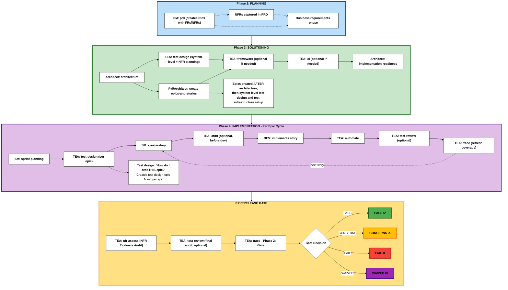

The Test Architect (TEA) is a specialized agent focused on quality strategy, test automation, and release gates in BMad Method projects.

:::tip[Design Philosophy]
TEA was built to solve AI-generated tests that rot in review. For the problem statement and design principles, see [Testing as Engineering](/docs/explanation/testing-as-engineering.md). For setup, see [Setup Test Framework](/docs/how-to/workflows/setup-test-framework.md).
:::

:::note[Scope]
TEA's risk, design, NFR, traceability, and gate workflows are stack-neutral and apply to any system under test. Its execution depth is not uniform: browsers, HTTP services, contracts, and mobile native (Maestro) are covered end to end, while other stacks are covered at shallower tiers. [Verification Architecture](/docs/explanation/verification-architecture.md) explains the split; [Execution Targets](/docs/reference/execution-targets.md) publishes the per-target matrix and the known gaps.
:::

## Overview

- **Persona:** Murat, Master Test Architect and Quality Advisor focused on risk-based testing, fixture architecture, ATDD, and CI/CD governance.
- **Mission:** Deliver actionable quality strategies, automation coverage, and gate decisions that scale with project complexity and compliance demands.
- **Use When:** BMad Method or Enterprise track projects, integration risk is non-trivial, brownfield regression risk exists, or compliance/NFR evidence is required. (Quick Flow projects typically don't require TEA)

BMad does not mandate TEA. Five engagement models cover everything from skipping TEA entirely to running it across all four phases, with the Enterprise track layered on top when compliance evidence is in scope. [Engagement Models](/docs/explanation/engagement-models.md) owns that decision; if you are unsure, default to the integrated path for your track and adjust later.

## TEA Command Catalog

| Command       | Primary Outputs                                                                               | Notes                                                | With Browser Automation (CLI/MCP)                                                                                                    |
| ------------- | --------------------------------------------------------------------------------------------- | ---------------------------------------------------- | ------------------------------------------------------------------------------------------------------------------------------------ |
| `test-design` | Combined risk assessment, NFR planning, mitigation plan, and coverage strategy                | Risk scoring + NFR thresholds/evidence plan          | **+ Exploratory**: Interactive UI discovery with browser automation (uncover actual functionality)                                   |
| `framework`   | Playwright/Cypress scaffold, `.env.example`, `.nvmrc`, sample specs                           | Use when no production-ready harness exists          | -                                                                                                                                    |
| `ci`          | CI workflow, selective test scripts, secrets checklist                                        | Platform-aware (GitHub Actions default)              | -                                                                                                                                    |
| `atdd`        | Red-phase acceptance test scaffolds + implementation checklist                                | TDD red phase + optional recording mode              | **+ Recording**: UI selectors verified with live browser; API tests benefit from trace analysis                                      |
| `automate`    | Prioritized specs, fixtures, README/script updates, DoD summary                               | Optional healing/recording, avoid duplicate coverage | **+ Healing**: Visual debugging + trace analysis for test fixes; **+ Recording**: Verified selectors (UI) + network inspection (API) |
| `test-review` | Test quality review report with 0-100 score, violations, fixes                                | Reviews tests against knowledge base patterns        | -                                                                                                                                    |
| `nfr-assess`  | NFR Evidence Audit report with actions                                                        | Audits implemented evidence against thresholds       | -                                                                                                                                    |
| `trace`       | Phase 1: Coverage matrix, recommendations. Phase 2: Gate decision (PASS/CONCERNS/FAIL/WAIVED) | Two-phase workflow: traceability + gate decision     | -                                                                                                                                    |

Invoke a workflow as `/bmad-testarch-<workflow>` in Claude Code, Cursor, and Windsurf, or `$bmad-testarch-<workflow>` in Codex. `nfr-assess` is the workflow's name in prose; the typeable skill is `bmad-testarch-nfr`. Inside an active TEA agent session the two-letter menu codes work instead: `TD`, `TF`, `CI`, `AT`, `TA`, `RV`, `NR`, `TR`, plus `TMT` for TEA Academy and `GATE`.

## TEA Workflow Lifecycle

BMad uses a 4-phase methodology with an optional Phase 1 and a documentation prerequisite:

- **Documentation** (optional, brownfield): prerequisite using `document-project`
- **Phase 1** (optional): discovery and analysis (`brainstorm`, `research`, `product-brief`)
- **Phase 2** (required): planning (`prd` creates the PRD with FRs and NFRs)
- **Phase 3** (track-dependent): solutioning (`architecture` → `test-design` system-level → `create-epics-and-stories` → TEA `framework`, `ci` → `implementation-readiness`)
- **Phase 4** (required): implementation (`sprint-planning` → per-epic `test-design` → per-story dev workflows)

The Quick Flow track skips Phases 1 and 3. BMad Method and Enterprise use all phases based on project needs.



TEA runs nothing in Phase 2. The Phase 3 workflows run once per project, the Phase 4 workflows run per epic and per story, and the gate workflows run per epic or per release. `teach-me-testing` sits outside the lifecycle entirely and runs once per learner.

Phase 3 order matters: run `test-design` first so NFR evidence needs can influence infrastructure, then `framework` once the architecture and test design have established the stack, then `ci` once the framework exists so the pipeline wires to real test commands.

### `test-design` is dual-mode

Both modes use the same workflow command. Make the scope explicit in your prompt.

- **System-level (Phase 3):** run immediately after architecture/ADR drafting. Produces `test-design-architecture.md` (for Architecture and Dev: testability gaps, ASRs, NFR requirements, planned evidence) and `test-design-qa.md` (for QA: test execution recipe, coverage plan, Sprint 0 setup, NFR coverage plan). Feeds the implementation-readiness gate. When an ADR or architecture draft is produced, run this before that gate so the ADR carries a testability review and an ADR → test mapping, and keep it updated if ADRs change.
- **Epic-level (Phase 4):** run per epic. Produces `test-design-epic-N.md` with risk, priorities, coverage plan, and epic-specific NFR planning when relevant.

**Phase 3 system-level example**

```text
/bmad-testarch-test-design
Run system-level test-design for Phase 3 using docs/prd.md, docs/architecture.md, and docs/adr/*.md. Focus on architecture testability, ASRs, NFR thresholds, planned NFR evidence, integration risks, and Sprint 0 setup. Produce test-design-architecture.md and test-design-qa.md before implementation-readiness.
```

**Phase 4 per-epic example**

```text
/bmad-testarch-test-design
Run epic-level test-design for Phase 4 on Epic 3 using docs/epics/epic-3.md and its stories. Use prior system-level test-design outputs if present. Produce test-design-epic-3.md with risk scores, P0-P3 scenarios, regression/integration/NFR coverage, and follow-on guidance for atdd and automate.
```

Codex users run `$bmad-testarch-test-design` with the same scope-setting prompt.

## Why TEA Is Different from Other BMM Agents

TEA spans Phase 3, Phase 4, and the release gate, where most BMM agents operate in a single phase. That multi-phase role is paired with a dedicated testing knowledge base so standards stay consistent across projects: extensive domain knowledge (test patterns, CI/CD, fixtures, quality practices), cross-cutting standards that apply to every BMad project rather than to one document type, and optional integrations for Playwright Utils, the Playwright CLI, and MCP servers. See [Knowledge Base System](/docs/explanation/knowledge-base-system.md).

## Library Integrations

"Optional" describes the choice, not the effect. Each library has a config flag, and while a flag is `true` and its package is installed, that library is the implementation TEA reaches for on everything it covers — you never name a utility in a prompt to get it. The contract behind that is the `library-integration-mandate` knowledge fragment, and each library has its own mandate carrying the substitutions. Turning a flag off is what makes TEA hand-roll the equivalent instead.

The same fragment holds the checklist for adding the next library, so a new integration lands in generation, aggregation, review, and docs rather than only in a fragment nobody applies.

### Playwright Utils (`@seontechnologies/playwright-utils`)

Production-ready fixtures and utilities that enhance TEA workflows.

- Install: `npm install -D @seontechnologies/playwright-utils`
  > Playwright Utils is enabled via the installer. Only set `tea_use_playwright_utils` in `_bmad/tea/config.yaml` if you need to override the installer choice.
- Impacts: `framework`, `atdd`, `automate`, `test-review`, `ci`
- Utilities: api-request, auth-session, network-recorder, intercept-network-call, recurse, log, file-utils, burn-in, network-error-monitor, fixtures-composition

### Pact.js Utils (`@seontechnologies/pactjs-utils`)

Contract testing utilities that reduce raw Pact.js boilerplate and standardize provider verification.

- Install: `npm install -D @seontechnologies/pactjs-utils @pact-foundation/pact`
- Config: `tea_use_pactjs_utils: true` (the default). It decides _how_ Pact suites are written, never _whether_ a project gets one: TEA still requires a real consumer-provider boundary before scaffolding any contract test. Set `false` to have TEA write raw `@pact-foundation/pact`.
- Impacts: `framework`, `atdd`, `automate`, `test-design`, `test-review`, `ci`
- Utilities: createProviderState, toJsonMap, setJsonBody, setJsonContent, buildVerifierOptions, buildMessageVerifierOptions, createRequestFilter, noOpRequestFilter, handlePactBrokerUrlAndSelectors, getProviderVersionTags
- Supports the local monorepo flow (`pactUrls`) and the remote broker flow (`PACT_BROKER_BASE_URL`, `PACT_BROKER_TOKEN`)

### Browser Automation (Playwright CLI + MCP)

CLI and MCP are complementary. Auto mode uses each where it shines and lets you override when you know better.

- **Playwright CLI** (`@playwright/cli`): token-efficient shell commands. The agent opens a page, takes a snapshot, and gets back concise element references instead of full DOM trees (~93% fewer tokens than MCP). Best for stateless work: page discovery, selector verification, screenshot capture.
- **Playwright MCP**: stateful automation over MCP servers with full accessibility trees. Best for multi-step wizards, self-healing mode, and deep DOM introspection.

**Configuration** (`_bmad/tea/config.yaml`):

    tea_browser_automation: "auto"  # auto | cli | mcp | none

| Mode   | What happens                                                                                                                          |
| ------ | ------------------------------------------------------------------------------------------------------------------------------------- |
| `auto` | TEA picks per action: CLI for quick lookups, MCP for complex flows. Falls back gracefully if only one is installed. **(Recommended)** |
| `cli`  | CLI only. MCP ignored even if configured.                                                                                             |
| `mcp`  | MCP only. CLI ignored even if installed. Same as the old `tea_use_mcp_enhancements: true`.                                            |
| `none` | No browser interaction. TEA generates from docs and code analysis only.                                                               |

**Setup:**

- CLI: `npm install -g @playwright/cli@latest` (global, one-time) then `playwright-cli install --skills` from the project root
- MCP: configure MCP servers in your IDE (see [Configure Browser Automation](/docs/how-to/customization/configure-browser-automation.md))

**Which workflows benefit:** `test-design` (exploratory mode: snapshot pages to discover actual UI elements), `atdd` and `automate` (verify selectors against the live DOM before generating tests), `test-review` (capture traces, screenshots, and network logs as evidence).

**To disable:** set `tea_browser_automation: "none"`, or skip both CLI and MCP installation.

### Pact MCP (SmartBear MCP for PactFlow/Pact Broker)

Optional design-time broker interaction for contract testing workflows.

**Configuration** (`_bmad/tea/config.yaml`):

    tea_pact_mcp: "mcp"  # none | mcp (default "mcp")

| Mode   | What happens                                                                                                                                                                                                            |
| ------ | ----------------------------------------------------------------------------------------------------------------------------------------------------------------------------------------------------------------------- |
| `mcp`  | Default. TEA uses SmartBear MCP tools for provider-state discovery, test review support, can-i-deploy, and matrix checks when they are reachable, and degrades to provider source or an OpenAPI spec when they are not. |
| `none` | TEA never attempts a broker call, and skips the reachability probe entirely.                                                                                                                                            |

**Setup:**

- Install: `npm install -g @smartbear/mcp` (or use `npx -y @smartbear/mcp@latest`)
- Claude Code (global): `claude mcp add-json -s user smartbear '{"type":"stdio","command":"npx","args":["-y","@smartbear/mcp@latest"],"env":{"PACT_BROKER_BASE_URL":"...","PACT_BROKER_TOKEN":"..."}}'`
- Required broker env vars: `PACT_BROKER_BASE_URL` and token/basic-auth credentials

**Which workflows benefit:** `test-design` (fetch provider states and broker landscape), `automate` (assist pact test generation with broker context), `test-review` (review pact tests against broker-informed practices), `ci` (reference can-i-deploy and matrix checks).

Pact MCP complements `pactjs-utils`: MCP helps at planning and review time, `pactjs-utils` runs inside test code.

## Related

- [Testing as Engineering](/docs/explanation/testing-as-engineering.md) - why TEA exists, and the three-part stack
- [Engagement Models](/docs/explanation/engagement-models.md) - the five ways to adopt TEA
- [Risk-Based Testing](/docs/explanation/risk-based-testing.md) - probability × impact scoring and P0-P3
- [Test Quality Standards](/docs/explanation/test-quality-standards.md) - the Definition of Done and the 100-point rubric
- [Knowledge Base System](/docs/explanation/knowledge-base-system.md) - context engineering with `tea-index.csv`
- [TEA Command Reference](/docs/reference/commands.md) - inputs, outputs, phases, and frequency per workflow
