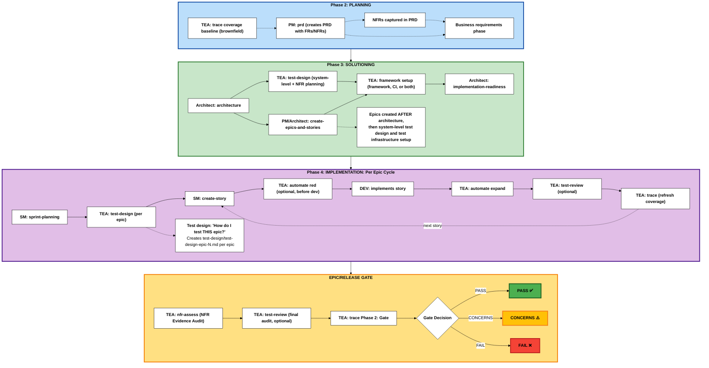

The Test Architect (TEA) plans tests, builds automation, and evaluates release evidence.
You can use it with BMad Method or on its own.

:::tip[Design Philosophy]
TEA was built to solve AI-generated tests that rot in review.
For the problem statement and design principles, see [Testing as Engineering](/docs/explanation/testing-as-engineering.md).
For setup, see [Setup Test Framework](/docs/how-to/workflows/setup-test-framework.md).
:::

:::note[Scope]
TEA's risk, design, NFR, traceability, and gate skills are stack-neutral and apply to any system under test.
Execution support varies by stack: browsers, HTTP services, contracts, and mobile native (Maestro) are covered end to end, while other stacks are covered at shallower tiers.
[Verification Architecture](/docs/explanation/verification-architecture.md) explains the split; [Execution Targets](/docs/reference/execution-targets.md) publishes the per-target matrix and the known gaps.
:::

## Overview

- **Persona:** Murat, Master Test Architect and Quality Advisor focused on risk-based testing, fixture architecture, ATDD, and CI/CD governance.
- **Mission:** Plan coverage, generate tests, and make gate decisions from project evidence.
- **Use When:** BMad Method or Enterprise track projects, integration risk is non-trivial, brownfield regression risk exists, or compliance/NFR evidence is required. (Quick Flow projects typically don't require TEA)

Choose an adoption path in [Engagement Models](/docs/explanation/engagement-models.md).
TEA runs in solutioning, implementation, and release gates; the Enterprise track adds compliance evidence.

<a id="tea-command-catalog"></a>

## TEA Skill Catalog

Eight canonical skills have ten direct capability commands, plus the TEA agent. The documentation sidebar lists these skills in this order:

| Skill                                                          | Primary Outputs                                                                                                      | Browser Automation (CLI/MCP)                                      |
| -------------------------------------------------------------- | -------------------------------------------------------------------------------------------------------------------- | ----------------------------------------------------------------- |
| [Automate](/docs/how-to/workflows/run-automate.md)             | Red acceptance scaffolds and implementation checklist; expand-mode specs, fixtures, README, and DoD summary          | Recording for skeleton UI in red; healing and recording in expand |
| [Test Review](/docs/how-to/workflows/run-test-review.md)       | Test quality report with 0-100 score, violations, and fixes                                                          | Traces, screenshots, and network evidence                         |
| [Test Design](/docs/how-to/workflows/run-test-design.md)       | Risk assessment, NFR thresholds and evidence plan, mitigation plan, and coverage strategy                            | Exploratory UI discovery                                          |
| [Framework](/docs/how-to/workflows/setup-test-framework.md)    | Stack-specific scaffold, CI pipeline, selective testing scripts, secrets checklist, and evaluation jobs as requested | No browser automation required                                    |
| [NFR](/docs/how-to/workflows/run-nfr-assess.md)                | NFR evidence audit against thresholds, domain statuses, and actions                                                  | Optional evidence capture                                         |
| [Trace](/docs/how-to/workflows/run-trace.md)                   | Phase 1 coverage matrix and recommendations; Phase 2 gate decision (PASS/CONCERNS/FAIL)                              | Consumes recorded live verification                               |
| [Teach Me Testing](/docs/how-to/workflows/teach-me-testing.md) | Seven learning sessions, quizzes, notes, and saved learner progress                                                  | No browser automation required                                    |

<a id="additional-skills"></a>

### Evaluate

[Trace](/docs/how-to/workflows/run-trace.md) appears in the Skills list above.

| Skill                                                    | Primary Outputs                                                                           |
| -------------------------------------------------------- | ----------------------------------------------------------------------------------------- |
| [Evaluate](/docs/tutorials/evaluate-your-first-skill.md) | Scored behavioral evaluation, named gaps, and a CI plan handed to Framework with CI scope |

Automation uses one skill with two modes: red before implementation and expand after implementation. The ATDD command and `AT` select red by default; automate and `TA` select expand. Your prompt can explicitly select either. Create runs execute and repair tests for up to three rounds while keeping real product defects visible.

Invoke a skill as `/bmad-testarch-<skill>` in Claude Code, Cursor, and Windsurf, or `$bmad-testarch-<skill>` in Codex.
NFR uses `/bmad-testarch-nfr` or `$bmad-testarch-nfr`; its stored identifier is `nfr-assess`. Teach Me Testing uses `/bmad-teach-me-testing` or `$bmad-teach-me-testing`, with no `testarch` segment.
Inside an active TEA agent session, use the menu codes: `TD`, `TF`, `CI`, `AT`, `TA`, `EV`, `RV`, `NR`, `TR`, plus `TMT` for TEA Academy and `GATE`.

`bmad-testarch-framework` owns both setup phases.
Request framework only, CI only, or both. It infers scope from the prompt and asks "Do you want CI too?" once when CI scope is unclear in an interactive session. An unattended request with unclear scope runs framework setup only and states that CI was excluded.
`bmad-testarch-ci` and `CI` still start its CI setup; `TF` starts framework setup.
Create starts setup, Resume continues an interrupted run, Validate reports checks without repairing outputs, and Edit revises the selected outputs and checks those changes.

<a id="tea-workflow-lifecycle"></a>

## TEA Skill Lifecycle

BMad uses a 4-phase methodology with an optional Phase 1 and a documentation prerequisite:

- **Documentation** (optional, brownfield): prerequisite using `document-project`
- **Phase 1** (optional): discovery and analysis (`brainstorm`, `research`, `product-brief`)
- **Phase 2** (required): planning (`prd` creates the PRD with FRs and NFRs)
- **Phase 3** (track-dependent): solutioning (`architecture` → `test-design` system-level → `create-epics-and-stories` → TEA `framework` (framework and CI scope) → `implementation-readiness`)
- **Phase 4** (required): implementation (`sprint-planning` → per-epic `test-design` → per-story dev workflows)

The Quick Flow track skips Phases 1 and 3.
BMad Method and Enterprise use all phases based on project needs.


```mermaid
%%{init: {'theme':'base', 'themeVariables': { 'primaryColor':'#fff','primaryTextColor':'#000','primaryBorderColor':'#000','lineColor':'#000','secondaryColor':'#fff','tertiaryColor':'#fff','fontSize':'16px','fontFamily':'arial'}}}%%
graph TB
    subgraph Phase2["<b>Phase 2: PLANNING</b>"]
        TraceBaseline["<b>TEA: trace coverage baseline (brownfield)</b>"]
        PM["<b>PM: prd (creates PRD with FRs/NFRs)</b>"]
        TraceBaseline -.-> PM
        PlanNote["<b>Business requirements phase</b>"]
        PrdNfr["<b>NFRs captured in PRD</b>"]
        PM -.-> PrdNfr
        PrdNfr -.-> PlanNote
        PM -.-> PlanNote
    end

    subgraph Phase3["<b>Phase 3: SOLUTIONING</b>"]
        Architecture["<b>Architect: architecture</b>"]
        EpicsStories["<b>PM/Architect: create-epics-and-stories</b>"]
        TestDesignSys["<b>TEA: test-design (system-level + NFR planning)</b>"]
        Framework["<b>TEA: framework setup (framework, CI, or both)</b>"]
        GateCheck["<b>Architect: implementation-readiness</b>"]
        Architecture --> EpicsStories
        Architecture --> TestDesignSys
        TestDesignSys --> Framework
        EpicsStories --> Framework
        Framework --> GateCheck
        Phase3Note["<b>Epics created AFTER architecture,</b><br/><b>then system-level test design and test infrastructure setup</b>"]
        EpicsStories -.-> Phase3Note
    end

    subgraph Phase4["<b>Phase 4: IMPLEMENTATION: Per Epic Cycle</b>"]
        SprintPlan["<b>SM: sprint-planning</b>"]
        TestDesign["<b>TEA: test-design (per epic)</b>"]
        CreateStory["<b>SM: create-story</b>"]
        ATDD["<b>TEA: automate red (optional, before dev)</b>"]
        DevImpl["<b>DEV: implements story</b>"]
        Automate["<b>TEA: automate expand</b>"]
        TestReview1["<b>TEA: test-review (optional)</b>"]
        Trace1["<b>TEA: trace (refresh coverage)</b>"]

        SprintPlan --> TestDesign
        TestDesign --> CreateStory
        CreateStory --> ATDD
        ATDD --> DevImpl
        DevImpl --> Automate
        Automate --> TestReview1
        TestReview1 --> Trace1
        Trace1 -.->|next story| CreateStory
        TestDesignNote["<b>Test design: 'How do I test THIS epic?'</b><br/>Creates test-design/test-design-epic-N.md per epic"]
        TestDesign -.-> TestDesignNote
    end

    subgraph Gate["<b>EPIC/RELEASE GATE</b>"]
        NFR["<b>TEA: nfr-assess (NFR Evidence Audit)</b>"]
        TestReview2["<b>TEA: test-review (final audit, optional)</b>"]
        TraceGate["<b>TEA: trace Phase 2: Gate</b>"]
        GateDecision{"<b>Gate Decision</b>"}

        NFR --> TestReview2
        TestReview2 --> TraceGate
        TraceGate --> GateDecision
        GateDecision -->|PASS| Pass["<b>PASS ✅</b>"]
        GateDecision -->|CONCERNS| Concerns["<b>CONCERNS ⚠️</b>"]
        GateDecision -->|FAIL| Fail["<b>FAIL ❌</b>"]
    end

    Phase2 --> Phase3
    Phase3 --> Phase4
    Phase4 --> Gate

    style Phase2 fill:#bbdefb,stroke:#0d47a1,stroke-width:3px,color:#000
    style Phase3 fill:#c8e6c9,stroke:#2e7d32,stroke-width:3px,color:#000
    style Phase4 fill:#e1bee7,stroke:#4a148c,stroke-width:3px,color:#000
    style Gate fill:#ffe082,stroke:#f57c00,stroke-width:3px,color:#000
    style Pass fill:#4caf50,stroke:#1b5e20,stroke-width:3px,color:#000
    style Concerns fill:#ffc107,stroke:#f57f17,stroke-width:3px,color:#000
    style Fail fill:#f44336,stroke:#b71c1c,stroke-width:3px,color:#000
```

TEA's Phase 2 work is the Brownfield baseline: run `trace` Phase 1 during planning to record existing coverage.
Greenfield projects start TEA in Phase 3.
The Phase 3 skills run once per project, the Phase 4 skills run per epic and per story, and the gate skills run per epic or per release.
`teach-me-testing` sits outside the lifecycle entirely and runs once per learner.

Phase 3 order matters: run `test-design` first so NFR evidence needs can influence infrastructure, then `framework` once architecture and test design have established the stack. Request both setup phases to agree the stack, framework, and test commands, then it can generate the scaffold and pipeline in parallel before validating them together. A CI-only request with no framework offers the framework phase first.

### `test-design` is dual-mode

Both modes use the same skill command.
Make the scope explicit in your prompt.

- **System-level (Phase 3):** run immediately after architecture/ADR drafting.
  Produces `test-design/test-design-architecture.md` (for Architecture and Dev: testability gaps, ASRs, NFR requirements, planned evidence) and `test-design/test-design-qa.md` (for QA: test execution recipe, coverage plan, Sprint 0 setup, NFR coverage plan).
  Feeds the implementation-readiness gate.
  When an ADR or architecture draft is produced, run this before that gate so the ADR carries a testability review and an ADR → test mapping, and keep it updated if ADRs change.
- **Epic-level (Phase 4):** run per epic.
  Produces `test-design/test-design-epic-N.md` with risk, priorities, coverage plan, and epic-specific NFR planning when relevant.

#### Phase 3 system-level example

```text
/bmad-testarch-test-design
Run system-level test-design for Phase 3 using docs/prd.md, docs/architecture.md, and docs/adr/*.md. Focus on architecture testability, ASRs, NFR thresholds, planned NFR evidence, integration risks, and Sprint 0 setup. Produce test-design/test-design-architecture.md and test-design/test-design-qa.md before implementation-readiness.
```

#### Phase 4 per-epic example

```text
/bmad-testarch-test-design
Run epic-level test-design for Phase 4 on Epic 3 using docs/epics/epic-3.md and its stories. Use prior system-level test-design outputs if present. Produce test-design/test-design-epic-3.md with risk scores, P0-P3 scenarios, regression/integration/NFR coverage, and follow-on guidance for Automate red and expand modes.
```

Codex users run `$bmad-testarch-test-design` with the same scope-setting prompt.

## Why TEA Is Different from Other BMM Agents

TEA spans Phase 3, Phase 4, and the release gate.
Its skills share testing, fixture, and CI patterns through the [Knowledge Base System](/docs/explanation/knowledge-base-system.md).

## Library Integrations

TEA uses a library automatically when its config flag is `true` and its package is installed.
The `library-integration-mandate` knowledge fragment defines this rule, and each library has a fragment listing the calls it supplies.
Set the flag to `false` to generate code using the underlying framework.

The fragment also lists the changes required to add an integration to generation, aggregation, review, and documentation.

### Playwright Utils (`@seontechnologies/playwright-utils`)

Shared Playwright fixtures for API requests, authentication, network handling, and polling.

- Install: `npm install -D @seontechnologies/playwright-utils`
  > `bmad setup tea` asks whether to enable Playwright Utils. Run it again, or edit `tea_use_playwright_utils` under `[modules.tea]` in `_bmad/config.toml`, to change the answer.
- Impacts: `framework` (framework and CI), `automate` (red and expand), and `test-review`
- Utilities: api-request, auth-session, network-recorder, intercept-network-call, recurse, log, file-utils, burn-in, network-error-monitor, fixtures-composition

### Pact.js Utils (`@seontechnologies/pactjs-utils`)

Contract testing utilities that reduce raw Pact.js boilerplate and standardize provider verification.

- Install: `npm install -D @seontechnologies/pactjs-utils @pact-foundation/pact`
- Config: `tea_use_pactjs_utils: true` (the default).
  TEA requires a real consumer-provider boundary before scaffolding contract tests.
  The flag selects the utilities used in those tests.
  Set `false` to have TEA write raw `@pact-foundation/pact`.
- Impacts: `framework` (framework and CI phases), `automate` (red and expand modes), `test-design`, and `test-review`
- Utilities: createProviderState, toJsonMap, setJsonBody, setJsonContent, buildVerifierOptions, buildMessageVerifierOptions, createRequestFilter, noOpRequestFilter, handlePactBrokerUrlAndSelectors, getProviderVersionTags
- Supports the local monorepo flow (`pactUrls`) and the remote broker flow (`PACT_BROKER_BASE_URL`, `PACT_BROKER_TOKEN`)

### Browser Automation (Playwright CLI + MCP)

Auto mode chooses CLI or MCP per action.
You can set a specific mode.

- **Playwright CLI** (`@playwright/cli`): token-efficient shell commands.
  The agent opens a page, takes a snapshot, and gets back concise element references.
  Best for stateless work: page discovery, selector verification, screenshot capture.
- **Playwright MCP**: stateful automation over MCP servers with full accessibility trees.
  Best for multi-step wizards, self-healing mode, and deep DOM introspection.

**Configuration** (`[modules.tea]` in `_bmad/config.toml`):

```toml
tea_browser_automation = "auto" # auto | cli | mcp | none
```

| Mode   | What happens                                                                                                                          |
| ------ | ------------------------------------------------------------------------------------------------------------------------------------- |
| `auto` | TEA picks per action: CLI for quick lookups, MCP for complex flows. Falls back gracefully if only one is installed. **(Recommended)** |
| `cli`  | CLI only. MCP ignored even if configured.                                                                                             |
| `mcp`  | MCP only. CLI ignored even if installed. Same as the old `tea_use_mcp_enhancements: true`.                                            |
| `none` | No browser interaction. TEA generates from docs and code analysis only.                                                               |

**Setup:**

- CLI: `npm install -g @playwright/cli@latest` (global, one-time) then `playwright-cli install --skills` from the project root
- MCP: configure MCP servers in your IDE (see [Configure Browser Automation](/docs/how-to/customization/configure-browser-automation.md))

**Which skills benefit:** `test-design` (exploratory mode: snapshot pages to discover actual UI elements), `automate` in red and expand modes (verify selectors against the live DOM before generating tests), `test-review` (capture traces, screenshots, and network logs as evidence).

**To disable:** set `tea_browser_automation: "none"`, or skip both CLI and MCP installation.

### Pact MCP (SmartBear MCP for PactFlow/Pact Broker)

Optional design-time broker interaction for contract testing skills.

**Configuration** (`[modules.tea]` in `_bmad/config.toml`):

```toml
tea_pact_mcp = "mcp" # none | mcp (default "mcp")
```

| Mode   | What happens                                                                                                                                                                                                            |
| ------ | ----------------------------------------------------------------------------------------------------------------------------------------------------------------------------------------------------------------------- |
| `mcp`  | Default. TEA uses SmartBear MCP tools for provider-state discovery, test review support, can-i-deploy, and matrix checks when they are reachable, and degrades to provider source or an OpenAPI spec when they are not. |
| `none` | Skips broker calls and the reachability probe.                                                                                                                                                                          |

**Setup:**

- Install: `npm install -g @smartbear/mcp` (or use `npx -y @smartbear/mcp@latest`)
- Claude Code (global): `claude mcp add-json -s user smartbear '{"type":"stdio","command":"npx","args":["-y","@smartbear/mcp@latest"],"env":{"PACT_BROKER_BASE_URL":"...","PACT_BROKER_TOKEN":"..."}}'`
- Required broker env vars: `PACT_BROKER_BASE_URL` and token/basic-auth credentials

**Which skills benefit:** `test-design` (fetch provider states and broker metadata), `automate` (assist pact test generation with broker context), `test-review` (review pact tests against broker-informed practices), `framework` CI phase (reference can-i-deploy and matrix checks).

Pact MCP complements `pactjs-utils`: MCP helps at planning and review time, `pactjs-utils` runs inside test code.

## Related

- [Testing as Engineering](/docs/explanation/testing-as-engineering.md): why TEA exists, and the three-part stack
- [Verification Architecture](/docs/explanation/verification-architecture.md): stack-neutral vs execution target split
- [How TEA Is Tested](/docs/explanation/how-tea-is-tested.md): how TEA proves its own behavior with deterministic checks and live evals
- [Engagement Models](/docs/explanation/engagement-models.md): the five ways to adopt TEA
- [Risk-Based Testing](/docs/explanation/risk-based-testing.md): probability × impact scoring and P0-P3
- [Test Quality Standards](/docs/explanation/test-quality-standards.md): the Definition of Done and the 100-point rubric
- [Knowledge Base System](/docs/explanation/knowledge-base-system.md): context engineering with `tea-index.csv`
- [TEA Command Reference](/docs/reference/commands.md): inputs, outputs, phases, and frequency per skill
- [Evaluate Your First Skill](/docs/tutorials/evaluate-your-first-skill.md): tutorial: score one skill from requirements to an accepted baseline
- [How Evaluate Works](/docs/explanation/how-evaluate-works.md): the stack, the rules, and the reasons behind an evaluation
- [Why Evaluate Confines the Target](/docs/explanation/why-evaluate-confines-the-target.md): why the target of an evaluation runs under file-system confinement
- [tea-evaluate CLI](/docs/reference/tea-evaluate-cli.md): every `tea-evaluate` command, option, and exit code
- Evaluate how-to guides: [Evaluate a Skill or Agent](/docs/how-to/evaluate/evaluate-a-skill-or-agent.md), [Evaluate an MCP Tool Server](/docs/how-to/evaluate/evaluate-an-mcp-tool-server.md), [Evaluate an HTTP API](/docs/how-to/evaluate/evaluate-an-http-api.md), [Choose an Evaluator and Calibrate a Judge](/docs/how-to/evaluate/choose-an-evaluator-and-calibrate-a-judge.md), [Read the Gaps and Fix Them](/docs/how-to/evaluate/read-the-gaps-and-fix-them.md), [Compare Runs and Accept a Baseline](/docs/how-to/evaluate/compare-runs-and-accept-a-baseline.md), [Put an Evaluation in CI](/docs/how-to/evaluate/put-an-evaluation-in-ci.md), [Bring an Existing Suite](/docs/how-to/evaluate/bring-an-existing-suite.md)
