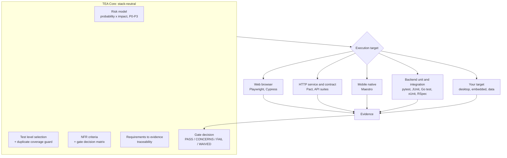

# Verification Architecture

TEA is two layers, and they have different lifespans.

**TEA Core** decides what must be verified, at what depth, with what evidence, and whether that evidence is sufficient to release. It holds no assumption about language, framework, or platform.

**Execution targets** turn those decisions into runnable tests on one specific stack. This layer is technology-specific by design and is meant to be swapped as your stack changes.

Read the second layer on its own and TEA looks like a browser-testing tool, because that is where its deepest coverage happens to sit today. The verification reasoning is the durable part. This page states what is in each layer, publishes TEA's actual coverage including the gaps, and describes how to extend it.

## The two layers

|                     | TEA Core                                                                         | Execution target                                                             |
| ------------------- | -------------------------------------------------------------------------------- | ---------------------------------------------------------------------------- |
| Question it answers | What must be verified, and is the evidence sufficient to ship?                   | How is it verified on this stack?                                            |
| Changes when        | Risk appetite, compliance regime, or release policy changes                      | Language, framework, or platform changes                                     |
| Stability           | Durable across a rewrite                                                         | Replaced by a rewrite                                                        |
| Owned by            | TEA                                                                              | TEA for supported targets; you for the rest                                  |
| Examples            | Risk scoring, P0-P3, level selection, NFR criteria, traceability, gate decisions | Playwright, Cypress, Maestro, pytest, JUnit, Go test, xUnit, RSpec, Pact, k6 |

## What TEA Core contains

Core is the part an enterprise is actually buying, and it is stack-neutral in construction rather than by assertion:

- **Risk model.** Probability × impact on a 1-9 scale, with scores ≥6 requiring documented mitigation and 9 mandating gate failure. See [Risk-Based Testing](/docs/explanation/risk-based-testing.md).
- **Priority assignment.** P0-P3 with coverage targets and execution ordering per band.
- **Test level selection.** Unit, integration, and end-to-end chosen by what the risk actually demands, with a duplicate-coverage guard that pushes verification to the cheapest level that can carry it.
- **NFR criteria and gate matrix.** Security, performance, reliability, and maintainability scored PASS / CONCERNS / FAIL, defaulting to CONCERNS when targets or evidence are undefined.
- **Requirements-to-evidence traceability.** Every acceptance criterion maps to evidence; gaps require an explicit waiver with an owner and an expiry date.
- **Release gate decision.** PASS / CONCERNS / FAIL / WAIVED, derived from the traceability matrix rather than from a person's confidence.
- **Architecture testability review.** An 8-category, 29-criteria audit applied at design time, before any test exists.
- **Confidence gate.** A stop rule for the agent itself: below a confidence threshold it declines to generate rather than inventing plausible output.

Two of TEA's nine workflows, `nfr-assess` and `trace`, contain no stack-conditional logic at any step. They run identically whether the system under test is a React app, a Go service, or a payment terminal. The risk and priority knowledge fragments reference no test framework at all.

## What an execution target supplies

An execution target is the set of technology-specific answers TEA needs before it can produce runnable tests. Six things:

1. **Detection.** The manifest or file signature that identifies the stack.
2. **Project layout.** Where tests live, and the idiomatic directory structure.
3. **Runner configuration.** The config file, its timeouts, reporters, and artifact paths.
4. **Commands.** Install, test, coverage, and the shard or filter syntax CI needs.
5. **CI wiring.** Runtime setup, caching, and whether burn-in applies.
6. **Review criteria.** Rows the test-review ledger can attach to that format.

Item six is the one that decides whether a target is genuinely supported. `test-review` scores against a criteria registry, and a format with no matching rows is one TEA cannot honestly score. When TEA encounters a test artifact it has no criteria for, the correct behavior is to name it as unscorable rather than to return a passing grade over a file it could not read.

## Coverage today

TEA's execution coverage is uneven, and the uneven part is deliberate to state rather than to imply. Full detail is in [Execution Targets](/docs/reference/execution-targets.md). The summary:

| Tier           | What it means                                                                                         | Targets                                                                                                                      |
| -------------- | ----------------------------------------------------------------------------------------------------- | ---------------------------------------------------------------------------------------------------------------------------- |
| **Full**       | Workflow branching, scaffolding, knowledge fragments, and review criteria                             | Web browser (Playwright, Cypress), mobile native (Maestro), HTTP and service tests, contract testing (Pact), component tests |
| **Generation** | Detection, scaffolding, and test generation, with no dedicated knowledge fragments or review criteria | pytest, JUnit 5 / TestNG, Go test, xUnit / NUnit / MSTest, RSpec / Minitest                                                  |
| **Evidence**   | TEA plans, requires, and audits the evidence; execution is your tooling                               | Performance (k6, JMeter, Gatling), security scanning (ZAP, Burp, Snyk), message contracts                                    |
| **Core only**  | Risk, design, NFR, and traceability apply; execution is unassisted                                    | Desktop, embedded, data pipelines, mainframe                                                                                 |

### The self-audit

Of TEA's 56 knowledge fragments, 38 name Playwright or Cypress. Three cover mobile. None covers a backend test framework, and the knowledge index has no row tagged for pytest, JUnit, Go test, xUnit, or RSpec.

That is the real shape of the gap, and it is uneven in a specific way. Web and mobile are knowledge-backed: TEA carries curated patterns for both, so what it generates follows a pattern library rather than the model's improvisation. Backend languages are not. TEA can decide to scaffold pytest, and does, but it works from the conventions named inline in the workflow step and from the project it can see. The reasoning that selects pytest is as rigorous for a Python service as for a React Native app. The execution guidance behind it is not yet equivalent.

## What this means for your project

**JavaScript or TypeScript web and API.** Every layer applies. This is the deepest path and the one the tutorials use.

**Backend services in Python, Java, Go, .NET, or Ruby.** Planning, risk, design, NFR, traceability, and gating apply in full. Framework scaffolding and test generation work and are stack-aware. Review scoring is partial, because most registry criteria are written against JavaScript and browser constructs. Expect strong plans and generated tests that follow your project's conventions rather than a curated TEA pattern library.

**Mobile native (iOS, Android, React Native, Expo, Flutter).** Every layer applies. `mobile` is a first-class stack type: TEA detects it, scaffolds a Maestro suite alongside the app's own unit and component framework, generates flows through a dedicated worker, produces a two-tier device pipeline, and scores flows against mobile criteria rows in the review ledger.

**Desktop, embedded, data pipelines, and anything else.** Core applies without modification, and this is not a technicality: risk scoring, level selection, NFR thresholds, traceability, and the gate decision are the majority of what a test architect does, and none of it depends on the runner. Execution is unassisted. TEA will not scaffold the framework, and `test-review` will decline to score test formats it has no criteria for rather than passing them.

The honest boundary is this: TEA's reasoning transfers to any stack today. TEA's execution depth does not, and the tiers above say exactly where it stops.

## Extending TEA to a new execution target

There is no plugin API for execution targets today. Extension happens through the surfaces TEA already exposes:

- **Configuration.** Set `test_framework` and `test_stack_type` explicitly rather than letting detection run. See [Configuration](/docs/reference/configuration.md).
- **Knowledge fragments.** Add fragments for your stack and register them in the knowledge index so workflows load them by tier and tag. See [Knowledge Base System](/docs/explanation/knowledge-base-system.md).
- **Custom workflows.** Add stack-specific steps alongside the shipped ones. See [Extend TEA with Custom Workflows](/docs/how-to/customization/extend-tea-with-custom-workflows.md).

Core requires no extension. Risk scoring, NFR criteria, traceability, and gate decisions apply to a new target on day one, which is why a stack TEA has never seen still produces a usable test plan.

## Why the split matters under audit

Regulated verification and validation asks a narrow question: was the evidence sufficient, and can you show the reasoning that decided it was. The answer has to survive a framework migration, because the systems being audited outlive their test tooling.

Separating the layers makes that answerable. The risk score, the priority, the required evidence, the traceability matrix, and the gate decision are all recorded independently of the tool that produced the evidence. Replacing Cypress with Playwright, or Playwright with a device farm, changes which artifacts satisfy a requirement. It does not change the requirement, its risk score, or the standard the gate holds it to.

An organization adopting TEA is standardizing the first layer. The second layer stays whatever each team already runs.

## Related

- [Execution Targets](/docs/reference/execution-targets.md) - per-target support detail
- [TEA Overview](/docs/explanation/tea-overview.md) - the full workflow map
- [Risk-Based Testing](/docs/explanation/risk-based-testing.md) - the scoring model in Core
- [Use TEA for Enterprise](/docs/how-to/brownfield/use-tea-for-enterprise.md) - compliance evidence and audit trails
