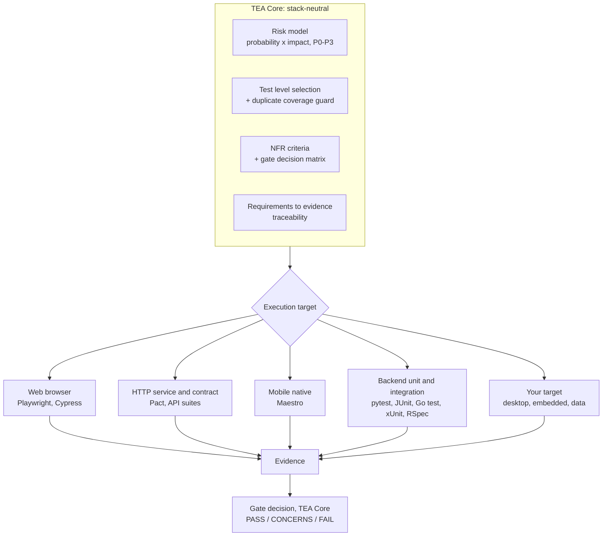

# Verification Architecture

TEA separates verification decisions from the tools that execute them.

**TEA Core** decides what must be verified, at what depth, with what evidence, and whether that evidence is sufficient to release.
It holds no assumption about language, framework, or platform.

**Execution targets** turn those decisions into runnable tests on one specific stack.
This layer is technology-specific by design and is meant to be swapped as your stack changes.

The core carries risk, evidence, and gate rules across stacks.
Execution support varies by target.

```mermaid
flowchart TB
  subgraph CORE["TEA Core: stack-neutral"]
    R[Risk model<br/>probability x impact, P0-P3]
    L[Test level selection<br/>+ duplicate coverage guard]
    N[NFR criteria<br/>+ gate decision matrix]
    T[Requirements to evidence<br/>traceability]
  end
  CORE --> X{Execution target}
  X --> W[Web browser<br/>Playwright, Cypress]
  X --> A[HTTP service and contract<br/>Pact, API suites]
  X --> M[Mobile native<br/>Maestro]
  X --> B[Backend unit and integration<br/>pytest, JUnit, Go test, xUnit, RSpec]
  X --> O[Your target<br/>desktop, embedded, data]
  W --> E[Evidence]
  A --> E
  M --> E
  B --> E
  O --> E
  E --> G[Gate decision, TEA Core<br/>PASS / CONCERNS / FAIL]
```

## The two layers

|                     | TEA Core                                                                         | Execution target                                                             |
| ------------------- | -------------------------------------------------------------------------------- | ---------------------------------------------------------------------------- |
| Question it answers | What must be verified, and is the evidence sufficient to ship?                   | How is it verified on this stack?                                            |
| Changes when        | Risk appetite, compliance regime, or release policy changes                      | Language, framework, or platform changes                                     |
| Stability           | Durable across a rewrite                                                         | Replaced by a rewrite                                                        |
| Owned by            | TEA                                                                              | TEA for supported targets; you for the rest                                  |
| Examples            | Risk scoring, P0-P3, level selection, NFR criteria, traceability, gate decisions | Playwright, Cypress, Maestro, pytest, JUnit, Go test, xUnit, RSpec, Pact, k6 |

## What TEA Core contains

TEA Core supplies:

- **Risk model.** Probability × impact on a 1-9 scale, with scores ≥6 requiring documented mitigation and 9 mandating gate failure.
  See [Risk-Based Testing](/docs/explanation/risk-based-testing.md).
- **Priority assignment.** P0-P3 with coverage targets and execution ordering per band.
- **Test level selection.** Unit, integration, and end-to-end chosen by what the risk actually demands, with a duplicate-coverage guard that pushes verification to the cheapest level that can carry it.
- **NFR criteria and gate matrix.** Security, performance, reliability, and maintainability scored PASS / CONCERNS / FAIL / N/A, declared one per domain in the audit's gate artifact, defaulting to CONCERNS when targets or evidence are undefined.
- **Requirements-to-evidence traceability.** Every acceptance criterion maps to evidence; gaps require an explicit waiver with an owner and an expiry date.
- **Release gate decision.** PASS / CONCERNS / FAIL, derived from the traceability matrix.
  Human waivers are validated and reported separately.
- **Architecture testability review.** An 8-category, 29-criteria audit applied at design time, before any test exists.
- **Confidence gate.** A stop rule for the agent itself: below its threshold it stops and requests the missing evidence.

Two of TEA's eight skills, `nfr-assess` and `trace`, contain no stack-conditional logic at any step.
They run identically whether the system under test is a React app, a Go service, or a payment terminal.
The risk and priority knowledge fragments reference no test framework at all.

## What an execution target supplies

An execution target is the set of technology-specific answers TEA needs before it can produce runnable tests.
Six things:

1. **Detection.** The manifest or file signature that identifies the stack.
2. **Project layout.** Where tests live, and the idiomatic directory structure.
3. **Runner configuration.** The config file, its timeouts, reporters, and artifact paths.
4. **Commands.** Install, test, coverage, and the shard or filter syntax CI needs.
5. **CI wiring.** Runtime setup, caching, and whether burn-in applies.
6. **Review criteria.** Rows the test-review ledger can attach to that format.

`test-review` needs registry criteria for the artifact format.
It lists a format with no applicable criteria as unscorable and excludes it from the score.

## Coverage today

[Execution Targets](/docs/reference/execution-targets.md) lists support and gaps per stack:

| Tier           | What it means                                                                                         | Targets                                                                                                                      |
| -------------- | ----------------------------------------------------------------------------------------------------- | ---------------------------------------------------------------------------------------------------------------------------- |
| **Full**       | Skill branching, scaffolding, knowledge fragments, and review criteria                                | Web browser (Playwright, Cypress), mobile native (Maestro), HTTP and service tests, contract testing (Pact), component tests |
| **Generation** | Detection, scaffolding, and test generation, with no dedicated knowledge fragments or review criteria | pytest, JUnit 5 / TestNG, Go test, xUnit / NUnit / MSTest, RSpec / Minitest                                                  |
| **Evidence**   | TEA plans, requires, and audits the evidence; execution is your tooling                               | Performance (k6, JMeter, Gatling), security scanning (ZAP, Burp, Snyk), message contracts                                    |
| **Core only**  | Risk, design, NFR, and traceability apply; execution is unassisted                                    | Desktop, embedded, data pipelines, mainframe                                                                                 |

### The self-audit

Of TEA's 59 knowledge fragments, 40 name Playwright or Cypress.
Three cover mobile.
None covers a backend test framework, and the knowledge index has no row tagged for pytest, JUnit, Go test, xUnit, or RSpec.

Web and mobile generation use curated knowledge fragments.
Backend scaffolding uses the conventions in skill steps and the project's existing code.
Dedicated backend knowledge fragments and review criteria remain a gap.

## What this means for your project

**JavaScript or TypeScript web and API.** Every layer applies.
This is the deepest path and the one the tutorials use.

**Backend services in Python, Java, Go, .NET, or Ruby.** Planning, risk, design, NFR, traceability, and gating apply in full.
Framework scaffolding and test generation work and are stack-aware.
Review scoring is partial, because most registry criteria are written against JavaScript and browser constructs.
Check generated tests against your project's conventions and runner behavior.

**Mobile native (iOS, Android, React Native, Expo, Flutter).** Every layer applies.
`mobile` is a first-class stack type: TEA detects it, scaffolds a Maestro suite alongside the app's own unit and component framework, generates flows through a dedicated worker, produces a two-tier device pipeline, and scores flows against mobile criteria rows in the review ledger.

**Desktop, embedded, data pipelines, and anything else.** Risk scoring, test planning, NFR assessment, traceability, and gates apply.
Execution is unassisted.
Supply your own framework and evidence, and expect unsupported test formats to be excluded from review scoring.

## Extending TEA to a new execution target

There is no plugin API for execution targets today.
Extension happens through the surfaces TEA already exposes:

- **Configuration.** Set `test_framework` and `test_stack_type` explicitly.
  See [Configuration](/docs/reference/configuration.md).
- **Knowledge fragments.** Add fragments for your stack and register them in the knowledge index so skills load them by tier and tag.
  See [Knowledge Base System](/docs/explanation/knowledge-base-system.md).
- **Custom skills.** Add stack-specific steps alongside the shipped ones.
  See [Extend TEA with Custom Skills](/docs/how-to/customization/extend-tea-with-custom-workflows.md).

Use the existing risk, NFR, traceability, and gate rules for the new target.

## Why the split matters under audit

Regulated verification and validation asks a narrow question: was the evidence sufficient, and can you show the reasoning that decided it was.
The answer has to survive a framework migration, because the systems being audited outlive their test tooling.

Separating the layers makes that answerable.
The risk score, the priority, the required evidence, the traceability matrix, and the gate decision are all recorded independently of the tool that produced the evidence.
Replacing Cypress with Playwright, or Playwright with a device farm, changes which artifacts satisfy a requirement.
It does not change the requirement, its risk score, or the standard the gate holds it to.

An organization adopting TEA is standardizing the first layer.
The second layer stays whatever each team already runs.

## Related

- [Execution Targets](/docs/reference/execution-targets.md): per-target support detail
- [TEA Overview](/docs/explanation/tea-overview.md): the full skill map
- [Risk-Based Testing](/docs/explanation/risk-based-testing.md): the scoring model in Core
- [Use TEA for Enterprise](/docs/how-to/brownfield/use-tea-for-enterprise.md): compliance evidence and audit trails
