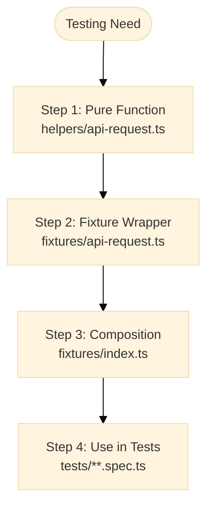

# Giải thích kiến trúc fixture

Kiến trúc fixture là pattern của TEA để xây dựng các test utility có thể tái sử dụng, kiểm thử được và dễ composition. Nguyên lý cốt lõi là: **viết pure function trước, rồi mới bọc bằng fixture của framework**.

## Tổng quan

**Pattern gồm 4 bước:**

1. Viết utility như một pure function
2. Bọc nó trong fixture của framework như Playwright hoặc Cypress
3. Compose nhiều fixture bằng `mergeTests`
4. Đóng gói để tái sử dụng giữa các dự án

### Luồng kiến trúc fixture



**Lợi ích ở từng bước:**

1. **Pure function:** dễ unit test, portable
2. **Fixture wrapper:** tích hợp framework, API sạch
3. **Composition:** kết hợp nhiều capability
4. **Usage:** import gọn, type-safe

## Vấn đề

### Framework-first là anti-pattern phổ biến

```typescript
export const test = base.extend({
  apiRequest: async ({ request }, use) => {
    await use(async (options) => {
      const response = await request.fetch(options.url, {
        method: options.method,
        data: options.data,
      });

      if (!response.ok()) {
        throw new Error(`API request failed: ${response.status()}`);
      }

      return response.json();
    });
  },
});
```

**Các vấn đề:**

- Không unit test được nếu không có Playwright context
- Bị khóa vào framework
- Khó compose với utility khác
- Khó mock để test chính utility đó

### Copy-paste utility giữa các test

```typescript
test('test 1', async ({ request }) => {
  const response = await request.post('/api/users', { data: {...} });
  const body = await response.json();
  if (!response.ok()) throw new Error('Failed');
});

test('test 2', async ({ request }) => {
  const response = await request.post('/api/users', { data: {...} });
  const body = await response.json();
  if (!response.ok()) throw new Error('Failed');
});
```

Vấn đề là duplication, xử lý lỗi không đồng nhất và rất khó cập nhật hàng loạt.

## Lời giải: pattern 3 bước

### Bước 1: pure function

```typescript
// helpers/api-request.ts
export async function apiRequest({ request, method, url, data, headers = {} }: ApiRequestParams): Promise<ApiResponse> {
  const response = await request.fetch(url, {
    method,
    data,
    headers,
  });

  if (!response.ok()) {
    throw new Error(`API request failed: ${response.status()}`);
  }

  return {
    status: response.status(),
    body: await response.json(),
  };
}
```

**Vì sao nên bắt đầu từ pure function:**

- Có thể unit test bằng mock dependency
- Không phụ thuộc framework cụ thể
- Dễ suy luận hành vi
- Có thể dùng lại trong script, CLI hoặc môi trường khác

Ví dụ unit test:

```typescript
describe('apiRequest', () => {
  it('should throw on non-OK response', async () => {
    const mockRequest = {
      fetch: vi.fn().mockResolvedValue({ ok: () => false, status: () => 500 }),
    };

    await expect(
      apiRequest({
        request: mockRequest,
        method: 'GET',
        url: '/api/test',
      }),
    ).rejects.toThrow('API request failed: 500');
  });
});
```

### Bước 2: fixture wrapper

```typescript
// fixtures/api-request.ts
import { test as base } from '@playwright/test';
import { apiRequest as apiRequestFn } from '../helpers/api-request';

export const test = base.extend<{ apiRequest: typeof apiRequestFn }>({
  apiRequest: async ({ request }, use) => {
    await use((params) => apiRequestFn({ request, ...params }));
  },
});

export { expect } from '@playwright/test';
```

**Lợi ích:**

- Fixture cung cấp context framework
- Logic vẫn ở pure function
- Tách bạch concern rõ ràng
- Có thể thay framework mà không phải viết lại core logic

### Bước 3: composition với `mergeTests`

```typescript
// fixtures/index.ts
import { mergeTests } from '@playwright/test';
import { test as apiRequestTest } from './api-request';
import { test as authSessionTest } from './auth-session';
import { test as logTest } from './log';

export const test = mergeTests(apiRequestTest, authSessionTest, logTest);
export { expect } from '@playwright/test';
```

**Cách dùng:**

```typescript
import { test, expect } from '../support/fixtures';

test('should update profile', async ({ apiRequest, authToken, log }) => {
  log.info('Starting profile update test');

  const { status, body } = await apiRequest({
    method: 'PATCH',
    url: '/api/profile',
    data: { name: 'New Name' },
    headers: { Authorization: `Bearer ${authToken}` },
  });

  expect(status).toBe(200);
  expect(body.name).toBe('New Name');
});
```

Lưu ý: ví dụ trên dùng signature kiểu vanilla (`url`, `data`). Playwright Utils dùng tên tham số hơi khác như `path`, `body`.

## TEA áp dụng pattern này ra sao

Khi chạy `framework` với `tea_use_playwright_utils: true`, TEA scaffold cấu trúc gần giống:

```text
tests/
├── support/
│   ├── helpers/
│   │   ├── api-request.ts
│   │   └── auth-session.ts
│   └── fixtures/
│       ├── api-request.ts
│       ├── auth-session.ts
│       └── index.ts
└── e2e/
    └── example.spec.ts
```

Khi chạy `test-review`, TEA cũng kiểm tra:

- utility có phải pure function không
- fixture có chỉ là wrapper mỏng không
- có dùng composition đúng cách không
- utility có thể unit test được không

## Pattern export package

### Tái sử dụng fixture giữa nhiều dự án

**Cách 1: tự build package nội bộ**

```json
{
  "name": "@company/test-utils",
  "exports": {
    "./api-request": "./fixtures/api-request.ts",
    "./auth-session": "./fixtures/auth-session.ts",
    "./log": "./fixtures/log.ts"
  }
}
```

**Cách dùng:**

```typescript
import { test as apiTest } from '@company/test-utils/api-request';
import { test as authTest } from '@company/test-utils/auth-session';
import { mergeTests } from '@playwright/test';

export const test = mergeTests(apiTest, authTest);
```

**Cách 2: dùng Playwright Utils, thường là khuyến nghị tốt hơn**

```bash
npm install -D @seontechnologies/playwright-utils
```

```typescript
import { test as base } from '@playwright/test';
import { mergeTests } from '@playwright/test';
import { test as apiRequestFixture } from '@seontechnologies/playwright-utils/api-request/fixtures';
import { createAuthFixtures } from '@seontechnologies/playwright-utils/auth-session';

const authFixtureTest = base.extend(createAuthFixtures());
export const test = mergeTests(apiRequestFixture, authFixtureTest);
```

**Vì sao Playwright Utils đáng cân nhắc:**

- Đã được xây sẵn, test và bảo trì
- Pattern thống nhất giữa nhiều dự án
- Có nhiều utility sẵn như API, auth, network, logging, files
- Có tài liệu và cộng đồng hỗ trợ

**Khi nào nên tự xây:**

- Có pattern đặc thù công ty
- Hệ thống auth rất riêng
- Có yêu cầu không nằm trong bộ utility sẵn có

## So sánh pattern tốt và xấu

### Anti-pattern: god fixture

```typescript
export const test = base.extend({
  testUtils: async ({ page, request, context }, use) => {
    await use({
      apiRequest: async (...) => { },
      login: async (...) => { },
      createUser: async (...) => { },
      deleteUser: async (...) => { },
      uploadFile: async (...) => { },
      // ... thêm rất nhiều method
    });
  }
});
```

**Vấn đề:**

- Không test riêng từng utility được
- Không compose chọn lọc được
- Không tái dùng từng phần được
- File phình to, khó bảo trì

### Pattern tốt: một concern cho mỗi fixture

```typescript
export const test = base.extend({ apiRequest });
export const test = base.extend({ authSession });
export const test = base.extend({ log });
```

Rồi compose:

```typescript
import { mergeTests } from '@playwright/test';
export const test = mergeTests(apiRequestTest, authSessionTest, logTest);
```

## Khi nào nên dùng pattern này

### Nên dùng cho

**Reusable utilities:**

- API request helper
- Authentication handler
- File operation helper
- Network mocking helper

**Test infrastructure:**

- Shared fixture giữa nhiều team
- Utility đóng gói thành package
- Chuẩn test dùng cho toàn công ty

### Có thể bỏ qua cho

**One-off setup rất đơn giản:**

```typescript
test.beforeEach(async ({ page }) => {
  await page.goto('/');
  await page.click('#accept-cookies');
});
```

**Helper chỉ dùng trong đúng một file test:**

```typescript
function createTestUser(name: string) {
  return { name, email: `${name}@test.com` };
}
```

## Điều này quan trọng thế nào với QC

Kiến trúc fixture tốt giúp đội QC:

- tái dùng thao tác chung mà không copy-paste
- giảm chi phí bảo trì khi API hoặc auth thay đổi
- giữ test gọn, dễ đọc và dễ review
- tách rõ đâu là business assertion, đâu là kỹ thuật nền

## Tài liệu liên quan

- [Test quality standards](/docs/vi-vn/explanation/test-quality-standards.md)
- [Knowledge base system](/docs/vi-vn/explanation/knowledge-base-system.md)
- [Network-first patterns](/docs/vi-vn/explanation/network-first-patterns.md)
- [Cách thiết lập test framework](/docs/vi-vn/how-to/workflows/setup-test-framework.md)
- [Tích hợp Playwright Utils](/docs/vi-vn/how-to/customization/integrate-playwright-utils.md)
- [Cách chạy automate](/docs/vi-vn/how-to/workflows/run-automate.md)

## Kết luận

Pattern `pure function → fixture → composition` giúp test utility:

- dễ test
- dễ tái dùng
- dễ đóng gói
- ít phụ thuộc framework hơn

Đó là nền tảng rất quan trọng nếu muốn suite lớn lên mà vẫn kiểm soát được chất lượng.

---

Được tạo bằng [BMad Method](https://bmad-method.org) - TEA (Test Engineering Architect)
