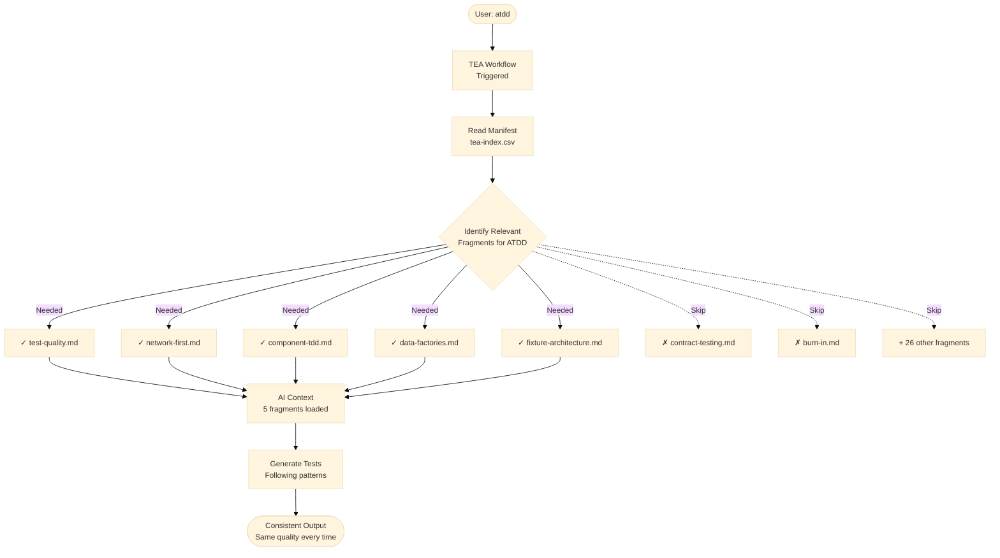

# Giải thích hệ thống knowledge base

Knowledge base của TEA là cách context engineering vận hành trong thực tế: hệ thống tự động nạp các chuẩn chuyên biệt vào ngữ cảnh AI để chất lượng test giữ ổn định, bất kể prompt thay đổi ra sao.

## Tổng quan

**Bài toán:** AI không có context sẽ cho đầu ra thất thường.

**Cách truyền thống:**

```text
User: "Write tests for login"
AI: [Sinh test với chất lượng ngẫu nhiên]
- Lúc thì dùng hard wait
- Lúc thì dùng pattern tốt
- Không nhất quán giữa các session
- Chất lượng phụ thuộc prompt
```

**TEA với knowledge base:**

```text
User: "Write tests for login"
TEA: [Load test-quality.md, network-first.md, auth-session.md]
TEA: [Sinh test theo pattern đã thiết lập]
- Luôn dùng network-first khi phù hợp
- Luôn dùng fixture đúng cách
- Ổn định qua các session
- Bớt phụ thuộc vào prompt wording
```

Kết quả là chất lượng mang tính hệ thống, không phải may rủi.

## Vấn đề

### Prompt-driven testing dẫn đến thiếu nhất quán

**Session 1:**

```text
User: "Write tests for profile editing"
AI: [Không có context hệ thống]
await page.waitForTimeout(3000);
```

**Session 2:**

```text
User: "Write comprehensive tests for profile editing with best practices"
AI: [Vẫn không có context chuẩn]
await page.waitForSelector('.success', { timeout: 10000 });
```

**Session 3:**

```text
User: "Write tests using network-first patterns and proper fixtures"
AI: [Prompt tốt hơn nhưng vẫn phải tự phát minh lại pattern]
```

Vấn đề là chất lượng phụ thuộc khả năng prompt engineering của từng người.

### Knowledge drift

Nếu không có knowledge base:

- Team A dùng pattern X
- Team B dùng pattern Y
- Cả hai đều chạy được nhưng không thống nhất
- Không có single source of truth
- Pattern trôi dần theo thời gian

## Lời giải: manifest `tea-index.csv`

### Cách hoạt động

**1. Manifest định nghĩa fragment**

`src/agents/bmad-tea/resources/tea-index.csv`:

```csv
id,name,description,tags,tier,fragment_file
test-quality,Test Quality,Execution limits and isolation rules,"quality,standards",knowledge/test-quality.md
network-first,Network-First Safeguards,Intercept-before-navigate workflow,"network,stability",knowledge/network-first.md
fixture-architecture,Fixture Architecture,Composable fixture patterns,"fixtures,architecture",knowledge/fixture-architecture.md
```

**2. Workflow nạp các fragment phù hợp**

Khi người dùng chạy `atdd`:

```text
TEA đọc tea-index.csv
Xác định fragment cần cho ATDD:
- test-quality.md
- network-first.md
- component-tdd.md
- fixture-architecture.md
- data-factories.md

Chỉ nạp 5 fragment này, không nạp toàn bộ 42 fragment
```

**3. Đầu ra ổn định**

Mỗi lần `atdd` chạy:

- cùng fragment được nạp
- cùng pattern được áp dụng
- cùng chuẩn chất lượng
- cấu trúc test ổn định

### Sơ đồ tải knowledge base



## Cấu trúc của một fragment

Mỗi fragment thường đi theo khuôn này:

````markdown
# Fragment Name

## Principle

[Một câu mô tả pattern]

## Rationale

[Vì sao dùng pattern này]

## Pattern Examples

### Example 1

```code
[Ví dụ chạy được]
```

## Anti-Patterns

### Don't Do This

```code
[Ví dụ xấu]
```
````

### Ví dụ fragment `test-quality.md`

````markdown
# Test Quality

## Principle

Tests must be deterministic, isolated, explicit, focused, and fast.

## Pattern Examples

### Example 1: Deterministic Test

```typescript
const promise = page.waitForResponse(matcher);
await page.click('button');
await promise;
```
````

````

## TEA dùng knowledge base như thế nào

### Nạp fragment theo từng workflow

| Workflow | Fragment được nạp | Mục đích |
| --- | --- | --- |
| `framework` | `fixture-architecture`, `playwright-config`, `fixtures-composition` | Pattern hạ tầng |
| `test-design` | `test-quality`, `test-priorities-matrix`, `risk-governance` | Chuẩn cho lập kế hoạch |
| `atdd` | `test-quality`, `component-tdd`, `network-first`, `data-factories` | Pattern TDD |
| `automate` | `test-quality`, `test-levels-framework`, `selector-resilience` | Sinh test toàn diện |
| `test-review` | Toàn bộ fragment về chất lượng, resilience, debugging | Audit đầy đủ |
| `ci` | `ci-burn-in`, `burn-in`, `selective-testing` | Tối ưu CI/CD |

**Lợi ích:** chỉ nạp thứ cần dùng, không làm phình context.

### Chọn fragment động

TEA không nạp toàn bộ 42 fragment cùng lúc:

```text
User runs: atdd for authentication feature

TEA analyzes context:
- Feature type: Authentication
- Relevant fragments:
  - test-quality.md
  - auth-session.md
  - network-first.md
  - email-auth.md
  - data-factories.md

Skips unrelated fragments
````

Kết quả là context gọn hơn, token ít hơn và chất lượng đầu ra tốt hơn.

## Context engineering trong thực tế

### Ví dụ: sinh test nhất quán

**Không có knowledge base:**

```text
Session 1:
test('api test', async ({ request }) => {
  const response = await request.get('/api/users');
  await page.waitForTimeout(2000);
});

Session 2:
test('api test', async ({ request }) => {
  const response = await request.get('/api/users');
  const users = await response.json();
});
```

Mỗi lần chạy sinh ra pattern khác nhau.

**Có knowledge base và Playwright Utils:**

```text
TEA loads test-quality.md, network-first.md, api-request.md

Generated:
import { test } from '@seontechnologies/playwright-utils/api-request/fixtures';

test('should fetch users', async ({ apiRequest }) => {
  const { status, body } = await apiRequest({
    method: 'GET',
    path: '/api/users'
  }).validateSchema(UsersSchema);

  expect(status).toBe(200);
  expect(body).toBeInstanceOf(Array);
});
```

Khác biệt chính:

- Không có KB: pattern ngẫu nhiên
- Có KB: luôn dùng utility và chuẩn giống nhau

### Ví dụ: test-review nhất quán

Không có knowledge base, cùng một suite có thể được nhận xét khác nhau giữa hai session. Có knowledge base, `test-review` sẽ dựa trên cùng tập fragment và flag cùng loại vấn đề với cùng lý do giải thích.

## Duy trì knowledge base

### Khi nào nên thêm fragment mới

**Nên thêm khi:**

- Pattern được dùng ở nhiều workflow
- Chuẩn đó không hiển nhiên
- Team liên tục hỏi "nên làm X thế nào?"
- Tích hợp công cụ mới

**Không nên thêm khi:**

- Chỉ là one-off pattern
- Kiến thức quá hiển nhiên
- Pattern còn thử nghiệm

### Tiêu chuẩn một fragment tốt

- Nguyên lý gói trong một câu
- Phần rationale giải thích rõ vì sao
- Có ít nhất vài ví dụ code
- Có anti-pattern rõ ràng
- Có thể đọc độc lập, ít phụ thuộc

**Kích thước tham khảo:** khoảng 10-30 KB là hợp lý.

### Khi nào cần cập nhật fragment hiện có

- Pattern tiến hóa
- Tool cập nhật API mới
- Team phản hồi chưa rõ
- Ví dụ code có lỗi

**Quy trình cập nhật:**

1. Sửa file markdown của fragment
2. Cập nhật ví dụ
3. Test lại với các workflow liên quan
4. Đảm bảo không tạo breaking change ngoài ý muốn

Không cần sửa `tea-index.csv` trừ khi description hoặc tags đổi.

## Lợi ích của knowledge base system

### 1. Tính nhất quán

Trước đây chất lượng test phụ thuộc người viết. Sau đó, test do TEA sinh ra hoặc review đều dựa trên cùng một bộ chuẩn.

### 2. Onboarding

Người mới không cần đọc hàng chục tài liệu trước khi bắt đầu. Họ có thể chạy workflow như `atdd`, xem code được sinh ra và học trực tiếp từ pattern chuẩn.

### 3. Quality gates khách quan

Thay vì tranh luận "test này có tốt không", `test-review` có thể chấm theo cùng tiêu chuẩn từ knowledge base.

### 4. Tiến hóa pattern tập trung

Chỉ cần cập nhật fragment một lần, các test mới về sau sẽ đi theo pattern mới.

### 5. Tái sử dụng giữa nhiều dự án

Không phải phát minh lại pattern cho từng repo. Cùng một hệ chuẩn có thể dùng lại trên nhiều dự án BMad.

## So sánh có và không có knowledge base

### Tình huống: kiểm thử background job bất đồng bộ

**Không có knowledge base:**

Developer 1:

```typescript
await page.click('button');
await page.waitForTimeout(10000);
```

Developer 2:

```typescript
await page.click('button');
for (let i = 0; i < 10; i++) {
  const status = await page.locator('.status').textContent();
  if (status === 'complete') break;
  await page.waitForTimeout(1000);
}
```

Developer 3:

```typescript
await page.click('button');
await page.waitForSelector('.success', { timeout: 30000 });
```

**Có knowledge base:**

Tất cả sẽ nghiêng về cùng một pattern, ví dụ network-first hoặc theo standard polling đã được tài liệu hóa, thay vì mỗi người làm một kiểu.

## Điều này quan trọng thế nào với QC

Với QC, knowledge base giúp:

- giảm phụ thuộc vào prompt wording
- giảm độ lệch giữa người này và người khác
- dễ review vì có chuẩn viện dẫn
- nâng chất lượng đầu ra AI từ "có lúc hay" thành "ổn định và tái lặp"

## Tài liệu liên quan

- [Knowledge base index](/docs/vi-vn/reference/knowledge-base.md)
- [Test quality standards](/docs/vi-vn/explanation/test-quality-standards.md)
- [Fixture architecture](/docs/vi-vn/explanation/fixture-architecture.md)
- [Network-first patterns](/docs/vi-vn/explanation/network-first-patterns.md)
- [TEA overview](/docs/vi-vn/explanation/tea-overview.md)

## Kết luận

Knowledge base là phần biến TEA từ một bộ prompt thông minh thành một hệ thống context engineering có chuẩn, có tính lặp lại và có khả năng mở rộng.

---

Được tạo bằng [BMad Method](https://bmad-method.org) - TEA (Test Engineering Architect)
