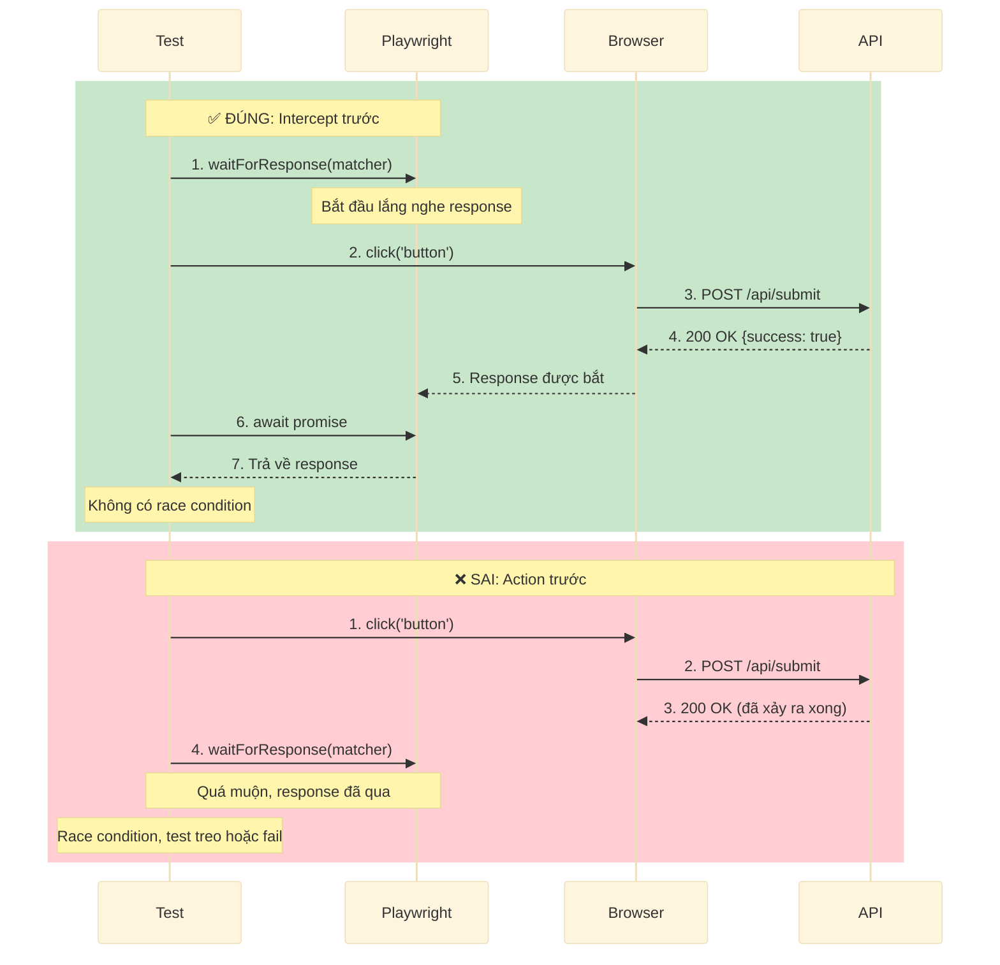

# Giải thích network-first patterns

Network-first patterns là lời giải của TEA cho flaky test. Thay vì đoán cần đợi bao lâu bằng timeout cố định, hãy đợi đúng sự kiện network dẫn tới thay đổi trên UI.

## Tổng quan

**Nguyên lý cốt lõi:**
UI thay đổi vì API trả về dữ liệu. Hãy chờ phản hồi API, không phải một timeout tùy ý.

**Cách truyền thống:**

```typescript
await page.click('button');
await page.waitForTimeout(3000); // Hy vọng 3 giây là đủ
await expect(page.locator('.success')).toBeVisible();
```

**Cách network-first:**

```typescript
const responsePromise = page.waitForResponse((resp) => resp.url().includes('/api/submit') && resp.ok());
await page.click('button');
await responsePromise; // Chờ phản hồi thực sự
await expect(page.locator('.success')).toBeVisible();
```

**Kết quả:** test có tính xác định, chỉ chờ đúng lượng thời gian cần thiết.

## Vấn đề cần giải quyết

### Hard wait tạo ra flakiness

```typescript
test('should submit form', async ({ page }) => {
  await page.fill('#name', 'Test User');
  await page.click('button[type=\"submit\"]');

  await page.waitForTimeout(2000);

  await expect(page.locator('.success')).toBeVisible();
});
```

**Vì sao pattern này dễ fail:**

- **Mạng nhanh:** lãng phí thời gian chờ
- **Mạng chậm:** chờ chưa đủ, test fail
- **Môi trường CI:** thường chậm hơn local, fail ngẫu nhiên
- **Khi hệ thống chịu tải:** API mất 3 giây thay vì 2 giây

**Kết quả:** hội chứng "máy em chạy được", CI thì flaky.

### Bẫy tăng timeout liên tục

```typescript
await page.waitForTimeout(2000); // Fail trong CI
await page.waitForTimeout(5000); // Vẫn thỉnh thoảng fail
await page.waitForTimeout(10000); // Pass, nhưng rất chậm
```

Vấn đề là từ thời điểm đó **mọi test đều phải chờ 10 giây**, dù API chỉ mất vài trăm mili giây.

### Race condition

```typescript
test('should load dashboard data', async ({ page }) => {
  await page.goto('/dashboard');

  await expect(page.locator('.data-table')).toBeVisible();
});
```

Điều có thể xảy ra:

1. `goto()` bắt đầu điều hướng
2. Trang tải HTML
3. JavaScript gọi `/api/dashboard`
4. Test kiểm tra `.data-table` trước khi API trả về
5. Test fail ngắt quãng

## Giải pháp: intercept-before-navigate

### Chờ response trước khi assert

```typescript
test('should load dashboard data', async ({ page }) => {
  const dashboardPromise = page.waitForResponse((resp) => resp.url().includes('/api/dashboard') && resp.ok());

  await page.goto('/dashboard');

  const response = await dashboardPromise;
  const data = await response.json();

  await expect(page.locator('.data-table')).toBeVisible();
  await expect(page.locator('.data-table tr')).toHaveCount(data.items.length);
});
```

**Vì sao cách này hiệu quả:**

- Thiết lập wait **trước** khi điều hướng, nên không bỏ lỡ response
- Chờ đúng API thật sự
- Không cần timeout cố định
- Có thể validate luôn phản hồi backend

**Với Playwright Utils, code gọn hơn:**

```typescript
import { test } from '@seontechnologies/playwright-utils/fixtures';
import { expect } from '@playwright/test';

test('should load dashboard data', async ({ page, interceptNetworkCall }) => {
  const dashboardCall = interceptNetworkCall({
    method: 'GET',
    url: '**/api/dashboard',
  });

  await page.goto('/dashboard');

  const { status, responseJson: data } = await dashboardCall;

  expect(status).toBe(200);
  expect(data.items).toBeDefined();

  await expect(page.locator('.data-table')).toBeVisible();
  await expect(page.locator('.data-table tr')).toHaveCount(data.items.length);
});
```

**Điểm mạnh của Playwright Utils:**

- Parse JSON tự động
- Trả về `{ status, responseJson, requestJson }`
- API ngắn gọn hơn
- Vẫn giữ đúng pattern intercept-before-navigate

### Pattern chuẩn: Intercept → Action → Await

```typescript
const promise = page.waitForResponse(matcher);
await page.click('button');
await promise;
```

**Vì sao thứ tự này quan trọng:**

- `waitForResponse()` bắt đầu lắng nghe ngay lập tức
- Sau đó mới kích hoạt action tạo request
- Cuối cùng mới `await` promise
- Gần như loại bỏ race condition do lỡ mất response

#### Luồng intercept-before-navigate



## TEA áp dụng network-first như thế nào

### TEA sinh test theo network-first

**Vanilla Playwright:**

```typescript
test('should create user', async ({ page }) => {
  const createUserPromise = page.waitForResponse(
    (resp) => resp.url().includes('/api/users') && resp.request().method() === 'POST' && resp.ok(),
  );

  await page.fill('#name', 'Test User');
  await page.click('button[type=\"submit\"]');

  const response = await createUserPromise;
  const user = await response.json();

  expect(user.id).toBeDefined();
  await expect(page.locator('.success')).toContainText(user.name);
});
```

**Với Playwright Utils nếu `tea_use_playwright_utils: true`:**

```typescript
import { test } from '@seontechnologies/playwright-utils/fixtures';
import { expect } from '@playwright/test';

test('should create user', async ({ page, interceptNetworkCall }) => {
  const createUserCall = interceptNetworkCall({
    method: 'POST',
    url: '**/api/users',
  });

  await page.getByLabel('Name').fill('Test User');
  await page.getByRole('button', { name: 'Submit' }).click();

  const { status, responseJson: user } = await createUserCall;

  expect(status).toBe(201);
  expect(user.id).toBeDefined();
  await expect(page.locator('.success')).toContainText(user.name);
});
```

### TEA review hard wait

Khi chạy `test-review`, TEA sẽ đánh dấu hard wait như một lỗi nghiêm trọng:

````markdown
## Critical Issue: Hard Wait Detected

**File:** tests/e2e/submit.spec.ts:45
**Issue:** Using `page.waitForTimeout(3000)`
**Severity:** Critical (causes flakiness)

**Current Code:**

```typescript
await page.click('button');
await page.waitForTimeout(3000); // ❌
```
````

**Fix:**

```typescript
const responsePromise = page.waitForResponse((resp) => resp.url().includes('/api/submit') && resp.ok());
await page.click('button');
await responsePromise; // ✅
```

**Vì sao:** hard wait là không xác định. Hãy dùng network-first patterns.

````

## Các biến thể phổ biến

### Basic response wait

**Vanilla Playwright:**

```typescript
const promise = page.waitForResponse((resp) => resp.ok());
await page.click('button');
await promise;
```

**Với Playwright Utils:**

```typescript
import { test } from '@seontechnologies/playwright-utils/fixtures';

test('basic wait', async ({ page, interceptNetworkCall }) => {
  const responseCall = interceptNetworkCall({ url: '**' });
  await page.click('button');
  const { status } = await responseCall;
  expect(status).toBe(200);
});
```

### Match URL cụ thể

```typescript
const promise = page.waitForResponse((resp) => resp.url().includes('/api/users/123'));
await page.goto('/user/123');
await promise;
```

```typescript
test('specific URL', async ({ page, interceptNetworkCall }) => {
  const userCall = interceptNetworkCall({ url: '**/api/users/123' });
  await page.goto('/user/123');
  const { status, responseJson } = await userCall;
  expect(status).toBe(200);
});
```

### Match method và status

```typescript
const promise = page.waitForResponse(
  (resp) => resp.url().includes('/api/users') && resp.request().method() === 'POST' && resp.status() === 201,
);
await page.click('button[type=\"submit\"]');
await promise;
```

```typescript
test('method and status', async ({ page, interceptNetworkCall }) => {
  const createCall = interceptNetworkCall({
    method: 'POST',
    url: '**/api/users',
  });
  await page.click('button[type=\"submit\"]');
  const { status, responseJson } = await createCall;
  expect(status).toBe(201);
});
```

### Nhiều response cùng lúc

```typescript
const [usersResp, postsResp] = await Promise.all([
  page.waitForResponse((resp) => resp.url().includes('/api/users')),
  page.waitForResponse((resp) => resp.url().includes('/api/posts')),
  page.goto('/dashboard'),
]);

const users = await usersResp.json();
const posts = await postsResp.json();
```

```typescript
test('multiple responses', async ({ page, interceptNetworkCall }) => {
  const usersCall = interceptNetworkCall({ url: '**/api/users' });
  const postsCall = interceptNetworkCall({ url: '**/api/posts' });

  await page.goto('/dashboard');

  const [{ responseJson: users }, { responseJson: posts }] = await Promise.all([usersCall, postsCall]);

  expect(users).toBeInstanceOf(Array);
  expect(posts).toBeInstanceOf(Array);
});
```

### Validate dữ liệu response trước khi assert UI

```typescript
const promise = page.waitForResponse((resp) => resp.url().includes('/api/checkout') && resp.ok());

await page.click('button:has-text(\"Complete Order\")');

const response = await promise;
const order = await response.json();

expect(order.status).toBe('confirmed');
expect(order.total).toBeGreaterThan(0);

await expect(page.locator('.order-confirmation')).toContainText(order.id);
```

```typescript
test('validate response data', async ({ page, interceptNetworkCall }) => {
  const checkoutCall = interceptNetworkCall({
    method: 'POST',
    url: '**/api/checkout',
  });

  await page.click('button:has-text(\"Complete Order\")');

  const { status, responseJson: order } = await checkoutCall;

  expect(status).toBe(200);
  expect(order.status).toBe('confirmed');
  expect(order.total).toBeGreaterThan(0);

  await expect(page.locator('.order-confirmation')).toContainText(order.id);
});
```

## Advanced patterns

### Ghi HAR để test offline

**Vanilla Playwright:**

```typescript
test('offline testing - RECORD', async ({ page, context }) => {
  await context.routeFromHAR('./hars/dashboard.har', {
    url: '**/api/**',
    update: true,
  });

  await page.goto('/dashboard');
});

test('offline testing - PLAYBACK', async ({ page, context }) => {
  await context.routeFromHAR('./hars/dashboard.har', {
    url: '**/api/**',
    update: false,
  });

  await page.goto('/dashboard');
});
```

**Với Playwright Utils:**

```typescript
import { test } from '@seontechnologies/playwright-utils/network-recorder/fixtures';

process.env.PW_NET_MODE = 'record';

test('should work offline', async ({ page, context, networkRecorder }) => {
  await networkRecorder.setup(context);

  await page.goto('/dashboard');
  await page.click('#add-item');
});
```

Chuyển sang playback:

```bash
PW_NET_MODE=playback npx playwright test
```

### Intercept request để giả lập lỗi API

**Vanilla Playwright:**

```typescript
test('should handle API error', async ({ page }) => {
  await page.route('**/api/users', (route) => {
    route.fulfill({
      status: 500,
      body: JSON.stringify({ error: 'Internal server error' }),
    });
  });

  await page.goto('/users');

  const response = await page.waitForResponse('**/api/users');
  const error = await response.json();

  expect(error.error).toContain('Internal server');
  await expect(page.locator('.error-message')).toContainText('Server error');
});
```

**Với Playwright Utils:**

```typescript
import { test } from '@seontechnologies/playwright-utils/fixtures';

test('should handle API error', async ({ page, interceptNetworkCall }) => {
  const usersCall = interceptNetworkCall({
    method: 'GET',
    url: '**/api/users',
    fulfillResponse: {
      status: 500,
      body: { error: 'Internal server error' },
    },
  });

  await page.goto('/users');

  const { status, responseJson } = await usersCall;

  expect(status).toBe(500);
  expect(responseJson.error).toContain('Internal server');
  await expect(page.locator('.error-message')).toContainText('Server error');
});
```

## So sánh: truyền thống và network-first

### Tải dữ liệu dashboard

**Truyền thống, dễ flaky:**

```typescript
test('dashboard loads data', async ({ page }) => {
  await page.goto('/dashboard');
  await page.waitForTimeout(2000);
  await expect(page.locator('table tr')).toHaveCount(5);
});
```

**Network-first, có tính xác định:**

```typescript
test('dashboard loads data', async ({ page }) => {
  const apiPromise = page.waitForResponse((resp) => resp.url().includes('/api/dashboard') && resp.ok());

  await page.goto('/dashboard');

  const response = await apiPromise;
  const { items } = await response.json();

  expect(items).toHaveLength(5);
  await expect(page.locator('table tr')).toHaveCount(items.length);
});
```

**Với Playwright Utils:**

```typescript
import { test } from '@seontechnologies/playwright-utils/fixtures';

test('dashboard loads data', async ({ page, interceptNetworkCall }) => {
  const dashboardCall = interceptNetworkCall({
    method: 'GET',
    url: '**/api/dashboard',
  });

  await page.goto('/dashboard');

  const {
    status,
    responseJson: { items },
  } = await dashboardCall;

  expect(status).toBe(200);
  expect(items).toHaveLength(5);
  await expect(page.locator('table tr')).toHaveCount(items.length);
});
```

### Submit form

```typescript
test('form submission', async ({ page }) => {
  await page.fill('#email', 'test@example.com');
  await page.click('button[type=\"submit\"]');
  await page.waitForTimeout(3000);
  await expect(page.locator('.success')).toBeVisible();
});
```

```typescript
test('form submission', async ({ page }) => {
  const submitPromise = page.waitForResponse(
    (resp) => resp.url().includes('/api/submit') && resp.request().method() === 'POST' && resp.ok(),
  );

  await page.fill('#email', 'test@example.com');
  await page.click('button[type=\"submit\"]');

  const response = await submitPromise;
  const result = await response.json();

  expect(result.success).toBe(true);
  await expect(page.locator('.success')).toBeVisible();
});
```

```typescript
import { test } from '@seontechnologies/playwright-utils/fixtures';

test('form submission', async ({ page, interceptNetworkCall }) => {
  const submitCall = interceptNetworkCall({
    method: 'POST',
    url: '**/api/submit',
  });

  await page.getByLabel('Email').fill('test@example.com');
  await page.getByRole('button', { name: 'Submit' }).click();

  const { status, responseJson: result } = await submitCall;

  expect(status).toBe(200);
  expect(result.success).toBe(true);
  await expect(page.locator('.success')).toBeVisible();
});
```

## Các hiểu lầm thường gặp

### "Tôi đã dùng waitForSelector rồi"

```typescript
await page.click('button');
await page.waitForSelector('.success', { timeout: 5000 });
```

Vấn đề là bạn đang đợi DOM, chưa đợi nguyên nhân gốc là API.

**Tốt hơn:**

```typescript
await page.waitForResponse(matcher);
await page.waitForSelector('.success');
```

### "Test của tôi nhanh, sao phải thêm phức tạp"

Ngắn hạn có thể vẫn ổn trên máy local. Nhưng về dài hạn:

- CI chậm hơn local
- Hệ thống khi tải cao sẽ chậm hơn
- Mạng biến động
- Suite mở rộng từ 100 lên 1000 test

Network-first ngăn các vấn đề đó trước khi chúng bùng lên.

### "Quá nhiều boilerplate"

Nếu thấy `waitForResponse` lặp lại quá nhiều, dùng `interceptNetworkCall` của Playwright Utils để gom phần boilerplate đó vào fixture.

## Triển khai kỹ thuật

Xem thêm trong knowledge base:

- [Knowledge Base Index - Network & Reliability](/docs/vi-vn/reference/knowledge-base.md)
- [Complete Knowledge Base Index](/docs/vi-vn/reference/knowledge-base.md)

## Khái niệm liên quan

- [Tiêu chuẩn chất lượng test](/docs/vi-vn/explanation/test-quality-standards.md) - determinism đòi hỏi network-first
- [Risk-based testing](/docs/vi-vn/explanation/risk-based-testing.md) - tính ổn định càng quan trọng ở vùng rủi ro cao
- [Fixture architecture](/docs/vi-vn/explanation/fixture-architecture.md) - network utilities có thể được đóng gói thành fixture
- [Knowledge base system](/docs/vi-vn/explanation/knowledge-base-system.md) - nơi các pattern network-first được lưu lại
- [TEA overview](/docs/vi-vn/explanation/tea-overview.md) - network-first xuất hiện trong các workflow của TEA
- [Testing as engineering](/docs/vi-vn/explanation/testing-as-engineering.md) - vì sao flakiness là vấn đề vận hành thực sự

## Hướng dẫn thực hành

- [Cách chạy test-review](/docs/vi-vn/how-to/workflows/run-test-review.md) - tìm và sửa hard wait
- [Cách chạy ATDD](/docs/vi-vn/how-to/workflows/run-atdd.md) - sinh test theo network-first
- [Cách chạy automate](/docs/vi-vn/how-to/workflows/run-automate.md) - mở rộng test với network patterns
- [Dùng TEA với test hiện có](/docs/vi-vn/how-to/brownfield/use-tea-with-existing-tests.md) - làm sạch legacy flaky tests
- [Tích hợp Playwright Utils](/docs/vi-vn/how-to/customization/integrate-playwright-utils.md) - các utility về network recorder, interceptor và error monitor

## Tham chiếu

- [TEA command reference](/docs/vi-vn/reference/commands.md)
- [Knowledge base index](/docs/vi-vn/reference/knowledge-base.md)
- [Glossary](/docs/vi-vn/glossary/index.md#test-architect-tea-concepts)

---

Được tạo bằng [BMad Method](https://bmad-method.org) - TEA (Test Engineering Architect)
````
