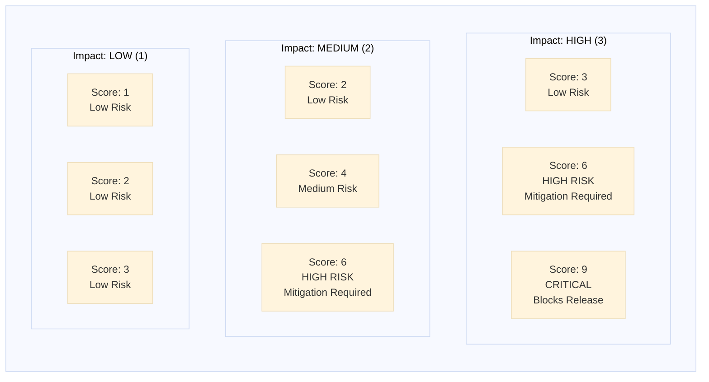

# Giải thích risk-based testing

Risk-based testing là nguyên lý cốt lõi của TEA: độ sâu kiểm thử phải tăng theo tác động kinh doanh. Thay vì kiểm mọi thứ như nhau, hãy dồn công sức vào nơi mà failure gây đau nhất.

## Tổng quan

Cách tiếp cận truyền thống thường đối xử các feature ngang nhau:

- Feature nào cũng được số lượng test tương tự
- Mức review như nhau bất kể tác động
- Không có ưu tiên có hệ thống
- Kiểm thử dễ biến thành checklist hình thức

Risk-based testing đặt ba câu hỏi:

- Khả năng feature này hỏng là bao nhiêu?
- Nếu hỏng thì tác động nghiêm trọng cỡ nào?
- Với mức rủi ro đó, nên đầu tư kiểm thử đến đâu?

## Vấn đề

### Kiểm thử ngang nhau cho các rủi ro không ngang nhau

```markdown
Feature A: đăng nhập người dùng, critical path, hàng triệu user
Feature B: xuất PDF, tính năng nice-to-have, rất ít dùng

Nếu cả hai đều được 10 test và mức scrutiny giống nhau,
ta đang lãng phí effort ở chỗ ít quan trọng và under-test chỗ sống còn.
```

### Không có cách ưu tiên khách quan

```markdown
PM: "Cần test checkout kỹ hơn"
QA: "Kỹ đến mức nào?"
PM: "Không rõ, nhưng nhiều hơn"
```

Không có score thì mọi quyết định dễ thành tranh luận chủ quan.

## Lời giải: chấm điểm Probability × Impact

### Điểm rủi ro = Probability × Impact

**Probability** - khả năng xảy ra lỗi:

- **1 thấp**: logic đơn giản, đã ổn định
- **2 trung bình**: có độ phức tạp vừa phải, còn ẩn số
- **3 cao**: phức tạp, mới, nhiều edge case

**Impact** - mức độ thiệt hại nếu lỗi xảy ra:

- **1 thấp**: chỉ là bất tiện nhỏ
- **2 trung bình**: trải nghiệm suy giảm nhưng có workaround
- **3 cao**: vỡ critical path hoặc ảnh hưởng kinh doanh rõ

**Thang điểm:** từ 1 đến 9

### Ma trận rủi ro



**Cách đọc nhanh:**

- **9**: critical, có thể chặn release
- **6-8**: high risk, cần mitigation rõ
- **4-5**: medium, nên có mitigation
- **1-3**: low, có thể kiểm tối thiểu

### Ví dụ chấm điểm

**Score 9 - cực kỳ quan trọng**

```text
Feature: xử lý thanh toán
Probability: 3, vì tích hợp bên thứ ba phức tạp
Impact: 3, vì hỏng thanh toán là mất doanh thu
Score: 9
```

**Hành động gợi ý:**

- E2E cho tất cả payment flow chính
- API test cho các scenario thanh toán
- Error handling cho failure mode
- Security test
- Load test khi lưu lượng cao
- Monitoring và alert

**Score 1 - rủi ro thấp**

```text
Feature: đổi màu theme profile
Probability: 1
Impact: 1
Score: 1
```

**Hành động gợi ý:**

- Một smoke test là đủ
- Bỏ qua edge case ít giá trị
- Không nhất thiết cần API test

**Score 6 - trung bình cao**

```text
Feature: chỉnh sửa thông tin hồ sơ
Probability: 2
Impact: 3
Score: 6
```

**Hành động gợi ý:**

- E2E cho happy path
- API test cho CRUD
- Validation test
- Không cần ôm mọi edge case nhỏ

## TEA áp dụng risk-based testing thế nào

### 1. Sáu nhóm rủi ro

TEA thường đánh giá theo 6 nhóm:

**TECH** - technical debt, fragility, thay đổi kiến trúc  
**SEC** - bảo mật, xác thực, phân quyền  
**PERF** - suy giảm hiệu năng, load, độ trễ  
**DATA** - toàn vẹn dữ liệu, migration, corruption  
**BUS** - lỗi business logic ảnh hưởng nghiệp vụ  
**OPS** - rủi ro vận hành, logging, monitoring, deployability

Ví dụ:

- **TECH**: chuyển từ REST sang GraphQL, score có thể rất cao
- **SEC**: thêm OAuth, cần security testing bắt buộc
- **PERF**: thêm realtime notification, cần load test nếu score tăng
- **DATA**: migration schema, cần data validation test
- **BUS**: tính khuyến mãi sai, cần business-rule tests
- **OPS**: sửa hệ thống log, có thể chỉ cần smoke test nếu impact thấp

### 2. Độ ưu tiên test P0-P3

Điểm rủi ro ảnh hưởng trực tiếp tới mức ưu tiên:

**P0 - Critical path**

- Thường score 6-9
- Có thể cộng thêm yếu tố doanh thu, bảo mật, tuân thủ, usage frequency
- Mục tiêu coverage rất cao
- Thường cần cả E2E và API

**P1 - High value**

- Thường score 4-6
- Là core journey hoặc logic phức tạp
- Chủ yếu API + selective E2E

**P2 - Medium value**

- Thường score 2-4
- Feature phụ trợ, admin, reporting
- Coverage vừa phải

**P3 - Low value**

- Điểm thấp, ít tác động
- Chỉ cần smoke hoặc kiểm tra tối thiểu

## Risk-based testing thay đổi chiến lược test ra sao

### Với feature rủi ro cao

- test nhiều tầng hơn
- đòi hỏi evidence rõ hơn
- review khắt khe hơn
- có thể cần traceability và gate decision riêng

### Với feature rủi ro thấp

- tránh over-testing
- ưu tiên smoke hoặc test đại diện
- không tiêu tốn thời gian vào edge case hiếm

## Tác động đến workflow của TEA

### `test-design`

Đây là nơi risk-based testing phát huy mạnh nhất. `test-design` dùng score để:

- xác định vùng cần test sâu
- gán priority P0-P3
- quyết định nên tập trung vào E2E, API hay integration
- viết mitigation plan theo mức rủi ro

### `atdd` và `automate`

Khi sinh test, độ sâu và phạm vi có thể thay đổi theo risk score:

- high-risk feature sẽ có nhiều scenario hơn
- low-risk feature sẽ gọn hơn
- selector, fixture và validation cũng được ưu tiên theo giá trị

### `trace`

Không phải mọi khoảng trống coverage đều nghiêm trọng như nhau. Với `trace`, vùng coverage thiếu ở P0/P1 sẽ đáng lo hơn nhiều so với vùng thấp rủi ro.

### `nfr-assess`

Một feature có risk score cao ở PERF, SEC hoặc DATA thường kéo theo nhu cầu đánh giá NFR sâu hơn, thay vì chỉ nhìn functional pass/fail.

## Lợi ích thực tế

### 1. Dùng effort đúng chỗ

Team không còn đổ cùng một lượng công sức vào feature ít quan trọng và feature critical.

### 2. Quyết định bớt cảm tính

Có điểm số giúp đối thoại giữa PM, QC, DEV và architect bớt tranh luận chung chung.

### 3. Dễ bảo vệ quality gate

Khi release bị chặn vì score cao mà mitigation chưa đủ, quyết định đó có nền tảng rõ hơn.

### 4. Phù hợp với enterprise

Trong môi trường compliance hoặc hệ thống lớn, risk-based testing giúp justify vì sao có nơi cần audit kỹ hơn nơi khác.

## Điều này quan trọng thế nào với QC

Với QC, risk-based testing là công cụ để:

- ưu tiên effort trong backlog test
- nói chuyện với PM và DEV bằng tiêu chí rõ
- tránh test quá nông ở vùng critical
- đồng thời tránh lãng phí ở feature rủi ro thấp

## Tài liệu liên quan

- [Test quality standards](/docs/vi-vn/explanation/test-quality-standards.md)
- [TEA overview](/docs/vi-vn/explanation/tea-overview.md)
- [Cách chạy test-design](/docs/vi-vn/how-to/workflows/run-test-design.md)
- [Cách chạy trace](/docs/vi-vn/how-to/workflows/run-trace.md)
- [Cách chạy nfr-assess](/docs/vi-vn/how-to/workflows/run-nfr-assess.md)

## Kết luận

Risk-based testing không có nghĩa là test ít đi. Nó có nghĩa là **test đúng chỗ, đúng độ sâu và đúng mức bằng chứng** so với rủi ro thật của hệ thống.

---

Được tạo bằng [BMad Method](https://bmad-method.org) - TEA (Test Engineering Architect)
